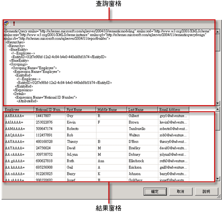

# 報表模型查詢設計工具使用者介面
  報表設計師提供了兩個查詢設計工具，可協助您指定想要將「報表伺服器模型」資料來源中的哪些資料用於報表中。 圖形化查詢設計工具可用來瀏覽和選擇模型實體與實體欄位。 使用以文字為基礎的查詢設計工具可直接處理 XML 格式的語意模型定義語言 (SMDL) 規格。  
  
> [!IMPORTANT]  
>  當使用者建立與執行查詢時，可以存取資料來源。 您應該授與資料來源的最小權限，例如唯讀權限。  
  
## 圖形化查詢設計工具  
 報表設計師提供了圖形化查詢設計工具，您可以用它來設計和執行在報表處理期間可擴展報表資料集之欄位集合的 SMDL 查詢。 圖形化查詢設計工具分成三個區域或窗格。  
  
 下圖會標示出各個窗格。  
  
   
  
 下表會描述各個窗格的功能。  
  
|窗格|函數|  
|----------|--------------|  
|[總管] 窗格|顯示模型中各實體與實體欄位的圖形表示。 這個窗格可用來瀏覽實體、其相關實體和欄位。|  
|設計區域|顯示模型中的欄位清單。 這個窗格可用來排列您所選擇之欄位的配置。|  
|Results pane|顯示查詢的結果。 若要執行查詢，以滑鼠右鍵按一下任何窗格，然後**執行**，或按一下**執行**() 在工具列上的按鈕。|  
  
 如果在檔案總管窗格或 [設計區域] 窗格中變更資訊，將會影響按一下 [執行] 後出現在 [結果] 窗格中的內容。  
  
 若要在某個窗格內執行動作，例如在設計區域中刪除資料行，請以滑鼠右鍵按一下該資料行，然後按一下功能表上的命令。  
  
### 圖形化查詢設計工具工具列  
 設計查詢時也可以使用工具列按鈕。 下表會列出工具列上的按鈕及其用途。  
  
|按鈕|說明|  
|------------|-----------------|  
|**當成文字編輯**|在以文字為基礎的查詢設計工具和圖形化查詢設計工具之間切換。 「報表伺服器」模型資料來源的查詢是 XML 格式的語意模型查詢語言 (SMQL) 規格。|  
|**匯入**|從檔案系統上的報表定義 (.rdl) 檔案匯入現有的查詢。 如需詳細資訊，請參閱[報表內嵌資料集和共用資料集 &#40;報表產生器及 SSRS&#41;](../../reporting-services/report-data/report-embedded-datasets-and-shared-datasets-report-builder-and-ssrs.md)。|  
||恢復上一個動作。|  
||重做上一個動作。|  
||執行查詢並將產生的資料列顯示在 [結果] 窗格中。|  
||開啟 [篩選資料] 對話方塊，讓您指定要篩選的資料。 您可以指定與目前 [設計區域] 中資料無關的篩選。|  
  
## 以文字為基礎的查詢設計工具  
 當您建立「報表伺服器模型」資料集查詢時，圖形化查詢設計工具為預設的工具。 若要切換到文字型查詢設計工具，請按一下工具列上的 [當成文字編輯] 切換按鈕。  
  
 以文字為基礎的查詢設計工具包含兩個窗格：SMQL [查詢] 窗格和 [結果] 窗格。 當您已經有來自其他來源的 SMQL 查詢規格，而且想要將其貼入查詢窗格時，這個查詢設計工具檢視最為有用。 以文字為基礎的查詢設計工具不會檢查查詢語法或重新設定查詢的結構，這一點與圖形化查詢設計工具不同。 當您按一下**執行**資料來源上執行的工具列上，查詢和結果會顯示在 [結果] 窗格中。  
  
 下圖會標示出各個窗格。  
  
   
  
 下表會描述各個窗格的功能。  
  
|窗格|函數|  
|----------|--------------|  
|[查詢] 窗格|顯示 SMQL 規格文字。|  
|結果窗格|顯示查詢的結果。 若要執行查詢，請以滑鼠右鍵按一下任何窗格，然後按一下 [執行]，或是按一下工具列上的 [執行] 按鈕。|  
  
### 以文字為基礎的查詢設計工具工具列  
 設計查詢時也可以使用工具列按鈕。 下表會列出工具列上的按鈕及其用途。  
  
|按鈕|說明|  
|------------|-----------------|  
|**當成文字編輯**|在以文字為基礎的查詢設計工具和圖形化查詢設計工具之間切換。|  
|**匯入**|從現有的報表中匯入查詢。|  
||執行查詢文字並將產生的資料列集顯示在 [結果] 窗格中。|  
  
## 請參閱＜  
 [查詢設計工具 &#40;SSRS&#41;](../../reporting-services/report-data/query-design-tools-ssrs.md)   
 [從外部資料來源新增資料 &#40;SSRS&#41;](../../reporting-services/report-data/add-data-from-external-data-sources-ssrs.md)   
 [報表模型連接 &#40;SSRS &#41;](../../reporting-services/report-data/report-model-connection-ssrs.md)   
 [RSReportDesigner 組態檔](../../reporting-services/report-server/rsreportdesigner-configuration-file.md)  
  
  

