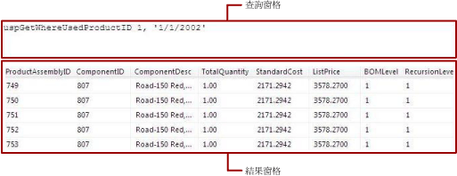

# <a name="text-based-query-designer-user-interface-report-builder"></a>以文字為基礎的查詢設計工具使用者介面 (報表產生器)
  使用以文字為基礎的查詢設計工具，可透過資料來源支援的查詢語言來指定查詢、執行查詢，並在設計階段檢視結果。 您可以指定多個 [!INCLUDE[tsql](../../includes/tsql-md.md)] 陳述式、自訂資料處理延伸模組的查詢或命令語法，以及指定為運算式的查詢。 以文字為基礎的查詢設計工具不會前置處理查詢，而且可以容納各種查詢語法，所以這是許多資料來源類型的預設查詢設計工具。  
  
> [!IMPORTANT]  
>  當使用者建立與執行查詢時，可以存取資料來源。 您應該授與資料來源的最小權限，例如唯讀權限。  
  
 以文字為基礎的查詢設計工具會顯示一個工具列及以下兩個窗格：  
  
-   **查詢** ：根據查詢類型顯示查詢文字、資料表名稱或預存程序名稱。 並非所有的資料來源類型都提供所有的查詢類型。 例如，只有資料來源類型 OLE DB 才支援資料表名稱。  
  
-   **結果** ：顯示在設計階段執行查詢的結果。  
  
## <a name="text-based-query-designer-toolbar"></a>以文字為基礎的查詢設計工具工具列  
 以文字為基礎的查詢設計工具為所有的命令類型提供了單一工具列。 下表列出工具列上的每一個按鈕以及該按鈕的功能。  
  
|按鈕|描述|  
|------------|-----------------|  
|**當成文字編輯**|在以文字為基礎的查詢設計工具和圖形化查詢設計工具之間切換。 並非所有的資料來源類型都支援圖形化查詢設計工具。|  
|**匯入**|從檔案或報表匯入現有的查詢。 只支援 sql 和 rdl 檔案類型|  
||執行查詢，並將結果集顯示在 [結果] 窗格中。|  
|**命令類型**|選取 [Text]、[StoredProcedure] 或 [TableDirect]。 如果預存程序含有參數，當您按一下工具列上的 [執行] 時，便會顯示 [定義查詢參數] 對話方塊，您可以依照需要填入值。 對於命令類型的支援會依資料來源類型而有所不同。 例如，只有 OLE DB 和 ODBC 支援 [TableDirect]。<br /><br /> 注意：若預存程序傳回一個以上的結果集，則只會使用第一個結果集填入資料集。|  
  
### <a name="command-type-text"></a>Text 命令類型  
 當您建立 [!INCLUDE[ssNoVersion](../../includes/ssnoversion-md.md)] 資料集時，預設會開啟關聯式查詢設計工具。 若要切換到文字型查詢設計工具，請按一下工具列上的 [當成文字編輯] 切換按鈕。 以文字為基礎的查詢設計工具會顯示兩個窗格：[查詢] 窗格和 [結果] 窗格。 下圖會標示出各個窗格。  
  
   
  
 下表會描述各個窗格的功能。  
  
|窗格|函數|  
|----------|--------------|  
|查詢|顯示 [!INCLUDE[tsql](../../includes/tsql-md.md)] 查詢文字。 使用此窗格，即可撰寫或編輯 [!INCLUDE[tsql](../../includes/tsql-md.md)] 查詢。|  
|結果|顯示查詢的結果。 若要執行查詢，請以滑鼠右鍵按一下任何窗格，然後按一下 [執行]，或是按一下工具列上的 [執行] 按鈕。|  
  
#### <a name="example"></a>範例  
 下列查詢會從 AdventureWorks2014 資料庫 **ContactType** 資料表傳回 **Person** 結構描述的名稱清單。  
  
```  
SELECT Name FROM Person.ContactType  
```  
  
 當您按一下工具列上的 [執行] 時，[查詢] 窗格中的命令便會執行，而且結果會顯示在 [結果] 窗格中。 結果集會顯示 20 種連絡人類型的清單，例如「擁有者」或「銷售代理人」。  
  
### <a name="command-type-storedprocedure"></a>StoredProcedure 命令類型  
 當您選取 [命令類型] [StoredProcedure] 時，文字型查詢設計工具會顯示兩個窗格：[查詢] 窗格和 [結果] 窗格。 請在 [查詢] 窗格內輸入預存程序名稱，然後按一下工具列上的 [執行]。 如果預存程序使用參數，[定義查詢參數] 對話方塊隨即開啟。 為此預存程序輸入參數值。 系統將會針對每一個預存程序輸入參數建立報表參數。  
  
 下圖會在您執行預存程序時，顯示 [查詢] 和 [結果] 窗格。 在此情況下，輸入參數是常數。  
  
   
  
 下表會描述各個窗格的功能。  
  
|窗格|函數|  
|----------|--------------|  
|查詢|顯示預存程序的名稱以及任何輸入參數。|  
|結果|顯示查詢的結果。 若要執行查詢，請以滑鼠右鍵按一下任何窗格，然後按一下 [執行]，或是按一下工具列上的 [執行] 按鈕。|  
  
#### <a name="example"></a>範例  
 下列查詢會呼叫 AdventureWorks2014 預存程序 **uspGetWhereUsedProductID**。 當您執行查詢時，必須為產品識別碼參數輸入值。  
  
```  
uspGetWhereUsedProductID  
```  
  
 按一下 [執行] (**!**) 按鈕。 提示輸入查詢參數時，請使用下表來輸入值。  
  
|||  
|-|-|  
|*@StartProductID*|820|  
|*@CheckDate*|20010115|  
  
 對於指定的日期，結果集會顯示 13 個產品識別碼 (使用指定的元件編號) 的清單。  
  
### <a name="command-type-tabledirect"></a>TableDirect 命令類型  
 當您選取 [命令類型] [TableDirect] 時，文字型查詢設計工具會顯示兩個窗格：[查詢] 窗格和 [結果] 窗格。 當您輸入資料表並按一下 [執行] 按鈕時，便會傳回該資料表的所有資料行。  
  
#### <a name="example"></a>範例  
 對於資料來源類型 OLE DB，下列的資料集查詢會傳回 AdventureWorks2014 資料庫中所有連絡人類型的結果集。  
  
 `Person.ContactType`  
  
 當您輸入資料表名稱 Person.ContactType 時，就等於建立 [!INCLUDE[tsql](../../includes/tsql-md.md)] 陳述式 `SELECT * FROM Person.ContactType`。  
  
## <a name="see-also"></a>另請參閱  
 [關聯式查詢設計工具使用者介面 &#40;報表產生器&#41;](../../reporting-services/report-data/relational-query-designer-user-interface-report-builder.md)   
 [查詢設計工具 &#40;報表產生器&#41;](http://msdn.microsoft.com/library/553f0d4e-8b1d-4148-9321-8b41a1e8e1b9)  
  
  
