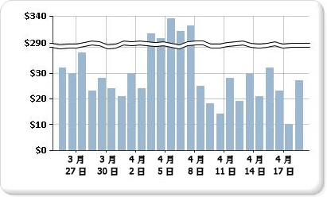

# 將刻度斷層加入至圖表 (報表產生器及 SSRS)

  刻度斷層是在圖表繪圖區上繪製的一道區域線，代表在值軸高低值之間的延續性有斷層 (通常是垂直軸或 Y 軸)。 使用刻度斷層可在相同的圖表區域中顯示兩個相異的範圍。  
  
   
  
> [!NOTE]  
>  您無法指定刻度斷層在圖表上的放置位置。 圖表會根據資料集中的值，自行計算資料範圍之間是否有足夠的分隔，以在執行階段於值軸 (Y 軸) 上繪製刻度斷層。  
  
 具有刻度斷層的圖表範例可從範例報表取得。 如需下載這個範例報表及其他項目的詳細資訊，請參閱 [報表產生器與報表設計師範例報表](http://go.microsoft.com/fwlink/?LinkId=198283)：  
  
> [!NOTE]  
>  [!INCLUDE[ssRBRDDup](../../includes/ssrbrddup-md.md)]  
  
### 若要在圖表上啟用刻度斷層  
  
1.  以滑鼠右鍵按一下垂直軸，然後按一下 [軸屬性]。 [垂直軸屬性] 對話方塊隨即開啟。  
  
2.  選取 [啟用刻度斷層] 核取方塊。  
  
### 變更刻度斷層的樣式  
  
1.  開啟 [屬性] 窗格。  
  
2.  以滑鼠右鍵在設計介面上按一下圖表的 Y 軸。 Y 軸物件的屬性 (依預設名為「圖表軸」) 會顯示在 [屬性] 窗格中。  
  
3.  在 [刻度] 區段中，展開 ScaleBreakStyle 屬性。  
  
4.  變更 ScaleBreakStyle 屬性的值，例如 BreakLineType 和 Spacing。 如需刻度中斷線屬性的詳細資訊，請參閱[將包含多個資料範圍的數列顯示在圖表上 &#40;報表產生器及 SSRS&#41;](../../reporting-services/report-design/displaying-a-series-with-multiple-data-ranges-on-a-chart.md)。  

## 後續步驟

[圖表](../../reporting-services/report-design/charts-report-builder-and-ssrs.md)   
[格式化圖表](../../reporting-services/report-design/formatting-a-chart-report-builder-and-ssrs.md)   
[軸屬性對話方塊、軸選項](http://msdn.microsoft.com/library/b276e210-7a12-48ae-971b-7dabae51df11)  

更多問題嗎？ [請嘗試詢問 Reporting Services 論壇](http://go.microsoft.com/fwlink/?LinkId=620231)
