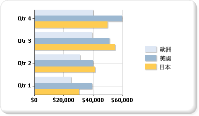

# 橫條圖 (報表產生器及 SSRS)
  橫條圖是以數條水平橫條來顯示數列。 一般橫條圖與直條圖相當有關聯，後者會將數列顯示為數條垂直線，而範圍橫條圖則會將數列顯示為數條水平橫條，其中包含各種起點與終點。  
  
 橫條圖是水平顯示資料的唯一圖表類型。 因此，橫條圖通常用於表示發生超過一段時間的資料，而且其中包含有限的開始和結束日期。 同時，橫條圖也常用於顯示類別資訊，因為類別目錄可以水平顯示。 如需如何將資料加入橫條圖的詳細資訊，請參閱[圖表 &#40;報表產生器及 SSRS&#41;](../../reporting-services/report-design/charts-report-builder-and-ssrs.md)。  
  
 下圖顯示橫條圖。 橫條圖非常適合這個資料，因為全部三個數列都共用一個共同的時間週期，以便進行有效的比較。  
  
   
  
> [!NOTE]  
>  [!INCLUDE[ssRBRDDup](../../includes/ssrbrddup-md.md)]  
  
## 橫條圖的變化  
  
-   **堆疊**： 將多個數列垂直堆疊的橫條圖。 如果您的圖表中只有一個數列，堆疊橫條圖的顯示將與橫條圖相同。  
  
-   **百分之百堆疊**： 將多個數列垂直堆疊以便百分之百符合圖表區域的橫條圖。 如果您的圖表中只有一個數列，所有橫條圖都會百分之百符合圖表區域。  
  
-   **立體群組**： 在立體圖表的個別資料列上顯示個別數列的橫條圖。  
  
-   **立體圓柱圖**： 在立體圖表上將橫條形狀顯示為圓柱的橫條圖。  
  
## 橫條圖的資料考量  
  
-   橫條圖會將其軸反轉。 類別目錄軸是垂直軸 (或「Y 軸」)，而值軸是水平軸 (或「Y 軸」)。 也就是說，在橫條圖中，類別目錄標籤有更多的空間，可以沿著 Y 軸顯示為從上到下讀取的清單。  
  
-   橫條圖與直條圖通常用於顯示群組之間的比較。 如果在圖表上出現三個以上的數列，請考慮使用堆疊橫條圖或直條圖。 如果在圖表上有多個數列，您也可以將堆疊橫條圖或直條圖收集到多個群組中。  
  
-   橫條圖會從左到右顯示值，這在顯示與持續時間相關的資料時，可能會更為直覺式。  
  
-   如果您想要將橫條加入到報表內的資料表或矩陣，請考慮使用線性量測計來代替橫條圖。 線性量測計的設計為顯示一個值而非多個群組，因此在清單或資料表的資料區域內，更有使用上的彈性。 如需詳細資訊，請參閱[量測計 &#40;報表產生器及SSRS&#41;](../../reporting-services/report-design/gauges-report-builder-and-ssrs.md)。  
  
-   您可以在橫條圖的個別直條上加入特殊的繪製樣式來增加其視覺效果。 繪製樣式包括楔形、浮凸、圓柱及深淺。 這些效果的設計可以改善平面圖表的外觀。 如果要使用立體圖表，您仍然可以套用繪製樣式，但是可能不會有相同的效果。 如需如何將繪製樣式加入橫條圖的詳細資訊，請參閱[將斜面、浮凸與紋理樣式加入至圖表 &#40;報表產生器及SSRS&#41;](../../reporting-services/report-design/add-bevel-emboss-and-texture-styles-to-a-chart-report-builder-and-ssrs.md)。  
  
-   堆疊橫條圖會將數列放在彼此的上方來建立一個橫條堆疊。 您可以選擇針對每個類別目錄，將堆疊橫條圖分成多組堆疊。 群組堆疊圖會並排顯示。 您的圖表中可以有任意數目的群組堆疊數列。  
  
-   當資料點標籤顯示在橫條圖上時，標籤會放在每個橫條的外部。 當橫條在圖表區域中佔用所有配置的空間時，這可能會讓標籤重疊。 您可以在 [屬性] 窗格中設定 **BarLabelStyle** 屬性，藉以變更針對每個橫條顯示之資料點標籤的位置。  
  
-   如果資料集中有很多相對於圖表大小的資料點，則會縮減資料行或橫條的大小，以及資料行和橫條之間的間距。 若要在圖表中手動設定資料行的寬度，修改 **PointWidth** 屬性來修改其寬度 (以像素為單位)。 依預設，此屬性的值為 0.8。 當您在圖表中增加資料行或橫條的寬度時，每個資料行或橫條之間的空間會減少。  
  
## 請參閱＜  
 [圖表 &#40;報表產生器及 SSRS&#41;](../../reporting-services/report-design/charts-report-builder-and-ssrs.md)   
 [圖表類型 &#40;報表產生器及 SSRS&#41;](../../reporting-services/report-design/chart-types-report-builder-and-ssrs.md)   
 [圖表中的空白和 Null 資料點 &#40;報表產生器及 SSRS&#41;](../../reporting-services/report-design/empty-and-null-data-points-in-charts-report-builder-and-ssrs.md)   
 [直條圖 &#40;報表產生器及 SSRS&#41;](../../reporting-services/report-design/column-charts-report-builder-and-ssrs.md)   
 [範圍圖表 &#40;報表產生器及 SSRS&#41;](../../reporting-services/report-design/range-charts-report-builder-and-ssrs.md)   
 [設定圖表上數列色彩的格式 &#40;報表產生器及 SSRS&#41;](../../reporting-services/report-design/formatting-series-colors-on-a-chart-report-builder-and-ssrs.md)   
 [格式化圖表上的軸標籤 &#40;報表產生器及 SSRS&#41;](../../reporting-services/report-design/formatting-axis-labels-on-a-chart-report-builder-and-ssrs.md)   
 [在圖表上格式化圖例 &#40;報表產生器及 SSRS&#41;](../../reporting-services/report-design/formatting-the-legend-on-a-chart-report-builder-and-ssrs.md)   
 [將斜面、浮凸與紋理樣式加入至圖表 &#40;報表產生器及 SSRS&#41;](../../reporting-services/report-design/add-bevel-emboss-and-texture-styles-to-a-chart-report-builder-and-ssrs.md)   
 [教學課程：將橫條圖加入至報表 (報表產生器)](http://go.microsoft.com/fwlink/?LinkId=198052)   
 [教學課程：將橫條圖加入至報表](http://go.microsoft.com/fwlink/?LinkId=198042)  
  
  