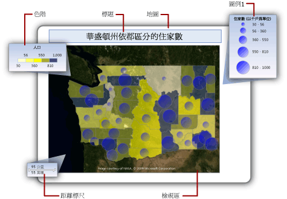

# 變更地圖圖例、色階與相關的規則 (報表產生器及 SSRS)
  在 [!INCLUDE[ssRSnoversion_md](../../includes/ssrsnoversion-md.md)] 分頁報表中，地圖可包含地圖圖例、色階和距離標尺。 這些地圖組件可協助使用者解譯地圖上的資料視覺化。  
  
 圖例包括下列地圖組件：  
  
-   **地圖圖例** ：顯示指引，協助解譯改變地圖圖層上地圖元素之顯示的分析資料。 地圖可以擁有多個圖例。 您可以指定每一個地圖圖層要使用的圖例。 圖例可提供多個地圖圖層的指引。  
  
-   **色階** ：顯示指引，協助解譯地圖上的色彩。 地圖可以擁有一個色階。 色階的資料可由多個圖層提供。  
  
-   **距離標尺** ：顯示指引，協助解譯地圖的標尺。 地圖可以擁有一個距離標尺。 目前的地圖檢視區縮放值會決定距離標尺。  
  
   
  
##   變更圖例相對於檢視區的位置  
  
#### 變更圖例相對於檢視區的位置  
  
1.  在 [設計] 檢視中，以滑鼠右鍵按一下圖例，然後開啟 [\<報表項目>  屬性]  頁面。  
  
2.  在 [位置]  中，按一下指定讓圖例顯示在相對於檢視區的位置。  
  
3.  若要在檢視區外顯示圖例，請選取 [在檢視區外顯示 <報表項目\<]  。  
  
4.  [!INCLUDE[clickOK](../../includes/clickok-md.md)]  
  
    > [!NOTE]  
    >  在預覽中，只有在與該圖例相關的規則有結果時，才會顯示地圖圖例和色階。 如果沒有要顯示的項目，則圖例不會出現在轉譯的報表中。  
  
##   變更地圖圖例的配置  
  
#### 變更地圖圖例的配置  
  
1.  在 [設計] 檢視中，以滑鼠右鍵按一下圖例，然後開啟 [圖例屬性]  頁面。  
  
2.  在 [圖例配置]  中，按一下您要用於圖例的表格版面配置。 當您按一下不同的選項時，設計介面上的配置就會變更。  
  
3.  [!INCLUDE[clickOK](../../includes/clickok-md.md)]  
  
##   顯示或隱藏地圖圖例標題  
  
#### 顯示或隱藏地圖圖例標題  
  
-   在設計介面上以滑鼠右鍵按一下地圖圖例，然後按一下 [顯示圖例標題]  。  
  
##   顯示或隱藏色階標題  
  
#### 顯示或隱藏色階標題  
  
-   在設計介面上以滑鼠右鍵按一下色階，然後按一下 [顯示色階標題]  。  
  
##   從第一個圖例中移出項目  
 依您需要建立多個額外的圖例，然後更新每個地圖圖層的規則，指定要在哪一個圖例中顯示規則結果。  
  
#### 建立新的圖例  
  
-   在 [設計] 檢視中，以滑鼠右鍵按一下地圖檢視區外的地圖，然後按一下 [新增圖例]  。  
  
     新的圖例會出現在地圖上。  
  
#### 在圖例中顯示規則結果  
  
1.  在 [設計] 檢視中，按一下地圖，直到 [地圖] 窗格出現為止。  
  
2.  以滑鼠右鍵按一下包含所需資料的圖層，然後按一下 [\<地圖元素類型>  色彩規則]  。  
  
3.  按一下 **[圖例]** 。  
  
4.  在 [在此圖例中顯示]  下拉式清單中，按一下要在其中顯示規則結果的圖例名稱。  
  
5.  [!INCLUDE[clickOK](../../includes/clickok-md.md)]  
  
##   根據範本樣式更改地圖元素色彩  
  
#### 根據範本樣式更改地圖元素色彩  
  
1.  在 [設計] 檢視中，按一下地圖，直到 [地圖] 窗格出現為止。  
  
2.  以滑鼠右鍵按一下包含所需資料的圖層，然後按一下 [\<地圖元素類型>  色彩規則]  。  
  
3.  按一下 [套用範本樣式]  。  
  
     範本樣式會指定字型、框線樣式以及色彩調色盤。 系統會針對在「地圖精靈」或「地圖圖層精靈」中指定的主題，從色彩調色盤指派一個不同的色彩給每個地圖元素。 這是套用到沒有相關分析資料之圖層的唯一選項。  
  
4.  [!INCLUDE[clickOK](../../includes/clickok-md.md)]  
  
##   根據色彩調色盤更改地圖元素色彩  
  
#### 根據色彩調色盤更改地圖元素色彩  
  
1.  在 [設計] 檢視中，按一下地圖，直到 [地圖] 窗格出現為止。  
  
2.  以滑鼠右鍵按一下包含所需資料的圖層，然後按一下 [\<地圖元素類型>  色彩規則]  。  
  
3.  按一下 [使用調色盤將資料視覺化]  。  
  
     此選項會使用內建調色盤或您指定的自訂調色盤。 系統會根據相關的分析資料，從調色盤指派一個不同的色彩或色彩陰影給每個地圖元素。  
  
4.  在 [資料欄位]  中，鍵入包含您要依色彩視覺化之分析資料的欄位名稱。  
  
5.  在 [調色盤]  的下拉式清單中，選取要使用的調色盤名稱。  
  
6.  [!INCLUDE[clickOK](../../includes/clickok-md.md)]  
  
##   根據色彩範圍更改地圖元素色彩  
  
#### 根據色彩範圍更改地圖元素色彩  
  
1.  在 [設計] 檢視中，按一下地圖，直到 [地圖] 窗格出現為止。  
  
2.  以滑鼠右鍵按一下包含所需資料的圖層，然後按一下 [\<地圖元素類型>  色彩規則]  。  
  
3.  按一下 [使用色彩範圍將資料視覺化]  。  
  
     此選項結合您在此頁面上指定的開始色彩、中間色彩與結束色彩，以及您在 [分佈]  頁面上指定的選項，將相關的分析資料分成多個範圍。 報表處理器會根據其相關的資料與所在範圍，指派適當的色彩給每個地圖元素。  
  
4.  在 [資料欄位]  中，鍵入包含您要依色彩視覺化之分析資料的欄位名稱。  
  
5.  在 [開始色彩]  中，指定要用於最低範圍的色彩。  
  
6.  在 [中間色彩]  中，指定要用於中間範圍的色彩。  
  
7.  在 [結束色彩]  中，指定要用於最高範圍的色彩。  
  
8.  [!INCLUDE[clickOK](../../includes/clickok-md.md)]  
  
##   根據自訂色彩更改地圖元素色彩  
  
#### 根據自訂色彩更改地圖元素色彩  
  
1.  在 [設計] 檢視中，按一下地圖，直到 [地圖] 窗格出現為止。  
  
2.  以滑鼠右鍵按一下包含所需資料的圖層，然後按一下 [\<地圖元素類型>  色彩規則]  。  
  
3.  按一下 [使用自訂色彩將資料視覺化]  。  
  
     此選項會使用您指定之色彩的清單。 系統會根據相關的分析資料，從清單指派一個色彩給每個地圖元素。 如果地圖元素多於色彩，則不會指派任何色彩。  
  
4.  在 [資料欄位]  中，鍵入包含您要依色彩視覺化之分析資料的欄位名稱。  
  
5.  在 [自訂色彩]  中按一下 [加入]  ，指定每一個自訂色彩。  
  
6.  [!INCLUDE[clickOK](../../includes/clickok-md.md)]  
  
##   設定圖例的分佈選項  
  
#### 設定圖例的分佈選項  
  
1.  在 [設計] 檢視中，按一下地圖，直到 [地圖] 窗格出現為止。  
  
2.  以滑鼠右鍵按一下包含所需資料的圖層，然後按一下 [\<地圖元素類型>  色彩規則]  。  
  
3.  選取 [使用 \<規則類型> 將資料視覺化]  選項。 若要使用分佈選項，您必須根據與圖層相關聯的分析資料，在 [分佈]  頁面上建立範圍。  
  
4.  按一下 **[分佈]** 。  
  
5.  選取下列其中一種分佈類型：  
  
    -   **EqualInterval**： 指定的範圍會將資料分割成相等的範圍間隔。  
  
    -   **EqualDistribution**： 指定的範圍會分割該資料，讓每個範圍都有相等的項目數目。  
  
    -   **最佳**： 指定會自動調整分佈的範圍來建立對稱的子範圍。  
  
    -   **自訂**。 指定您自己的範圍數目來控制值的分佈。  
  
     如需分佈選項的詳細資訊，請參閱[使用規則與分析資料更改多邊形、線條與點顯示 &#40;報表產生器及 SSRS&#41;](../../reporting-services/report-design/vary-polygon-line-and-point-display-by-rules-and-analytical-data.md)。  
  
6.  在 [子範圍的數目]  中，鍵入要使用的子範圍數目。 當分佈類型為 [最佳]  時，會自動計算子範圍的數目。  
  
7.  在 [範圍開始]  中，鍵入最小範圍值。 小於此數字的所有值都與範圍最小值相同。  
  
8.  在 [範圍結束]  中，鍵入最大範圍值。 大於此數字的所有值都與範圍最大值相同。  
  
9. [!INCLUDE[clickOK](../../includes/clickok-md.md)]  
  
##   變更規則圖例的內容  
  
#### 變更色彩、大小、寬度或標記類型圖例的內容  
  
1.  在 [設計] 檢視中，按一下地圖，直到 [地圖] 窗格出現為止。  
  
2.  以滑鼠右鍵按一下其中包含所需資料的圖層，然後按一下 [\<地圖元素類型>  規則]  。  
  
3.  確認已選取 [使用 \<規則類型  > 將資料視覺化]  選項。  
  
4.  在 [資料欄位]  中，確認已選取您要在圖層上視覺化的分析資料。  
  
    > [!NOTE]  
    >  如果下拉式清單中沒有顯示任何欄位，請以滑鼠右鍵按一下圖層，然後按一下 [圖層資料]  來開啟 [地圖圖層資料屬性] 對話方塊的 [分析資料] 頁面，並驗證您已經指定此圖層的分析資料。  
  
5.  按一下 **[圖例]** 。  
  
6.  在 [在此圖例中顯示]  中，選取要用來顯示規則結果的地圖圖例。  
  
7.  [!INCLUDE[clickOK](../../includes/clickok-md.md)]  
  
##   變更色階的內容  
  
#### 變更色階或色彩圖例的內容  
  
1.  在 [設計] 檢視中，按一下地圖，直到 [地圖] 窗格出現為止。  
  
2.  以滑鼠右鍵按一下包含所需資料的圖層，然後按一下 [\<地圖元素類型>  色彩規則]  。  
  
3.  選取要使用的色彩規則選項。 若要以地圖圖例或色階顯示項目，您必須選取其中一個 [使用 \<規則類型> 將資料視覺化]  選項。  
  
4.  在 [資料欄位]  中，確認已選取您要在圖層上視覺化的分析資料。  
  
    > [!NOTE]  
    >  如果下拉式清單中沒有顯示任何欄位，請以滑鼠右鍵按一下圖層，然後按一下 [圖層資料]  來開啟 [地圖圖層資料屬性] 對話方塊的 [分析資料] 頁面，並驗證您已經指定此圖層的分析資料。  
  
5.  按一下 **[圖例]** 。  
  
6.  在 [色階選項]  中，選取 [以色階顯示]  ，使用色階顯示規則結果。 您可以為多個色彩規則指定這個選項。  
  
7.  [!INCLUDE[clickOK](../../includes/clickok-md.md)]  
  
##   移除圖例中的所有項目  
  
#### 根據規則隱藏項目  
  
1.  在 [設計] 檢視中，按一下地圖，直到 [地圖] 窗格出現為止。  
  
2.  以滑鼠右鍵按一下其中包含所需資料的圖層，然後按一下 [\<地圖元素類型>  規則]  。  
  
3.  按一下 **[圖例]** 。  
  
4.  [!INCLUDE[clickOK](../../includes/clickok-md.md)]  
  
##   變更圖例中的內容格式  
 設定與地圖圖例相關聯之規則的圖例選項。  
  
#### 變更圖例中的內容格式  
  
1.  在 [設計] 檢視中，按一下地圖，直到 [地圖] 窗格出現為止。  
  
2.  以滑鼠右鍵按一下其中包含所需資料的圖層，然後按一下 [\<地圖元素類型>  規則]  。  
  
3.  按一下 **[圖例]** 。  
  
4.  [圖例文字]  會顯示關鍵字，這些關鍵字會指定出現在圖例中的資料。 使用地圖關鍵字和自訂格式，有助於控制圖例文字的格式。 例如，#FROMVALUE {C2} 會指定包含兩位小數位數的貨幣格式。 如需詳細資訊，請參閱 [使用規則與分析資料更改多邊形、線條與點顯示 &#40;報表產生器及 SSRS&#41;](../../reporting-services/report-design/vary-polygon-line-and-point-display-by-rules-and-analytical-data.md)。  
  
5.  [!INCLUDE[clickOK](../../includes/clickok-md.md)]  
  
## 另請參閱  
 [地圖 &#40;報表產生器及 SSRS&#41;](../../reporting-services/report-design/maps-report-builder-and-ssrs.md)   
 [新增、變更或刪除地圖或地圖圖層 &#40;報表產生器及 SSRS&#41;](../../reporting-services/report-design/add-change-or-delete-a-map-or-map-layer-report-builder-and-ssrs.md)   
 [自訂地圖或地圖圖層的資料和顯示 &#40;報表產生器及 SSRS&#41;](../../reporting-services/report-design/customize-the-data-and-display-of-a-map-or-map-layer-report-builder-and-ssrs.md)   
 [報表疑難排解：地圖報表 &#40;報表產生器及 SSRS&#41;](../../reporting-services/report-design/troubleshoot-reports-map-reports-report-builder-and-ssrs.md)   
 [地圖精靈與地圖圖層精靈 &#40;報表產生器及 SSRS&#41;](../../reporting-services/report-design/map-wizard-and-map-layer-wizard-report-builder-and-ssrs.md)  
  
  
