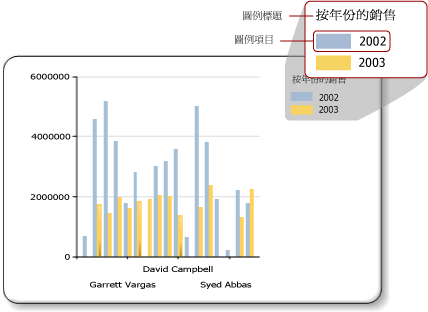

# 圖表圖例 - 格式化 (報表產生器)
  圖表圖例包含圖表中每一個類別目錄的描述。 圖例一定會包含一或多個圖例項目，其中每一個圖例項目都是由代表數列的彩色方塊及描述此數列的文字字串所組成，如下圖所示。  
  
   
  
 圖例項目會連接到報表上的個別數列，但是形狀圖表例外 (其圖例會連接到個別資料點)。 此圖表會根據從資料產生的數列，將項目加入到圖例中。  
  
 您可以使用 **[圖例屬性]** 對話方塊或 [屬性] 窗格來設定圖例的格式。 請以滑鼠右鍵按一下此圖例，然後按一下 **[圖例屬性]** ，為圖例文字、背景色彩、框線和 3D 效果變更值。 若要變更圖例標題的，請選取此圖例，然後以滑鼠右鍵按一下圖例標題，再按一下 **[圖例標題屬性]**。  
  
 您無法將影像、額外資料行或其他補充項目加入至圖例。  
  
> [!NOTE]  
>  [!INCLUDE[ssRBRDDup](../../includes/ssrbrddup-md.md)]  
  
## 排序圖例中的圖例項目  
 數列在圖例中排序時，會根據 [!INCLUDE[ssRSnoversion](../../includes/ssrsnoversion-md.md)] 處理引擎處理數列的順序而定。 若要變更此順序，您可以變更資料欄位放置區內的欄位順序。 如果您使用數列群組，則數列資料要等到處理之後才會知道，所以您無法重新排序這些項目。 可以在預覽中看到變更。 如需數列群組的詳細資訊，請參閱 [圖表 &#40;報表產生器及 SSRS&#41;](../../reporting-services/report-design/charts-report-builder-and-ssrs.md)。  
  
 您可以隱藏任何數列，使其不要顯示在圖例上。 如果您使用數列群組，與資料欄位有關的所有數列都會隱藏起來。 如需詳細資訊，請參閱 [隱藏圖表上的圖例項目 &#40;報表產生器及 SSRS&#41;](../../reporting-services/report-design/chart-legend-hide-items-report-builder.md)。  
  
## 變更圖例中圖例項目的文字和色彩  
 在圖表的資料欄位放置區中放置欄位時，系統就會自動產生包含此欄位名稱的圖例項目。 根據預設，每一個圖例項目的文字都是取自資料欄位的名稱。 每個圖例項目都會連接到報表上的個別數列，但是形狀圖例外 (其圖例會連接到個別資料點而非個別數列)。 針對形狀圖定義類別目錄群組時，每個圖例項目的文字都會取自該類別目錄群組的字串表示。 您可以指定圓形圖、環圈圖和漏斗圖的自訂標籤文字，以便除了類別目錄群組標籤以外，在圖例中顯示與每個個別資料點相關的資訊。 若要這樣做，請選取圖例，然後在 **[數列屬性]** 對話方塊或 [屬性] 窗格的 **[LegendText]** 屬性中指定圖例文字。 如需詳細資訊，請參閱 [變更圖例項目的文字 &#40;報表產生器及 SSRS&#41;](../../reporting-services/report-design/chart-legend-change-item-text-report-builder.md)。  
  
 在 **[LegendText]** 屬性 (Property) 或 **[數列屬性]** 對話方塊中，您也可以針對經常參考的屬性 (Attribute) 指定圖表特有且區分大小寫的關鍵字。 此圖表控制項會在執行階段將這些關鍵字取代成資料表示。 這個方法對於形狀圖很有用，因為您可以顯示與特定資料點相關的資訊。 如需詳細資訊，請參閱 [格式化圖表上的資料點 &#40;報表產生器及 SSRS&#41;](../../reporting-services/report-design/formatting-data-points-on-a-chart-report-builder-and-ssrs.md)。  
  
 每一個圖例項目所顯示的彩色方塊都是繼承自其對應數列的填滿色彩。 如果您想要變更圖例項目中所顯示的色彩，您必須變更對應數列的色彩。 如需詳細資訊，請參閱 [設定圖表上數列色彩的格式 &#40;報表產生器及 SSRS&#41;](../../reporting-services/report-design/formatting-series-colors-on-a-chart-report-builder-and-ssrs.md)。  
  
## 從圖例中移除額外的圖例項目  
 圖例一定會連接到某個數列。 如果圖例項目出現在圖例中，但是對應的數列未顯示在圖表上，則最有可能的原因是該數列未包含任何值。 您必須移除此數列，才能從圖例中移除此圖例項目。 若要從圖表中移除數列，您可以用滑鼠右鍵按一下指定的數列，然後選取 [刪除數列] 選項。  
  
## 調整圖例的位置  
 矩形區域中的圖表區域包含軸標籤和繪圖區。 當圖例置於圖表區域的外面時，您可以將圖例拖曳到十二個不同位置當中的其中一個。 依預設，此圖例會顯示在圖表區域的外面。 您也可以在 **[圖例屬性]** 對話方塊中設定此位置。  
  
 您無法將此圖例拖曳到圖表區域的裡面或外面。 如果您要將圖例放到圖表區域的內部，請在 **[圖例屬性]** 對話方塊的 **[停駐]** 底下，從下拉式清單中選取 **[預設值]** ，並清除 **[在圖表區域外顯示圖例]** 選項。 當您將圖例放在圖表區域的內部時，可以將圖表上資料點的空間最大化。 但是，根據資料集而定，這樣可能會造成圖例與圖表區域上的某些資料點重疊，使得圖表更難閱讀。  
  
## 水平顯示圖例項目  
 根據預設，圖例會格式化成一或多個資料列的清單，其中每一個資料列包含一個圖例項目。 圖例區域會展開，以容納這個數目的圖例項目。 如果此圖例無法展開，就會顯示省略符號 ( )。 根據指定的圖例樣式而定，此圖例可垂直或水平展開。 您可以在 **[圖例屬性]** 對話方塊上變更配置樣式，或是變更用來顯示所有圖例項目的配置空間。  
  
 若要水平顯示此圖例，請將此圖例停駐於圖表的上方或底部。 這樣會水平展開此圖例。 您也可以將 Layout 屬性設定為 [資料列] 或 [寬型資料表]。 在 [屬性] 窗格中設定 MaxAutoSize 屬性可在圖例停駐於圖表區域的上方或底部時，控制配置給此圖例的垂直空間。  
  
## 格式化圖例文字  
 您可以在 **[圖例屬性]** 對話方塊的 **[字型]** 頁面上變更圖例文字的字型、大小、樣式和色彩。  
  
 依預設，圖例文字不會最佳化來配合圖例區域的大小。 若要讓圖例文字自動配合配置空間的大小，請將 AutoFitTextDisabled 屬性設定為 [False]，並將 MinFontSize 屬性的最小字型大小設定為您認為可呈現，而且仍然允許圖例最佳化的最小字型大小。  
  
## 另請參閱  
 [圖例屬性對話方塊、一般 &#40;報表產生器及 SSRS&#41;](http://msdn.microsoft.com/library/db718f8f-f185-422f-871c-96f0749e5893)   
 [變更圖例項目的文字 &#40;報表產生器及 SSRS&#41;](../../reporting-services/report-design/chart-legend-change-item-text-report-builder.md)   
 [格式化圖表 &#40;報表產生器和 SSRS&#41;](../../reporting-services/report-design/formatting-a-chart-report-builder-and-ssrs.md)   
 [設定圖表上數列色彩的格式 &#40;報表產生器及 SSRS&#41;](../../reporting-services/report-design/formatting-series-colors-on-a-chart-report-builder-and-ssrs.md)   
 [圖表 &#40;報表產生器及 SSRS&#41;](../../reporting-services/report-design/charts-report-builder-and-ssrs.md)   
 [隱藏圖表上的圖例項目 &#40;報表產生器及 SSRS&#41;](../../reporting-services/report-design/chart-legend-hide-items-report-builder.md)   
 [使用調色盤定義圖表的色彩 &#40;報表產生器及 SSRS&#41;](../../reporting-services/report-design/define-colors-on-a-chart-using-a-palette-report-builder-and-ssrs.md)  
  
  
