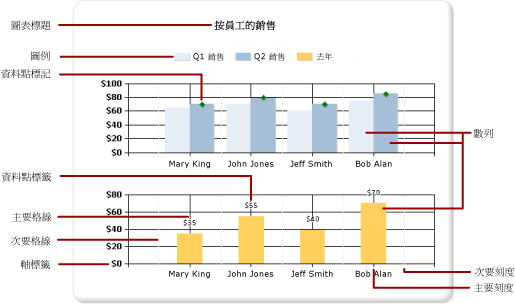
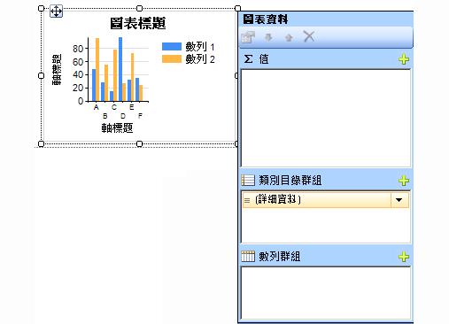
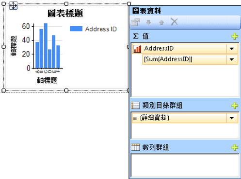

# 圖表 (報表產生器及 SSRS)
閱讀有關使用圖表資料區域的詳細資訊，以協助您的 [!INCLUDE[ssRSnoversion_md](../../includes/ssrsnoversion-md.md)] 分頁報表讀者一眼便了解大量的彙總資料。  

您在建立圖表之前花越多時間仔細準備及了解您的資料，便越容易迅速而有效率地設計圖表。 如需協助選擇要使用哪一個圖表，請參閱[圖表類型](../../reporting-services/report-design/chart-types-report-builder-and-ssrs.md)要立即開始使用圖表來實驗，請參閱[報表產生器教學課程](../../reporting-services/report-builder-tutorials.md)中的列、資料行、走勢圖和圓形圖教學課程。  
  
 下圖顯示圖表中使用的許多不同元素。  
  
   
  
 您可以與報表分開發行圖表，作為「報表組件」。 如需詳細資訊，請參閱[報表組件](../../reporting-services/report-design/report-parts-report-builder-and-ssrs.md)。
  
 
##   設計圖表  
 將圖表資料區加入至設計介面之後，您可以將數值和非數值資料的報表資料集欄位拖曳到圖表的 [圖表資料] 窗格。 當您在設計介面按一下圖表時，[圖表資料] 窗格隨即出現，其中包含三個區域：[類別目錄群組]、[數列群組] 和 [值]。 如果報表有共用或內嵌資料集，資料集中的欄位會出現在 [報表資料] 窗格中。 將欄位從資料集拖曳至 [圖表資料] 窗格的適當區域中。 根據預設，當欄位加入到圖表的其中一個區域時， [!INCLUDE[ssRSnoversion](../../includes/ssrsnoversion-md.md)] 會計算該欄位的彙總。 您也可以使用數列群組動態產生數列。 圖表的[組織類似矩陣](#SimilarMatrix)。  
  
   
  
> [!NOTE]  
>  圖表在設計階段的資料與圖表在報表處理時的資料不同。 它不是您實際的資料。 它會產生已經加入的資料，讓您可以利用圖表外觀的概念，設計您的圖表。  
  
##  圖表與矩陣的相似處  
 考慮圖表如何運作的其中一種方法是比較圖表與矩陣。  
  
   
  
 在概念上，組織是相同的：  
  
-   矩陣中的 [資料行] 群組與圖表中的 [類別目錄群組] 區域類似。  
  
-   矩陣中的 [資料列] 群組與圖表中的 [數列群組] 區域類似。  
  
-   矩陣中的 [資料] 區域與圖表中的 [值] 區域類似。  
  
 
##   將資料加入到圖表中  
 假設您所擁有的報表會依名稱顯示銷售額。 您會將 Full Name 欄位放到 [類別目錄群組] 區域，並將 Sales 欄位放到 [值] 區域。  
  
 當您將 Sales 欄位加入到 [值] 區域時，資料欄位的文字會出現在圖例中，而此數值欄位中的資料將會彙總為一個值。 根據預設，此值會使用內建函數 Sum 進行彙總。 [圖表資料] 窗格將會包含一個適用於您欄位的簡單運算式。 在範例中，欄位運算式 `[Sum(Sales)]` 的 `=Sum(Fields!Sales.Value)`將會出現。 如果沒有指定任何群組，圖表僅會顯示一個資料點。 若要顯示多個資料點，您必須加入群組欄位來為資料分組。 當您將 Name 欄位加入到 [類別目錄群組] 區域時，與欄位名稱相同名稱的群組欄位會自動加入到圖表中。 加入定義 x 和 y 軸之值的欄位時，圖表擁有足夠的資訊可以正確繪製資料。  
  
   
  
 當 [數列群組] 區域留空時，數列的數目會在設計階段修正。 在此範例中，銷售額是出現在圖表上的唯一數列。  
  
 
##   圖表中的類別目錄和數列群組  
 圖表支援巢狀類別目錄和數列群組。 圖表不會顯示詳細資料。 將資料集欄位拖曳到所選圖表的類別目錄和數列放置區，藉以在圖表中加入群組。  
  
 圓形圖之類的形狀圖支援類別目錄群組和巢狀類別目錄群組。 長條圖之類的其他圖表支援類別目錄群組和數列群組。 您可以建立巢狀群組，但是必須確定類別目錄或數列的數目不會遮住圖表中相關資訊的呈現。  
  
### 將數列群組加入至圖表  
 如果您將某個欄位加入到 [數列群組] 區域，數列的數目則視該欄位中包含的資料而定。 在先前的範例中，假設您將 Year 欄位加入到 [數列群組] 區域。 在 Year 欄位中，值的數目將會決定有多少數列會出現在圖表上。 如果 Year 欄位包含 2004、2005 和 2006 年，圖表將會在 [值] 區域中，為每個欄位顯示三個數列。  
  
##   建立圖表前的資料集考量  
 圖表提供資料的摘要檢視。 不過，資料集如果很大，則圖表上的資訊可能會變得不易辨認或無法判讀。 資料點遺失或為 Null、資料類型不適於圖表類型，以及將圖表與資料表結合等進階應用，都可能會影響圖表的可讀性。 您應該在設計圖表之前小心地準備及了解資料，如此就可以快速而有效地設計圖表。  
  
 報表中的圖表數可依您的需要而定。 圖表會繫結至單一資料集，這與矩陣或資料表等任何其他資料區類似。 如果您想要在同一圖表上顯示多個資料集，可以在 SQL 查詢中使用 JOIN 或 UNION 陳述式建立其他資料集，然後再將資料加入到圖表。 如需有關 JOIN 和 UNION 陳述式的詳細資訊，請參閱《線上叢書》或其他 SQL 參考資訊。  
  
 如果詳細資料沒有必要或沒有用處，請考慮在資料集查詢中預先彙總資料。 若要更清楚地顯示每個資料點，請減少資料集中的類別目錄數目。 您可以篩選資料集或將條件加入至查詢，以減少傳回的資料列數目。 
  
##   在圖表中顯示資料的最佳作法  
 當顯示的元素數目能以清楚的影像顯示基礎資訊時，圖表最為有效。 有些圖表 (例如散佈圖) 的資料點數越多越好，有些圖表 (例如圓形圖) 則在資料點較少時比較有效。 根據資料集中的值，小心地選擇圖表類型以及您想要以何種方式顯示這項資訊。 如需詳細資訊，請參閱 [圖表類型 &#40;報表產生器及 SSRS&#41;](../../reporting-services/report-design/chart-types-report-builder-and-ssrs.md)。  
  
 您可以使用數種方法來合併圖表上的資料：  
  
-   在使用圓形圖時，將小扇區收集成稱為「其他」的單一扇區。 這樣可以減少圓形圖上的扇區數目。 如需詳細資訊，請參閱 [收集圓形圖上的小配量 &#40;報表產生器及 SSRS&#41;](../../reporting-services/report-design/collect-small-slices-on-a-pie-chart-report-builder-and-ssrs.md)。  
  
-   請避免在資料點很多時使用資料點標籤。 資料點標籤在圖表上只有幾個點時最有效。  
  
-   請篩選不想要或不相關的資料。 這樣有助於強調您想要在圖表上顯示的關鍵資料。 若要篩選圖表中的資料點，請針對類別目錄群組或數列群組設定篩選。 依預設，圖表會使用內建函數 Sum，將屬於相同群組的值彙總成數列中的個別資料點。 如果您變更數列的彙總函式，則必須同樣變更篩選運算式中的彙總函式。 如需詳細資訊，請參閱 [篩選、分組和排序資料 &#40;報表產生器及 SSRS&#41;](../../reporting-services/report-design/filter-group-and-sort-data-report-builder-and-ssrs.md)(將互動式排序加入資料表或矩陣 (報表產生器及 SSRS))。  
  
-   若要在資料表或矩陣範本中顯示比例資料，請考慮使用線性量測計，而不要使用橫條圖。 量測計較適合用來顯示資料格內的單一值。 如需詳細資訊，請參閱 [巢狀資料區 &#40;報表產生器及 SSRS&#41;](../../reporting-services/report-design/nested-data-regions-report-builder-and-ssrs.md)。  
   
##   從圖表的資料欄位彙總值  
 根據預設，當欄位加入到圖表的 [值] 區域時， [!INCLUDE[ssRSnoversion](../../includes/ssrsnoversion-md.md)] 會計算該欄位的彙總。 如果您將某個欄位拖曳到圖表上，而不將該欄位放到特定的區域中，該圖表將會根據欄位的資料類型，判斷此欄位屬於類別目錄 (x) 軸或值 (y) 軸。 放在 [值] 區域的數值欄位會使用 SUM 函數進行彙總。 如果值欄位的資料類型在 [值] 區域中為字串，即使欄位中有數字，圖表也無法顯示數值，因此圖表會顯示 COUNT 函數。 若要避免發生這個問題，請確定您使用的欄位具有數值資料類型，而不是包含格式化數字的字串。 您可以使用 Visual Basic 運算式，利用 **CDbl** 或 **CInt** 常數將 [字串] 值轉換為數值資料類型。 例如，下列複雜運算式會轉換包含格式化為字串之數值的 `MyField` 欄位。  
  
 `=Sum(CDbl(Fields!MyField.Value))`  
  
 如需彙總運算式的詳細資訊，請參閱[彙總函式參考 &#40;報表產生器及 SSRS&#41;](../../reporting-services/report-design/report-builder-functions-aggregate-functions-reference.md)。  
   
##   本節內容  
 [將圖表加入至報表 &#40;報表產生器及 SSRS&#41;](../../reporting-services/report-design/add-a-chart-to-a-report-report-builder-and-ssrs.md)  
 描述將圖表加入至報表的第一個步驟。  
  
 [圖表類型 &#40;報表產生器及 SSRS&#41;](../../reporting-services/report-design/chart-types-report-builder-and-ssrs.md)  
 描述 [!INCLUDE[ssRSnoversion](../../includes/ssrsnoversion-md.md)]提供的所有圖表類型及圖表子類型，包括使用各種圖表類型時的考量及最佳作法。  
  
 [格式化圖表 &#40;報表產生器及 SSRS&#41;](../../reporting-services/report-design/formatting-a-chart-report-builder-and-ssrs.md)  
 使用來改善整體外觀，並反白顯示圖表的關鍵資料點。  
  
 [圖表中的空白和 Null 資料點 &#40;報表產生器及 SSRS&#41;](../../reporting-services/report-design/empty-and-null-data-points-in-charts-report-builder-and-ssrs.md)  
 描述根據包含空白或 Null 值使用圖表時的考量。  
  
 [將包含多個資料範圍的數列顯示在圖表上 &#40;報表產生器及 SSRS&#41;](../../reporting-services/report-design/displaying-a-series-with-multiple-data-ranges-on-a-chart.md)  
 描述如何將刻度分欄加入到包含一個以上資料範圍的數列中。  
  
 [圖表上的多個數列 &#40;報表產生器及 SSRS&#41;](../../reporting-services/report-design/multiple-series-on-a-chart-report-builder-and-ssrs.md)  
 描述在相同圖表上顯示多個數列的數個方法，包括結合圖表類型、使用副座標軸、指定不同的圖表類型，以及使用多個圖表區域。  
  
 [將多個資料區連結至相同的資料集 &#40;報表產生器及 SSRS&#41;](../../reporting-services/report-design/linking-multiple-data-regions-to-the-same-dataset-report-builder-and-ssrs.md)  
 提供相同報表資料集的不同資料檢視。  
  
 [在圖表中加入或刪除群組 &#40;報表產生器及 SSRS&#41;](../../reporting-services/report-design/add-or-delete-a-group-in-a-chart-report-builder-and-ssrs.md)  
 描述將群組和巢狀群組加入至圖表。  
  
 [將移動平均加入至圖表 &#40;報表產生器及 SSRS&#41;](../../reporting-services/report-design/add-a-moving-average-to-a-chart-report-builder-and-ssrs.md)  
 描述如何使用 [移動平均] 公式計算數列中資料的平均值。  
  
 [疑難排解圖表 &#40;報表產生器及 SSRS&#41;](../../reporting-services/report-design/troubleshoot-charts-report-builder-and-ssrs.md)  
 描述使用圖表的秘訣。  
  
## 另請參閱  
 [影像、文字方塊、矩形和線條 &#40;報表產生器及 SSRS&#41;](../../reporting-services/report-design/images-text-boxes-rectangles-and-lines-report-builder-and-ssrs.md)   
 [互動式排序、文件引導模式及連結 &#40;報表產生器及 SSRS&#41;](../../reporting-services/report-design/interactive-sort-document-maps-and-links-report-builder-and-ssrs.md)   
 [巢狀資料區 &#40;報表產生器及 SSRS&#41;](../../reporting-services/report-design/nested-data-regions-report-builder-and-ssrs.md)   
 [教學課程：將直條圖加入至報表 &#40;報表產生器&#41;](../../reporting-services/tutorial-add-a-column-chart-to-your-report-report-builder.md)   
 [教學課程：將圓形圖加入至報表 &#40;報表產生器&#41;](../../reporting-services/tutorial-add-a-pie-chart-to-your-report-report-builder.md)   
 [教學課程：將橫條圖加入至報表 &#40;報表產生器&#41;](../../reporting-services/tutorial-add-a-bar-chart-to-your-report-report-builder.md)  
  
  
