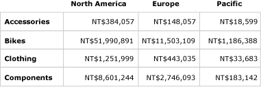
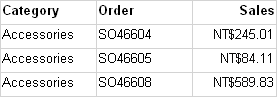
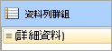
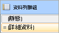
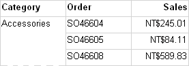
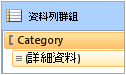
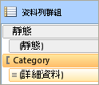
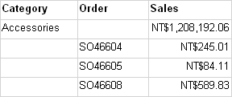
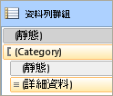

# 控制資料列和資料行標題 (報表產生器及 SSRS)
  資料表、矩陣或清單資料區可以用垂直或水平方式跨越多個頁面。 您可以指定是否要在每一頁重複資料列標題或資料行標題。 在 Web 入口網站或報表預覽等互動式轉譯器中，您也可以指定是否要凍結資料列或資料行標題，以便在橫向捲動或向下捲動報表時讓它們保持可見狀態。 在資料表或矩陣中，第一個資料列通常包含標示每個資料行中之資料的資料行標題；第一個資料行通常包含標示每個資料列中之資料的資料列標題。 對於巢狀群組，您可能會想要重複包含群組標籤的初始資料列和資料行標題集合。 根據預設，清單資料區域並不包含標題。  
  
 您控制標題為重複還是要凍結的方式視下列事項而定：  
  
-   針對在每個頁面頂端重複的資料行標題：  
  
    -   資料表或矩陣是否擁有水平展開的資料行群組區域。  
  
    -   您是否要以一整個單位的方式控制與資料行群組相關聯的所有資料列。  
  
-   針對沿著每個頁面側邊重複的資料列標題：  
  
    -   資料表或矩陣是否擁有垂直展開的資料列群組區域。 只有包含資料列群組標頭的資料列群組支援使用資料列標題。  
  
> [!NOTE]  
>  [!INCLUDE[ssRBRDDup](../../includes/ssrbrddup-md.md)]  
  
## 了解 Tablix 資料區中的資料列及資料行  
 資料表或矩陣是基礎 Tablix 資料區的範本。 Tablix 資料區具有四個可能的區域：控制向下展開報表之資料列的資料列群組區域、控制橫向展開報表之資料行的資料行群組區域、顯示資料的主體，以及邊角。 若要了解在哪裡設定屬性以控制重複或凍結標頭，了解 Tablix 資料區的兩種表示法相當有協助：  
  
-   **在報表定義中** ：在 Tablix 資料區定義中的每個資料列或資料行都是特定資料列或資料行群組的一個 Tablix 成員。 Tablix 成員是靜態或動態的。 靜態 Tablix 成員都包含標籤或小計，而且會針對每個群組重複一次。 動態 Tablix 成員包含群組值，而且會針對群組的每個唯一值重複一次，也稱為群組執行個體。  
  
-   **在設計介面上** ：在設計介面上，虛線將 Tablix 資料區分為四個區域。 Tablix 資料區中的每個資料格都組織成資料列和資料行。 資料列和資料行與群組 (包括詳細資料群組) 相關聯。 若是選取的 Tablix 資料區，資料列和資料行控點與反白橫條表示群組成員資格。 資料列群組或資料行群組區域中的資料格代表 Tablix 成員的群組標頭。 單一資料列或資料行可以與多個群組產生關聯。  
  
     如需詳細資訊，請參閱 [Tablix 資料區 &#40;報表產生器及 SSRS&#41;](../../reporting-services/report-design/tablix-data-region-report-builder-and-ssrs.md) 和 [Tablix 資料區資料格、資料列及資料行 &#40;報表產生器&#41; 及 SSRS](../../reporting-services/report-design/tablix-data-region-cells-rows-and-columns-report-builder-and-ssrs.md)。  
  
 針對包含資料列群組或資料行群組區域的 Tablix 資料區，請設定 Tablix 資料區上的屬性以控制相關聯的資料列和資料行。 針對其他所有案例，在 [屬性] 窗格中設定所選 Tablix 成員的屬性，藉以控制資料列和資料行。 如需逐步指示，請參閱[在多個頁面上顯示資料列和資料行標頭 &#40;報表產生器及 SSRS&#41;](../../reporting-services/report-design/display-row-and-column-headers-on-multiple-pages-report-builder-and-ssrs.md) 和[在報表中捲動時將標頭保持可見 &#40;報表產生器及 SSRS&#41;](../../reporting-services/report-design/keep-headers-visible-when-scrolling-through-a-report-report-builder-and-ssrs.md)。  
  
##   範例  
 Tablix 資料區最常見的範例為用於矩陣、不含群組的資料表、包含資料列群組和資料列群組標頭的資料表，以及包含資料列群組但不含資料列群組標頭的資料表。 若要控制重複或凍結標頭的方式，您必須判斷您要控制的資料列或資料行是與資料列群組區域中的群組標頭相關聯，還是與資料行群組區域中的群組標頭相關聯。  
  
 下列章節提供用於 Tablix 資料區之一般配置的範例：  
  
-   [矩陣](#Matrix)  
  
-   [不含群組的資料表](#TableNoGroups)  
  
-   [包含資料列群組和資料列群組區域的資料表](#TableRowGroupsGroupHeader)  
  
-   [包含資料列群組但不含資料列群組區域的資料表](#TableRowGroupsNoGroupHeader)  
  
###   矩陣  
 根據預設，一個簡單的矩陣有一個資料列群組和一個資料行群組。 下圖顯示包含以 Category 為基礎之資料列群組，以及以 Geography 為基礎之資料行群組的矩陣：  
  
   
  
 虛線表示四個 Tablix 區域。 資料列群組區域所擁有的資料列群組標頭可控制第一個資料行中的類別標籤。 同樣地，資料行群組區域所擁有的資料行群組標頭可控制第一個資料列中的地理位置標籤。 在預覽中，由於矩陣會橫跨頁面展開，第一個資料列會顯示資料行標題，如下圖所示：  
  
   
  
 若要在第一個資料列中重複或凍結資料行標題，請在 Tablix 資料區上設定資料行標頭的屬性。 巢狀資料行群組的資料行標頭會自動加入。  
  
 若要在第一個資料行中重複或凍結資料列標題，請在 Tablix 資料區上設定資料列標頭的屬性。 巢狀資料列群組的資料列標頭會自動加入。  
  
 [回頁首](#Top)  
  
###   不含資料列群組的資料表  
 根據預設，不含群組的簡單資料表包含詳細資料群組。 下圖的資料表顯示類別、訂單號碼，以及銷售資料：  
  
   
  
 資料表僅包含 Tablix 主體區域，因此沒有虛線。 第一個資料列顯示資料行標頭，並代表與群組沒有關聯的靜態 Tablix 成員。 第二個資料列顯示詳細資料，並代表與詳細資料群組相關聯的動態 Tablix 成員。 下圖顯示預覽中的資料表：  
  
   
  
 若要重複或凍結資料行標題，請在 Tablix 成員上設定屬於 Tablix 資料區定義之靜態資料列的屬性。 若要選取靜態資料列，您必須使用 [群組] 窗格的 [進階] 模式。 下圖顯示 [資料列群組] 窗格：  
  
   
  
 在 [進階] 模式中，下圖顯示資料表中資料列群組的靜態和動態 Tablix 成員：  
  
   
  
 若要重複或凍結 Tablix 成員的資料行標題，請選取標示的靜態資料列 (**Static**)。 [屬性] 窗格會顯示所選 Tablix 成員的屬性。 您可以設定此 Tablix 成員的屬性，藉以控制第一個資料列如何在檢視中重複，或保留在檢視中。  
  
 [回頁首](#Top)  
  
###   包含資料列群組和資料列群組區域的資料表  
 如果您將資料列群組加入到簡單的資料表中，資料列群組區域就會加入到設計介面上的資料表中。 下圖顯示包含以 Category 為基礎之資料列群組的資料表：  
  
   
  
 虛線表示 Tablix 資料列群組區域以及 Tablix 主體區域。 資料列群組區域擁有資料列群組標頭，但是沒有資料行群組標頭。 下圖顯示預覽中的這個資料表：  
  
   
  
 若要重複或凍結資料行標題，請使用與上述範例相同的方法。 下圖顯示 [資料列群組] 窗格的預設檢視：  
  
   
  
 使用 [資料列群組] 窗格的 **[進階]** 模式顯示 Tablix 成員，如下圖所示：  
  
   
  
 列出的 Tablix 成員： **Static**、(**Static**)、Category 和 (**Details**)。 包含括號 () 的 Tablix 成員表示沒有對應的群組標頭。 若要重複或凍結資料行標題，請選取最上方的 Static Tablix 成員，然後在 [屬性] 窗格中設定屬性。  
  
 [回頁首](#Top)  
  
###   包含資料列群組但不含資料列群組區域的資料表  
 資料表可以使用數種方式包含資料列群組，但不含資料列群組區域。 兩個可能的方式包括：  
  
-   從包含資料列群組和資料列群組區域的資料表開始，然後刪除資料列群組區域的資料行。 僅刪除資料行，但不刪除群組。 例如，您可能想要將資料表格式控制為一個簡單的方格。  
  
-   升級針對上一個 RDL 版本所建立的報表，然後再導入 Tablix 資料區。  
  
 下圖顯示在設計介面上包含資料列群組，但不含資料列群組區域的資料表：  
  
   
  
 資料表有三個資料列。 第一個資料列包含資料行標頭。 第二個資料列包含群組值和小計。 第三個資料列包含詳細資料。 因為只有一個 Tablix 主體區域，因此沒有虛線。 下圖顯示預覽中的這個資料表：  
  
   
  
 若要控制資料列如何在檢視中重複，或保留在檢視中，您必須在 Tablix 成員上設定每個資料列的屬性。 在預設模式下，這個範例與包含資料列群組和群組標頭之資料表的上一個範例沒有什麼不同。 下圖顯示此資料表在預設模式下的 [群組] 窗格：  
  
   
  
 不過，在進階模式下，此配置結構會顯示一組不同的 Tablix 成員。 下圖顯示此資料表在進階模式下的 [群組] 窗格：  
  
   
  
 在 [資料列群組] 窗格中，會列出下列 Tablix 成員： (**Static**)、(Category)、(**Static**) 和 (**Details**)。 若要重複或凍結資料行標題，請選取最上方的 (**Static**) Tablix 成員，然後在 [屬性] 窗格中設定屬性。  
  
 [回頁首](#Top)  
  
## 重複或凍結標頭的轉譯器支援  
 轉譯器對於重複或凍結標頭的支援不同。  
  
 使用實體頁面 (PDF、影像、列印) 的轉譯器支援下列功能：  
  
-   當 Tablix 資料區以水平方式橫向擴展到多個頁面時，重複資料列標頭。  
  
-   當 Tablix 資料區以垂直方式向下擴展到多個頁面時，重複資料行標頭。  
  
 此外，使用軟分頁符號的轉譯器 (Web 入口網站、報表預覽或報表檢視器控制項) 支援下列功能：  
  
-   當您以水平方式橫向捲動報表時，保持資料列標頭可見狀態。  
  
-   當您以垂直方式向下捲動報表時，保持資料行標頭可見狀態。  
  
 如需詳細資訊，請參閱[轉譯行為 &#40;報表產生器及 SSRS&#41;](../../reporting-services/report-design/rendering-behaviors-report-builder-and-ssrs.md)。  
  
## 另請參閱  
 [篩選、分組和排序資料 &#40;報表產生器及 SSRS&#41;](../../reporting-services/report-design/filter-group-and-sort-data-report-builder-and-ssrs.md)   
 [資料表、矩陣和清單 &#40;報表產生器及 SSRS&#41;](../../reporting-services/report-design/tables-matrices-and-lists-report-builder-and-ssrs.md)   
 [Reporting Services 中的分頁 &#40;報表產生器及 SSRS&#41;](../../reporting-services/report-design/pagination-in-reporting-services-report-builder-and-ssrs.md)   
 [匯出報表 &#40;報表產生器及 SSRS&#41;](../../reporting-services/report-builder/export-reports-report-builder-and-ssrs.md)  
  
  
