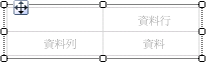
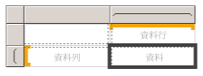
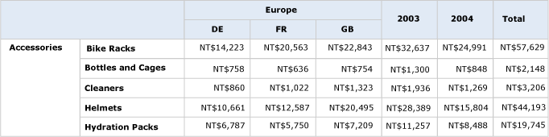

# 建立矩陣 (報表產生器及 SSRS)
  使用矩陣顯示群組資料與摘要資訊。 您可以依資料列和資料行群組中的多個欄位或運算式群組資料。 矩陣提供與交叉資料表和樞紐資料表類似的功能。 在執行階段，當報表資料和資料區域結合時，矩陣在頁面上會以水平和垂直方式成長。 矩陣資料格中的值會顯示資料格所屬資料列與資料行群組交集範圍內的彙總值。 您可以格式化資料列和資料行以反白顯示您要強調的資料。 您也可以加入一開始隱藏詳細資料的向下鑽研切換，使用者就可以在需要時，按一下切換來顯示更多或更少的詳細資料。  
  
 在初始設計之後，您可以繼續開發矩陣以改善使用者的檢視體驗。 如需詳細資訊，請參閱 [控制報表頁面上的 Tablix 資料區顯示 &#40;報表產生器及 SSRS&#41;](../../reporting-services/report-design/controlling-the-tablix-data-region-display-on-a-report-page.md)。  
  
 若要快速地開始使用矩陣，請參閱[教學課程：建立矩陣報表 &#40;報表產生器&#41;](../../reporting-services/tutorial-creating-a-matrix-report-report-builder.md)。  
  
> [!NOTE]  
>  您可以將清單當做報表組件，與報表分開發行。 請深入了解 [報表組件 (報表產生器及 SSRS)](../../reporting-services/report-design/report-parts-report-builder-and-ssrs.md)。  
  
##   將矩陣加入至您的報表  
 將矩陣從功能區上的 [插入] 索引標籤加入至設計介面。 您可以選擇使用「資料表或矩陣精靈」(包括建立資料來源連接和資料集與設定矩陣) 來加入矩陣，或根據矩陣範本來加入矩陣。  
  
> [!NOTE]  
>  您只能在 [!INCLUDE[ssRBDenali](../../includes/ssrbdenali-md.md)]中使用此精靈。  
  
 為從開始到結束描述如何設定資料表，本主題使用矩陣範本。  此矩陣一開始擁有一個資料列群組、一個資料行群組、一個邊角資料格，以及一個資料資料格，如下圖所示。  
  
   
  
 當您在設計介面上選取矩陣時，資料列和資料行控制代碼隨即出現，如下圖所示。  
  
   
  
 將資料集欄位拖曳到 [群組] 窗格的 [資料列群組] 和 [資料行群組] 區域來加入群組。 您拖曳到資料列群組或資料行群組窗格中的第一個欄位會取代初始的空預設群組。 接著，您可以根據資料，套用每個資料格的格式。  
  
   
  
 在 [預覽] 中，矩陣會展開以顯示資料列群組和資料行群組值。 資料格會顯示摘要值，如下圖所示。  
  
   
  
 您開始使用的矩陣是以 Tablix 資料區為基礎的範本。 您可以加入巢狀或相鄰的資料列群組或資料行群組，甚至是加入詳細資料列，以便繼續開發您的矩陣設計。 如需詳細資訊，請參閱[探索 Tablix 資料區的彈性 &#40;報表產生器及 SSRS&#41;](../../reporting-services/report-design/exploring-the-flexibility-of-a-tablix-data-region-report-builder-and-ssrs.md)。  
  
  
##   將父群組或子群組加入至矩陣中  
 若要以單一資料集欄位為基礎加入群組，將欄位從 [報表資料] 窗格拖曳到 [群組] 窗格的適當 [資料列群組] 或 [資料行群組] 區域。 將欄位放到群組階層中，以便將其關聯性設定到現有的群組。 將該欄位放到現有群組的上方來建立父群組，或將其放在現有群組的下方來建立子群組。  
  
 當您將欄位放到 **[群組]** 窗格時，會發生數種狀況：  
  
-   系統會根據欄位名稱，自動建立一個包含唯一名稱的新群組。 群組運算式會設定為簡單的欄位名稱參考，例如 `[Category]`。  
  
-   新的資料列或資料行會出現在對應的資料列群組或資料行群組區域中。  
  
-   在新的資料行中，預設資料列的資料列群組資料格會從報表資料集顯示。 在 Tablix 主體中，此資料列的資料格現在是資料列群組的成員。 如果有定義任何資料行群組，資料行中的資料格為這些資料行群組的成員。 群組指標會針對每個資料格的群組成員資格提供視覺提示。  
  
 若要在建立群組後加以自訂，使用 **[Tablix 群組]** 對話方塊。 您可以變更群組名稱，並在群組定義中編輯或加入其他運算式。 若要從資料表加入或移除資料列，請參閱[插入或刪除資料列 &#40;報表產生器及 SSRS&#41;](../../reporting-services/report-design/insert-or-delete-a-row-report-builder-and-ssrs.md)。  
  
 當報表執行時，動態資料行標頭會依唯一群組值數目，向右展開資料行 (如果矩陣的 Direction 屬性設為 RTL，則是向左展開)。 動態資料列是在頁面上向下擴展。 出現在 Tablix 主體資料格中的資料會以資料列和資料行群組的交集為基礎來彙總，如下圖所示。  
  
   
  
 在預覽中，報表如下圖所示。  
  
   
  
 若要撰寫指定預設範圍外之範圍的運算式，您必須在彙總函式中，指定資料集、資料區域或群組的名稱。 若要計算每個子類別目錄佔 Clothing 類別目錄群組值的百分比，將資料行加入到 Total 資料行旁邊的 Category 群組中、格式化文字方塊來顯示百分比，以及加入在分子使用預設範圍，並在分母使用 Category 群組範圍的運算式，如下列範例所示。  
  
 `=SUM(Fields!Linetotal.Value)/SUM(Fields! Linetotal.Value,"Category")`  
  
 如需詳細資訊，請參閱 [總計、彙總與內建集合的運算式範圍 &#40;報表產生器及 SSRS&#41;](../../reporting-services/report-design/expression-scope-for-totals-aggregates-and-built-in-collections.md)。  
  
  
##   將相鄰的群組加入到矩陣中  
 若要以單一資料集欄位為基礎加入相鄰的群組，請使用 [群組] 窗格中的快速鍵功能表。 如需詳細資訊，請參閱 [在資料區中加入或刪除群組 &#40;報表產生器及 SSRS&#41;](../../reporting-services/report-design/add-or-delete-a-group-in-a-data-region-report-builder-and-ssrs.md)。 下圖顯示以地理位置為基礎的群組與以年份為基礎的相鄰群組。  
  
   
  
 在此範例中，查詢已將資料值篩選為僅包含歐洲 2003 和 2004 年的值。 不過，您可以針對每個群組個別設定篩選。 在預覽中，報表如下圖所示。  
  
   
  
 若要加入相鄰資料行群組的總計資料行，按一下資料行群組定義資料格，然後使用 **[加入總計]** 命令。 新的靜態資料行就會加入到資料行群組的旁邊，其中包含現有資料列中每個數值欄位的預設彙總總和。 若要變更運算式，請手動編輯預設彙總，例如， `Avg([Sales])`。 如需詳細資訊，請參閱[將總計加入到群組或 Tablix 資料區 &#40;報表產生器及 SSRS&#41;](../../reporting-services/report-design/add-a-total-to-a-group-or-tablix-data-region-report-builder-and-ssrs.md)。  
  
  
## 另請參閱  
 [彙總函式參考 &#40;報表產生器及 SSRS&#41;](../../reporting-services/report-design/report-builder-functions-aggregate-functions-reference.md)   
 [運算式範例 &#40;報表產生器及 SSRS&#41;](../../reporting-services/report-design/expression-examples-report-builder-and-ssrs.md)  
  
  
