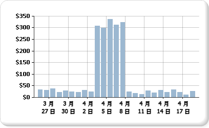

# 將包含多個資料範圍的數列顯示在圖表上

  圖表將會使用數列的最小值和最大值來計算軸刻度。 當圖表上的數列包含一個以上的資料範圍時，資料點可能會變得模糊，而圖表上只能清楚看到幾個資料點。 例如，假設您的報表顯示 30 天的期間內每天的銷售總額。  
  
   
  
 在這個月的大多數時間，銷售量都是在 10 和 40 之間。 但是，有一個禮拜的促銷活動造成四月初的銷售量激增。 這樣的銷售資料變更會產生資料點的不平均分配，因此會降低圖表的整體可讀性。  
  
 有幾種不同的方式可提升可讀性：  
  
-   **啟用刻度斷層**： 如果您的資料形成兩組或多組資料範圍，請使用刻度斷層來移除範圍之間的間隙。 刻度斷層是在繪圖區上繪製的一道區域線，代表數列中高低值之間的斷層。  
  
-   **篩選掉不必要的值**： 如果您的資料點蓋住了圖表上所要顯示的重要資料範圍，請使用報表篩選移除不要的點。 如需如何在 [!INCLUDE[ssRSnoversion](../../includes/ssrsnoversion-md.md)] 中將篩選新增至圖表的詳細資訊，請參閱[新增資料集篩選、資料區篩選和群組篩選 &#40;報表產生器及 SSRS&#41;](../../reporting-services/report-design/add-dataset-filters-data-region-filters-and-group-filters.md)。  
  
-   **將每一個資料範圍繪製成個別數列來進行多個數列的比較**： 如果您的資料範圍超過兩個以上，請考慮將資料範圍分割成個別的數列。 如需詳細資訊，請參閱 [圖表上的多個數列 &#40;報表產生器及 SSRS&#41;](../../reporting-services/report-design/multiple-series-on-a-chart-report-builder-and-ssrs.md)：  
  
> [!NOTE]  
>  [!INCLUDE[ssRBRDDup](../../includes/ssrbrddup-md.md)]  
  
## 使用刻度斷層顯示多個資料範圍  
 當您啟用刻度斷層時，圖表會計算要將線條繪製到圖表上的何處。 範圍之間必須有足夠的分隔位置，才能繪製刻度斷層。 根據預設，只有當至少圖表百分之 25 的資料範圍之間有分隔時，才可以加入刻度斷層。  
  
   
  
> [!NOTE]  
>  您無法指定刻度斷層在圖表上的放置位置。 但是，您可以修改刻度斷層的計算方式，本主題稍後會加以描述。  
  
 如果您啟用刻度斷層，但是它並未出現，而且資料範圍之間確實有足夠的距離，此時您可以將 CollapsibleSpaceThreshold 屬性設定為小於 25 的值。 CollapsibleSpaceThreshold 會指定資料範圍之間所需之可摺疊空間的百分比。 如需詳細資訊，請參閱[將刻度斷層新增至圖表 &#40;報表產生器及 SSRS&#41;](../../reporting-services/report-design/add-scale-breaks-to-a-chart-report-builder-and-ssrs.md)。  
  
 圖表最多可支援每個圖表五個刻度斷層；但是，顯示一個以上的刻度斷層可能會造成圖表無法讀取。 如果您的資料範圍超過兩個以上，請考慮使用另一個方法來顯示這些資料。 如需詳細資訊，請參閱 [圖表上的多個數列 &#40;報表產生器及 SSRS&#41;](../../reporting-services/report-design/multiple-series-on-a-chart-report-builder-and-ssrs.md)：  
  
## 不支援的刻度斷層案例  
 下列圖表案例不支援刻度斷層：  
  
-   圖表具有立體功能。  
  
-   指定了對數值軸。  
  
-   已經明確設定值軸的最小值和最大值。  
  
-   圖表類型為極座標圖、雷達圖、圓形圖、環圈圖、漏斗圖、金字塔圖或任何堆疊圖表。  
  
 具有刻度斷層的圖表範例可從範例報表取得。 如需下載這個範例報表及其他項目的詳細資訊，請參閱 [報表產生器與報表設計師範例報表](http://go.microsoft.com/fwlink/?LinkId=198283)：  

## 後續步驟

[圖表的多個數列](../../reporting-services/report-design/multiple-series-on-a-chart-report-builder-and-ssrs.md)   
[格式化圖表](../../reporting-services/report-design/formatting-a-chart-report-builder-and-ssrs.md)   
[圖表的 3D、浮凸和其他效果](../../reporting-services/report-design/chart-effects-3d-bevel-and-other-report-builder.md)   
[圖表](../../reporting-services/report-design/charts-report-builder-and-ssrs.md)   
[軸屬性對話方塊、軸選項](http://msdn.microsoft.com/library/b276e210-7a12-48ae-971b-7dabae51df11)   
[將小配量收集成一個圓形圖](../../reporting-services/report-design/collect-small-slices-on-a-pie-chart-report-builder-and-ssrs.md)  

更多問題嗎？ [請嘗試詢問 Reporting Services 論壇](http://go.microsoft.com/fwlink/?LinkId=620231)
