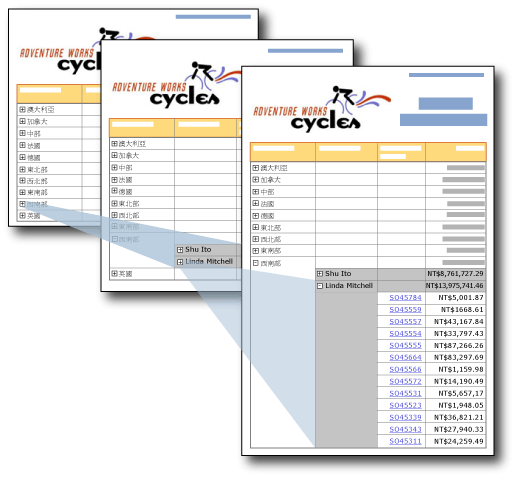

# 向下鑽研動作 (報表產生器及 SSRS)
  透過在文字方塊上提供加號和減號圖示，您就可以讓使用者以互動方式隱藏和顯示項目。 這稱為 *「向下鑽研」* (Drilldown) 動作。 對於資料表或矩陣，您可以顯示或隱藏靜態資料列和資料行，或者顯示或隱藏與群組相關聯的資料列和資料行。  
  
   
  
 在此圖中，使用者可以按一下報表中的加號 (+) 來顯示詳細資料。  
  
 例如，除了包含資料列群組之資料表的外部群組摘要資料列之外，您可以一開始隱藏所有資料列。 為每個內部群組 (包括詳細資料群組) 之包含群組的群組資料格，加入展開/摺疊圖示。 轉譯報表時，使用者可以按一下文字方塊，以展開和摺疊詳細資料。 如需詳細資訊，請參閱[資料表 &#40;報表產生器及 SSRS&#41;](../../reporting-services/report-design/tables-report-builder-and-ssrs.md)。  
  
 若要讓使用者展開或摺疊項目，您可以設定該項目的可見性屬性。  
  
> [!NOTE]  
>  當您建立具有向下鑽研動作的報表時，您必須設定您要隱藏之群組、資料行或資料列的可見性資訊，而不只是資料列或資料行中之單一文字方塊的可見性資訊。 此外，您用於切換的文字方塊必須位於可控制您要顯示或隱藏之項目的包含範圍內。  
>   
>  例如，若要隱藏與巢狀群組相關聯的資料列，文字方塊必須位於與父群組相關聯的資料列中，或是位於內含項目階層中更高的位置。  
>   
>  如需設定群組、 資料行或資料列的可見性資訊，請參閱[將展開或摺疊群組動作加入項目 &#40;報表產生器及 SSRS &#41;](../../reporting-services/report-design/add-an-expand-or-collapse-action-to-an-item-report-builder-and-ssrs.md)  
  
 如需隱藏報表項目的詳細資訊，請參閱[隱藏項目 &#40;報表產生器及 SSRS &#41;](../../reporting-services/report-builder/hide-an-item-report-builder-and-ssrs.md).  
  
> [!NOTE]  
>  [!INCLUDE[ssRBRDDup](../../includes/ssrbrddup-md.md)]  
  
## 比較向下鑽研和鑽研報表  
 在向下鑽研報表中，使用者可按一下加號或減號按鈕來展開或摺疊報表區段，以就地顯示詳細資料。 在鑽研報表中，使用者則會按一下摘要值的連結，這會開啟相關的個別報表來顯示詳細資料。 只有在詳細資料報表執行時，才會擷取詳細資料。 鑽研報表需要的資源通常比向下鑽研報表更少。 如需詳細資訊，請參閱 [鑽研、向下鑽研、子報表和巢狀資料區 &#40;報表產生器及 SSRS&#41;](../../reporting-services/report-design/drillthrough-drilldown-subreports-and-nested-data-regions.md)。  
  
## 隱藏報表項目的轉譯延伸模組支援  
 只有支援使用者互動性的轉譯延伸模組 (例如在報表產生器和報表管理員中執行報表時使用的 HTML 轉譯延伸模組)，才支援報表項目的顯示與隱藏切換。 其他轉譯延伸模組會顯示隱藏的項目。 下列清單描述包含條件式可見性之報表項目的支援：  
  
-   在 HTML 中，如果項目是隱藏的，則在 HTML 原始檔中看不到它們。  
  
-   XML 轉譯延伸模組會顯示所有的報表項目 (不論它們是否為隱藏)。  
  
-   Excel 轉譯延伸模組會顯示並展開資料表、矩陣或清單的隱藏資料列和資料行。 所有的資料列和資料行都是可見的。  
  
 如需詳細資訊，請參閱[轉譯行為 &#40;報表產生器及 SSRS&#41;](../../reporting-services/report-design/rendering-behaviors-report-builder-and-ssrs.md)。  
  
## 另請參閱  
 [鑽研、向下鑽研、子報表和巢狀資料區 &#40;報表產生器及 SSRS&#41;](../../reporting-services/report-design/drillthrough-drilldown-subreports-and-nested-data-regions.md)   
 [互動式排序、 文件引導模式及連結 &#40;報表產生器及 SSRS &#41;](../../reporting-services/report-design/interactive-sort-document-maps-and-links-report-builder-and-ssrs.md)   
 [運算式範例 &#40;報表產生器及 SSRS &#41;](../../reporting-services/report-design/expression-examples-report-builder-and-ssrs.md)  
  
  

