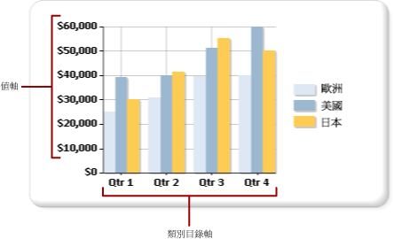

# 格式化圖表上的軸標籤 (報表產生器及 SSRS)
  以座標為基礎的圖表類型 (直條圖、橫條圖、區域圖、點圖、折線圖和範圍圖) 具有兩個座標軸，可用來分類及顯示資料關聯性。 每個座標軸都會套用不同類型的格式設定。  
  
 您可以使用 [軸屬性] 對話方塊或 [屬性] 窗格來設定軸的格式。 以滑鼠右鍵按一下要格式化的軸，然後按一下 [軸屬性]，變更軸文字、數值和日期格式、主要和次要刻度、標籤自動調整以及軸線條的粗細、色彩和樣式等值。 若要變更軸標題的值，以滑鼠右鍵按一下軸標題，然後按一下 [軸標題屬性]。  
  
 軸標籤會在圖表上識別主要格線間隔。 根據預設，圖表會使用演算法來決定如何將標籤以最佳化的方式放置在軸上，以避免文字重疊。  
  
> [!NOTE]  
>  [!INCLUDE[ssRBRDDup](../../includes/ssrbrddup-md.md)]  
  
## 軸的類型  
 圖表有兩種主要的軸：值軸和類別目錄軸。  
  
   
  
 當您將欄位從資料集拖曳到圖表介面上時，圖表會決定這個欄位是屬於類別目錄軸或值軸。  
  
 值軸通常是圖表的垂直軸 (或稱 Y 軸)， 用來顯示圖表所繪製的數值資料值。 拖曳到資料欄位區域中的欄位會繪製在值軸上。 類別目錄軸通常是圖表的水平軸 (或稱 X 軸)。 這些軸在橫條圖中則完全相反。 在橫條圖類型中，類別目錄軸是垂直軸，而值軸是水平軸。 如需詳細資訊，請參閱[橫條圖 &#40;報表產生器及 SSRS&#41;](../../reporting-services/report-design/bar-charts-report-builder-and-ssrs.md)。  
  
## 圖表如何計算軸標籤間隔  
 在設定軸標籤的格式之前，您應該先了解圖表如何計算軸標籤間隔。 如此才能設定必要的屬性，以達到所要的軸標籤行為。  
  
 軸刻度受限於最小值及最大值，這些值會定義在軸上顯示的資料範圍。 圖表會根據結果集中的值來計算每個軸的最小值及最大值。 值軸上的刻度永遠是由值欄位中的最小及最大數決定， 類別目錄軸上的最小及最大值類型則是根據類別目錄欄位的類型而定。 資料集中的任何欄位都可分類成三種類別目錄欄位類型之一。 下表說明這三種類別目錄欄位類型。  
  
|類型目錄欄位類型|說明|範例|  
|-------------------------|-----------------|-------------|  
|數值|類別目錄會以數值次序沿著 X 軸繪製。|依員工識別碼排列的銷售報表，沿著 X 軸顯示員工識別碼。|  
|日期/時間|類別目錄會依時間順序沿著 X 軸繪製。|依月份排列的銷售報表，沿著 X 軸顯示格式化的日期。|  
|字串|類別目錄會依出現在資料來源中的次序沿著 X 軸繪製。|依區域排列的銷售報表，沿著 X 軸顯示區域名稱。|  
  
 當放入圖表的類別目錄過多時，所有具有兩個軸的圖表類型都設計成會隱藏某些軸標籤，以產生較清晰的圖表影像並避免標籤互相衝突。  
  
 應用程式會根據下列步驟，計算軸上放置標籤的位置：  
  
1.  根據結果集中的值來識別最小值及最大值。  
  
2.  根據這些最小值和最大值計算等距的軸間隔數 (通常為 4 到 6 個)。  
  
3.  標籤會根據軸標籤屬性以這些間隔顯示。 影響標籤位置的屬性包括字型大小、標籤顯示的角度以及文字換行屬性。 這些軸標籤自動調整選項都可以變更。  
  
### 圖表如何計算軸標籤的範例  
 此處所示的資料表包含要繪製在直條圖上的範例銷售資料。 [名稱] 欄位會加入至 [類別目錄群組] 區域，而 [數量] 欄位則加入至 [值] 區域。  
  
|名稱|Quantity|  
|----------|--------------|  
|Michael Blythe|229|  
|Jae Pak|112|  
|Ranjit Varkey Chudukatil|494|  
|Jillian Carson|247|  
|Linda Mitchell|339|  
|Rachel Valdez|194|  
  
 [數量] 欄位會沿著值軸繪製。 最小值為 112，最大值則為 494。 在此例中，圖表會以 0 開始計算刻度，而在 500 結束。 圖表也會以 100 計算 5 個等距的間隔，並在 0、100、200、300、400 和 500 的位置建立標籤。  
  
 [名稱] 欄位會沿著類別目錄軸繪製。 圖表會計算出 4 到 6 個標籤，並計算自動調整設定，以決定如何在類別目錄軸上放置標籤而不致導致標籤衝突。 結果是某些類別目錄標籤可能會省略。 您可以個別地覆寫每個軸的自動調整選項。  
  
## 在類別目錄軸上顯示所有標籤  
 在值軸上，軸間隔會為圖表上的資料點提供一致的量值； 不過，在類別目錄軸上，這項功能則可能導致類別目錄無法顯示軸標籤。 通常您會想要標示所有的類別目錄。 可以將間隔數設定為 1 來顯示所有的類別目錄。  如需詳細資訊，請參閱 [指定軸間隔 &#40;報表產生器及 SSRS&#41;](../../reporting-services/report-design/specify-an-axis-interval-report-builder-and-ssrs.md)。  
  
> [!NOTE]  
>  若在軸上以手動間隔來取代自動標籤功能，則圖表必須正確地重新調整所有其他元素的大小。 結果是您可能會在標籤的大小及位置，或是圖表其他元素的大小方面，遭遇未預期的結果。  
  
## 可變的軸間隔  
 不論大小為何，圖表都會計算大約 5 個軸標籤。 如果圖表較寬或較高，而您只在軸上顯示 5 個標籤，則每個標籤之間可能會出現很大的間距。 這會使得根據軸來識別每個資料點的值更為困難。 若要避免在較寬或較高的圖表上發生這個問題，可以設定可變的軸間隔。 根據相對應的軸，圖表會依其寬度或高度來計算軸上可出現的最佳化標籤數。 如需詳細資訊，請參閱 [指定軸間隔 &#40;報表產生器及 SSRS&#41;](../../reporting-services/report-design/specify-an-axis-interval-report-builder-and-ssrs.md)。  
  
## 軸值排序  
 類別目錄會依其在結果集中的出現順序沿著 X 軸顯示。 您可以藉由在查詢中加入 SORT 命令，或使用運算式排序資料集來變更群組順序。 圖表資料區域的排序方式與所有其他資料區相同。 如需如何排序資料的詳細資訊，請參閱[在資料區中排序資料 &#40;報表產生器及 SSRS&#41;](../../reporting-services/report-design/sort-data-in-a-data-region-report-builder-and-ssrs.md)。  
  
## 在類別目錄軸上指定純量值  
 根據預設，圖表只會在包含有效值的資料集中顯示資料點的軸標籤。 例如，如果在類別目錄軸上有 1、2 和 6 等值，則圖表也會顯示類別目錄 1、2 和 6。 若要維持類別目錄值的刻度，可以將圖表指定為使用純量軸。 在下列案例中，圖表會在圖表的 X 軸上顯示 1-6 的標籤，即使資料集並未包含 3-5 的值。  
  
 有兩種方式可以設定純量軸：  
  
-   在 [軸屬性] 對話方塊中，選取 [純量軸] 選項。 這樣會在軸上沒有資料群組值存在的位置加入數值或日期/時間值。 如需詳細資訊，請參閱[軸屬性對話方塊、軸選項 &#40;報表產生器及 SSRS&#41;](http://msdn.microsoft.com/library/b276e210-7a12-48ae-971b-7dabae51df11)。  
  
-   在 [數列屬性] 對話方塊中，針對 [類別目錄欄位] 選項選取欄位或輸入運算式。 圖表會針對您所指定之類別目錄欄位中的所有值加入軸間隔。  
  
## 從類別目錄軸加入或移除側邊界  
 在橫條圖、直條圖和散佈圖類型中，圖表會自動在 X 軸的端點加入側邊界。 您不可以變更邊界的大小。 在所有其他圖表類型中，圖表中都不會加入側邊界。 如需詳細資訊，請參閱 [加入或移除圖表中的邊界 &#40;報表產生器及 SSRS&#41;](../../reporting-services/report-design/add-or-remove-margins-from-a-chart-report-builder-and-ssrs.md)。  
  
## 本節內容  
 [將軸標籤格式化成日期或貨幣 &#40;報表產生器及 SSRS&#41;](../../reporting-services/report-design/format-axis-labels-as-dates-or-currencies-report-builder-and-ssrs.md)  
  
 [在圖表中放置標籤 &#40;報表產生器及 SSRS&#41;](../../reporting-services/report-design/position-labels-in-a-chart-report-builder-and-ssrs.md)  
  
 [指定軸間隔 &#40;報表產生器及 SSRS&#41;](../../reporting-services/report-design/specify-an-axis-interval-report-builder-and-ssrs.md)  
  
 [加入或移除圖表中的邊界 &#40;報表產生器及 SSRS&#41;](../../reporting-services/report-design/add-or-remove-margins-from-a-chart-report-builder-and-ssrs.md)  
  
 [指定對數刻度 &#40;報表產生器及 SSRS&#41;](../../reporting-services/report-design/specify-a-logarithmic-scale-report-builder-and-ssrs.md)  
  
## 請參閱＜  
 [格式化圖表 &#40;報表產生器及 SSRS&#41;](../../reporting-services/report-design/formatting-a-chart-report-builder-and-ssrs.md)   
 [圖表 &#40;報表產生器及 SSRS&#41;](../../reporting-services/report-design/charts-report-builder-and-ssrs.md)   
 [格式化圖表上的資料點 &#40;報表產生器及 SSRS&#41;](../../reporting-services/report-design/formatting-data-points-on-a-chart-report-builder-and-ssrs.md)  
  
  
