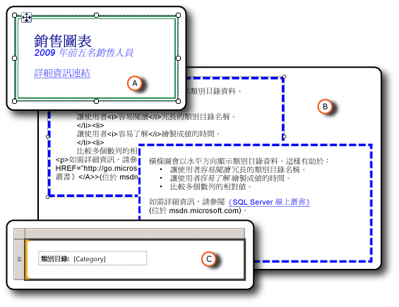

# 設定報表項目的格式 (報表產生器及 SSRS)
  對報表中的項目進行格式化，使報表更具吸引力並增強其可讀性。 當您在報表設計模式時，可以將文字方塊及文字方塊中的個別項目、影像、運算式和資料格式化。  
  
   
  
 A. 文字方塊具有雙線框線與各種格式化樣式，包括連結。  
  
 B. 文字方塊具有虛線框線，以及原始 HTML 和轉譯的 HTML。  
  
 C. 文字方塊具有文字標籤和預留位置。  
  
 您可以變更格式化選項，其方法是選取要格式化的項目，然後開啟此項目的 [屬性] 對話方塊。 例如，如果您想要格式化整個文字方塊的內容或是文字方塊內選取的字，請以滑鼠右鍵按一下此項目，並選取 [文字方塊屬性]。 然後，您可以套用您想要的格式化樣式。  
  
 若要快速開始使用，請參閱[教學課程：格式化文字 &#40;報表產生器&#41;](../../reporting-services/tutorial-format-text-report-builder.md)。  
  
> [!NOTE]  
>  [!INCLUDE[ssRBRDDup](../../includes/ssrbrddup-md.md)]  
  
## 本節內容  
 [格式化文字和預留位置 &#40;報表產生器及 SSRS&#41;](../../reporting-services/report-design/formatting-text-and-placeholders-report-builder-and-ssrs.md)  
 描述如何針對一個文字方塊中的不同文字區塊，進行文字格式化與自訂格式化選項。  
  
 [將 HTML 匯入至報表 &#40;報表產生器及 SSRS&#41;](../../reporting-services/report-design/importing-html-into-a-report-report-builder-and-ssrs.md)  
 描述如何在報表中插入並使用 HTML。  
  
 [格式化數字和日期 &#40;報表產生器及 SSRS&#41;](../../reporting-services/report-design/formatting-numbers-and-dates-report-builder-and-ssrs.md)  
 描述如何使用 [!INCLUDE[ssRSnoversion](../../includes/ssrsnoversion-md.md)]支援的標準與自訂格式化字串。  
  
 [格式化線條、色彩和影像 &#40;報表產生器及 SSRS&#41;](../../reporting-services/report-design/formatting-lines-colors-and-images-report-builder-and-ssrs.md)  
 描述如何格式化報表項目和資料區內的線條、格線、色彩和影像。  
  
 [設定報表或文字方塊的地區設定 &#40;Reporting Services&#41;](../../reporting-services/report-design/set-the-locale-for-a-report-or-text-box-reporting-services.md)  
 描述如何變更因語言和地區而異之資料顯示格式的設定，例如日期、貨幣和數字值。  
  
## 請參閱＜  
 [格式化圖表 &#40;報表產生器及 SSRS&#41;](../../reporting-services/report-design/formatting-a-chart-report-builder-and-ssrs.md)  
  
  
