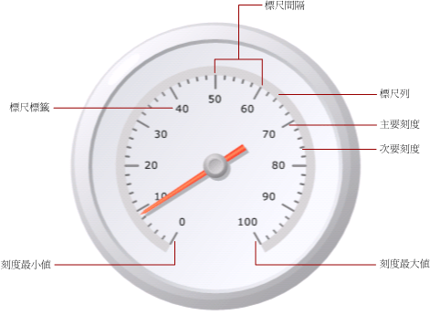
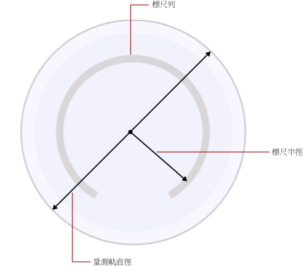

# 格式化量測計上的標尺 (報表產生器及 SSRS)
  在 [!INCLUDE[ssRSnoversion_md](../../includes/ssrsnoversion-md.md)] 分頁報表中，量測計標尺是顯示在量測計上，受限於最小值與最大值的數字範圍。 量測計標尺通常包含量測計標籤與刻度，以便正確讀取量測計指標所顯示的數目。 量測計標尺通常與一或多個量測計指標相關聯。 在相同的量測計上可以有一個以上的標尺。  
  
   
  
 與定義多個群組的圖表不同的是，量測計只會顯示一個值。 您必須定義標尺的最小值和最大值。 系統會根據您針對最小值和最大值指定的值，自動計算間隔數字。  
  
 當您在已經包含一個標尺的量測計上加入另一個標尺時，第一個標尺的外觀屬性會被複製到第二個標尺上。  
  
 您可以用滑鼠右鍵按一下標尺標籤或刻度，然後選取 [星形標尺屬性]  或 [線性標尺屬性]  ，以便在標尺上設定屬性。 每個量測計類型至少都包含一個具有相同屬性集的標尺。 每個量測計類型也都有唯一的屬性：  
  
-   在星形量測計上，您可以指定星形標尺的半徑、開始角度與掃掠角度。  
  
-   在線性量測計上，您可以指定相對於線性量測計上端點之開始和結束邊界的寬度。  
  
 若要快速地開始格式化標尺，請參閱[設定量測計的最小值或最大值 &#40;報表產生器及 SSRS&#41;](../../reporting-services/report-design/set-a-minimum-or-maximum-on-a-gauge-report-builder-and-ssrs.md)。  
  
##   定義標尺上的最小值、最大值與間隔  
 量測計通常用於顯示 KPI (以 0 到 100 的百分比表示)，因此，這些就是量測計上最小值與最大值屬性的預設值。 不過，這些值可能無法代表您嘗試顯示之值的標尺。 因為沒有內建的邏輯可以決定 KPI 資料欄位所代表的意義，因此量測計不會自動計算最小值與最大值。 如果您的 KPI 資料欄位不是介於 0 和 100 之間的值，您必須明確地設定最小值與最大值屬性的值，才能將內容提供給要顯示在量測計上的一個值。  
  
 在標尺上有主要刻度和次要刻度。 此外，標尺上的標籤通常與主要刻度相關聯。 例如，標尺的主要刻度可能是 0、20、40、60、80 和 100。 這些標籤應該對應至這些刻度。 標籤值之間的差距稱為標尺間隔。 在此範例中，標尺間隔設定為 20。 您可以在 **[星形標尺屬性]** 或 **[線性標尺屬性]** 對話方塊中，設定 [間隔] 屬性。  
  
 應用程式會根據下列步驟，計算標尺間隔：  
  
1.  指定最小值和最大值。 這些值不會根據您的資料集自動計算，因此您必須在量測計的 **[屬性]** 對話方塊上提供值。  
  
2.  如果沒有指定 [間隔] 的值，預設值為 [自動]。也就是說，應用程式將會根據第一個步驟中所指定的最小值與最大值，計算間隔的等距數字。 如果您有指定 [間隔] 的值，量測計將會計算最大值與最小值之間的差距，並將該數目除以 [間隔] 屬性中指定的值。  
  
 同時，也有一些定義標籤和刻度間隔的屬性。 如果您指定這些屬性的值，它們將會覆寫針對標尺間隔屬性指定的值。 例如，如果標尺間隔為 [自動]，但是您指定 4 做為標籤間隔，這些標籤將會顯示為 0、4、8 等等，但是主要刻度仍然會由量測計根據其自己的計算來計算。 這可能會造成標籤與刻度不同步的情況。 如果您有設定標籤間隔，請考慮隱藏刻度而不顯示。  
  
 間隔位移會決定顯示第一個標籤前要略過的單位數。 出現在標尺上的所有後續主要刻度和標籤都會使用指定的間隔。 標籤或刻度間隔的值為 0 時，與將間隔重設為 [自動] 相同。  
  
##   減少標籤與乘數的衝突  
 如果您的值包含許多數字位數，可能會開始妨礙量測計的讀取。 您可以使用標尺乘數增加或減少值的標尺。 指定標尺倍增器時，標尺上的每個原始值都會乘以乘數，才會顯示在標尺上。 若要減少值的標尺，您必須指定一個小數位數。 例如，如果您的標尺是從 0 到 10000，但是您想要在量測計上顯示 0 到 10 的數字，您可以使用乘數值 0.001。  
  
> [!NOTE]  
>  使用乘數不會乘以量測計所使用之彙總欄位的實際值。 只有在定義最小值、最大值與間隔之後，才會乘以顯示在量測計上之標籤的值。 使用乘數時，請考慮保留自動計算間隔的功能。  
  
##   指定星形標尺上的標尺列寬度、半徑與角度  
 使用 **[星形標尺屬性]** 對話方塊的 **[配置]** 頁面來設定標尺的標尺列寬度、標尺半徑、開始角度和掃掠角度。 您可以使用這些屬性來自訂標尺的大小和格式。 例如，如果您將標尺標籤放置在標尺之外，您將需要調整標尺半徑的大小，讓標籤容納在量測計之內。  
  
> [!NOTE]  
>  當您按一下量測計的標尺時，標尺周圍會出現虛線的外框。 此外框不是標尺列，而且不會用於計算量測計上的度量。 此外框僅適用於設計階段，讓您可以反白顯示標尺以存取標尺屬性。  
  
 所有度量均以標尺列為基礎。 當您選取量測計時，不會顯示標尺列寬度。 如果您指定標尺列的值，它將會協助您進行與標尺相關的其他所有度量。 若要檢視標尺列，在 **[星形標尺屬性]** 對話方塊的 **[配置]** 頁面上，將 **[標尺列寬度]** 屬性設定為大於 0 的值。 在星形量測計上，標尺列會以量測計直徑的百分比表示。 在線性量測計上，標尺列會以量測計寬度或高度的百分比表示，以最小的為準。  
  
 標尺半徑是量測計中心到標尺列中間的距離。 標尺半徑的值會以量測計直徑的百分比表示。 最好將標尺半徑保持在低於 35 的值。 如果您指定高於 35 的值，標尺可能會被繪製在量測計界限之外。 下圖顯示如何在標尺列上，相對於量測計的直徑，度量標尺半徑。  
  
   
  
 開始角度是標尺開始旋轉的角度，介於 0 和 360 之間。 零 (0) 的位置位於量測計底部，而且開始角度會順時針旋轉。 例如，開始角度為 90 度時，標尺會在 9 點鐘的位置開始。  
  
 掃掠角度是標尺將會在圓形中掃掠的度數，介於 0 和 360 之間。 掃掠角度為 360 度時，會產生完整圓形的標尺。 這在您想要設計類似時鐘的量測計時相當實用。  
  
##   將標籤放置在線性或星形標尺上  
 有兩個屬性可以決定標籤的位置： 標籤位置屬性會指定標籤顯示在標尺列的內部、外部，還是跨標尺列顯示。 距離屬性會設定標籤到標尺的距離，從標尺列開始。 如果您要將標籤放置在標尺列的內部，請指定負數。 例如，如果您的標籤在標尺的外部，而且您已經將標尺的距離設定為 10，標籤將會顯示在通常放置標籤之位置外部的 10 個單位，其中 1 個單位為：  
  
-   星形量測計之量測計直徑的 1%，或  
  
-   線性量測計之量測計高度或寬度最小值的 1%。  
  
## 另請參閱  
 [格式化量測計上的範圍 &#40;報表產生器及 SSRS&#41;](../../reporting-services/report-design/formatting-ranges-on-a-gauge-report-builder-and-ssrs.md)   
 [格式化量測計上的指標 &#40;報表產生器及 SSRS&#41;](../../reporting-services/report-design/formatting-pointers-on-a-gauge-report-builder-and-ssrs.md)   
 [將軸標籤格式化成日期或貨幣 &#40;報表產生器及 SSRS&#41;](../../reporting-services/report-design/format-axis-labels-as-dates-or-currencies-report-builder-and-ssrs.md)   
 [格式化圖表上的軸標籤 &#40;報表產生器及 SSRS&#41;](../../reporting-services/report-design/formatting-axis-labels-on-a-chart-report-builder-and-ssrs.md)   
 [量測計 &#40;報表產生器及 SSRS&#41;](../../reporting-services/report-design/gauges-report-builder-and-ssrs.md)  
  
  
