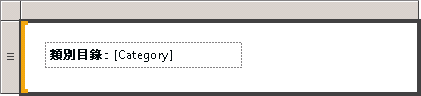

# 格式化文字和預留位置 (報表產生器及 SSRS)
  文字方塊可以是資料區內包含文字的報表項目或個別資料格、導出欄位、資料庫中欄位的指標，或是所有這三個項目的組合。 您可以混合字型和色彩、加入粗體和斜體樣式，以及使用對齊和首行縮排等段落樣式。 您可以格式化整個文字方塊，也可以格式化文字方塊內的特定文字、數字、運算式或欄位。  
  
 字型、大小、色彩和效果全部都對報表的可讀性有所貢獻。 您可以將字型、字型樣式、字型大小和底線線效果套用至文字方塊或資料區域。 依預設，使用的報表字型為 Arial、10 點和黑色。 您可以使用 **[文字方塊]** 和 **[文字屬性]** 對話方塊來指定在轉譯報表時顯示文字的方式。  
  
   
  
 在此圖中，文字方塊本身有框線，而且所有文字都位於相同的文字方塊中，但文字則有各種不同的格式。  
  
 若要快速開始使用，請參閱[教學課程：格式化文字 &#40;報表產生器&#41;](../../reporting-services/tutorial-format-text-report-builder.md)。  
  
> [!NOTE]  
>  [!INCLUDE[ssRBRDDup](../../includes/ssrbrddup-md.md)]  
  
## 在文字方塊中建立預留位置文字  
 在文字方塊內定義簡單或複雜運算式時，所產生的運算式 UI 表示法稱為 *「預留位置」*(Placeholder)。 您可以在單一文字方塊內任何數目的預留位置或文字區段上，定義色彩、字型、動作和其他行為。  
  
 預留位置的值永遠是簡單或複雜運算式。 您可以使用下列其中一個方法建立運算式，將預留位置加入至文字方塊：  
  
-   從 **[報表資料]** 窗格拖曳欄位，並將其放置到文字方塊中。 如果您拖曳報表主體上任何其他位置的運算式，就會建立包含預留位置的新文字方塊。 這個預留位置的值，將是對應至已卸除之欄位的欄位運算式。  
  
-   以滑鼠右鍵按一下文字方塊中的任一處，然後選取 [插入預留位置]。 您可以在 **[預留位置屬性]** 對話方塊中，指定運算式做為預留位置的值。 如需詳細資訊，請參閱 [預留位置屬性對話方塊、一般 &#40;報表產生器及 SSRS&#41;](https://msdn.microsoft.com/library/7a867736-a3b0-4b5a-b3e5-fe7c8d7618a8)。  
  
-   將任何簡單或複雜的運算式輸入至文字方塊。 例如，如果您在文字方塊中輸入 **Name: [Name]** ， **[Name]** 文字將會顯示為代表運算式 `=Fields!Name.Value`的預留位置。  
  
-   以等號 (=) 開始，在空白的文字方塊中輸入運算式。 當您將焦點從文字方塊移出時，所產生的運算式會轉換成您可以編輯的預留位置。 如果文字方塊不是空白的，或者文字方塊中的等號是插入第一個字元以外的位置，則系統會將等號視為字串常值而不會建立預留位置。 如需定義簡單與複雜運算式的詳細資訊，請參閱[報表中的運算式用法 &#40;報表產生器及 SSRS&#41;](../../reporting-services/report-design/expression-uses-in-reports-report-builder-and-ssrs.md)。  
  
## 在文字方塊中格式化預留位置和靜態文字  
 您可以使用 **[預留位置屬性]** 對話方塊來格式化預留位置。 您只能格式化整個預留位置，而不能格式化預留位置的區段。 如果想要查看基礎運算式，可以將指標暫停在預留位置上。 您可以藉由按兩下預留位置，或以滑鼠右鍵按一下預留位置後選取 [預留位置屬性]，來變更基礎運算式。 也可以在 **[預留位置屬性]** 對話方塊，使用 **[一般]** 中的 **[標籤]** 屬性來指定 UI 標籤。 這將是在設計階段為預留位置所顯示的文字。  
  
   
  
 在此圖中，清單中的文字方塊同時包含粗體格式的標籤以及無格式設定的預留位置。  
  
 與預留位置文字不同的是，您可以在文字方塊中分開對齊個別文字、在單一的文字方塊內使用多個段落，並為任何文字子集定義其他行為。  
  
 您可以在單一文字方塊內的任何文字子集上定義顏色、字型、動作和其他行為，以針對報表中的文字建立合併列印或範本。 也可以在單一文字方塊內使用多個段落。 例如，如果您擁有兩個不同的文字段落，就可以在文字方塊中按 ENTER 鍵來區隔段落。 也可以針對任何個別的文字字串設定對齊值。 您也可以針對文字方塊中的個別文字定義動作。 如果您想要針對文字方塊內所含的文字字串加入超連結，這個功能可能很有用。  
  
> [!NOTE]  
>  在文字方塊上定義的動作，比針對文字方塊中的個別文字所定義的動作，擁有更高的優先權。  
  
 如需混合格式化的詳細資訊，請參閱[格式化文字方塊中的文字 &#40;報表產生器及 SSRS&#41;](../../reporting-services/report-design/format-text-in-a-text-box-report-builder-and-ssrs.md)。  
  
## 使用一般對齊水平文字  
 在 **[文字方塊屬性]** 對話方塊的 **[對齊]** 中，您可以指定文字應該如何水平對齊。 如果沒有指定對齊值，則對齊的預設值為 **[預設]**。 這代表文字會根據預留位置值的欄位類型來對齊。 如果您指定的運算式會評估為非字串值 (即非數字)，則文字會靠右對齊。 如果運算式會評估為字串值 (如數字)，則文字會靠左對齊。  
  
## 另請參閱  
 [運算式 &#40;報表產生器及 SSRS&#41;](../../reporting-services/report-design/expressions-report-builder-and-ssrs.md)   
 [格式化圖表上的軸標籤 &#40;報表產生器及 SSRS&#41;](../../reporting-services/report-design/formatting-axis-labels-on-a-chart-report-builder-and-ssrs.md)   
 [格式化量測計上的標尺 &#40;報表產生器及 SSRS&#41;](../../reporting-services/report-design/formatting-scales-on-a-gauge-report-builder-and-ssrs.md)   
 [資料表、矩陣和清單 &#40;報表產生器及 SSRS&#41;](../../reporting-services/report-design/tables-matrices-and-lists-report-builder-and-ssrs.md)   
 [預留位置屬性對話方塊、一般 &#40;報表產生器及 SSRS&#41;](https://msdn.microsoft.com/library/7a867736-a3b0-4b5a-b3e5-fe7c8d7618a8)   
 [匯出至 Microsoft Excel &#40;報表產生器及 SSRS&#41;](../../reporting-services/report-builder/exporting-to-microsoft-excel-report-builder-and-ssrs.md)   
 [文字方塊 &#40;報表產生器及 SSRS&#41;](../../reporting-services/report-design/text-boxes-report-builder-and-ssrs.md)  
  
  
