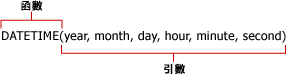

# 報表模型查詢中的公式 (報表產生器及 SSRS)
  公式是針對使用報表模型做為資料來源之報表中的值來執行的計算。 當您定義報表模型資料來源的查詢時，可以在報表模型查詢設計工具的 [定義公式] 對話方塊中定義公式。 公式可以包含函數、運算子、常數和對欄位或實體的參考。 公式可讓您結合、彙總、篩選以及評估數值和文字資料。 您可以建立公式，並將它們另存為新的欄位，或者，您可以修改現有欄位的公式。  
  
 公式不是 RDL 運算式，開頭不得為等號 (=)。 如需 RDL 運算式的詳細資訊，請參閱[運算式 &#40;報表產生器及 SSRS&#41;](../../reporting-services/report-design/expressions-report-builder-and-ssrs.md)。  
  
 公式如下列所示：  
  
-   **Sum Line Total**  
  
-   6+12  
  
-   **SUM**(**IF**(**Finished Goods Flag**, "Finished", "Unfinished"))  
  
> [!NOTE]  
>  [!INCLUDE[ssRBRDDup](../../includes/ssrbrddup-md.md)]  
  
## 參考  
 參考是欄位名稱。 可以是實體中的現有欄位名稱，也可以是已建立並加入至 [欄位] 清單的導出欄位名稱。 參考會告訴「報表產生器」去何處尋找想要在公式中使用的值或資料。 您可以參考一個公式內之內容實體和其他實體中的欄位，或使用來自多個公式中之一個欄位的值。  
  
 當您使用參考時，報表處理器會針對欄位中的每個值執行公式。 例如，假設欄位包含過去五年的年度銷售總額。 此欄位會包含五個值，每個值代表給定年度的銷售總額。 如果公式包含對此欄位的參考，則公式會使用每個個別值來計算新的值。  
  
## 運算子  
 運算子指定要在公式的值上執行之計算的類型。 計算運算子有三種不同的類型：算術、比較和文字。 系統會使用符號 (如加號 (+))，來表示運算子。  
  
 **算術運算子。** 算術運算子會執行基本數學運算 (例如加法、減法或乘法)、結合數字，並產生數值結果。  
  
 **比較運算子。** 您可以使用比較運算子比較兩個值。 當使用這些運算子比較兩個值時，結果是邏輯值，TRUE 或 FALSE。  
  
 **文字串連運算子。** 使用連字號 (&) 來聯結或串連一個或多個文字字串，以產生單一文字片段。  
  
##   常數  
 常數是一個不需要計算的值，因此也不會變更。 報表產生器使用下列常數： **True**、 **False**和 **Empty**。 這些常數用於評估 [布林] 欄位。 例如，假設您有一個名為 IsDiscontinued 的欄位。 此欄位的有效值僅為 True、False 或空白 (" ")。  
  
##   函數  
 函數是預先定義的公式，可使用依特定順序指定的特定值 (稱為 *「引數」*(Argument)) 執行計算。 引數可以是常值或欄位，或是兩者的組合。 當公式中使用欄位時，欄位名稱代表欄位的每個執行個體。 如果引數是常值，您可能需要使用特定的字元來表示引數是常值。  
  
 函數可用於執行簡單或複雜的計算。 函數的結構以函數名稱開始，隨後是左括號、以逗號分隔的函數引數，和右括號。  
  
   
  
 引數可以是欄位參考、數字、文字和邏輯值 (如 **TRUE** 或 **FALSE**)。 引數也可以是常數、公式或其他函數。 您輸入的引數必須產生該引數的有效值。 例如，如果公式是兩個整數相乘，則結果不能是文字字串。  
  
 報表產生器隨附下列九種常用函數的類別：  
  
|||  
|-|-|  
|彙總函式|**AVG**, **COUNT**, **COUNTDISTINCT**, **MAX**, **MIN**, **STDEV**, **STDEVP**, **SUM**, **VAR**, **VARP**|  
|條件式函數|**IF**, **IN**, **SWITCH**|  
|轉換函數|**INT**, **DECIMAL**, **FLOAT**, **TEXT**|  
|日期和時間函數|**DATE**, **DATEADD**, **DATEDIFF**, **DATETIME**, **DATEONLY**, **DAY**, **DAYOFWEEK**, **DAYOFYEAR**, **HOUR**, **MINUTE**, **MONTH**, **NOW**, **QUARTER**, **SECOND**, **TIMEONLY**, **TODAY**, **WEEK**, **YEAR**|  
|資訊函數|**GETUSERCULTURE**, **GETUSERID**|  
|邏輯函數|**AND**, **NOT**, **OR**|  
|數學函數|**MOD**, **ROUND**, **TRUNC**|  
|操作員|加 (+)、除 (/)、等於 (=)、乘冪 (^)、大於 (>)、大於或等於 (>=)、小於 (<)、小於或等於 (<=)、乘 (*)、負 (-)、不等於 (<>)、減 (-)|  
|文字函數|**CONCAT**, **FIND**, **LEFT**, **LENGTH**, **LOWER**, **LTRIM**, **REPLACE**, **RIGHT**, **RTRIM**, **SUBSTRING**, **UPPER**|  
  
  
