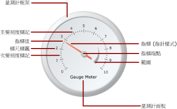

# 量測計 (報表產生器及 SSRS)
  在 [!INCLUDE[ssRSnoversion_md](../../includes/ssrsnoversion-md.md)] 分頁報表中，量測計資料區域會顯示資料集中的單一值。 個別量測計一定會放在量測計面板內，您可在其中加入子量測計或相鄰的量測計。 您可以在單一量測計面板內，建立多個量測計來共用篩選、群組或排序等常用功能。  
  
 量測計可以在報表中執行許多工作：  
  
-   在單一的星形或線性量測計中，顯示關鍵效能指標 (KPI)。  
  
-   在資料表或矩陣內放置量測計，以說明每個資料格內的值。  
  
-   在單一量測計面板中使用多個量測計，以在欄位之間比較資料。  
  
 量測計類型有兩種：星形和線性。 下圖顯示量測計面板中單一星形量測計的基本元素。  
  
   
  
 如需使用量測計作為 KPI 的詳細資訊，請參閱[教學課程：將 KPI 加入至報表 &#40;報表產生器&#41;](../../reporting-services/tutorial-adding-a-kpi-to-your-report-report-builder.md)。  
  
> [!NOTE]  
>  您可以將量測計當做報表組件，與報表分開發行。 深入了解 [報表組件](../../reporting-services/report-design/report-parts-report-builder-and-ssrs.md)。  
  
##   量測計類型  
 [!INCLUDE[ssRSnoversion](../../includes/ssrsnoversion-md.md)] 提供兩種量測計類型：星形和線性。 星形量測計通常是在您想要將資料表示為速度時使用。 線性量測計則用來將資料表示為溫度或標尺值。  
  
 兩個類型之間的主要差異在於量測計的整體圖案和可用的量測計指標。 星形量測計是圓形，或圓形的度數，類似於里程計。 量測計指標通常是指針，但可以是標記或橫條。  
  
 線性量測計是矩形，水平或垂直方向，類似於尺規。 量測計指標通常是溫度計，但可以是標記或橫條。 此量測計類型由於其形狀的緣故，在整合到資料表或矩陣資料區以顯示進度資料時很有用。  
  
 除了這些差異之外，這兩個量測計類型可以互換。 不過，如果您必須在報表中使用簡單的量測計，應該考慮使用指標而不是量測計。 如需詳細資訊，請參閱[指標 &#40;報表產生器及 SSRS&#41;](../../reporting-services/report-design/indicators-report-builder-and-ssrs.md)。  
  
 下列圖例顯示星形與線性量測計。 星形量測計是圓的，而且使用指針指標。 線性量測計是水平的，而且使用溫度計指標。  
  
 **星形量測計**  
  
   
  
 星形量測計選項：星形、星形附迷你量測計、雙標尺、右上 90 度、左上 90 度、左下 90 度、右下 90 度、上方 180 度、下方 180 度、左方 180 度、右方 180 度以及計量器。  
  
 **線性量測計**  
  
   
  
 線性量測計選項：水平、垂直、多橫條指標、雙標尺、三色範圍、對數、溫度計、華氏/攝氏溫度計以及項目符號圖表。  
  
##   將資料加入至量測計  
 將量測計加入至設計介面之後，將資料集欄位拖曳到量測計資料窗格中。 量測計預設會將欄位值彙總為量測計上顯示的一個值。 您可以使用 Value 屬性，將該值附加至指標中。 根據欄位的資料類型，量測計會使用 SUM 或 COUNT 彙總。 當您使用適合加法的數值資料時，量測計會使用 SUM 函數。 否則，它會使用 COUNT 彙總。 指標的值可以使用不同的彙總或不使用彙總。  
  
 您可以將群組加入到量測計中，以便在量測計上檢視個別的群組或個別的資料列。 套用群組和篩選後，量測計會使用指標值來顯示傳回之資料集中的最後一個群組或資料列。  
  
 您可以透過加入其他指標，將多個值加入到個別的量測計中。 此指標可以屬於相同的標尺，或者您可以加入其他標尺，然後讓指標與該標尺產生關聯。  
  
 與 **[選取圖表類型]** 對話方塊提供的圖表類型不同， **[選取量測計類型]** 對話方塊所提供的量測計類型，是藉由使用量測計屬性組合而建立。 因此，您不能用變更圖表類型的同樣方法來變更量測計類型。 若要變更量測計類型，您必須移除量測計，並將其重新加入設計介面。 量測計至少具有一種標尺和一個指標。 您可以以滑鼠右鍵按一下量測計，然後選取 **[加入標尺]**，即可擁有多種標尺。 依預設，這樣會建立較小的標尺並放置在第一個標尺內。 標尺會顯示標籤與刻度標記。 系統提供兩組刻度：主要和次要。  
  
 您可以以滑鼠右鍵按一下量測計，然後選取 **[加入指標]**，即可擁有多個指標。 這樣會在同一標尺上建立另一個指標，但如果您有多個標尺，可以讓指標與量測計上的任何標尺產生關聯。  
  
### 將資料加入至量測計時的考量  
 如同其他所有資料區，量測計資料區僅能繫結至一個資料集。 如果您有多個資料集，請考慮使用 JOIN 或 UNION 來建立一個資料集，或針對每個資料集使用個別的量測計。  
  
 數值資料類型會使用 SUM 函數彙總。 非數值資料類型則會以 COUNT 函數彙總，此函數會針對資料集或群組中的特定值或欄位，計算執行個體的數目。  
  
 加入資料之後，當您以滑鼠右鍵按一下指標時，將會出現 [清除指標值] 和 [刪除指標] 選項。 [清除指標值] 選項會移除附加到量測計的欄位，但是指標仍然會出現在量測計上。 [刪除指標] 選項會從量測計刪除欄位，並從檢視刪除指標。 如果您將欄位重新加入到量測計中，預設指標會重新出現。 將欄位加入到量測計之後，您必須在對應的標尺上設定最大值與最小值，以便將內容提供給量測計上的值。 您也可以針對顯示標尺重要區域的範圍，設定最小值與最大值。 量測計將不會在標尺或範圍上自動設定最小值或最大值，因為它無法判斷應該如何察覺該值。  
  
### 將資料加入到量測計的方法  
 在您定義報表的資料集之後，可以使用下列其中一種方法，將資料欄位加入到量測計中：  
  
-   將欄位從資料集拖曳至資料窗格中。 按一下量測計，並將欄位拖曳到其中。 您可以按一下量測計，或將欄位拖曳到量測計上，藉以開啟資料窗格。 如果量測計上還沒有指標，則會將指標加入到量測計中，並繫結到您已經加入的欄位。  
  
-   顯示資料窗格，然後指向欄位預留位置。 按一下欄位預留位置旁的向下鍵，然後選取您要使用欄位。 如果已經有選取的欄位，請按向下鍵，然後選取一個不同的欄位。  
  
    > [!NOTE]  
    >  在量測計上沒有指標，或報表包含一個以上的資料集，而且量測計面板與資料集沒有關聯時，這個方法並不適用。  
  
-   以滑鼠右鍵按一下量測計指標，然後選取 **[指標屬性]**。 對於 **[值]**，則從下拉式清單中選取一個欄位，或按一下 **[運算式]** (*fx*) 按鈕來定義欄位運算式。  
  
### 將欄位彙總為單一值  
 當欄位加入到量測計時， [!INCLUDE[ssRSnoversion](../../includes/ssrsnoversion-md.md)] 預設會計算欄位的彙總。 數值資料類型會使用 SUM 函數彙總。 非數值資料類型則會以 COUNT 函數彙總，此函數會針對資料集或群組中的特定值或欄位，計算執行個體的數目。 如果值欄位的資料類型為 [字串]，即使欄位中有數字，量測計也無法顯示數值。 但是量測計會使用 COUNT 函數彙總字串欄位。 若要避免發生這個問題，請確定您使用的欄位具有數值資料類型，而不是包含格式化數字的字串。 您可以使用 Visual Basic 運算式，利用 CDbl 或 CInt 常數將 [字串] 值轉換為數值資料類型。 例如，下列運算式會將 MyField 字串欄位轉換為數值。  
  
 `=Sum(CDbl(Fields!MyField.Value))`  
  
 如需彙總運算式的詳細資訊，請參閱[彙總函式參考 &#40;報表產生器及 SSRS&#41;](../../reporting-services/report-design/report-builder-functions-aggregate-functions-reference.md)。  
  
### 定義量測計上的群組  
 將欄位加入到量測計之後，您可以加入一個資料群組。 量測計與 [!INCLUDE[ssRSnoversion](../../includes/ssrsnoversion-md.md)]中的其他所有資料區域不同，前者可以在一個資料區域顯示多個群組。 當您透過在量測計上定義群組運算式來加入群組時，與您在 Tablix 資料區域上加入資料列群組時一樣。 不過，加入群組時，只有最後一個群組的值會顯示為量測值上的指標值。 例如，如果您在 Year 上加入群組運算式，指標將會指向資料集中，代表前一個年度之彙總銷售值的值。 如需群組的詳細資訊，請參閱 [了解群組 &#40;報表產生器及 SSRS&#41;](../../reporting-services/report-design/understanding-groups-report-builder-and-ssrs.md)。  
  
 您可以在量測值上加入群組，例如，當您要在資料表或清單中顯示多個量測計，而且您想要顯示依群組彙總的資料時。 如需詳細資訊，請參閱 [在資料區中加入或刪除群組 &#40;報表產生器及 SSRS&#41;](../../reporting-services/report-design/add-or-delete-a-group-in-a-data-region-report-builder-and-ssrs.md)。  
  
##   將元素放置在量測計中  
 量測計面板是最上層的容器，其中保存一個或多個量測計。 您只要按一下量測計的外部，就可以檢視 **[量測計面板屬性]** 對話方塊。 每個量測計都會依序包含數個量測計項目：量測計標尺、量測計範圍，以及量測計指標。 當您要使用量測計時，需要了解如何在量測計面板中測量項目，以修改這些項目的大小與位置。  
  
### 了解大小與位置的測量  
 在量測計上，所有大小與位置的量值都會以其父項目的百分比計算。 當父項目擁有不同的寬度和高度值時，量測計項目的大小會以兩個值中較小者的百分比計算。 例如，在線性量測計上，所有指標的量值都會以線性量測計的寬度或高度 (以較小者) 百分比計算。  
  
 位置的量值也會使用座標系統，以其父項目的百分比計算。 此座標系統的原點位於左上角，其中 X 軸指向右側，而 Y 軸指向下方。 座標值應介於 0 和 100 之間，而且所有量值都會以百分比表示。 例如，當線性量測計的 X 和 Y 位置分別設定為 50 和 50 時，線性量測計會放置在量測計面板的中間。  
  
### 將多個量測計放置在量測計面板內部  
 將新的量測計加入到已經包含一個量測計的量測計面板有兩種方式。 您可以將量測計加入為第一個量測計的子系，或者您可以加入與第一個量測計相鄰的其他量測計。  
  
 當新的量測計加入到量測計面板時，該量測計會被調整大小並以量測計面板中其他所有量測計的等比例放置。 例如，如果將星形量測計加入到已經包含星形量測計的量測計面板中，將會自動調整兩個量測計的大小，讓每個量測計各佔面板的一半位置。  
  
 您可以將新的量測計加入到已經包含量測計的量測計面板中。 若要這樣做，以滑鼠右鍵按一下量測計面板上的任何位置，將滑鼠停留在 **[加入新量測計]** ，然後選取 **[子系]**。 **[選取量測計類型]** 對話方塊將會出現。 當新的量測計當做子系加入時，則會以下列其中一種方式加入。 在星形量測計中，子量測計會放在第一個量測計的左上角。 在線性量測計中，子量測計會放在第一個量測計的中間。 您可以使用 [位置] 屬性，將子量測計放置在相對於父量測計的位置。 如同其他所有元素，位置的量值會以其父元素的百分比計算。  
  
### 放置量測計標尺標籤與量測計範圍  
 有兩個屬性可以決定標籤在量測計標尺上的位置。 您可以設定量測計標尺的 **[位置]** 屬性，以指定標籤要顯示在標尺列內部、外部，還是跨標尺列顯示。 您也可以指定 **[距標尺距離]** 屬性的數值，這會指定從位置增加或減少的單位數以決定標籤位置。 例如，如果 **[位置]** 設定為 **[外部]** ，而且您已經將 **[距標尺距離]** 設定為 10，這些標籤將放置在距量測計標尺外緣 10 個單位處，其中 1 個單位為：  
  
-   星形量測計之量測計直徑的 1%，或  
  
-   線性量測計之量測計高度或寬度最小值的 1%。  
  
 **[位置]** 和 **[距標尺距離]** 屬性也適用於量測計範圍。  
  
### 維持線性量測計的外觀比例  
 星形量測計假設為圓形形式，因此，此量測計類型通常會維持相同的寬度和高度值。 不過，線性量測計假設為矩形形式，寬度和高度間的比例通常不平均。 量測計的外觀比例會決定調整量測計大小時，應該維持之寬度對高度的比例。 例如，如果此值設定為 2，不論如何調整量測計的大小，量測計的寬度將永遠為量測計高度的兩倍。 若要設定外觀比例，您可以從 [線性量測計屬性] 對話方塊設定 AspectRatio 屬性。  
  
##   如何主題  
 本節列出向您逐步示範如何使用報表中的量測計；如果取得資料以便在量測計中有效顯示；以及如何加入與設定量測計及其元素的程序。  
  
-   [將量測計加入至報表 &#40;報表產生器及 SSRS&#41;](../../reporting-services/report-design/add-a-gauge-to-a-report-report-builder-and-ssrs.md)  
  
-   [設定量測計的最小值或最大值 &#40;報表產生器及 SSRS&#41;](../../reporting-services/report-design/set-a-minimum-or-maximum-on-a-gauge-report-builder-and-ssrs.md)  
  
-   [設定量測計的貼齊間隔 (報表產生器及 SSRS)](http://msdn.microsoft.com/en-us/0ece7297-6e2f-47fb-835d-b9e9cce53fe2)  
  
-   [將影像指定為量測計的指標 (報表產生器及 SSRS)](http://msdn.microsoft.com/en-us/9d73b3c3-a068-4868-a2be-0cd261b6e92b)  
  
##   本節內容  
 下列主題會提供有關使用量測計的其他資訊。  
  
|||  
|-|-|  
|詞彙|定義|  
|[格式化量測計上的標尺 &#40;報表產生器及 SSRS&#41;](../../reporting-services/report-design/formatting-scales-on-a-gauge-report-builder-and-ssrs.md)|提供有關格式化量測計上之標尺的一般資訊，以及有關格式化星形與線性量測計上標尺之選項的詳細資訊。|  
|[格式化量測計上的指標 &#40;報表產生器及 SSRS&#41;](../../reporting-services/report-design/formatting-pointers-on-a-gauge-report-builder-and-ssrs.md)|提供有關格式化量測計上之指標的一般資訊，以及有關格式化星形與線性量測計上可用指標樣式之選項的詳細資訊。|  
|[格式化量測計上的範圍 &#40;報表產生器及 SSRS&#41;](../../reporting-services/report-design/formatting-ranges-on-a-gauge-report-builder-and-ssrs.md)|提供有關格式化量測計之範圍以表示量測計上值的重要子區段，或以視覺化的方式表示指標值靠近特定值範圍之時間的資訊。|  
  
## 另請參閱  
 [運算式 &#40;報表產生器及 SSRS&#41;](../../reporting-services/report-design/expressions-report-builder-and-ssrs.md)   
 [篩選、分組和排序資料 &#40;報表產生器及 SSRS&#41;](../../reporting-services/report-design/filter-group-and-sort-data-report-builder-and-ssrs.md)   
 [報表參數 &#40;報表產生器和報表設計師&#41;](../../reporting-services/report-design/report-parameters-report-builder-and-report-designer.md)   
 [圖表 &#40;報表產生器及 SSRS&#41;](../../reporting-services/report-design/charts-report-builder-and-ssrs.md)   
 [資料表、矩陣和清單 &#40;報表產生器及 SSRS&#41;](../../reporting-services/report-design/tables-matrices-and-lists-report-builder-and-ssrs.md)  
  
  
