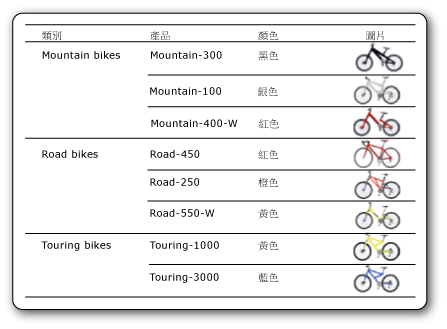

# 影像 (報表產生器及 SSRS)
  影像是一種報表項目，其中包含了內嵌在報表中、儲存在資料庫中、儲存在報表伺服器上或儲存在網路上其他位置之影像的參考。 影像可能是一個隨資料列數重複顯示的圖片。 您也可以將影像當做某些報表項目的背景。  
  
 您最好將標誌儲存在伺服器上，因為您可以在許多報表中使用相同的標誌。  
  
> [!NOTE]  
>  [!INCLUDE[ssRBRDDup](../../includes/ssrbrddup-md.md)]  
  
##   比較外部、內嵌與資料繫結影像  
 當您在報表中使用以伺服器為基礎或其他外部的影像時，影像項目會包含指向報表伺服器之影像或網路上所在位置的路徑。 不過，使用內嵌影像時，影像資料是儲存在報表定義中，而不是以個別檔案存在。  
  
 以伺服器為基礎的影像在數個報表或網頁共用標誌或靜態圖片時，非常有用。 內嵌影像可確保影像總是能供報表使用，但是不能共用它們。 使用外部影像的報表定義小於使用內嵌影像的報表定義。  
  
 資料繫結影像也可以從儲存在資料庫中的二進位資料顯示。 例如，出現在產品清單中產品名稱旁邊的圖片，即是資料庫影像。 在下列圖片中，自行車的影像會儲存在資料庫中，並可以報表中擷取，以說明每個產品。  
  
   
  
  
##   當做報表組件的影像  
 您可以將影像當做報表組件，與報表分開儲存。 [!INCLUDE[ssRBrptparts](../../includes/ssrbrptparts-md.md)]  
  
  
##   內嵌影像  
 您可以在報表中內嵌影像，讓所有影像資料都儲存在報表定義中。 當您內嵌影像時，影像會以 MIME 編碼，並當做文字儲存在報表定義中。 使用內嵌影像來確保報表隨時都可以使用影像，但它也會增加報表定義的大小。  
  
 如需內嵌影像的詳細資訊，請參閱 [在報表中內嵌影像 &#40;報表產生器及 SSRS&#41;](../../reporting-services/report-design/embed-an-image-in-a-report-report-builder-and-ssrs.md)。  
  
  
##   外部影像  
 您可以指定影像的 URL，在報表中包含預存影像。 當您在報表中使用外部影像時，影像來源會設定為 **External** ，而影像的值則是影像的 URL 位址或路徑。  
  
 如需詳細資訊，請參閱[指定外部項目的路徑 &#40;報表產生器及 SSRS&#41;](../../reporting-services/report-design/specifying-paths-to-external-items-report-builder-and-ssrs.md)。  
  
 在報表產生器或報表設計師中執行報表時，預覽會以使用者的認證來顯示影像。 在報表伺服器上執行報表時，如果伺服器認證不足以存取影像，可能就不會顯示報表中的影像。 在這種情況下，請連絡系統管理員。  
  
 如需將外部影像加入報表中的詳細資訊，請參閱 [加入外部影像 &#40;報表產生器及 SSRS&#41;](../../reporting-services/report-design/add-an-external-image-report-builder-and-ssrs.md)。  
  
  
##   背景影像  
 影像可當做報表之主體、矩形、文字方塊、清單、矩陣或資料表中的背景影像。 背景影像和影像具有類似的屬性。 您也可以指定如何重複影像將項目的背景填滿。  
  
> [!NOTE]  
>  某些轉譯延伸模組 (例如 HTML 轉譯延伸模組) 會在主體、頁首和頁尾中轉譯報表主體的背景影像。 您可以為頁首和頁尾定義個別的背景影像，但是如果沒有定義影像，報表就會使用主體的背景影像。 其他的轉譯延伸模組 (如影像轉譯延伸模組) 並不會在頁首和頁尾中轉譯主體背景影像。  
  
 如需加入背景影像的詳細資訊，請參閱 [加入背景影像 &#40;報表產生器及 SSRS&#41;](../../reporting-services/report-design/add-a-background-image-report-builder-and-ssrs.md)。  
  
  
##   資料繫結影像  
 您可以將儲存在資料庫中的影像加入至您的報表。 您使用的影像報表項目與靜態影像所使用的相同，不過多了一組屬性來指示影像儲存在資料庫中。 若要檢視資料繫結影像的使用指示，請參閱 [加入資料繫結影像 &#40;報表產生器及 SSRS&#41;](../../reporting-services/report-design/add-a-data-bound-image-report-builder-and-ssrs.md)。  
  
  
##   如何主題  
 [加入外部影像 &#40;報表產生器及 SSRS&#41;](../../reporting-services/report-design/add-an-external-image-report-builder-and-ssrs.md)  
  
 [在報表中內嵌影像 &#40;報表產生器及 SSRS&#41;](../../reporting-services/report-design/embed-an-image-in-a-report-report-builder-and-ssrs.md)  
  
 [加入背景影像 &#40;報表產生器及 SSRS&#41;](../../reporting-services/report-design/add-a-background-image-report-builder-and-ssrs.md)  
  
 [加入資料繫結影像 &#40;報表產生器及 SSRS&#41;](../../reporting-services/report-design/add-a-data-bound-image-report-builder-and-ssrs.md)  
  
  
## 另請參閱  
 [匯出至影像檔 &#40;報表產生器及 SSRS&#41;](../../reporting-services/report-builder/exporting-to-an-image-file-report-builder-and-ssrs.md)   
 [轉譯行為 &#40;報表產生器及 SSRS&#41;](../../reporting-services/report-design/rendering-behaviors-report-builder-and-ssrs.md)  
  
  
