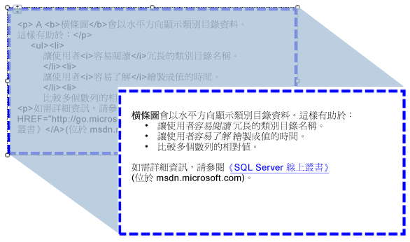

# 將 HTML 匯入至報表 (報表產生器及 SSRS)
  您可以使用文字方塊來將從資料集的欄位所擷取的 HTML 格式文字插入至報表。 文字可以來自任何評估為正確格式之 HTML 的簡單或複雜運算式。 格式化的文字可以轉譯為所有受支援的輸出格式，包括 PDF 在內。  
  
   
  
 下圖顯示報表設計檢視中具有 HTML 格式的文字，以及相同文件在報表執行時所呈現的樣式。  
  
> [!NOTE]  
>  當您匯入包含 HTML 標記的文字時，資料一定要先由文字方塊進行剖析。 因為只支援一部分的 HTML 標記，所以顯示在轉譯報表中的 HTML 可能會與原始的 HTML 不同。  
  
 若要快速開始使用，請參閱[教學課程：格式化文字 &#40;報表產生器&#41;](../../reporting-services/tutorial-format-text-report-builder.md)。  
  
> [!NOTE]  
>  [!INCLUDE[ssRBRDDup](../../includes/ssrbrddup-md.md)]  
  
## 支援的 HTML 標籤  
 下列是在定義為預留位置文字時，會轉譯為 HTML 的標記完整清單：  
  
-   超連結： \<a >  
  
-   字型：\<字型 >  
  
-   標頭、 樣式和區塊元素： \<H {n} >， \<d i v >，\<範圍 >，\
， \<d i v >， \<l i >， \<HN >  
  
-   文字格式： \<B >， \<I >， \<U >， \<S >  
  
-   清單處理： \<o l >， \<u l >， \<l i >  
  
 所以其他的 HTML 標記都會在處理報表時遭到忽略。 如果預留位置文字中的運算式所代表的 HTML 沒有採用正確格式，則預留位置會轉譯為純文字。 所有 HTML 標記都不區分大小寫。  
  
 如果文字方塊中的文字只包含一個文字區塊，則預留位置中任何定義區塊元素的 HTML 都會正確轉譯。 不過，如果文字方塊具有多個文字區塊，則 HTML 標記會遭到忽略，而文字的結構會由文字區塊定義。  
  
 如果針對文字定義了一個以上的標記，而 [!INCLUDE[ssRSnoversion](../../includes/ssrsnoversion-md.md)] 在 HTML 和現有的報表條件約束之間偵測到衝突，則只會將最內層的 HTML 標記視為 HTML。  
  
 如需詳細資訊，請參閱[將 HTML 加入至報表 &#40;報表產生器及 SSRS&#41;](../../reporting-services/report-design/add-html-into-a-report-report-builder-and-ssrs.md)。  
  
## 階層式樣式表屬性的限制  
 在使用階層式樣式表 (CSS) 屬性時，只會定義基本的標記集合。 下列是受支援的屬性清單：  
  
-   text-align, text-indent  
  
-   font-family  
  
-   字型大小  
  
    -   只有以絕對 CSS 長度單位計算的有效 RDL 大小值才受到支援。 支援的單位包括：in、cm、mm、pt、pc。  
  
    -   相對 CSS 長度單位會被忽略，而且不受支援。 不支援的單位包括 em、ex、px、%、rem。  
  
     如需 CSS 單位的詳細資訊，請參閱 [CSS Values and Units Reference](http://msdn.microsoft.com/library/ms531211\(VS.85\).aspx) (CSS 值和單位參考) (http://msdn.microsoft.com/library/ms531211(VS.85).aspx)。  
  
-   色彩  
  
-   padding, padding-bottom, padding-top, padding-right, padding-left  
  
-   font-weight  
  
 以下是使用 CSS 的一些考量：  
  
-   格式不正確的 CSS 值會像格式不正確的 HTML 一樣遭到忽略。  
  
-   同一標記中同時存在屬性和 CSS 樣式屬性時，CSS 屬性擁有較高的優先權。 例如，如果文字是 **\
**、 將會套用 text-align 屬性和文字會靠右對齊。  
  
-   對於屬性和 CSS 樣式來說，如果某屬性指定了一次以上，則只會套用該屬性的最後一個執行個體。 比方說，如果文字是 **\
**，文字會靠右對齊。  
  
## 另請參閱  
 [轉譯為 HTML &#40;報表產生器及 SSRS&#41;](../../reporting-services/report-builder/rendering-to-html-report-builder-and-ssrs.md)  
  
  
