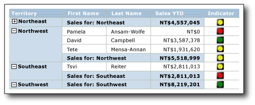
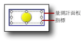
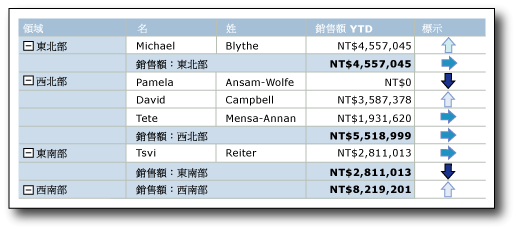

# 指標 (報表產生器及 SSRS)
  在 [!INCLUDE[ssRSnoversion_md](../../includes/ssrsnoversion-md.md)] 分頁報表中，指標是小型量測計，看一眼就可傳達單一資料值的狀態。 圖示即使很小，但在視覺上也能有效代表指標及其狀態。  
  
 您可以在報表中使用狀態指標以顯示下列項目：  
  
-   使用趨勢向上箭號、一般箭號 (無變化)、或趨勢向下箭號的**趨勢** 。  
  
-   使用一般辨識符號 (例如核取記號和驚嘆號) 的**狀態** 。  
  
-   使用一般辨識形狀 (例如號誌燈和標誌) 的**條件** 。  
  
-   使用顯示進度之一般辨識形狀和符號 (例如正方形與星形的四分色方塊數目) 的**評比** 。  
  
 您可以在儀表板或自由格式報表中單獨使用指標，但是最常用於資料表或矩陣中，以資料列或資料行將資料視覺化。 下圖顯示包含號誌燈指標的資料表，此指標會依銷售人員和領域，顯示年初至今的銷售量。  
   
   
  
 [!INCLUDE[ssRSnoversion](../../includes/ssrsnoversion-md.md)] 提供以原狀使用的內建指標集合與指標圖示，您也可以自訂個別的指標圖示與指標集合以符合您的需求。  
  
 如需使用指標作為 KPI 的詳細資訊，請參閱[教學課程：將 KPI 加入至報表 &#40;報表產生器&#41;](../../reporting-services/tutorial-adding-a-kpi-to-your-report-report-builder.md)。  
  
> [!NOTE]  
>  您可以將指標當做報表組件，與報表分開發行。 深入了解 [報表組件](../../reporting-services/report-design/report-parts-report-builder-and-ssrs.md)。  
  
##   比較指標與量測計  
 雖然指標在外觀上有很大的差異，但它們只是簡單的量測計。 指標和量測計都會顯示單一資料值。 主要差異是量測計具備框架和指標之類的元素。 指標則只有狀態、圖示及 (選擇性) 標籤。 指標狀態類似於量測計範圍。  
  
 指標與量測計相同，都位於量測計面板內。 當您想要使用 **[指標屬性]** 對話方塊或 [屬性] 窗格來設定指標時，您需要選取指標，而不是此面板。 否則，可用的選項會套用到量測計面板選項，而且您無法設定指標。 下圖顯示選取的指標如何出現在它的量測計面板中。  
  
   
  
 根據您要描繪資料值的方式，量測計可能比指標更有效。 如需詳細資訊，請參閱 [量測計 &#40;報表產生器及 SSRS&#41;](../../reporting-services/report-design/gauges-report-builder-and-ssrs.md)。  
  
##   選擇要使用的指標類型  
 不論資料位於詳細資料列或資料表或矩陣中的資料列或資料行群組，或本身位於報表主體或儀表板中，使用正確的指標集合都是與資料意義立即進行通訊的關鍵。 內建的指標集合擁有三個或多個圖示。 這些指標可以依形狀、色彩或兩者而有所不同。 每個圖示都會與不同的資料狀態進行通訊。  
  
 下表列出內建的指標集合，並描述其中一些常見的用法。  
  
|指標集合|指標類型|  
|-------------------|--------------------|  
||方向性：指出使用向上箭號、向下箭號、一般箭號 (無變化)、趨勢向上箭號或趨勢向下箭號的趨勢。|  
||符號：指出使用一般辨識符號 (例如核取記號和驚嘆號) 的狀態。|  
||形狀：指出使用一般形狀 (例如交通標誌和菱形) 的條件。|  
||評比：指出使用顯示進度值之一般辨識形狀和符號 (例如正方形的四分色方塊數目) 的評比。|  
  
 選擇指標集合後，您就可以在指標或 [屬性] 窗格的對話方塊中設定其屬性，來自訂集合中每個指標圖示的外觀。 您可以使用內建的色彩、圖示和大小或運算式來設定指標。  
  
##   自訂指標  
 您可以自訂指標以符合您的需求。 您可以使用下列方式修改指標集合以及集合內的個別指標圖示：  
  
-   變更指標圖示的色彩。 例如，您可能希望指標集合的色彩配置是單色的，或使用預設色彩以外的色彩。  
  
-   變更指標集合中的圖示。 例如，您可以在一個指標集合中使用星形、圓形和正方形的圖示。  
  
-   指定指標的開始值和結束值。 例如，您可以針對 75% 的指標值使用一個圖示來扭曲資料顯示。  
  
-   將圖示加入至指標集合。 例如，您可以將其他圖示加入至指標集合，以更詳細的方式區分指標值。  
  
-   從指標集合刪除圖示，藉由只使用幾個圖示，讓資料顯示更簡單。  
  
 如需詳細資訊，請參閱 [變更指標圖示和指標集合 &#40;報表產生器及 SSRS&#41;](../../reporting-services/report-design/change-indicator-icons-and-indicator-sets-report-builder-and-ssrs.md)。  
  
##   在資料表和矩陣中使用指標  
 簡單的指標形狀使其適合在資料表和矩陣中使用。 指標即使很小，都仍然有效。 這讓它們在報表的詳細資料或群組資料列中都相當實用。  
  
 下圖顯示包含使用方向性指標集合 ([四箭號 (彩色)]  ) 之資料表的報表來表示標尺。 報表中的指標圖示設定為使用藍色陰影來代替預設色彩：紅色、黃色和綠色。  
  
   
  
 如需新增、變更及刪除指標的詳細資訊，請參閱 [加入或刪除指標 &#40;報表產生器及 SSRS&#41;](../../reporting-services/report-design/add-or-delete-an-indicator-report-builder-and-ssrs.md)。  
  
 當您第一次將標記加入至報表時，系統會設定為使用預設值。 接著，您可以變更值，讓指標以您希望的方式描述資料。 您可以變更指標圖示的外觀、指標選擇要使用之圖示的方式，以及變更指標集合所使用的圖示。 如需詳細資訊，請參閱 [變更指標圖示和指標集合 &#40;報表產生器及 SSRS&#41;](../../reporting-services/report-design/change-indicator-icons-and-indicator-sets-report-builder-and-ssrs.md)。  
  
 根據預設，指標會設定為使用百分比做為度量單位，並自動偵測資料中的最小值與最大值。 指標集合中的每個圖示都有一個百分比範圍。 百分比範圍的數目取決於圖示集中的圖示數目，但範圍的大小和循序相同。 例如，如果圖示集有 5 個圖示，則有 5 個百分比範圍，每個大小各為 20%。 第一個從 0 開始並到 20 結束、第二個從 20 開始並到 40 結束，以此類推。 報表上的指標會使用指標集合中的圖示，該指標集合的百分比範圍落在指標資料值所在的範圍中。 您可以變更集合中每個圖示的百分比範圍。 最小值與最大值可以透過提供值或運算式來明確設定。 但您可以將度量單位變更為數值。 在此情況下，您不用指定資料的最小值或最大值。 不過，您只能針對每個圖示提供指標所使用的開始值與結束值。 如需詳細資訊，請參閱 [設定度量單位 &#40;報表產生器及 SSRS&#41;](../../reporting-services/report-design/set-and-configure-measurement-units-report-builder-and-ssrs.md)。  
  
 指標會在指定的範圍內，跨指標資料值進行同步處理，藉以傳達資料值。 根據預設，此範圍是指標的父容器，例如，包含指標的資料表或矩陣。 您可以根據報表的版面配置選擇不同的範圍，來變更指標的同步處理。 指標可以省略同步處理。 如需詳細資訊，請參閱 [設定同步處理範圍 &#40;報表產生器及 SSRS&#41;](../../reporting-services/report-design/set-synchronization-scope-report-builder-and-ssrs.md)。  
  
 如需了解和設定報表內範圍的一般資訊，請參閱[總計、彙總與內建集合的運算式範圍 &#40;報表產生器及 SSRS&#41;](../../reporting-services/report-design/expression-scope-for-totals-aggregates-and-built-in-collections.md)。  
  
 指標只使用單一值。 如果您必須顯示多個資料值，請使用走勢圖或資料橫條來代替指標。 它們可以表示多個資料值，但即使很小，也很容易了解，而且在資料表和矩陣中運作良好。 如需詳細資訊，請參閱 [走勢圖和資料橫條 &#40;報表產生器及 SSRS&#41;](../../reporting-services/report-design/sparklines-and-data-bars-report-builder-and-ssrs.md)。  
  
##   調整指標的大小，將視覺影響最大化  
 除了色彩、方向和形狀之外，您還可以使用大小，將指標的視覺影像最大化。 設想使用指標顯示客戶對於不同類型自行車之滿意度的報表。 根據客戶滿意度，指標所使用的圖示可以設定為不同的大小。 滿意度愈高，出現在報表中的圖示愈大。 下圖顯示自行車銷售的報告，而圖示的大小會反映銷售量。  
  
 您可以根據指標所使用的欄位值，使用運算式來動態設定星星的大小。 如需詳細資訊，請參閱 [使用運算式指定指標的大小 &#40;報表產生器及 SSRS&#41;](../../reporting-services/report-design/specify-the-size-of-an-indicator-using-an-expression-report-builder-and-ssrs.md)。  
  
 若要深入了解撰寫與使用運算式，請參閱[運算式 &#40;報表產生器及 SSRS&#41;](../../reporting-services/report-design/expressions-report-builder-and-ssrs.md)。  
  
##   在量測計面板中加入指標與量測計  
 指標的位置永遠在量測計面板內。 量測計面板是最上層的容器，其中可以包含一個或多個量測計和狀態指標。 量測計面板可以包含子系或相鄰的量測計或指標。 如果您使用指標做為量測計的子系，您可以顯示量測計中所顯示的資料值狀態，將資料進一步視覺化。 例如，量測計中的指標可以顯示一個綠色圓形來表示量測計中所指向的值位於值範圍的 33% 以上。 並排使用量測計和指標時，您可以使用不同的方式來表示資料。 在任一種情況下，指標和量測計可以使用相同或不同的資料欄位。  
  
 下圖並排顯示量測計內的一個指標。  
  
   
  
 如需詳細資訊，請參閱 [在量測計面板中加入指標與量測計 &#40;報表產生器及 SSRS&#41;](../../reporting-services/report-design/include-indicators-and-gauges-in-a-gauge-panel-report-builder-and-ssrs.md)。  
  
 如需使用量測計的詳細資訊，請參閱 [量測計 &#40;報表產生器及 SSRS&#41;](../../reporting-services/report-design/gauges-report-builder-and-ssrs.md)。  
  
##   指標狀態的順序  
 **[指標屬性]** 對話方塊的 **[值和狀態]** 索引標籤中指標狀態的順序會影響指標狀態的開始和結束值重疊時，為資料值所顯示的指標圖示。  
  
 無論使用百分比或數值狀態度量單位，都可能會發生這種狀況。 它比較可能發生於使用數值度量單位時，因為您為此度量提供特定值。 也比較可能發生於捨入報表資料值時，因為這傾向於使值較不離散。  
  
 下列案例描述在 [三箭號 (彩色)]  方向指標中變更三個狀態的順序時，資料視覺效果如何受到影響。 依預設，此順序為：  
  
1.  紅色向下箭頭  
  
2.  黃色水平箭頭  
  
3.  綠色向上箭頭  
  
 下列案例顯示四個不同的狀態順序及其值範圍，以及順序如何影響資料視覺效果。  
  
 在這些案例中，[三箭號 (彩色)]  指標使用數值狀態度量。  
  
|狀態順序|開始值|結束值|  
|--------------------|-----------------|---------------|  
|紅色|0|3500|  
|黃色|3500|5000|  
|綠色|5000|10000|  
  
 紅色向下箭頭描述值 3500，而黃色水平箭頭則描述 5000。  
  
|狀態順序|開始值|結束值|  
|--------------------|-----------------|---------------|  
|綠色|5000|10000|  
|黃色|3500|5000|  
|紅色|0|3500|  
  
 黃色水平箭頭描述值 3500，而綠色向上箭頭則描述 5000。  
  
|狀態順序|開始值|結束值|  
|--------------------|-----------------|---------------|  
|綠色|5000|10000|  
|紅色|0|3500|  
|黃色|3500|5000|  
  
 紅色向下箭頭描述值 3500，而綠色向上箭頭則描述 5000。  
  
|狀態順序|開始值|結束值|  
|--------------------|-----------------|---------------|  
|黃色|3500|5000|  
|紅色|0|3500|  
|綠色|5000|10000|  
  
 黃色向下箭頭現在描述值 3500 和 5000。  
  
 總而言之，評估開始，指標狀態清單頂端和報表會顯示與第一個其值範圍可納入資料之指標狀態相關的指標圖示。 藉由變更指標狀態的順序，可以影響資料值的視覺效果。  
  
##   如何主題  
 本節列出的程序會示範如何加入、變更與刪除指標；如何設定與自訂指標；以及如何使用量測計中的指標。  
  
-   [加入或刪除指標 &#40;報表產生器及 SSRS&#41;](../../reporting-services/report-design/add-or-delete-an-indicator-report-builder-and-ssrs.md)  
  
-   [變更指標圖示和指標集合 &#40;報表產生器及 SSRS&#41;](../../reporting-services/report-design/change-indicator-icons-and-indicator-sets-report-builder-and-ssrs.md)  
  
-   [設定度量單位 &#40;報表產生器及 SSRS&#41;](../../reporting-services/report-design/set-and-configure-measurement-units-report-builder-and-ssrs.md)  
  
-   [設定同步處理範圍 &#40;報表產生器及 SSRS&#41;](../../reporting-services/report-design/set-synchronization-scope-report-builder-and-ssrs.md)  
  
-   [使用運算式指定指標的大小 &#40;報表產生器及 SSRS&#41;](../../reporting-services/report-design/specify-the-size-of-an-indicator-using-an-expression-report-builder-and-ssrs.md)  
  
-   [在量測計面板中加入指標與量測計 &#40;報表產生器及 SSRS&#41;](../../reporting-services/report-design/include-indicators-and-gauges-in-a-gauge-panel-report-builder-and-ssrs.md)  
  
## 另請參閱  
 [量測計 &#40;報表產生器及 SSRS&#41;](../../reporting-services/report-design/gauges-report-builder-and-ssrs.md)   
 [走勢圖和資料橫條 &#40;報表產生器及 SSRS&#41;](../../reporting-services/report-design/sparklines-and-data-bars-report-builder-and-ssrs.md)   
 [圖表 &#40;報表產生器及 SSRS&#41;](../../reporting-services/report-design/charts-report-builder-and-ssrs.md)  
  
  
