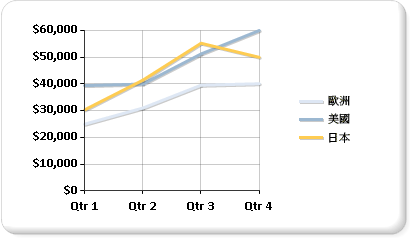

# 折線圖 (報表產生器及 SSRS)
  折線圖會將數列顯示成一組由單一線條連接的點。 因此，折線圖用於表示發生超過一段連續時間的大量資料。 如需如何將資料加入折線圖的詳細資訊，請參閱 [圖表 &#40;報表產生器及 SSRS&#41;](../../reporting-services/report-design/charts-report-builder-and-ssrs.md)。  
  
 下圖顯示的是包含三個數列的折線圖。  
  
   
  
> [!NOTE]  
>  [!INCLUDE[ssRBRDDup](../../includes/ssrbrddup-md.md)]  
  
## 變數  
  
-   **平滑線圖**： 使用曲線而非一般線條的折線圖。  
  
-   **梯線圖**： 使用梯線而非一般線條的折線圖。 梯線圖會使用類似梯子或樓梯的階梯線條來連接每個點。  
  
-   **走勢圖**： 折線圖的變數，只在資料表或矩陣的資料格中顯示線條數列。 如需詳細資訊，請參閱[走勢圖和資料橫條 &#40;報表產生器及 SSRS&#41;](../../reporting-services/report-design/sparklines-and-data-bars-report-builder-and-ssrs.md)。  
  
## 折線圖的資料考量  
  
-   為增進預設折線圖的視覺效果，請考慮將數列框線的寬度變更為 3，並增加一個單位的陰影位移。 這樣就會建立線條較粗的折線圖。 如果您將圖表類型從折線圖變更為其他類型，您需要將這些屬性還原為其原始值。  
  
-   如果您的資料集包含空值，折線圖將會以預留位置線條的形式加入空點，才能維持圖表的連續性。 如果您不想看到這些線條，請考慮使用非連續的圖表類型 (例如，橫條圖或直條圖) 來顯示資料集。  
  
-   折線圖至少需要兩個點才能繪製一條線。  如果您的資料集只有一個資料點，折線圖將會顯示為單一資料點標記。  
  
-   繪製為線條的數列在圖表區域中將不會佔用太多空間。  因此，折線圖通常會與其他圖表類型組合，例如，直條圖。 不過，折線圖無法與橫條圖、極座標圖、圓形圖或形狀圖等圖表類型組合在一起。  
  
## 請參閱＜  
 [橫條圖 &#40;報表產生器及 SSRS&#41;](../../reporting-services/report-design/bar-charts-report-builder-and-ssrs.md)   
 [直條圖 &#40;報表產生器及 SSRS &#41;](../../reporting-services/report-design/column-charts-report-builder-and-ssrs.md)   
 [圖表 &#40;報表產生器及 SSRS &#41;](../../reporting-services/report-design/charts-report-builder-and-ssrs.md)   
 [圖表類型 &#40;報表產生器及 SSRS &#41;](../../reporting-services/report-design/chart-types-report-builder-and-ssrs.md)   
 [區域圖 &#40;報表產生器及 SSRS &#41;](../../reporting-services/report-design/area-charts-report-builder-and-ssrs.md)   
 [空白和 Null 資料點中圖表 &#40;報表產生器及 SSRS &#41;](../../reporting-services/report-design/empty-and-null-data-points-in-charts-report-builder-and-ssrs.md)   
 [圖表 &#40;報表產生器及 SSRS &#41;](../../reporting-services/report-design/charts-report-builder-and-ssrs.md)  
  
  
