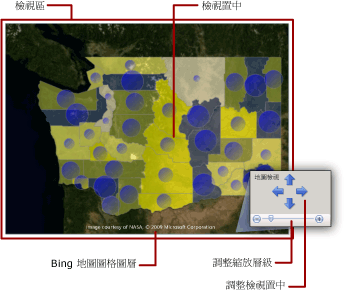
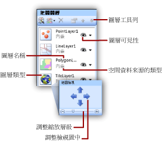

# 地圖 (報表產生器及 SSRS)
  若要針對地理背景將商務資料視覺化，您可以將地圖加入 [!INCLUDE[ssRSnoversion_md](../../includes/ssrsnoversion-md.md)] 分頁報表。 您選取的地圖類型取決於您想要在報表中傳達的資訊而定。 您可以加入只顯示位置的地圖，或是根據某區域住家數而變動泡泡大小的泡泡地圖，或者是根據每一家商店最有利潤的產品而變動標記樣式的標記地圖，或者是顯示商店之間之路線的線路地圖。  
  
 地圖包含標題、指定中心點和標尺的檢視區、檢視區的選用 Bing 地圖底圖背景、顯示空間資料的一個或多個圖層，以及可協助使用者解譯資料視覺效果的各種圖例。 下圖顯示地圖的基本部分。  
  
   
  
 若要立即開始使用地圖，請參閱[教學課程：地圖報表 &#40;報表產生器&#41;](../../reporting-services/tutorial-map-report-report-builder.md) 或[報表範例 (報表產生器及 SSRS)](https://go.microsoft.com/fwlink/?LinkId=198283)。  
  
> [!NOTE]  
>  您可以將地圖當做報表組件，與報表分開儲存。 深入了解 [報表組件](../../reporting-services/report-design/report-parts-report-builder-and-ssrs.md)。  
  
##   將地圖加入至報表  
 若要將地圖加入至報表，以下為要遵循的一般步驟清單：  
  
-   決定您要顯示的分析資料以及您需要的空間資料類型。 例如，若要在泡泡地圖上顯示商店的相對年度銷售額，您需要用於分析資料的商店名稱和商店銷售額，以及用於空間資料的商店名稱和商店位置做為緯度和經度。  
  
-   決定您要的地圖樣式。 基本地圖僅顯示位置。 泡泡地圖會根據單一分析值更改泡泡大小。 分析色彩地圖會根據分析資料的範圍更改地圖元素。 您選取的樣式取決於您想要視覺化的資料以及您使用之空間資料的類型。  
  
-   收集您必須擁有的資訊來指定空間資料來源、空間資料、分析資料來源與分析資料。 這包含空間資料來源的連接字串，來指定您需要之空間資料的類型，並確認您的報表資料包含讓空間資料和分析資料產生關聯的符合欄位。  
  
-   執行「地圖精靈」，以便將地圖加入至報表中。 這會將第一個地圖圖層加入至地圖中。 執行「地圖圖層精靈」來建立其他圖層或修改現有的圖層。 這些精靈提供一個簡單的入門方式。 如需詳細資訊，請參閱 [地圖精靈與地圖圖層精靈 &#40;報表產生器及 SSRS&#41;](../../reporting-services/report-design/map-wizard-and-map-layer-wizard-report-builder-and-ssrs.md)。  
  
-   預覽報表中的地圖之後，您可能會想要調整地圖檢視、變更您的資料更改每個圖層顯示的方式、提供圖例來協助使用者解譯資料，以及調整解析度來提供使用者良好的檢視經驗。  
  
 如需詳細資訊，請參閱 [規劃地圖報表 &#40;報表產生器及 SSRS&#41;](../../reporting-services/report-design/plan-a-map-report-report-builder-and-ssrs.md)。  
  
##   將資料加入至地圖  
 地圖使用兩種類型的資料：空間資料與分析資料。 空間資料定義地圖的外觀，而分析資料則提供與地圖相關的值。 例如，空間資料會定義某個區域中的城市位置，而分析資料會提供每個城市的人口數。  
  
 地圖必須擁有空間資料，分析資料則是選擇性的。 例如，您可以加入只顯示某個城市中之商店位置的地圖。  
  
 若要視覺化地圖上的資料，分析資料和空間資料必須擁有關聯性。 當空間資料與分析資料來自相同的來源時，關聯性是已知的。 當空間資料和分析資料來自不同的來源，您必須指定要將兩者產生關聯的符合欄位。  
  
### 空間資料  
 空間資料由多組座標所組成。 資料來源中的空間資料可以是單一點、多個點、單一線條、多個線條，或一組多邊形。 每組座標都會定義一個 *「地圖元素」* (Map Element)，例如，表示某個縣市外框的多邊形、表示路段圖的線條，或是表示城市位置的點。  
  
 空間資料以下列其中一個座標系統為基礎：  
  
-   **地理** ：在球形表面使用經度和緯度指定地理座標。 空間資料為地理時，必須指定投射。 投射是一組規則，可指定如何將擁有球形座標的物件繪製到平面上。 只有包含相同投射的地理資料可以進行比較或結合。  
  
-   **平面** ：在平面上使用 X 和 Y 指定地理座標。  
  
 每個地圖圖層都會顯示一個空間資料類型：多邊形、線條或點。 若要顯示多個空間資料類型，請將多個圖層加入至地圖中。 您也可以加入 Microsoft 地圖底圖的圖層。 圖格圖層不會相依於空間資料。 圖格圖層會顯示對應到地圖檢視區座標的影像分割。  
  
#### 空間資料的來源  
 系統支援下列空間資料來源：  
  
-   **地圖庫報表：** 空間資料會內嵌在位於地圖庫中的報表內。 根據預設，地圖庫安裝在 \<磁碟機>  :\Program Files\Microsoft SQL Server\Report Builder \MapGallery 中。  
  
    > [!NOTE]  
    >  這個 [!INCLUDE[ssRSnoversion](../../includes/ssrsnoversion-md.md)] 地圖功能會使用美國人口普查局 ([https://www.census.gov/](https://www.census.gov/)) 提供的 TIGER/Line Shapefiles 資料。 TIGER/Line 形狀檔是 Census MAF/TIGER 資料庫中選定地理和製圖資訊的擷取內容。 TIGER/Line 形狀檔是由美國人口普查局免費提供。 若要取得 TIGER/Line 形狀檔的詳細資料，請移至 [TIGER/Line 形狀檔和 TIGER/Line 檔案技術文件](https://www.census.gov/programs-surveys/geography/technical-documentation/complete-technical-documentation/tiger-geo-line.html) \(英文\)。 TIGER/Line 形狀檔中的界限資訊只能當做統計資料收集和表格製作的用途，其統計用途的描述和指定並不構成司法權或擁有權利的判定，也不屬於法律上的土地描述。 Census TIGER 與 TIGER/Line 是美國人口普查局的註冊商標。  
  
-   **ESRI 形狀檔：** ESRI 形狀檔包含與環境系統研究協會 (Environmental Systems Research Institute, Inc.，ESRI)ESRI 形狀檔空間資料格式。 ESRI 形狀檔指的是一組檔案。 .shp 檔案中的資料會指定地理或幾何圖案。 .dbf 檔案中的資料會提供這些圖案的屬性。 若要在設計檢視中檢視地圖或是從報表伺服器執行地圖，這兩種檔案必須位於相同的資料夾。 當您從本機檔案系統的 .shp 檔案加入空間資料時，空間資料會內嵌在您的報表中。 若要在執行階段動態擷取空間資料，請將形狀檔上傳至報表伺服器，然後將其指定為空間資料的來源。 如需詳細資訊，請參閱 [尋找地圖的 ESRI 形狀檔](https://go.microsoft.com/fwlink/?linkid=178814)。  
  
-   **儲存在資料庫中的 SQL Server 空間資料：** 您可以使用查詢來指定 **關聯式資料庫中的** SQLGeometry **或** SQLGeography [!INCLUDE[ssNoVersion](../../includes/ssnoversion-md.md)] 資料類型。 如需詳細資訊，請參閱[空間資料類型概觀](../../relational-databases/spatial/spatial-data-types-overview.md)。  
  
     當您在查詢設計工具中查看結果集時，每一列空間資料都視為一個單位，並儲存在單一地圖元素中。 例如，如果有多個點定義在結果集的一個資料列中，顯示屬性會套用到該地圖元素中的所有點。  
  
-   **您所建立的自訂位置：** 您可以將位置當做內嵌點手動加入至內嵌點圖層。 如需詳細資訊，請參閱 [將自訂位置加入至地圖 &#40;報表產生器及 SSRS&#41;](../../reporting-services/report-design/add-custom-locations-to-a-map-report-builder-and-ssrs.md)。  
  
#### 設計檢視中的空間資料  
 在 [設計] 檢視中，報表處理器會顯示範例空間資料來協助您設計地圖圖層。 您所看到的資料取決於空間資料的可用性。  
  
-   **內嵌資料。** 範例資料擷取自內嵌於報表中地圖圖層的地圖元素。  
  
-   **ESRI 形狀檔的連結。** ：如果有 ESRI 形狀檔 (.shp) 和支援檔案 (.dbf)，範例資料是從形狀檔載入。 否則，報表處理器會產生範例資料並顯示 **[沒有可用的空間資料]** 訊息。  
  
-   **SQL Server 空間資料：** 如果有資料來源而且認證有效，範例資料是從資料庫中的空間資料載入。 否則，報表處理器會產生範例資料並顯示 **[沒有可用的空間資料]** 訊息。  
  
#### 將空間資料內嵌在報表定義中  
 與分析資料不同，您可以選擇將地圖圖層的空間資料內嵌在報表定義中。 當您內嵌空間資料時，就是在內嵌地圖圖層中使用的地圖元素。  
  
 內嵌元素會增加報表定義的大小，但是在報表執行時，可以確認空間資料永遠存在預覽或報表伺服器中。 資料越多，表示儲存空間越多，處理時間也越長。 永遠的最佳作法是，除了其他報表資料之外，也限制空間資料，以調整報表所需的資訊。  
  
#### 控制執行階段的地圖解析度  
 當您變更空間資料的解析度時，就是在指定您希望線條繪製地圖上的詳細程度。 例如，針對地區，您需要將資料粒度降低到地球表面區域的一百公尺，還是一英哩就已經夠詳細？  
  
 如果空間資料內嵌在報表中，您所使用的解析度會影響報表定義中的地圖元素數目。 解析度較高時，會增加以該解析度繪製框線所需的元素數目。 如果空間資料沒有內嵌在報表中，每次檢視報表時，報表伺服器都會計算以該解析度繪製框線所需的線條數目。 若要設計可調和顯示解析度與可接受之報表呈現時間的報表，請將地圖解析度簡化到您在報表中視覺化分析資料所需的詳細程度。  
  
### 分析資料  
 分析資料是您要在地圖上視覺化的資料，例如，某個城市的人口數或某個商店的銷售總額。 分析資料可能是來自下列其中一個來源：  
  
-   **資料集欄位：** 來自 [報表資料] 窗格中資料集的欄位。  
  
-   **空間資料來源欄位：** 來自其中包含空間資料之空間資料來源的欄位。 例如，ESRI 形狀檔通常同時包含空間資料與分析資料。 來自空間資料來源的欄位名稱開頭為 #；當您要針對圖層指定規則的資料欄位時，這些欄位名稱會出現在欄位的下拉式清單中。  
  
-   **地圖元素的內嵌資料：** 將多邊形、線條或點內嵌到報表中之後，您可以覆寫個別地圖元素的資料欄位以及設定自訂值。  
  
 當您指定圖層的規則，並選取分析資料欄位時，如果資料類型為數值，報表處理器會自動使用預設函數 Sum 來計算地圖元素的彙總值。 如果該欄位不是數值，則不會指定任何彙總函式，而且會使用隱含的彙總函式 First。 若要變更預設運算式，請針對圖層變更規則的選項。 如需詳細資訊，請參閱 [使用規則與分析資料更改多邊形、線條與點顯示 &#40;報表產生器及 SSRS&#41;](../../reporting-services/report-design/vary-polygon-line-and-point-display-by-rules-and-analytical-data.md)。  
  
### 符合欄位  
 若要在圖層上讓分析資料和地圖元素產生關聯，您必須指定 *「符合欄位」* (Match Field)。 符合欄位用於建立地圖元素和分析資料之間的關聯性。 只要進行比對的欄位指定唯一的分析值給每個空間位置，您就可以使用一個或多個欄位。  
  
 例如，對於依據城市人口數更改泡泡大小的泡泡地圖，需要下列資料：  
  
-   從空間資料來源：  
  
    -   **SpatialData。** 具有指定城市緯度與經度的空間資料的欄位。  
  
    -   **名稱。** 包含城市名稱的欄位。  
  
    -   **Area：** 包含區域名稱的欄位。  
  
-   從分析資料來源：  
  
    -   **Population：** 包含城市人口數的欄位。  
  
    -   **City：** 包含城市名稱的欄位。  
  
    -   **Area：** 包含領域、省/市或區域名稱的欄位。  
  
 在此範例中，光是城市名稱還不足以唯一識別人口數。 例如，在美國有很多稱為奧爾班尼的城市。 若要為特定城市命名，除了城市名稱之外，您還必須指定區域。  
  
##   了解地圖檢視區  
 指定報表的地圖資料之後，您可以指定地圖 *「檢視區」* (Viewport) 來限制地圖檢視區。 根據預設，檢視區與整個地圖的區域相同。 若要裁剪地圖，您可以指定定義您要包含在報表中之區域的中心、縮放層級，以及最大和最小座標。 若要改善地圖在報表中的顯示，您可以將圖例、距離標尺和色階移到檢視區外部。 下圖顯示檢視區：  
  
   
  
##   加入 Bing 地圖底圖圖層  
 您可以加入 Bing 地圖底圖的圖層，這個圖層會為檢視區定義的目前地圖檢視提供地理背景。 若要加入圖格圖層，您必須指定 **[地理]** 座標系統以及 **[Mercator]** 投射類型。 系統會從 Bing Map Web 服務自動擷取符合您選取之檢視區置中和縮放層級的影像分割。  
  
 您可以指定下列選項來自訂圖層：  
  
-   圖層類型。 支援下列樣式：  
  
    -   **路段圖：** 顯示擁有白色背景、道路與標籤文字的路段圖樣式。  
  
    -   **空照圖：** 顯示沒有文字的空照圖影像樣式。  
  
    -   **混合式。** 顯示 **[路段圖]** 和 **[空照圖]** 樣式的組合。  
  
-   圖格上顯示文字的語言。  
  
-   是否要使用安全連線從 Bing Map Web 服務中擷取圖格。  
  
 如需逐步指示，請參閱 [加入、變更或刪除地圖或地圖圖層 &#40;報表產生器及 SSRS&#41;](../../reporting-services/report-design/add-change-or-delete-a-map-or-map-layer-report-builder-and-ssrs.md)。  
  
 如需有關圖格的詳細資訊，請參閱 [Bing Maps 圖格系統](https://go.microsoft.com/fwlink/?linkid=147315)。 如需有關在報表中使用 Bing 地圖底圖的詳細資訊，請參閱 [其他使用規定](https://go.microsoft.com/fwlink/?LinkId=151371)。  
  
##   了解地圖圖層與地圖元素  
 一個地圖可以擁有多個圖層。 圖層有三種類型。 每個圖層都會顯示一種空間資料類型：  
  
-   **多邊形圖層：** 顯示區域的外框或針對每個多邊形自動計算之多邊形中心點的標記。  
  
-   **線條圖層：** 顯示路徑或路線的線條。  
  
-   **點圖層：** 顯示點位置的標記。  
  
 當您針對圖層指定空間資料的來源時，精靈會檢查空間資料欄位，並根據其類型設定圖層類型。 系統會針對資料來源中的每個值，將地圖元素加入至圖層中。  
  
 例如，若要顯示中央倉儲到商店的傳遞路線，您可以加入兩個圖層：包含圖釘標記的點圖層 (以顯示商店位置) 以及線條圖層 (以顯示從倉儲到每個商店的傳遞路線)。 點圖層需要指定商店位置的 [點] 空間資料，而線條圖層則需要指定傳遞路線的 [線條] 空間資料。  
  
 第四種圖層類型為圖格圖層。 圖格圖層會加入對應至地圖檢視區置中與縮放層級之 Bing 地圖底圖的背景。  
  
 若要使用圖層，在報表設計介面上選取一個地圖來顯示 [地圖] 窗格。 [地圖] 窗格會顯示針對地圖所定義之圖層的清單。 使用此窗格選取圖層來變更選項、變更圖層的繪製程序、加入圖層或執行「地圖圖層精靈」、隱藏或顯示圖層，以及變更地圖檢視區的檢視置中與縮放層級。 下圖顯示檢視區：  
  
   
  
 如需地圖圖層的詳細資訊，請參閱 [加入、變更或刪除地圖或地圖圖層 &#40;報表產生器及 SSRS&#41;](../../reporting-services/report-design/add-change-or-delete-a-map-or-map-layer-report-builder-and-ssrs.md)。  
  
### 更改點、線條與多邊形的顯示屬性  
 您可以使用圖層的規則，或者針對個別元素，設定地圖元素的顯示選項。 例如，您可以設定圖層上所有點的顯示屬性，或者您可以設定圖層上不論是否內嵌之所有點的顯示選項，或者您可以覆寫特定內嵌點的顯示屬性設定。  
  
 當您檢視報表時，您看到的顯示值受到此階層的控制，以遞增順序列出。 數字較高者較為優先：  
  
1.  **圖層屬性：** 套用至整個圖層的屬性。 例如，使用圖層屬性來設定分析資料的來源或整個圖層的可見性。  
  
2.  **多邊形、線條、點屬性以及內嵌多邊形、線條、點屬性：** 套用至圖層上所有地圖元素的屬性 (不論這些元素來自動態空間資料或內嵌空間資料)。 例如，使用多邊形中心點屬性將泡泡的填滿色彩設定為漸層 (由深藍色至淺藍色，以及由上至下填滿泡泡區域)。  
  
3.  **色彩規則、大小規則、寬度規則與標記類型規則：** 當圖層所包含的地圖元素與分析資料擁有關聯性時，規則會將屬性套用至該圖層。 規則類型會隨著圖層類型而變更。 例如，根據人口數使用點大小規則來更改泡泡大小。  
  
4.  **針對內嵌多邊形、線條或點屬性覆寫：** 對於內嵌的地圖元素，您可以選取覆寫選項，然後變更任何屬性或資料值。 您對個別元素之覆寫規則所進行的任何變更都無法回復。 例如，您可以使用圖釘標記反白顯示特定的商店。  
  
 如需詳細資訊，請參閱 [使用規則與分析資料更改多邊形、線條與點顯示 &#40;報表產生器及 SSRS&#41;](../../reporting-services/report-design/vary-polygon-line-and-point-display-by-rules-and-analytical-data.md)。  
  
 除了更改地圖元素的外觀之外，您還可以使用下列方式，為點、線條和多邊形，或圖層增加互動功能：  
  
-   當使用者將指標停留在地圖上時，建立工具提示來提供地圖元素的其他詳細資料。  
  
-   加入鑽研動作以連結至報表中的其他位置、其他報表或網頁。  
  
-   在運算式中加入定義圖層可見性的參數，讓使用者顯示或隱藏特定的地圖圖層。  
  
 如需詳細資訊，請參閱[互動式排序、文件引導模式及連結 &#40;報表產生器及 SSRS&#41;](../../reporting-services/report-design/interactive-sort-document-maps-and-links-report-builder-and-ssrs.md)。  
  
##   了解地圖圖例、色階與距離標尺  
 您可以將各種圖例加入至報表中以協助使用者解譯地圖。 地圖可以包含下列項目：  
  
-   **圖例：** 您可以建立多個圖例。 系統會根據您為每個圖層上之地圖元素所指定的規則，自動產生圖例中所列出的項目。 針對每個規則，您可以指定用來顯示其相關項目的圖例。 以此種方式，您可以將多個圖層中的項目指派給相同的圖例或不同的圖例。  
  
-   **色階：** 您可以建立一個色階。 您可以在色階中顯示色彩規則的項目，做為提供色彩規則之圖例的替代方式。 您可以將多個色彩規則套用到色階。  
  
-   **距離標尺：** 您可以顯示一個距離標尺。 距離標尺會同時以公里和英哩顯示目前地圖檢視的標尺。  
  
 您可以將圖例、色階與距離標尺放在檢視區內部或外部的離散位置。 如需詳細資訊，請參閱 [變更地圖圖例、色階與相關的規則 &#40;報表產生器及 SSRS&#41;](../../reporting-services/report-design/change-map-legends-color-scale-and-associated-rules-report-builder-and-ssrs.md)。  
  
##   地圖疑難排解  
 地圖報表會使用來自各種資料來源的空間資料與分析資料。 每個地圖圖層都可以使用不同的資料來源。 根據圖層屬性、規則、地圖元素屬性，每個圖層的顯示屬性都會遵循特定的程序。  
  
 檢視地圖報表時，如果看不到您所要的結果，根本原因可能來自各種問題。 為了協助您區隔以及了解每一個問題，一次使用一個圖層會有協助。 使用 [地圖] 窗格選取圖層並輕鬆切換其可見性。  
  
 如需地圖報表問題的詳細資訊，請參閱[針對報表進行疑難排解：地圖報表 &#40;報表產生器及 SSRS&#41;](../../reporting-services/report-design/troubleshoot-reports-map-reports-report-builder-and-ssrs.md)  
  
##   如何主題  
 本節列出的程序可以為您逐步示範，如何在報表中使用地圖和地圖圖層。  
  
-   [加入、變更或刪除地圖或地圖圖層 &#40;報表產生器及 SSRS&#41;](../../reporting-services/report-design/add-change-or-delete-a-map-or-map-layer-report-builder-and-ssrs.md)  
  
-   [變更地圖圖例、色階與相關的規則 &#40;報表產生器及 SSRS&#41;](../../reporting-services/report-design/change-map-legends-color-scale-and-associated-rules-report-builder-and-ssrs.md)  
  
-   [將自訂位置加入至地圖 &#40;報表產生器及 SSRS&#41;](../../reporting-services/report-design/add-custom-locations-to-a-map-report-builder-and-ssrs.md)  
  
##   本節內容  
 [規劃地圖報表 &#40;報表產生器及 SSRS&#41;](../../reporting-services/report-design/plan-a-map-report-report-builder-and-ssrs.md)  
  
 [地圖精靈與地圖圖層精靈 &#40;報表產生器及 SSRS&#41;](../../reporting-services/report-design/map-wizard-and-map-layer-wizard-report-builder-and-ssrs.md)  
  
 [自訂地圖或地圖圖層的資料和顯示 &#40;報表產生器及 SSRS&#41;](../../reporting-services/report-design/customize-the-data-and-display-of-a-map-or-map-layer-report-builder-and-ssrs.md)  
  
 [使用規則與分析資料更改多邊形、線條與點顯示 &#40;報表產生器及 SSRS&#41;](../../reporting-services/report-design/vary-polygon-line-and-point-display-by-rules-and-analytical-data.md)  
  
 [加入、變更或刪除地圖或地圖圖層 &#40;報表產生器及 SSRS&#41;](../../reporting-services/report-design/add-change-or-delete-a-map-or-map-layer-report-builder-and-ssrs.md)  
  
 [變更地圖圖例、色階與相關的規則 &#40;報表產生器及 SSRS&#41;](../../reporting-services/report-design/change-map-legends-color-scale-and-associated-rules-report-builder-and-ssrs.md)  
  
 [將自訂位置加入至地圖 &#40;報表產生器及 SSRS&#41;](../../reporting-services/report-design/add-custom-locations-to-a-map-report-builder-and-ssrs.md)  
  
 [報表疑難排解：地圖報表 &#40;報表產生器及 SSRS&#41;](../../reporting-services/report-design/troubleshoot-reports-map-reports-report-builder-and-ssrs.md)  
  
  
