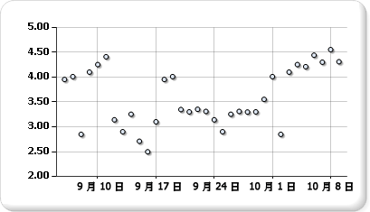

# 散佈圖 (報表產生器及 SSRS)
  散佈圖會將數列顯示成一組點。 這些值會以點在圖表上的位置來表示。 類別目錄會由圖表上不同的標記來表示。 散佈圖通常用來比較跨越類別目錄的彙總資料。 如需如何將資料新增至散佈圖的詳細資訊，請參閱 [Charts &#40;Report Builder and SSRS&#41;](../../reporting-services/report-design/charts-report-builder-and-ssrs.md)  
  
 下圖顯示散佈圖的範例。  
  
   
  
> [!NOTE]  
>  [!INCLUDE[ssRBRDDup](../../includes/ssrbrddup-md.md)]  
  
## 變數  
  
-   **泡泡圖。** 泡泡圖會根據泡泡的大小，顯示資料點的兩個值之間的差異。 較大的泡泡，也就是兩個值之間較大的差異。  
  
-   **立體泡泡圖**。 泡泡圖以立體方式顯示。  
  
## 散佈圖的資料考量  
  
-   散佈圖通常用於顯示與比較數值，例如，科學、統計與工程資料。  
  
-   當您想要在不管時間的情況下比較大量資料點時，請使用散佈圖。 您在散佈圖中包含越多資料，您就可以達到越好的比較結果。  
  
-   泡泡圖的每個資料點都需要兩個值 (頂端和底部)。  
  
-   散佈圖適合處理值的分佈與資料點的群集。 如果您的資料集包含許多點 (例如，數千個點)，則這是最佳的圖表類型。 在點圖上顯示多個數列會擾亂視覺，應該予以避免。 在此狀況下，請考慮使用折線圖。  
  
-   根據預設，散佈圖會將資料點顯示為圓形。 如果您在散佈圖上有多個數列，請考慮將每個點的標記形狀變更為正方形、三角形、菱形或其他形狀。  
  
## 請參閱＜  
 [圖表 &#40;報表產生器及 SSRS &#41;](../../reporting-services/report-design/charts-report-builder-and-ssrs.md)   
 [圖表類型 &#40;報表產生器及 SSRS &#41;](../../reporting-services/report-design/chart-types-report-builder-and-ssrs.md)   
 [格式化圖表 &#40;報表產生器及 SSRS &#41;](../../reporting-services/report-design/formatting-a-chart-report-builder-and-ssrs.md)   
 [折線圖 &#40;報表產生器及 SSRS &#41;](../../reporting-services/report-design/line-charts-report-builder-and-ssrs.md)  
  
  

