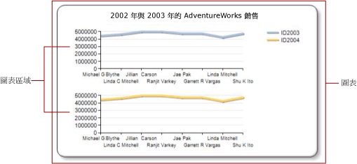

# 為數列指定圖表區域 (報表產生器及 SSRS)
  在 [!INCLUDE[ssRSnoversion_md](../../includes/ssrsnoversion-md.md)] 分頁報表中，圖表  是最上層的容器，其中包含外框、圖表標題和圖例。 根據預設，圖表包含一個「圖表區域」  。 在圖表介面上看不到圖表區域，但是您可以將圖表區域視為僅包含軸標籤、軸標題，以及一或多個數列之繪圖區的容器。 下圖顯示單一圖表內多個圖表區域的概念。  
  
   
  
 依預設，所有數列都會加入到預設的圖表區域中。 使用區域圖、直條圖、折線圖和散佈圖時，這些數列的任何組合都可以顯示在相同的圖表區域中。 如果您在相同的圖表區域中有數個數列，則會降低圖表的可讀性。 您可能想要將圖表類型分為數個圖表區域。 使用多個圖表區域將會增加可讀性，讓比較更為容易。 例如，價格-數量股票圖通常有不同範圍的值，但是可以在相同一段時間的價格和數量資料之間進行比較。  
  
 長條圖、極座標圖或形狀圖數列僅能與相同圖表區域中相同圖表類型的數列結合。 如果您使用的是極座標圖或形狀圖，請考慮將個別的圖表資料區域用於您要顯示的每個欄位。  
  
> [!NOTE]  
>  [!INCLUDE[ssRBRDDup](../../includes/ssrbrddup-md.md)]  
  
## 讓數列與新圖表區域產生關聯  
  
1.  以滑鼠右鍵按一下圖表的任何位置，然後選取 [新增新的圖表區域]  。 新的空白圖表區域就會出現在圖表上。  
  
2.  以滑鼠右鍵按一下圖表上的數列，或者在 [圖表資料] 窗格以滑鼠右鍵按一下適當區域中的資料欄位，然後按一下 [數列屬性]  。  
  
3.  在 **[軸和圖表區域]** 中，選取您要數列顯示在其中的圖表區域。  
  
4.  (選擇性) 垂直對齊圖表區域。 若要這樣做，以滑鼠右鍵按一下圖表，然後選取 [圖表區域屬性]  。 在 **[對齊]** 中，選取您要與所選圖表區域對齊的另一個圖表區域。  
  
## 另請參閱  
 [圖表上的多個數列 &#40;報表產生器及 SSRS&#41;](../../reporting-services/report-design/multiple-series-on-a-chart-report-builder-and-ssrs.md)   
 [格式化圖表上的資料點 &#40;報表產生器和 SSRS&#41;](../../reporting-services/report-design/formatting-data-points-on-a-chart-report-builder-and-ssrs.md)   
 [使用調色盤定義圖表的色彩 &#40;報表產生器及 SSRS&#41;](../../reporting-services/report-design/define-colors-on-a-chart-using-a-palette-report-builder-and-ssrs.md)   
 [極座標圖 &#40;報表產生器及 SSRS&#41;](../../reporting-services/report-design/polar-charts-report-builder-and-ssrs.md)   
 [形狀圖 &#40;報表產生器及 SSRS&#41;](../../reporting-services/report-design/shape-charts-report-builder-and-ssrs.md)   
 [圓形圖 &#40;報表產生器及 SSRS&#41;](../../reporting-services/report-design/pie-charts-report-builder-and-ssrs.md)  
  
  
