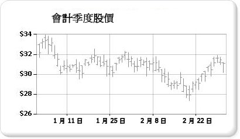

# 股票圖 (報表產生器及 SSRS)

  股票圖是特別針對每個資料點最多使用四個值的財務或科學資料而設計的。 這些值會讓用於繪製財務股票資料的最高值、最低值、開盤值與收盤值排成一列。 此圖表類型會使用標記 (通常是線條或三角形) 來顯示開盤值與收盤值。 在下列範例中，開盤值以左方的標記顯示，而收盤值以右方的標記顯示。  
  
   
  
 股票圖表的範例是可從範例報表產生器報表。 如需有關下載這個範例報表及其他的詳細資訊，請參閱[報表產生器和報表設計師範例報表](http://go.microsoft.com/fwlink/?LinkId=198283)。  
  
> [!NOTE]  
>  [!INCLUDE[ssRBRDDup](../../includes/ssrbrddup-md.md)]  
  
## 變數  
  
-   **K 線圖**： K 線圖是一種特殊形式的股票圖，其中的方塊用於顯示開盤值與收盤值之間的範圍。 K 線圖就像股票圖一樣，最多可以在每個資料點顯示四個值。  
  
## 股票圖的資料考量  
  
-   顯示多個股票資料點 (例如，年股價趨勢) 時，很難區分每個資料點的每個開盤值、收盤值、最高值與最低值。 在此狀況下，請考慮使用折線圖而非股票圖。  
  
-   產生軸標籤時，標記通常會從零開始。  一般而言，股價的變動程度與其他資料集的變動程度不同。 因此，您可能想要停用從零開始的軸標籤，才能得到較佳的資料檢視。 若要這樣做，請在 **[軸屬性]** 對話方塊或 [屬性] 視窗中，將 **IncludeZero** 設定為 **false** 。 如需圖表如何產生軸標籤的詳細資訊，請參閱[格式化圖表上的軸標籤 &#40;報表產生器及 SSRS&#41;](../../reporting-services/report-design/formatting-axis-labels-on-a-chart-report-builder-and-ssrs.md)。  
  
-   [!INCLUDE[ssRSnoversion](../../includes/ssrsnoversion-md.md)] 提供許多計算公式搭配股票圖使用，包括「價格指標」、「相對強弱指標 (Relative Strength Index)」、MACD 等等。  

## 後續的步驟

[範圍圖表](../../reporting-services/report-design/range-charts-report-builder-and-ssrs.md)   
[圖表](../../reporting-services/report-design/charts-report-builder-and-ssrs.md)   
[格式化圖表](../../reporting-services/report-design/formatting-a-chart-report-builder-and-ssrs.md)   
[軸屬性對話方塊、 軸選項](http://msdn.microsoft.com/library/b276e210-7a12-48ae-971b-7dabae51df11)  

更多問題嗎？ [請嘗試詢問 Reporting Services 論壇](http://go.microsoft.com/fwlink/?LinkId=620231)
