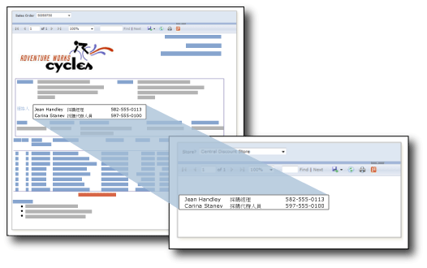

# 子報表 (報表產生器及 SSRS)
  子報表是一個報表項目，會在主要報表的主體內顯示另一個報表。 報表中子報表的概念類似於網頁中的框架。 它用於在報表中內嵌報表。 任何報表都可以做為子報表。 顯示為子報表的報表儲存在報表伺服器上，通常會與父報表儲存在同一個資料夾中。 您可以設計父報表來傳遞參數給子報表。 子報表可以在資料區域中重複，使用參數在每一個子報表執行個體中篩選資料。  
  
> [!NOTE]  
>  如果您在 Tablix 資料區中使用子報表，則會針對每一個資料列來處理子報表和它的參數。 如果存在許多資料列，請考慮是否使用鑽研報表會更適當。  
  
   
  
 在此圖中，[銷售訂單] 主報表中顯示的連絡資訊實際上來自 [連絡人] 子報表。  
  
> [!NOTE]  
>  [!INCLUDE[ssRBRDDup](../../includes/ssrbrddup-md.md)]  
  
## 比較子報表和巢狀資料區  
 如果您想要使用子報表顯示不同群組的資料，請考慮改用資料區，例如資料表、矩陣和圖表。 只搭配資料區使用報表時，其執行效能可能會比包含子報表的報表更好。  
  
 在單一資料區域內從相同的資料來源中巢狀資料群組時，請使用資料區域。 在單一資料區域內從不同的資料來源中巢狀資料群組，請使用子報表，重複使用多個父報表中的子報表，或是在另一個報表中顯示獨立報表。 例如，您可以在另一個報表主體中置放多個子報表，以建立「簡報書籍」。  
  
 資料區與子報表的功能和彈性相同，但效能更佳。 這是因為報表伺服器會將子報表的每一個執行個體，都視為獨立的報表來處理，所以可能會影響效能。 如需詳細資訊，請參閱 [巢狀資料區 &#40;報表產生器及 SSRS&#41;](../../reporting-services/report-design/nested-data-regions-report-builder-and-ssrs.md)。  
  
## 在子報表中使用參數  
 若要從父報表傳遞參數至子報表，請在做為子報表使用的報表中定義一個報表參數。 當您在父報表中放置子報表時，您可以選取報表參數，以及要從父報表中傳遞給子報表中之報表參數的值。  
  
> [!NOTE]  
>  您從子報表選取的參數是報表參數，而非查詢參數。  
  
 您可以在報表主體或資料區域中放置一個子報表。 如果您在資料區域中放置一個子報表，子報表將在資料區域中重複群組或資料列的每一個執行個體。 若要從群組或資料列傳遞值給子報表，請在子報表值屬性中，針對包含要傳遞給子報表參數的值欄位，使用欄位運算式。  
  
 如需使用子報表的詳細資訊，請參閱[新增子報表和參數 &#40;報表產生器及 SSRS&#41;](../../reporting-services/report-design/add-a-subreport-and-parameters-report-builder-and-ssrs.md)。  
  
## 指定子報表名稱和位置  
 您可以設計主報表，以便在相同報表伺服器上的不同資料夾中指定子報表。  
  
 您用來指定子報表的語法，取決於報表伺服器處於原生模式或 SharePoint 整合模式而定。 如需詳細資訊，請參閱[指定外部項目的路徑 &#40;報表產生器及 SSRS&#41;](../../reporting-services/report-design/specifying-paths-to-external-items-report-builder-and-ssrs.md)。  
  
 在報表產生器中，若要預覽主報表中的子報表，則兩個報表都必須位在相同的報表伺服器上，或者您必須指定子報表的完整路徑。  
  
## 另請參閱  
 [鑽研、向下鑽研、子報表和巢狀資料區 &#40;報表產生器及 SSRS&#41;](../../reporting-services/report-design/drillthrough-drilldown-subreports-and-nested-data-regions.md)  
  
  
