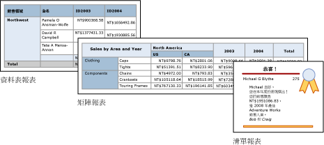

# 資料表、矩陣和清單 (報表產生器及 SSRS)
 在[!INCLUDE[ssRSnoversion_md](../../includes/ssrsnoversion-md.md)]，資料表、 矩陣和清單都是*資料區域*顯示分頁報表中會組織成資料列和資料行的資料格的資料。 資料格通常包含文字資料 (例如文字、日期和數字)，但也可以包含量測計、圖表或報表項目 (例如影像)。 資料表、矩陣和清單經常統稱為 *Tablix* 資料區。  
  
 資料表、矩陣和清單範本建立於 Tablix 資料區之上，是一個可以在資料格中顯示資料的彈性方格。 在資料表和矩陣範本中，資料格會組織成資料列和資料行。 範本是基礎泛型 tablix 資料區的變化，您可以結合範本格式顯示資料，並將資料表、 矩陣或清單上變更為包含其他資料區的功能，當您開發您的報表。 例如，如果您加入一個資料表之後，發現該資料表不符合您的需要，您可以加入資料行群組，讓該資料表變成矩陣。  
  
 資料表和矩陣資料區可以加入巢狀資料表、矩陣、清單、圖表和量測計，以顯示複雜的資料關聯性。 資料表和矩陣具有表格式配置，且其資料來自單一資料來源上建立的單一資料集。 資料表和矩陣之間的主要差異在於資料表可以只包含資料列群組，而矩陣則包含資料列群組和資料行群組。  
  
 清單則稍有不同。 它們支援自由形式的配置，而且可以包含多個對等的資料表或矩陣，每個都使用來自不同資料集的資料。 清單也可以用於表單，例如發票。  
  
 下圖顯示包含資料表、矩陣或清單的簡單報表。  
  
   
  
 若要快速地開始使用資料表、矩陣和清單，請參閱[教學課程：建立基本資料表報表 &#40;報表產生器&#41;](../../reporting-services/tutorial-creating-a-basic-table-report-report-builder.md)、[教學課程：建立矩陣報表 &#40;報表產生器&#41;](../../reporting-services/tutorial-creating-a-matrix-report-report-builder.md) 及[教學課程：建立自由格式報表 &#40;報表產生器&#41;](../../reporting-services/tutorial-creating-a-free-form-report-report-builder.md)。  
  
> [!NOTE]  
>  您可以將資料表、矩陣和清單當做報表組件，與報表分開發行。 深入了解 [報表組件](../../reporting-services/report-design/report-parts-report-builder-and-ssrs.md)。  
  
##   Table  
 使用資料表顯示詳細資料、在資料列群組中組織資料，或兩者。 「資料表」範本包含三個資料行，其中有一個資料的資料表頁首資料列和一個詳細資料資料列。 下圖顯示在設計介面上選取的初始資料表範本：  
  
   
  
 您可以依單一欄位、多個欄位或透過撰寫自己的運算式來分組資料。 您可以建立巢狀群組或獨立的相鄰群組，以及顯示群組資料的彙總值，或將總計加入至群組。 例如，如果您的資料表有一個稱為 [Category] 的資料列群組，您可以加入每個群組的小計，以及報表的總計。 若要改善資料表的外觀，並反白顯示您想要強調的資料，您可以合併資料格，並將格式套用至資料和資料表標題。  
  
 您可以一開始隱藏詳細資料或群組資料並加入向下鑽研切換，以便讓使用者以互動方式選擇要顯示多少資料。  
  
 如需詳細資訊，請參閱[資料表 &#40;報表產生器及 SSRS&#41;](../../reporting-services/report-design/tables-report-builder-and-ssrs.md)。  
  
##   矩陣  
 使用矩陣顯示在資料列與資料行中群組的彙總資料摘要，類似於樞紐分析表或交叉資料表。 群組的資料列數和資料行數，取決於每個資料列和資料行群組的唯一組數目。 下圖顯示在設計介面上選取的初始矩陣範本：  
  
 ![從 [工具箱] 中，選取加入新的矩陣](../../reporting-services/report-design/media/rs-matrixtemplatenewselected.gif "新矩陣從工具箱新增選取")  
  
 您可以依資料列和資料行群組中的多個欄位或運算式群組資料。 當報表資料和資料區在執行階段結合時，如果為資料行群組加入資料行，並為資料列群組加入資料列，則矩陣會在頁面上以水平和垂直方式成長。 矩陣資料格會顯示資料格所屬資料列與資料行群組交集範圍內的彙總值。 例如，如果您的矩陣有一個資料列群組 (Category) 和兩個資料行群組 (Territory 和 Year) 顯示銷售量的總和，報表會針對 Category 群組中的每個值，顯示包含銷售量總和的兩個資料格。 資料格範圍的兩個交集是：Category 和 Territory，以及 Category 和 Year。 矩陣可以包含巢狀群組與相鄰的群組。 巢狀群組擁有父子式關聯性，而相鄰的群組則擁有對等關聯性。 您可以針對矩陣內的任何和所有層級的巢狀資料列和資料行群組加入小計。  
  
 若要讓矩陣資料更容易讀取，並反白顯示您想要強調的資料，您可以合併資料格，或以水平和垂直方式分割，然後將格式套用至資料和群組標題。  
  
 您也可以加入一開始隱藏詳細資料的向下鑽研切換，使用者就可以在需要時，按一下切換來顯示更多或更少的詳細資料。  
  
 如需詳細資訊，請參閱 [建立矩陣](../../reporting-services/report-design/create-a-matrix-report-builder-and-ssrs.md)。  
  
##   清單  
 使用清單來建立自由形式配置。 您不會受限於格線配置，但是可以將欄位任意放在清單內。 您可以使用清單來設計顯示許多資料集欄位的表單，或將表單設計為容器來並排顯示群組資料的多個資料區域。 例如，您可以定義清單的群組；加入資料表、圖表與影像；以及以資料表和圖形形式顯示每個群組值的值，如同您針對員工或病患記錄所進行的處理。  
  
 ![從 [工具箱] 中，選取加入新清單](../../reporting-services/report-design/media/rs-listtemplatenewselected.gif "新清單從工具箱新增選取")  
  
 如需詳細資訊，請參閱＜使用清單建立發票和表單＞。  
  
##   準備資料  
 資料表、矩陣和清單資料區都會顯示資料集中的資料。 您可以在擷取資料集之資料的查詢中準備資料，也可以透過設定資料表、矩陣或清單中的屬性來準備資料。  
  
 您用來擷取報表資料集之資料的查詢語言 (例如 [!INCLUDE[tsql](../../includes/tsql-md.md)]) 可以透過套用篩選以便只包含資料的子集、以使報表更容易讀取的常數取代 Null 值或空白，以及排序和分組資料，來準備資料。  
  
 如果您選擇在報表的資料表、矩陣或清單資料區中準備資料，您要在資料區上或資料區內的資料格上設定屬性。 如果您想要篩選或排序資料，請在資料區上設定屬性。 例如，若要排序資料，您要指定排序所依據的資料行和排序方向。 如果您想要為某個欄位提供一個替代值，您要設定顯示該欄位之資料格文字的值。 例如，若要在欄位空白或 Null 時顯示空白，您要使用運算式來設定值。  
  
 如需詳細資訊，請參閱[準備要在 Tablix 資料區中顯示的資料 &#40;報表產生器及 SSRS&#41;](../../reporting-services/report-design/preparing-data-for-display-in-a-tablix-data-region-report-builder-and-ssrs.md)。  
  
##   建立和設定資料表、矩陣或清單  
 當您將資料表或矩陣加入至報表時，可以使用「資料表和矩陣精靈」或從報表產生器和報表設計師所提供的範本手動建立它們。 清單是從清單範本手動建立。  
  
 此精靈會引導您進行快速建立和設定資料表或矩陣的步驟。 完成精靈之後，或者如果您要從頭開始建立 Tablix 資料區，您可以進一步設定並精簡它們。 可從資料區的滑鼠右鍵功能表取得的對話方塊可讓您輕鬆設定常用的分頁符號屬性、頁首與頁尾的重複性和可見性、顯示選項、篩選，以及排序。 但是，Tablix 資料區會提供其他豐富的屬性，這些屬性只能在報表產生器的 [屬性] 窗格中設定。 例如，如果您要在資料表、矩陣或清單的資料集空白時顯示訊息，您要在 [屬性] 窗格的 NoRowsMessage Tablix 屬性中指定訊息文字。  
  
##   切換 Tablix 範本  
 您不會受到一開始選擇的 Tablix 範本所限制。 當您加入群組、總計與標籤時，可以修改您的 Tablix 設計。 例如，您可以從資料表開始，然後刪除詳細資料資料列並加入資料行群組。 如需詳細資訊，請參閱[探索 Tablix 資料區的彈性 &#40;報表產生器和 SSRS&#41;](../../reporting-services/report-design/exploring-the-flexibility-of-a-tablix-data-region-report-builder-and-ssrs.md)。  
  
 您可以加入任何 Tablix 功能以便繼續開發資料表、矩陣或清單。 Tablix 功能包括在資料列和資料行上顯示群組資料的詳細資料或彙總。 您可以建立巢狀群組、獨立的相鄰群組或遞迴群組。 您可以在群組定義中加入多個群組運算式，藉以篩選與排序群組資料，並輕鬆地結合群組。  
  
 您也可以加入群組的總計或資料區的總計。 您可以隱藏資料列或資料行來簡化報表，並讓使用者切換隱藏資料的顯示，如同在向下鑽研報表中一樣。 如需詳細資訊，請參閱 [控制報表頁面上的 Tablix 資料區顯示 &#40;報表產生器及 SSRS&#41;](../../reporting-services/report-design/controlling-the-tablix-data-region-display-on-a-report-page.md)。  
  
##   如何主題  
 本節列出向您逐步示範如何在報表中使用資料表、矩陣和清單；如何顯示資料列和資料行中的資料、加入和刪除資料行、合併資料格，以及加入資料列和資料行群組之小計的程序。  
  
-   [加入詳細資料群組 &#40;報表產生器及 SSRS&#41;](../../reporting-services/report-design/add-a-details-group-report-builder-and-ssrs.md)  
  
-   [將總計加入到群組或 Tablix 資料區 &#40;報表產生器及 SSRS&#41;](../../reporting-services/report-design/add-a-total-to-a-group-or-tablix-data-region-report-builder-and-ssrs.md)  
  
-   [變更資料格內的項目 &#40;報表產生器及 SSRS&#41;](../../reporting-services/report-design/change-an-item-within-a-cell-report-builder-and-ssrs.md)  
  
-   [變更資料列高度或資料行寬度 &#40;報表產生器及 SSRS&#41;](../../reporting-services/report-design/change-row-height-or-column-width-report-builder-and-ssrs.md)  
  
-   [插入或刪除資料行 &#40;報表產生器及 SSRS&#41;](../../reporting-services/report-design/insert-or-delete-a-column-report-builder-and-ssrs.md)  
  
-   [插入或刪除資料列 &#40;報表產生器及 SSRS&#41;](../../reporting-services/report-design/insert-or-delete-a-row-report-builder-and-ssrs.md)  
  
-   [在資料區中合併資料格 &#40;報表產生器及 SSRS&#41;](../../reporting-services/report-design/merge-cells-in-a-data-region-report-builder-and-ssrs.md)  
  
-   [建立遞迴階層群組 &#40;報表產生器及 SSRS&#41;](../../reporting-services/report-design/create-a-recursive-hierarchy-group-report-builder-and-ssrs.md)  
  
-   [在資料區中加入或刪除群組 &#40;報表產生器及 SSRS&#41;](../../reporting-services/report-design/add-or-delete-a-group-in-a-data-region-report-builder-and-ssrs.md)  
  
-   [與群組一起顯示頁首和頁尾 &#40;報表產生器及 SSRS&#41;](../../reporting-services/report-design/display-headers-and-footers-with-a-group-report-builder-and-ssrs.md)  
  
-   [建立階梯狀報表 &#40;報表產生器及 SSRS&#41;](../../reporting-services/report-design/create-a-stepped-report-report-builder-and-ssrs.md)  
  
-   [加入、移動或刪除資料表、矩陣或清單 &#40;報表產生器及 SSRS&#41;](../../reporting-services/report-design/add-move-or-delete-a-table-matrix-or-list-report-builder-and-ssrs.md)  
  
##   本節內容  
 下列主題提供有關使用 Tablix 資料區的其他資訊。  
  
 [Tablix 資料區 &#40;報表產生器及 SSRS&#41;](../../reporting-services/report-design/tablix-data-region-report-builder-and-ssrs.md)  
 說明與 Tablix 資料區相關的主要概念，例如 Tablix 的區域、詳細資料和群組資料、資料行和資料列群組，以及靜態與動態資料列和資料行。  
  
 [將資料加入至 Tablix 資料區 &#40;報表產生器及 SSRS&#41;](../../reporting-services/report-design/adding-data-to-a-tablix-data-region-report-builder-and-ssrs.md)  
 提供有關將詳細資料和群組資料、小計和總計，以及標籤加入至 Tablix 資料區的詳細資訊。  
  
 [控制報表頁面上的 Tablix 資料區顯示 &#40;報表產生器及 SSRS&#41;](../../reporting-services/report-design/controlling-the-tablix-data-region-display-on-a-report-page.md)  
 描述 Tablix 資料區的屬性，您可以修改這些屬性來變更您在報表中檢視時 Tablix 資料區顯示的方式。  
  
 [控制資料列和資料行標題 &#40;報表產生器及 SSRS&#41;](../../reporting-services/report-design/controlling-row-and-column-headings-report-builder-and-ssrs.md)  
 描述資料表、矩陣或清單資料區以水平或垂直方式跨越多個頁面時，如何控制資料列和資料行標題。  
  
 [建立遞迴階層群組 &#40;報表產生器及 SSRS&#41;](../../reporting-services/report-design/creating-recursive-hierarchy-groups-report-builder-and-ssrs.md)  
 描述如何顯示父系和子系之關聯性由資料集中之欄位表示的遞迴資料。  
  
 [了解群組 &#40;報表產生器及 SSRS&#41;](../../reporting-services/report-design/understanding-groups-report-builder-and-ssrs.md)  
 說明群組的定義和使用時機，並描述可用於不同 Tablix 資料區的群組。  
  
## 請參閱＜  
 [加入資料集篩選、資料區篩選和群組篩選 &#40;報表產生器及 SSRS&#41;](../../reporting-services/report-design/add-dataset-filters-data-region-filters-and-group-filters.md)   
 [巢狀的資料區 &#40;報表產生器及 SSRS &#41;](../../reporting-services/report-design/nested-data-regions-report-builder-and-ssrs.md)   
 [將多個資料區域連結至相同的資料集 &#40;報表產生器及 SSRS &#41;](../../reporting-services/report-design/linking-multiple-data-regions-to-the-same-dataset-report-builder-and-ssrs.md)   
 [運算式 &#40;報表產生器及 SSRS &#41;](../../reporting-services/report-design/expressions-report-builder-and-ssrs.md)   
 [篩選、 群組和排序資料 &#40;報表產生器及 SSRS &#41;](../../reporting-services/report-design/filter-group-and-sort-data-report-builder-and-ssrs.md)   
 [報表參數 &#40;報表產生器和報表設計工具 &#41;](../../reporting-services/report-design/report-parameters-report-builder-and-report-designer.md)   
 [圖表 &#40;報表產生器及 SSRS &#41;](../../reporting-services/report-design/charts-report-builder-and-ssrs.md)   
 [量測計 &#40;報表產生器及 SSRS &#41;](../../reporting-services/report-design/gauges-report-builder-and-ssrs.md)  
  
  
