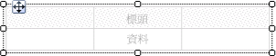
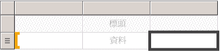
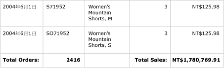
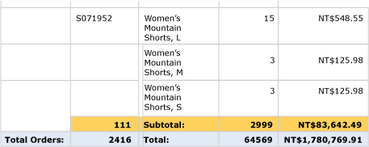
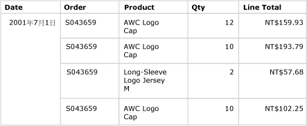
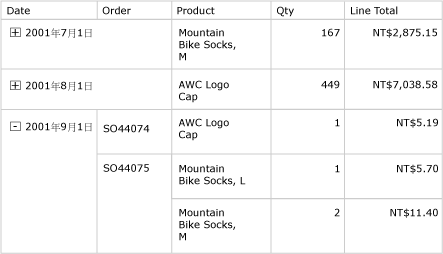

# 資料表 (報表產生器及 SSRS)
 在 [!INCLUDE[ssRSnoversion_md](../../includes/ssrsnoversion-md.md)]分頁報表中，您可以使用資料表顯示詳細資料、群組資料，或兩者的組合。   
   
 您可以依單一欄位、多個欄位或透過撰寫自己的運算式來分組資料。 您可以建立巢狀群組或獨立、相鄰的群組。 若要顯示群組資料的彙總值，將總計加入到群組中。 格式化資料列和資料行以反白顯示您要強調的資料。 您可以一開始隱藏詳細資料或群組資料並加入向下鑽研切換，以便讓使用者以互動方式選擇要顯示多少資料。  
  
 若要快速地開始使用資料表，請參閱[教學課程：建立基本資料表報表 &#40;報表產生器&#41;](../../reporting-services/tutorial-creating-a-basic-table-report-report-builder.md) 或[建立基本資料表報表 &#40;SSRS 教學課程&#41;](../../reporting-services/create-a-basic-table-report-ssrs-tutorial.md)。  
  
> [!NOTE]  
>  您可以將資料表當做報表組件，與報表分開發行。 深入了解 [報表組件](../../reporting-services/report-design/report-parts-report-builder-and-ssrs.md)。  
  
  
##   加入資料表以顯示詳細資料  
 將資料表從功能區上的 [插入] 索引標籤加入至設計介面。 您可以使用「資料表或矩陣精靈」(包括建立資料來源連接和資料集與設定資料表) 來加入資料表，或根據您可以手動設定的資料表範本來加入資料表。  
  
> [!NOTE]  
>  您只能在報表產生器中使用此精靈。  
  
 為從開始到結束描述如何設定資料表，本主題使用資料表範本。  
  
 根據預設，新的資料表有固定數目的資料行，其中的標頭資料列供標籤使用，而資料列供詳細資料使用。 下圖顯示加入到設計介面中的新資料表。  
  
   
  
 當您選取資料表時，資料列和資料行控點會出現在資料表的外部，而方括號會出現在資料格的內部。 資料列控點顯示的圖形可協助您了解每個資料列的用途。 方括號表示所選資料格的群組成員資格。 下圖顯示預設資料表中選取的空資料格。  
  
   
  
 資料列的資料列控制代碼會顯示詳細資料符號 ()。 若要在這些資料列上顯示資料，將欄位從 [報表資料] 窗格拖曳到標頭資料列或詳細資料列的資料表資料格中。 兩個資料列會同時填入。 若要加入其他資料行，將欄位拖曳到資料表中，直到您看到插入點為止。 將資料集欄位加入到資料表之後，您可以變更日期和貨幣的預設格式來控制它們顯示在報表中的方式。 下圖顯示包含這些欄位的資料表資料區域：Date、Order、Product、Qty 和 Line Total。  
  
   
  
 在預覽中檢視報表來檢查您的設計。 必要時，資料表會向下展開頁面。 標籤資料列和檢視資料列會分別針對資料集查詢結果集中的每個資料列顯示一次。 訂單中銷售的每個產品以及項目的數量和產品線總計都會列在個別的資料列中，如下圖所示：  
  
   
  
 您開始使用的資料表是以 Tablix 資料區為基礎的範本。 您可以加入基礎 Tablix 資料區所支援的功能來加強資料表的設計。 如需詳細資訊，請參閱 [控制報表頁面上的 Tablix 資料區顯示 &#40;報表產生器及 SSRS&#41;](../../reporting-services/report-design/controlling-the-tablix-data-region-display-on-a-report-page.md)。 您也可以加入資料列群組、資料行群組，以及加入或移除詳細資料群組，以便繼續開發您的資料表。 如需詳細資訊，請參閱[探索 Tablix 資料區的彈性 &#40;報表產生器及 SSRS&#41;](../../reporting-services/report-design/exploring-the-flexibility-of-a-tablix-data-region-report-builder-and-ssrs.md)。  
  
### 加入詳細資料的資料表  
 若要加入總計，選取包含數值資料的資料格，然後使用快速鍵功能表自動加入數值欄位之詳細資料的標籤和總計。 您也可以手動指定其他標籤和總計。 下圖顯示同時包含自動和手動指定之總計的一般總計：  
  
   
  
 在預覽中，報表會針對資料集查詢結果集中的每個資料列顯示一次標頭資料列和詳細資料列，而且該報表會顯示總計資料列。 下圖顯示資料表的最後幾個資料列，包括總計資料列。  
  
   
  
 如需詳細資訊，請參閱[將總計加入到群組或 Tablix 資料區 &#40;報表產生器及 SSRS&#41;](../../reporting-services/report-design/add-a-total-to-a-group-or-tablix-data-region-report-builder-and-ssrs.md)。  
  
##   將資料列群組加入到資料表  
 如同您可以將欄位從 [報表資料] 窗格拖曳到資料格來顯示詳細資料，您也可以將欄位拖曳到 [群組] 窗格來加入群組。 若是資料表，將欄位拖曳到 [資料列群組] 窗格。 加入群組之後，資料表會在要顯示群組值之資料列群組區域的新資料行中，自動加入資料格。 如需詳細資訊，請參閱 [Tablix 資料區的區域 &#40;報表產生器及 SSRS&#41;](../../reporting-services/report-design/tablix-data-region-areas-report-builder-and-ssrs.md)。  
  
 下圖顯示 [設計] 檢視中包含兩個巢狀資料列群組的資料表。 若要建立資料列群組，拖曳 Order 欄位，然後將 Date 欄位拖曳到 [資料列群組] 窗格，並插入每個群組，當做現有群組的父系。 此圖表顯示一個以日期為基礎的父群組與一個以訂單號碼為基礎的子群組，以及依預設定義的詳細資料群組。  
  
   
  
 在預覽中，報表會顯示先依日期，然後依訂單分組的訂單資料，如下圖所示。  
  
   
  
 顯示群組資料的另一種方法是讓群組階層縮排，以顯示群組的巢狀關聯性，而不是在其自己的資料行中呈現每個值。 這種格式樣式稱為階梯狀報表。 如需如何將群組資訊格式化為階梯狀報表的詳細資訊，請參閱[建立階梯狀報表 &#40;報表產生器及 SSRS&#41;](../../reporting-services/report-design/create-a-stepped-report-report-builder-and-ssrs.md)。  
  
### 將總計加入到資料列群組  
 若要顯示群組的總計，您可以使用內容相關的 **[加入總計]** 命令。 若是資料列群組，[加入總計] 命令會加入群組外的資料列，讓該資料列僅針對群組重複一次。 若是巢狀群組，子群組的總計資料列位於子群組外部，但位於父群組內部。 在此種情況下，針對子群組設定總計資料列的背景色彩以便與詳細資料列區隔相當實用。 您也可以使用不同的背景色彩區隔資料表頁首與頁尾資料列。 下圖顯示根據訂單號碼，針對群組加入總計資料列的資料表。  
  
   
  
 當您檢視報表時，顯示訂單小計的資料列會針對每個訂單號碼重複一次。 資料表頁尾會顯示所有日期的總計。 在下圖中，最後幾個資料列顯示最後三個詳細資料列、最後一個訂單號碼 SO71952 的小計，以及資料表中所有日期的總計。  
  
   
  
 如需詳細資訊，請參閱[將總計加入到群組或 Tablix 資料區 &#40;報表產生器及 SSRS&#41;](../../reporting-services/report-design/add-a-total-to-a-group-or-tablix-data-region-report-builder-and-ssrs.md)。  
  
##   移除或隱藏詳細資料列  
 預覽報表中的資料表之後，您可能會決定移除現有的詳細資料列。 或者，您可能決定依預設隱藏這些資料列，然後讓使用者在檢視更多或更少詳細資料之間切換，就像在向下鑽研報表中一樣。  
  
 若要從資料表移除詳細資料列，請使用 [群組] 窗格。 選取詳細資料群組，然後使用快速鍵功能表刪除顯示詳細資料的群組和資料列。 下圖顯示依日期和訂單號碼分組之資料表的設計檢視，但是其中沒有詳細資料列。 在此資料表中沒有加入任何總計資料列。  
  
   
  
 刪除詳細資料列之後，這些值的範圍為資料列群組。 詳細資料不再顯示。  
  
> [!NOTE]  
>  確認移除詳細資料資料列之後，每個資料格中的運算式都會在適當時指定彙總運算式。 如有必要，編輯運算式以指定所需的彙總函式。  
  
 下圖顯示 [預覽] 中的這個報表。  
  
   
  
 若要從資料表加入或移除資料列，請參閱[插入或刪除資料列 &#40;報表產生器及 SSRS&#41;](../../reporting-services/report-design/insert-or-delete-a-row-report-builder-and-ssrs.md)。  
  
 您也可以在一開始檢視報表時隱藏詳細資料列。 若要這樣做，您可以建立一個向下鑽研報表，其中只會顯示父群組資料。 針對每個內部群組 (包括詳細資料群組)，將可見性切換加入到包含群組的群組資料格。 例如，若是詳細資料群組，將切換加入到顯示訂單號碼群組值的文字方塊中。 若是訂單號碼群組，將切換加入到顯示日期群組值的文字方塊中。 下圖顯示 2001 年 9 月 1 日的資料列，展開後可顯示前幾筆訂單。  
  
   
  
 如需詳細資訊，請參閱 [將展開或摺疊動作加入項目中 &#40;報表產生器及 SSRS&#41;](../../reporting-services/report-design/add-an-expand-or-collapse-action-to-an-item-report-builder-and-ssrs.md)。  
  
## 另請參閱  
 [篩選、分組和排序資料 &#40;報表產生器及 SSRS&#41;](../../reporting-services/report-design/filter-group-and-sort-data-report-builder-and-ssrs.md)   
 [運算式 &#40;報表產生器及 SSRS&#41;](../../reporting-services/report-design/expressions-report-builder-and-ssrs.md)   
 [運算式範例 &#40;報表產生器及 SSRS&#41;](../../reporting-services/report-design/expression-examples-report-builder-and-ssrs.md)   
 [資料表、矩陣和清單 &#40;報表產生器及 SSRS&#41;](../../reporting-services/report-design/tables-matrices-and-lists-report-builder-and-ssrs.md)  
  
  
