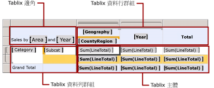
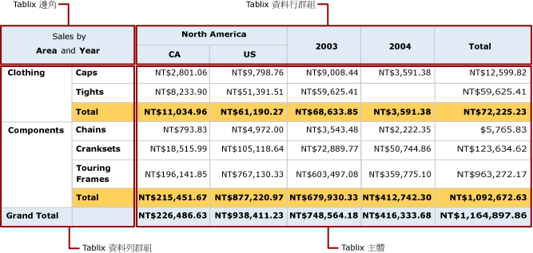

# Tablix 資料區的區域 (報表產生器及 SSRS)
 在 [!INCLUDE[ssRSnoversion_md](../../includes/ssrsnoversion-md.md)] 分頁報表中，Tablix 資料區具有四個包含 Tablix 資料格的區域︰   
* 邊角  
* 資料列群組區域  
* 資料行群組區域  
* 主體   
  
每個區域中的資料格都有一個不同的函數。 您可以將資料格加入至 Tablix 主體區域，以便顯示詳細資料和分組資料。 當您建立群組以顯示群組執行個體值時，報表產生器和報表設計師會將資料格加入至資料列群組或資料行群組區域。 當資料列群組和資料行群組都存在時，報表產生器和報表設計師會建立 Tablix 邊角資料格。  
  
在設計介面上，虛線會指出所選取之 Tablix 資料區的四個區域。 下圖顯示 Tablix 區域中，具有以類別目錄和子類別目錄為基礎的巢狀資料列群組、以地理和國家 (地區) 為基礎的巢狀資料行群組，以及以年為基礎的相鄰資料行群組的區域。  
  
   
  
 下列清單具有每個區域的描述：  
  
-   **Tablix 邊角區域**。 (選擇性) Tablix 邊角位於左上角，如果是由右至左 (RTL) 配置則在右上角。 當您同時將資料列群組和資料行群組加入至 Tablix 資料區時，就會自動建立這個區域。 在這個區域中，您可以合併資料格，並且加入標籤或嵌入其他的報表項目。 在此圖中，邊角中的合併資料格會顯示 Sales by Area and Year 標籤。  
  
-   **Tablix 資料行群組區域**。 (選擇性) Tablix 資料行群組位於右上角 (如果是 RTL 配置，則在左上角)。 當您加入資料行群組時，就會自動建立這個區域。 這個區域中的資料格代表資料行群組架構的成員，並會顯示資料行群組的執行個體值。 在此圖中，顯示 [地理] 和 [國家區域] 的資料格為巢狀資料行群組，而顯示 [年] 的資料格則是相鄰的資料行群組。 資料行 [總計] 顯示每個資料列的彙總總計。  
  
-   **Tablix 資料列群組區域**。 (選擇性) Tablix 資料列群組位於左下角 (如果是 RTL 配置，則在右下角)。 當您加入資料列群組時，就會自動建立這個區域。 這個區域中的資料格代表資料列群組架構的成員，並會顯示資料列群組的執行個體值。 在此圖中，顯示 [Category] 和 [Subcat] 的資料格是巢狀資料列群組。 [Subcat] 下方的 [總計] 資料列會重複用於每個類別群組，以顯示每個資料行的彙總小計。 全部總計資料列則會顯示所有類別的總計。  
  
-   **Tablix 主體區域**。 Tablix 主體位於右下角 (如果是 RTL 配置，則在左下角)。 Tablix 主體會顯示詳細資料和分組資料。 在這個範例中只會使用彙總的資料。 運算式的範圍是由文字方塊所屬的最內部群組決定。 當 Tablix 主體中的資料格是詳細資料列的成員時，它們會顯示詳細資料。當這些資料格是與群組相關聯的資料列或資料行的成員時，則會顯示彙總資料。 依預設，群組資料列或資料行中含有簡單運算式 (不包含彙總函式) 的資料格，會評估為群組中的第一個值。 在此圖中，資料格會顯示所有銷售訂單產品線總數的彙總總計。  
  
 當報表執行時，資料行群組會向右展開 (如果 Tablix 資料區的 Direction 屬性設定為 RTL，則向左展開)，資料行若有群組運算式的唯一值，就會展開。 資料列群組會在頁面上向下展開。 如需詳細資訊，請參閱 [Tablix 資料區資料格、資料列及資料行 &#40;報表產生器及 SSRS&#41;](../../reporting-services/report-design/tablix-data-region-cells-rows-and-columns-report-builder-and-ssrs.md)。  
  
 下圖顯示預覽中的 Tablix 資料區。  
  
   
  
 資料列群組區域會為 Clothing 和 Components 顯示兩個類別目錄群組執行個體。 資料行群組會為 North America 顯示地理群組執行個體，其中具有 Canada (CA) 和 United States (US) 的兩個巢狀國家 (地區) 群組執行個體。 另外，相鄰的資料行會為 2003 和 2004 顯示兩個年群組執行個體。 [總計] 資料行資料列會顯示資料列總計；類別目錄群組所重複的總計資料列會顯示子類別目錄總計，而全部總計資料列則會針對資料區域顯示一次類別目錄的總計。  
  
## 另請參閱  
 [資料表、矩陣和清單 &#40;報表產生器及 SSRS&#41;](../../reporting-services/report-design/tables-matrices-and-lists-report-builder-and-ssrs.md)   
 [報表產生器教學課程](../../reporting-services/report-builder-tutorials.md)   
 [資料表 &#40;報表產生器及 SSRS&#41;](../../reporting-services/report-design/tables-report-builder-and-ssrs.md)   
 [建立矩陣](../../reporting-services/report-design/create-a-matrix-report-builder-and-ssrs.md)   
 [使用清單建立發票和表單](../../reporting-services/report-design/create-invoices-and-forms-with-lists-report-builder-and-ssrs.md)   
 [Tablix 資料區 &#40;報表產生器及 SSRS&#41;](../../reporting-services/report-design/tablix-data-region-report-builder-and-ssrs.md)  
  
  
