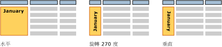

# 文字方塊 (報表產生器及 SSRS)
  當您考慮文字方塊時，可能會考慮包含介面 (如在 [!INCLUDE[msCoName](../../includes/msconame-md.md)] Office PowerPoint 內) 文字的獨立方塊。 在 [!INCLUDE[ssRSnoversion_md](../../includes/ssrsnoversion-md.md)] 分頁報表中，有些文字方塊就像那樣，而且這些文字方塊可以根據運算式，顯示標題、描述與標籤或動態文字的靜態文字。 但是，資料表或矩陣 (Tablix 資料區) 中的每個資料格也都包含一個文字方塊，您可以使用和報表中之獨立文字方塊的相同方式進行格式化。  
  
> [!NOTE]  
>  如果將報表資料集欄位值直接拖曳到報表設計介面，或報表設計介面上的文字方塊，則您在執行報表時，只能看到結果集中的第一個值。 若要查看欄位的值，您需要建立資料表、矩陣或清單資料區，並且將欄位拖曳到資料區中的資料格。 如此一來，當您執行報表時，將會看到該欄位中的所有值。  
  
 若要以自由形式配置顯示重複的文字，請建立清單資料區，並將文字方塊放置在其中。 當您想要重複多個值的形式時，請使用清單，例如，客戶發票表單會針對每個客戶重複一次。 深入了解 [creating invoices and forms with lists](../../reporting-services/report-design/create-invoices-and-forms-with-lists-report-builder-and-ssrs.md)(建立發票和表單的清單)。  
  
 當您想要控制文字方塊配置和最後一個文字方塊下的空白字元時，使用矩形容器。 如需詳細資訊，請參閱[矩形和線條 &#40;報表產生器及 SSRS&#41;](../../reporting-services/report-design/rectangles-and-lines-report-builder-and-ssrs.md)。  
  
 文字方塊中的運算式可以包含指向資料庫欄位的常值文字，也可以計算資料。 所有運算式都會顯示為預留位置文字，讓您可以格式化數字、色彩和其他外觀屬性。 您也可以在相同的文字方塊中結合預留位置與常值文字。  
  
 您可以在任何單一文字方塊中，使用多個字型、色彩、樣式和動作格式化文字。 如需詳細資訊，請參閱 [格式化文字和預留位置 &#40;報表產生器及 SSRS&#41;](../../reporting-services/report-design/formatting-text-and-placeholders-report-builder-and-ssrs.md)(建立發票和表單的清單)。  
  
> [!NOTE]  
>  [!INCLUDE[ssRBRDDup](../../includes/ssrbrddup-md.md)]  
  
##   文字方塊的擴張和縮小  
 根據預設，文字方塊是固定的大小。 您可以讓文字方塊根據其內容垂直縮小或擴張。 如需詳細資訊，請參閱 [允許文字方塊擴張或縮小 &#40;報表產生器及 SSRS&#41;](../../reporting-services/report-design/allow-a-text-box-to-grow-or-shrink-report-builder-and-ssrs.md)(建立發票和表單的清單)。  
  
## 旋轉文字方塊  
 旋轉文字方塊方向可協助您建立更容易閱讀的報表、支援地區設定特定的文字方向、在固定頁面大小的列印報表中容納更多資料行，並以更受觀迎的圖形方式建立報表。 文字方塊可以向不同的方向旋轉：水平、垂直(90 度旋轉)，或旋轉 270 度。 垂直選項最常用於由上往下書寫的東亞洲語言。 在大部分轉譯器中，垂直選項會處理字符旋轉屬性，以便讓文字由上而下的方向書寫，但字元並不會側躺。 針對其他語言，在垂直和 270 度選項中，文字是側躺的。  
  
 您可以旋轉包含靜態文字、來自報表資料集的欄位，或計算之資料等項目的文字方塊。 文字方塊可以在報表主體、資料表或矩陣，或報表首及尾上獨立呈現。  
  
 下圖顯示依月份群組的三種版本資料表報表。 包含月份值的文字方塊使用不同的文字方塊方向。  
  
   
  
 方向是在文字方塊上設定，並套用至方塊中的所有文字。 您無法針對文字方塊的各個部分指定不同的方向。  
  
 若要開始，請參閱下文中關於旋轉文字的章節：[教學課程：對文字進行格式化 &#40;報表產生器&#41;](../../reporting-services/tutorial-format-text-report-builder.md)，並參閱[設定文字方塊方向 &#40;報表產生器及 SSRS&#41;](../../reporting-services/report-design/set-text-box-orientation-report-builder-and-ssrs.md)。  
  
##   如何主題  
 [加入、移動或刪除文字方塊 &#40;報表產生器及 SSRS&#41;](../../reporting-services/report-design/add-move-or-delete-a-text-box-report-builder-and-ssrs.md)  
  
 [格式化文字方塊中的文字 &#40;報表產生器及 SSRS&#41;](../../reporting-services/report-design/format-text-in-a-text-box-report-builder-and-ssrs.md)  
  
 [設定文字方塊方向 &#40;報表產生器及 SSRS&#41;](../../reporting-services/report-design/set-text-box-orientation-report-builder-and-ssrs.md)  
  
 [允許文字方塊擴張或縮小 &#40;報表產生器及 SSRS&#41;](../../reporting-services/report-design/allow-a-text-box-to-grow-or-shrink-report-builder-and-ssrs.md)  
  
## 另請參閱  
 [格式化文字和預留位置 &#40;報表產生器及 SSRS&#41;](../../reporting-services/report-design/formatting-text-and-placeholders-report-builder-and-ssrs.md)   
 [格式化數字和日期 &#40;報表產生器及 SSRS&#41;](../../reporting-services/report-design/formatting-numbers-and-dates-report-builder-and-ssrs.md)  
  
  
