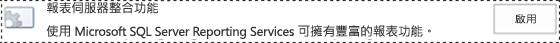
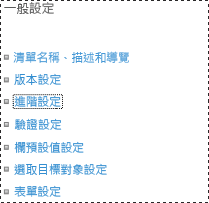
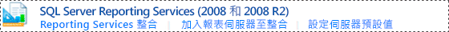
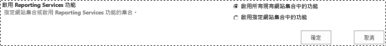

# 將 Reporting Services 內容類型新增至 SharePoint 文件庫

[!INCLUDE[ssrs-appliesto](../../includes/ssrs-appliesto.md)] [!INCLUDE[ssrs-appliesto-2016](../../includes/ssrs-appliesto-2016.md)] [!INCLUDE[ssrs-appliesto-sharepoint-2013-2016i](../../includes/ssrs-appliesto-sharepoint-2013-2016.md)] [!INCLUDE[ssrs-appliesto-not-pbirsi](../../includes/ssrs-appliesto-not-pbirs.md)]

[!INCLUDE [ssrs-previous-versions](../../includes/ssrs-previous-versions.md)]

[!INCLUDE[ssRSnoversion](../../includes/ssrsnoversion-md.md)] 會提供預先定義的 SharePoint 內容類型，可用來管理共用資料來源檔案 (.rsds)、報表模型檔案 (.smdl)，以及報表產生器的報表定義檔案 (.rdl)。 將 **[報表產生器報表]**、 **[報表模型]**和 **[報表資料來源]** 內容類型加入至文件庫會啟用 **[新增]** 命令，讓您能夠建立該類型的新文件。

> [!NOTE]
> SQL Server 2016 後即不再提供 Reporting Services 與 SharePoint 的整合。

 若要將內容類型加入至文件庫，您必須是網站管理員或具有「完整控制」等級的權限。  
  
 系統會針對從下列網站範本類型建立的現有網站集合，在所有文件庫中自動啟用 [!INCLUDE[ssRSnoversion](../../includes/ssrsnoversion-md.md)] 內容類型與內容類型管理：  
  
-   **商業智慧中心**  
  
 在 [!INCLUDE[ssRSnoversion](../../includes/ssrsnoversion-md.md)] 整合之後建立的網站將不會啟用 [!INCLUDE[ssRSnoversion](../../includes/ssrsnoversion-md.md)] 內容類型。  
  
> [!TIP]  
>  如果您先前 **沒有** 設定文件庫的內容類型，請先啟用內容類型的管理，然後再啟用 [!INCLUDE[ssRSnoversion](../../includes/ssrsnoversion-md.md)] 內容類型。 請參閱在單一文件庫中啟用內容類型管理的程序。  
  
 **短片** [(SSRS) Enabling Content Types in SharePoint2010.wmv](http://www.youtube.com/watch?v=yqhm3DrtT1w) (http://www.youtube.com/watch?v=yqhm3DrtT1w)。  
  
 **本主題內容：**  
  
-   [在現有 BI 中心的所有文件庫中啟用內容類型](#bkmk_enable_all)  
  
-   [啟用單一文件庫的內容類型管理 (SharePoint 2013)](#bkmk_enable_content_management)  
  
-   [加入 Reporting Services 內容類型 (SharePoint 2013)](#bkmk_add_single)  
  
-   [啟用單一文件庫的內容類型管理 (SharePoint 2010)](#bkmk_enable_content_management_2010)  
  
-   [若要加入報表伺服器內容類型 (SharePoint 2010)](#bkmk_add_single_2010)  
  
-   [啟用多個 BI 網站的內容類型與內容管理](#bkmk_enable_multiple_sites)  
  
##   在現有 BI 中心的所有文件庫中啟用內容類型  
  
1.  若要在現有 **商業智慧中心** 網站的所有文件庫中啟用內容類型與內容管理，您可以切換 [!INCLUDE[ssRSnoversion](../../includes/ssrsnoversion-md.md)] 整合功能。  
  
2.  前往 **[網站設定]**。  
  
    -   在 SharePoint 2013，按一下 **[設定]** 圖示。   
  
    -   在 SharePoint 2010，按一下 **[網站動作]**，然後按一下 **[網站設定]**。  
  
3.  按一下 **[網站集合功能]**。  
  
4.  尋找 **[報表伺服器整合功能]** 並按一下 **[停用]**。  
  
       
  
5.  重新整理瀏覽器，然後按一下 **[報表伺服器整合功能]** 的 **[啟動]**。  
  
       
  
##   啟用單一文件庫的內容類型管理 (SharePoint 2013)  
  
1.  開啟要啟用多個內容類型的文件庫。  
  
2.  在功能區中，按一下 **[文件庫]** 。  
  
       
  
3.  在 **[文件庫]** 功能區中，按一下 **[文件庫設定]**。 如果看不到 **[文件庫設定]** 或按鈕已停用，表示您沒有設定文件庫設定 (包括內容類型) 的權限。  
  
       
  
4.  按一下 **[一般設定]** 區段中的 **[進階設定]**。  
  
       
  
5.  在 **[內容類型]** 區段中，選取 **[是]** 允許內容類型的管理。  
  
6.  按一下 **[確定]**。  
  
##   加入 Reporting Services 內容類型 (SharePoint 2013)  
  
1.  開啟要加入 Reporting Services 內容類型的程式庫。  
  
2.  在功能區中，按一下 **[文件庫]**。  
  
3.  按一下 **[文件庫設定]**。  
  
4.  在 **[內容類型]**底下，按一下 **[從現有的網站內容類型新增]**。  
  
5.  在 **[從下列位置選取網站內容類型]**，選取 **[SQL Server Reporting Services 內容類型]**。  
  
6.  在 **[可用的網站內容類型]** 清單中，按一下 **[報表產生器]**，然後按一下 **[加入]** 將選取的內容類型移至 **[要新增的內容類型]** 清單。  
  
7.  若要加入 **[報表模型]** 和 **[報表資料來源]** 內容類型，請重複上一個步驟。  
  
8.  當您完成新增內容類型後，按一下 **[確定]**。  
  
    > [!NOTE]  
    >  如果在 [新增內容類型] 頁面上看不到 [!INCLUDE[ssRSnoversion](../../includes/ssrsnoversion-md.md)] 內容類型群組 [SQL Server Reporting Services 內容類型]，表示下列有一條件成立：  
  
    -   尚未安裝適用於 SharePoint 產品的 [!INCLUDE[ssRSnoversion](../../includes/ssrsnoversion-md.md)] 增益集。 如需詳細資訊，請參閱 [安裝或解除安裝 SharePoint 的 Reporting Services 增益集](../../reporting-services/install-windows/install-or-uninstall-the-reporting-services-add-in-for-sharepoint.md)。 本主題包含安裝增益集的資訊，並逐步帶領您進行增益集中僅檔案部分的安裝，以解決問題。  
  
    -   安裝了增益集，但網站集合功能的 [報表伺服器整合功能] 未啟用。 請確認 [網站設定] 中的網站集合功能。  
  
    -   所有 [!INCLUDE[ssRSnoversion](../../includes/ssrsnoversion-md.md)] 內容類型已經加入至文件庫。 如果所有內容類型是文件庫的一部分，則該群組已從 **[新增內容類型]** 頁面中移除。 如果您刪除一個或多個 [!INCLUDE[ssRSnoversion](../../includes/ssrsnoversion-md.md)] 內容類型，就會在 **[新增內容類型]** 頁面上看到群組 **[SQL Server Reporting Services 內容類型]** 。  
  
##   啟用單一文件庫的內容類型管理 (SharePoint 2010)  
  
1.  開啟要啟用多個內容類型的文件庫。 在文件庫功能表列上，您應該會看見下列功能表： **[新增]**、 **[上傳]**、 **[動作]**及 **[設定]**。 如果您看不到 **[設定]**，表示您沒有加入內容類型的權限。  
  
2.  在 **[文件庫工具]** 功能區中，按一下 **[文件庫]**。  
  
       
  
3.  按一下 **[設定]** 功能區群組的 **[文件庫設定]**。  
  
4.  在 **[一般設定]**底下，按一下 **[進階設定]**。  
  
5.  在 **[內容類型]** 區段中，選取 **[是]** 允許內容類型的管理。  
  
6.  按一下 **[確定]**。  
  
##   若要加入報表伺服器內容類型 (SharePoint 2010)  
  
1.  開啟要加入 Reporting Services 內容類型的程式庫。  
  
2.  按一下 **[文件庫工具]** 功能區索引標籤的 **[文件庫]**索引標籤。  
  
3.  按一下 **[設定]** 功能區群組的 **[文件庫設定]**。  
  
4.  在 **[內容類型]**底下，按一下 **[從現有的網站內容類型新增]**。  
  
5.  在 **[選取內容類型]** 區段的 **[從下列位置選取網站內容類型]**中，按一下箭號選取 **[SQL Server Reporting Services 內容類型]**。  
  
6.  在 **[可用的網站內容類型]** 清單中，按一下 **[報表產生器]**，然後按一下 **[加入]** 將選取的內容類型移至 **[要新增的內容類型]** 清單。  
  
7.  若要加入 **[報表模型]** 和 **[報表資料來源]** 內容類型，請重複上一個步驟。  
  
8.  當您完成新增內容類型後，按一下 **[確定]**。  
  
##   啟用多個 BI 網站的內容類型與內容管理  
  
1.  對於 SQL Server Reporting Services 2008 及 2008 R2 報表伺服器，您可以啟用多個商業智慧中心網站的內容類型與內容管理：  
  
2.  在 [SharePoint 管理中心]，按一下 **[一般應用程式設定]**。 在 [SQL Server Reporting Services (2008 和 2008 R2)] 區段中，按一下 [Reporting Services 整合]。  
  
       
  
3.  按一下 **[所有現有網站集合中的啟動功能]**。  
  
       
  
4.  按一下 **[確定]**。  
  
## 另請參閱  
 [報表伺服器項目的 SharePoint 網站和清單權限參考](../../reporting-services/security/sharepoint-site-and-list-permission-reference-for-report-server-items.md)   
 [啟動報表產生器](../../reporting-services/report-builder/start-report-builder.md)  
  
  
