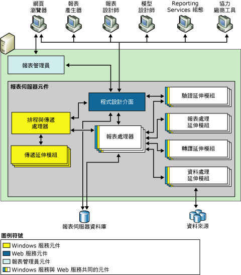
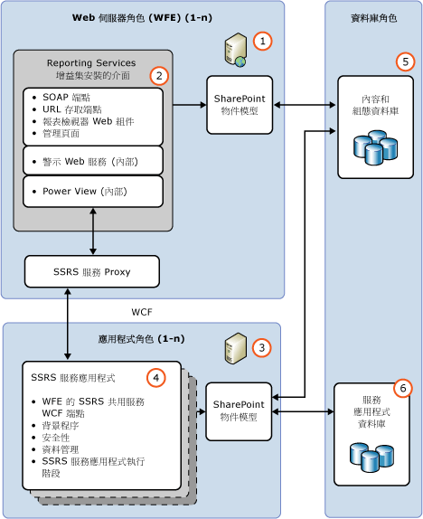

# Reporting Services 報表伺服器

[!INCLUDE[ssrs-appliesto](../../includes/ssrs-appliesto.md)] [!INCLUDE[ssrs-appliesto-2016-and-later](../../includes/ssrs-appliesto-2016-and-later.md)] [!INCLUDE[ssrs-appliesto-sharepoint-2013-2016i](../../includes/ssrs-appliesto-sharepoint-2013-2016.md)] [!INCLUDE[ssrs-appliesto-pbirsi](../../includes/ssrs-appliesto-pbirs.md)]

[!INCLUDE [ssrs-previous-versions](../../includes/ssrs-previous-versions.md)]

深入了解的中央部分[!INCLUDE[ssNoVersion](../../includes/ssnoversion-md.md)]Reporting Services 安裝。 它是由處理引擎以及擴充功能所組成，以增加功能。

> [!NOTE]
> SQL Server 2016 之後已無法再使用 reporting Services 與 SharePoint 整合。

Reporting Services 報表伺服器執行其中一種部署模式;原生模式或 SharePoint 模式。 請參閱 [SharePoint 和原生模式的功能比較](#bkmk_featuresupport) 一節中的功能比較。  
  
 **安裝：**上 Reporting Services 安裝資訊，請參閱[安裝 Reporting Services](../install-windows/install-reporting-services.md)。

## 報表伺服器模式概觀

 處理引擎 (處理器) 是報表伺服器的核心。 處理器支援報告系統的完整性，並且無法修改或擴充。 延伸模組也是處理器，但執行的是非常特殊的功能。 Reporting Services 包含一或多個預設延伸模組，每種支援的延伸模組類型。 您可以將自訂延伸模組加入到報表伺服器。 這麼做可讓您擴充報表伺服器以支援不經任何處理就支援的功能；自訂功能的範例包括支援單一登入技術、以預設轉譯延伸模組尚未處理之應用程式格式輸出報表，以及將報表傳遞到印表機或應用程式。  
  
 單一報表伺服器執行個體是由一組完整的處理器和延伸模組所定義，其中提供的端對端管理可從處理初始要求到呈現完成的報表。 報表伺服器透過其子元件處理報表要求，並為視需要存取或排程散發提供報表。  
  
 在功能上，報表伺服器能為各種資料來源提供報表撰寫經驗、報表轉譯及報表傳遞經驗，以及可延伸的驗證和授權配置。 此外，報表伺服器包含報表伺服器資料庫，可儲存已發行的報表、共用資料來源、共用資料集、報表組件、共用排程和訂閱、報表定義來源檔案、模型定義、已編譯的報表、快照集、參數，以及其他資源。 報表伺服器還提供管理經驗，可設定報表伺服器來處理報表要求、維護快照集記錄，以及管理報表、資料來源、資料集和訂閱的權限。  
  
 Reporting Services 報表伺服器支援兩種部署模式報表伺服器執行個體：  
  
-   **原生模式**： 包括 SharePoint web 組件，提供僅能透過 Reporting Services 元件的所有處理和管理能力的應用程式伺服器的報表伺服器執行所在的原生模式。 您使用 Reporting Services configuration manager 和 SQL Server Management Studio 中設定原生模式報表伺服器。  
  
-   **SharePoint 模式**：在該模式下，報表伺服器會安裝為 SharePoint 伺服器陣列的一部分。  您可以使用 PowerShell 命令或 SharePoint 內容管理頁面來部署和設定 SharePoint 模式。  
  
 SQL Server Reporting Services 中，您無法切換到另一種模式從報表伺服器。 如果您要變更環境使用的報表伺服器類型，則必須安裝所需的報表伺服器模式，然後將報表項目或報表伺服器資料庫從舊版報表伺服器複製或移動到新的報表伺服器。 這種程序通常稱為「移轉」。 移轉所需的步驟，取決於您要移轉到哪個模式以及您要從哪個版本移轉。 如需詳細資訊，請參閱＜ [Upgrade and Migrate Reporting Services](../../reporting-services/install-windows/upgrade-and-migrate-reporting-services.md)＞  
  
## SharePoint 和原生模式的功能比較
  
|功能或元件|原生模式|SharePoint 模式|  
|--------------------------|-----------------|---------------------|  
|**URL 定址**|是|SharePoint 整合模式中的 URL 定址不同。 在參考報表、報表模型、共用資料來源和資源時會使用 SharePoint URL， 而不使用報表伺服器資料夾階層。 如果您所擁有的自訂應用程式依賴原生模式報表伺服器所支援的 URL 存取，當報表伺服器設定成 SharePoint 整合時，該功能將無法再運作。   如需有關 URL 存取的詳細資訊，請參閱 [URL 存取參數參考](../../reporting-services/url-access-parameter-reference.md)|  
|**自訂安全性延伸模組**|是|Reporting Services 自訂安全性延伸模組無法部署或在報表伺服器上使用。 報表伺服器包含一個特殊用途的安全性延伸模組，每當您將報表伺服器設定為以 SharePoint 整合模式執行，就會使用此延伸模組。 此安全性延伸模組為內部元件，而且它是整合作業的必要項目。|  
|**組態管理員**|是|**\*\* 重要事項 \*\*** 組態管理員無法用來管理 SharePoint 模式報表伺服器。 請改用 SharePoint 管理中心。|  
|**報表管理員**|是|報表管理員無法用來管理 SharePoint 模式。 請使用 SharePoint 應用程式頁面。 如需詳細資訊，請參閱 [Reporting Services SharePoint 服務和服務應用程式](../../reporting-services/report-server-sharepoint/reporting-services-sharepoint-service-and-service-applications.md)。|  
|**連結報表**|是|資料分割|  
|**我的報表**|是|否|  
|**我的訂閱** 和批次方法。|是|否|  
|**資料警示**|否|是|  
|**Power View**|否|是   需要用戶端瀏覽器中的 Silverlight。 如需瀏覽器需求的詳細資訊，請參閱 [Reporting Services 和 Power View 的瀏覽器支援](../../reporting-services/browser-support-for-reporting-services-and-power-view.md)|  
|**.RDL 報表**|是|是   .RDL 報表可以在執行 Reporting Services 報表伺服器以原生模式或 SharePoint 模式。|  
|**.RDLX 報表**|否|是   Power View。RDLX 報表可以只在 Reporting Services 報表伺服器以 SharePoint 模式執行。|  
|**適用於 SharePoint 清單延伸模組的 SharePoint 使用者 Token 認證**|否|是|  
|**網際網路部署的 AAM 區域**|否|是|  
|**SharePoint 備份與復原**|否|是|  
|**ULS 記錄支援**|否|是|  
  
## 原生模式

 在原生模式中，報表伺服器是獨立的應用程式伺服器，可以提供報表和報表模型的所有檢視、管理、處理和傳遞。 這是報表伺服器執行個體的預設模式。 您可以安裝在安裝期間所設定的原生模式報表伺服器，或者，您可以在安裝程式完成時，將其設定成原生模式作業。  
  
 下圖顯示的 Reporting Services 原生模式部署的三層式架構。 它會顯示資料層的報表伺服器資料庫和資料來源、中介層的報表伺服器元件，以及展示層的用戶端應用程式和內建或自訂工具。 它會顯示伺服器元件之間的要求與資料流程，以及哪些元件會傳送內容至資料存放區與從資料存放區擷取內容。  
  
   
  
 報表伺服器會當做稱為「報表伺服器服務」的 [!INCLUDE[msCoName](../../includes/msconame-md.md)] Windows 服務實作，可主控 Web 服務、背景處理以及其他作業。 在 [服務] 主控台應用程式中，此服務會列為 SQL Server Reporting Services (MSSQLSERVER)。  
  
 協力廠商開發人員可以建立其他的延伸模組，以取代或擴充報表伺服器的處理功能。 如需了解有關應用程式開發人員可使用之程式設計介面的詳細資訊，請參閱＜ [技術參考](../../reporting-services/technical-reference-ssrs.md)＞。  
  
### 附隨 SharePoint Web 組件的原生模式

 Reporting Services 提供兩個 web 組件，您可以安裝和執行個體上註冊[!INCLUDE[winSPServ](../../includes/winspserv-md.md)]2.0 或更新版本，或[!INCLUDE[spPortalServ](../../includes/spportalserv-md.md)]2003年或更新版本。 從 SharePoint 網站，您可以使用 web 組件來尋找及檢視執行的原生模式報表伺服器上所儲存和處理報表。 這些 web 組件導入在舊版的 Reporting Services。  
  
## SharePoint 模式

 在 SharePoint 模式下，報表伺服器必須在 SharePoint 伺服器陣列內執行。 報表伺服器處理、 轉譯和管理功能來執行 Reporting Services SharePoint 共用服務和一或多個 Reporting Services 服務應用程式的 SharePoint 應用程式伺服器表示。 SharePoint 網站會針對報表伺服器內容和作業，提供前端存取。  
  
 SharePoint 模式需要：  
  
-   [!INCLUDE[SPF2010](../../includes/spf2010-md.md)] 或 [!INCLUDE[SPS2010](../../includes/sps2010-md.md)]。  
  
-   適當版本的 Reporting Services 增益集適用於 SharePoint 2010 產品。  
  
-   SharePoint 應用程式與安裝 Reporting Services 共用的服務和至少一個 Reporting Services 服務應用程式伺服器。  
  
 下圖顯示 SharePoint 模式 Reporting Services 環境：  
  
   
  
||Description|  
|-|-----------------|  
|**(1)**|Web 伺服器或 Web 前端 (WFE)。 Reporting Services 增益集必須安裝在您要使用 web 應用程式功能，例如檢視報表或 Reporting Services 管理工作，例如管理資料來源或訂閱頁面每個 web 伺服器上。|  
|**(2)**|增益集安裝用戶端通訊的應用程式伺服器，透過 Reporting Services 服務 proxy 的 URL 和 SOAP 的端點。|  
|**(3)**|執行 Reporting Services 共用的服務應用程式伺服器。 向外延展報表處理是在 SharePoint 伺服器陣列，並加入其他應用程式伺服器的 Reporting Services 服務的管理。|  
|**(4)**|您可以建立多個 Reporting Services 服務應用程式搭配不同的組態，包括權限、 電子郵件、 proxy、 和訂用帳戶。|  
|**(5)**|報表、資料來源和其他項目都儲存在 SharePoint 內容資料庫中。|  
|**(6)**|Reporting Services 服務應用程式建立三個資料庫的報表伺服器、 暫存和資料警示功能。 套用至所有 SSRS 服務應用程式的組態設定都會儲存在 **RSReportserver.config** 檔案中。|  
  
## 報表處理序和排程與傳遞處理序

 報表伺服器包含兩個處理引擎，這兩個引擎會執行初步與中繼的報表處理，以及排程與傳遞作業。 報表處理器會擷取報表定義或模型、將配置資訊與資料處理延伸模組中的資料結合，以及使用要求的格式來轉譯。 排程與傳遞處理序會處理從排程觸發的報表，並將報表傳遞至目標目的地。  
  
## 報表伺服器資料庫

 報表伺服器是無狀態伺服器，它會將所有屬性、物件與中繼資料儲存在 [!INCLUDE[ssNoVersion](../../includes/ssnoversion-md.md)] 資料庫中。 儲存的資料包括已發行的報表、已編譯的報表、報表模型，以及資料夾階層，該階層會提供報表伺服器所管理之所有項目的定址。 報表伺服器資料庫可以在單一的 Reporting Services 安裝，或屬於向外延展部署的多部報表伺服器提供內部儲存體。 如果您設定要在 SharePoint 產品或技術的大型部署中執行的報表伺服器，報表伺服器除了報表伺服器資料庫之外，還會使用 SharePoint 資料庫。 如需有關在 Reporting Services 中使用之資料存放區的詳細資訊，請參閱[報表伺服器資料庫 &#40;SSRS 原生模式&#41;](../../reporting-services/report-server/report-server-database-ssrs-native-mode.md)。  
  
## 驗證、轉譯、資料和傳遞延伸模組

 報表伺服器支援以下類型的延伸模組：驗證延伸模組、資料處理延伸模組、報表處理延伸模組、轉譯延伸模組及傳遞延伸模組。 報表伺服器至少需要一個驗證延伸模組、資料處理延伸模組和轉譯延伸模組。 傳遞與自訂報表處理延伸模組是選擇性的，但是您若要支援報表散發或自訂控制項，則是必要的。  
  
 Reporting Services 提供預設的延伸模組，讓您可以使用所有伺服器功能，而不必開發自訂元件。 下表描述提供可提供現成功能之完整報表伺服器執行個體的預設延伸模組：  
  
|型別|預設值|  
|----------|-------------|  
|驗證|預設報表伺服器執行個體支援 Windows 驗證，包括模擬和委派功能 (如果有在您的網域中啟用)。|  
|資料處理|預設報表伺服器執行個體包括用於 [!INCLUDE[ssNoVersion](../../includes/ssnoversion-md.md)]、 [!INCLUDE[ssASnoversion](../../includes/ssasnoversion-md.md)]、Oracle、Hyperion Essbase、SAPBW、OLE DB、Parallel Data Warehouse 和 ODBC 資料來源的資料處理延伸模組。|  
|轉譯|預設報表伺服器執行個體包括用於 HTML、Excel、CSV、XML、影像、Word、SharePoint 清單和 PDF 的轉譯延伸模組。|  
|傳遞|預設報表伺服器執行個體包括電子郵件傳遞延伸模組與檔案共用傳遞延伸模組。 如果報表伺服器設定為 SharePoint 整合，您就可以使用將報表儲存至 SharePoint 文件庫的傳遞延伸模組。|  
  
> [!NOTE]  
>  Reporting Services 包括一組完整的工具和應用程式，讓您可以用以管理伺服器、建立內容，以及讓該內容提供給您組織的使用者使用。  
  
## 相關工作

 下列主題提供有關安裝、使用和維護報表伺服器的詳細資訊：  
  
|工作|連結|  
|----------|----------|  
|檢閱硬體及軟體需求。|第 1 課：建立 Windows Azure 儲存體物件[Hardware and Software Requirements for Reporting Services in SharePoint Mode](http://msdn.microsoft.com/library/ed91877d-4f74-4266-a932-b824b4810c99)。|  
|以 SharePoint 模式安裝 Reporting Services。|[安裝適用於 SharePoint 2010 的 Reporting Services SharePoint 模式](http://msdn.microsoft.com/47efa72e-1735-4387-8485-f8994fb08c8c)|  
|如果您是 Web 開發者，或您有建立階層式樣式表的專業知識，您可以修改預設樣式 (自行負責風險)，來變更工具列或報表管理員的色彩、字型和配置。 此版本未收錄預設樣式表或樣式表的修改指示。|[自訂 HTML 檢視器及報表管理員的樣式表](http://msdn.microsoft.com/library/df805cff-b1de-4062-b2ac-423f37390fbd)|  
|熟悉 HTML 樣式和階層式樣式表 (CSS) 的 Web 開發人員可以使用本主題的資訊來判斷哪些檔案可修改，以便自訂報表管理員的外觀。|[設定入口網站傳遞自訂驗證 Cookie](assetid:///91aeb053-149e-4562-ae4c-a688d0e1b2ba)|  
|說明如何針對報表伺服器 Web 服務和 Windows 服務微調記憶體設定。|[設定報表伺服器應用程式的可用記憶體](../../reporting-services/report-server/configure-available-memory-for-report-server-applications.md)|  
|說明建議的設定步驟為遠端管理的報表伺服器。|[設定報表伺服器來進行遠端管理](../../reporting-services/report-server/configure-a-report-server-for-remote-administration.md)|  
| 提供有關在原生報表伺服器執行個體上設定 [我的報表] 可用性的指示。|[啟用與停用我的報表](../../reporting-services/report-server/enable-and-disable-my-reports.md)|  
|提供有關設定 RSClientPrint 控制項，以便在支援的瀏覽器內部提供列印功能的指示。 如需瀏覽器需求的詳細資訊，請參閱 [Reporting Services 和 Power View 的瀏覽器支援](../../reporting-services/browser-support-for-reporting-services-and-power-view.md)。|[啟用和停用 Reporting Services 的用戶端列印功能](../../reporting-services/report-server/enable-and-disable-client-side-printing-for-reporting-services.md)|  

## 後續的步驟

[Reporting Services 延伸模組](../../reporting-services/extensions/reporting-services-extensions.md)   
[Reporting Services 工具](../../reporting-services/tools/reporting-services-tools.md)   
[訂閱與傳遞 &#40;Reporting Services&#41;](../../reporting-services/subscriptions/subscriptions-and-delivery-reporting-services.md)   
[報表伺服器資料庫 &#40;SSRS 原生模式&#41;](../../reporting-services/report-server/report-server-database-ssrs-native-mode.md)   
[實作安全性延伸模組](../../reporting-services/extensions/security-extension/implementing-a-security-extension.md)   
[實作資料處理延伸模組](../../reporting-services/extensions/data-processing/implementing-a-data-processing-extension.md)   
[Reporting Services 支援的資料來源 &#40;SSRS&#41;](../../reporting-services/report-data/data-sources-supported-by-reporting-services-ssrs.md)   

更多問題嗎？ [請嘗試詢問 Reporting Services 論壇](http://go.microsoft.com/fwlink/?LinkId=620231)
