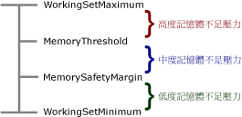

# <a name="configure-available-memory-for-report-server-applications"></a>設定報表伺服器應用程式的可用記憶體
  雖然 [!INCLUDE[ssRSnoversion](../../includes/ssrsnoversion-md.md)] 可以使用所有可用的記憶體，但是您可以透過針對配置給 [!INCLUDE[ssRSnoversion](../../includes/ssrsnoversion-md.md)] 伺服器應用程式的記憶體資源總數設定上限，覆寫預設行為。 此外，您也可以設定臨界值，讓報表伺服器根據系統處於低度、中度或嚴重記憶體不足壓力的情況，變更其設定優先權和處理要求的方式。 在低度記憶體不足壓力層級時，報表伺服器的回應方式為提供稍高優先權給互動式或視需要報表處理。 在高度記憶體不足壓力層級時，報表伺服器會運用有限的資源並使用多種技術來維持運作。  
  
 本主題將描述您可以指定的組態設定，以及當記憶體不足壓力成為處理要求的因素時，伺服器如何回應。  
  
## <a name="memory-management-policies"></a>記憶體管理原則  
 [!INCLUDE[ssRSnoversion](../../includes/ssrsnoversion-md.md)] 會透過調整配置給特定應用程式和處理要求類型的記憶體數量，回應系統資源條件約束。 在報表伺服器服務中執行而且受限於記憶體管理的應用程式包括：  
  
-   報表管理員 (報表伺服器的 Web 前端應用程式)。  
  
-   報表伺服器 Web 服務 (用於互動式報表處理和視需要要求)。  
  
-   背景處理應用程式 (用於排程報表處理、訂閱傳遞和資料庫維護)。  
  
 記憶體管理原則會套用至整個報表伺服器服務，而不會套用至在此處理序內部執行的個別應用程式。  
  
 如果系統沒有任何記憶體不足的壓力，每個伺服器應用程式都會在啟動時 (接收要求之前) 要求一些記憶體，以便在最後收到要求時提供最佳效能。 隨著記憶體不足的壓力逐漸增加，報表伺服器會根據下表所描述的方式調整其處理模型。  
  
|記憶體不足的壓力|伺服器回應|  
|---------------------|---------------------|  
|低|目前的要求會繼續處理。 新的要求幾乎一定都會被接受。 導向至背景處理應用程式之要求所收到的優先權會比導向至報表伺服器 Web 服務的要求更低。|  
|中|目前的要求會繼續處理。 新的要求可能會被接受。 導向至背景處理應用程式之要求所收到的優先權會比導向至報表伺服器 Web 服務的要求更低。 這三個伺服器應用程式的記憶體配置會縮減，而且針對背景處理進行相對大幅的縮減，以便提供更多可用的記憶體給 Web 服務要求。|  
|高|記憶體配置會進一步縮減。 要求更多記憶體的伺服器應用程式會被拒絕。 目前要求的處理速度會減慢而且花費更多時間才能完成。 新的要求不會被接受。 報表伺服器會將記憶體中資料檔案交換至磁碟。<br /><br /> 如果記憶體條件約束變得很嚴格而且沒有記憶體可用來處理新的要求，當目前的要求完成時，報表伺服器將會傳回 HTTP 503 伺服器無法使用的錯誤。 在某些情況下，系統可能會回收應用程式定義域，以便立即縮減記憶體不足的壓力。|  
  
 雖然您無法針對不同的記憶體不足壓力狀況自訂報表伺服器回應，但是可以指定組態設定，以便定義分隔高度、中度和低度記憶體不足壓力回應的界限。  
  
## <a name="when-to-customize-memory-management-settings"></a>自訂記憶體管理設定的時機  
 預設設定會針對低度、中度和高度記憶體不足的壓力指定不相等的範圍。 根據預設，低度記憶體不足壓力區域比中度和高度記憶體不足壓力的區域更大。 這種組態是針對平均分配或以累加方式成長或降低的處理負載最佳化。 在此狀況中，區域之間的轉換是漸進式而且報表伺服器具有調整其回應的時間。  
  
 如果負載模式包含尖峰，修改預設設定就會很有用。 當處理負載中突然出現尖峰時，報表伺服器可能會非常快速地從沒有記憶體不足壓力移至記憶體配置失敗的狀況。 如果您有多個需要大量記憶體之報表的並行執行個體，而且這些執行個體都同時啟動，就可能會發生這種情況。 為了處理這種處理負載類型，您想讓報表伺服器盡快移至中度或高度記憶體不足壓力的回應，以便減緩處理的速度。 這樣做允許更多要求完成。 若要這樣做，您應該降低 **MemorySafetyMargin** 的值，讓低記憶體壓力區域比其他區域更小。 不過，這樣做會導致中度和高度記憶體不足壓力的回應提早發生。  
  
## <a name="configuration-settings-for-memory-management"></a>記憶體管理的組態設定  
 可控制報表伺服器之記憶體配置的組態設定包括 **WorkingSetMaximum**、 **WorkingSetMinimum**、 **MemorySafetyMargin**和 **MemoryThreshold**。  
  
-   **WorkingSetMaximum** 和 **WorkingSetMinimum** 會定義可用記憶體的範圍。 您可以設定這些設定，以便針對報表伺服器應用程式設定可用記憶體的範圍。 如果您要在同一部電腦上主控多個應用程式，而且您判斷出報表伺服器所使用的系統資源數量相對於同一部電腦上的其他應用程式而言不成比例，這樣做可能會很有用。  
  
-   **MemorySafetyMargin** 和 **MemoryThreshold** 會設定低度、中度和高度記憶體壓力的界限。 針對每種狀態， [!INCLUDE[ssRSnoversion](../../includes/ssrsnoversion-md.md)] 會採取矯正措施來確保報表處理和其他要求會以適當的方式處理 (相對於電腦上可用的記憶體數量而言)。 您可以指定組態設定，以便決定低度、高度和中度壓力層級之間的區別。  
  
     雖然您可以變更組態設定，但是這樣做不會改善報表處理效能。 只有當要求在完成之前即被卸除時，變更這些組態設定才有用。 改善伺服器效能的最佳方式就是將報表伺服器或個別的報表伺服器應用程式部署在專用的電腦上。  
  
 下圖將顯示這些設定如何一起用來區別低度、中度和高度記憶體不足壓力層級：  
  
   
  
 下表描述 **WorkingSetMaximum**、 **WorkingSetMinimum**、 **MemorySafetyMargin**和 **MemoryThreshold** 設定。 組態設定指定於 [RSReportServer.config 檔](../../reporting-services/report-server/rsreportserver-config-configuration-file.md)中。  
  
|元素|Description|  
|-------------|-----------------|  
|**WorkingSetMaximum**|指定一個記憶體臨界值，達到此臨界值後，沒有任何新的記憶體配置要求會授與報表伺服器應用程式。<br /><br /> 根據預設，報表伺服器會將 **WorkingSetMaximum** 設定為電腦上的可用記憶體數量。 這個值是在服務啟動時偵測的。<br /><br /> 除非您手動加入這項設定，否則它不會顯示在 RSReportServer.config 檔中。 如果您想讓報表伺服器使用更少記憶體，可以修改 RSReportServer.config 檔並加入此元素和值。 有效值範圍是從 0 到最大整數。 這個值是以 KB 表示。<br /><br /> 達到 **WorkingSetMaximum** 的值之後，報表伺服器就不再接受新的要求。 系統會允許目前正在進行中的要求完成。 只有當記憶體使用量降到 **WorkingSetMaximum**所指定的值以下時，才會接受新要求。<br /><br /> 如果現有的要求在達到 **WorkingSetMaximum** 值之後仍繼續耗用其他記憶體，則系統會回收所有報表伺服器應用程式定義域。 如需詳細資訊，請參閱＜ [Application Domains for Report Server Applications](../../reporting-services/report-server/application-domains-for-report-server-applications.md)＞。|  
|**WorkingSetMinimum**|指定資源耗用量的下限。如果整體記憶體使用量低於此限制，報表伺服器將不會釋放記憶體。<br /><br /> 根據預設，此值是在服務啟動時計算的。 計算內容是初始記憶體配置要求代表 **WorkingSetMaximum**的 60%。<br /><br /> 除非您手動加入這項設定，否則它不會顯示在 RSReportServer.config 檔中。 如果您想要自訂此值，就必須將 **WorkingSetMinimum** 元素加入 RSReportServer.config 檔。 有效值範圍是從 0 到最大整數。 這個值是以 KB 表示。|  
|**MemoryThreshold**|指定 **WorkingSetMaximum** 的百分比，以便定義高度與中度壓力狀況之間的界限。 如果報表伺服器記憶體使用量達到此值，報表伺服器就會讓要求處理的速度變慢，並且變更配置給不同伺服器應用程式的記憶體數量。 預設值是 90。 此值應該大於針對 **MemorySafetyMargin**所設定的值。|  
|**MemorySafetyMargin**|指定 **WorkingSetMaximum** 的百分比，以便定義中度與低度壓力狀況之間的界限。 這個值是保留給系統而且無法用於報表伺服器作業之可用記憶體的百分比。 預設值是 80。|  
  
> [!NOTE]  
>  在 [!INCLUDE[ssKatmai](../../includes/sskatmai-md.md)] 和更新版本中，**MemoryLimit** 和 **MaximumMemoryLimit** 設定已過時。 如果您已升級現有的安裝，或正在使用包含這些設定的 RSReportServer.config 檔，則報表伺服器就不會再讀取這些值。  
  
#### <a name="example-of-memory-configuration-settings"></a>記憶體組態設定的範例  
 下列範例將顯示使用自訂記憶體組態值之報表伺服器電腦的組態設定。 如果您想要加入 **WorkingSetMaximum** 或 **WorkingSetMinimum**，就必須在 RSReportServer.config 檔中輸入這些元素和值。 這兩個值都是整數，它們代表您配置給伺服器應用程式之 RAM 的 KB 數。 下列範例會指定報表伺服器應用程式的總記憶體不得超過 4 GB。 如果 **WorkingSetMinimum** 的預設值 ( **WorkingSetMaximum**的 60%) 可接受，您就可以省略它並單獨在 RSReportServer.config 檔中指定 **WorkingSetMaximum** 。 此範例包含 **WorkingSetMinimum** ，以便說明其顯示方式 (如果您想要加入它的話)：  
  
```  
      <MemorySafetyMargin>80</MemorySafetyMargin>  
      <MemoryThreshold>90</MemoryThreshold>  
      <WorkingSetMaximum>4000000</WorkingSetMaximum>  
      <WorkingSetMinimum>2400000</WorkingSetMinimum>  
```  
  
#### <a name="about-aspnet-memory-configuration-settings"></a>關於 ASP.NET 記憶體組態設定  
 雖然報表伺服器 Web 服務和報表管理員是 [!INCLUDE[vstecasp](../../includes/vstecasp-md.md)] 應用程式，但是這兩個應用程式都不會回應您針對以 IIS 5.0 相容性模式執行的 **應用程式在 machine.config 之** processModel [!INCLUDE[vstecasp](../../includes/vstecasp-md.md)] 區段中指定的記憶體組態設定。 [!INCLUDE[ssRSnoversion](../../includes/ssrsnoversion-md.md)] 只會從 RSReportServer.config 檔讀取記憶體組態設定。  
  
## <a name="see-also"></a>另請參閱  
 [RsReportServer.config 組態檔](../../reporting-services/report-server/rsreportserver-config-configuration-file.md)   
 [RsReportServer.config 組態檔](../../reporting-services/report-server/rsreportserver-config-configuration-file.md)   
 [修改 Reporting Services 組態檔 &#40;RSreportserver.config&#41;](../../reporting-services/report-server/modify-a-reporting-services-configuration-file-rsreportserver-config.md)   
 [報表伺服器應用程式的應用程式網域](../../reporting-services/report-server/application-domains-for-report-server-applications.md)  
  
  
