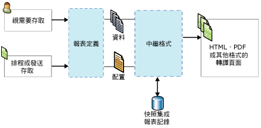

# Reporting Services 概念 (SSRS)
  本主題提供 [!INCLUDE[ssNoVersion](../includes/ssnoversion-md.md)] [!INCLUDE[ssRSnoversion](../includes/ssrsnoversion-md.md)] 概念的簡短摘要。  
  
 **[!INCLUDE[applies](../includes/applies-md.md)]**  [!INCLUDE[ssRSnoversion](../includes/ssrsnoversion-md.md)] 原生模式 | [!INCLUDE[ssRSnoversion](../includes/ssrsnoversion-md.md)] SharePoint 模式   
  
##   報表伺服器概念  
 報表伺服器是其上安裝 [!INCLUDE[ssRSnoversion](../includes/ssrsnoversion-md.md)] 執行個體的電腦。 報表伺服器會在內部儲存分頁與行動報表、報表相關項目以及資源、排程和訂閱這類項目。 報表伺服器可以設定為獨立單一伺服器或向外延展伺服器陣列，也可以與 SharePoint Server 整合。 與報表伺服器項目的互動方式是透過 [!INCLUDE[ssRSnoversion](../includes/ssrsnoversion-md.md)] Web 服務、WMI 提供者、URL 存取或透過指令碼進行程式設計。 與報表伺服器的互動方式則取決於部署拓撲和組態。  
  
### 原生模式報表伺服器
 以原生模式所設定報表伺服器是其上安裝 [!INCLUDE[ssNoVersion](../includes/ssnoversion-md.md)] [!INCLUDE[ssRSnoversion](../includes/ssrsnoversion-md.md)] 且設定為獨立伺服器的電腦。 與報表伺服器、報表和報表相關項目的互動方式，是搭配使用瀏覽器與 [!INCLUDE[ssRSWebPortal](../includes/ssrswebportal.md)] 或 URL 存取命令、SQL Server Management Studio 或透過指令碼進行程式設計。 如需詳細資訊，請參閱 [Reporting Services 報表伺服器 &#40;原生模式&#41;](../reporting-services/report-server/reporting-services-report-server-native-mode.md)。  
  
### SharePoint 模式報表伺服器  
 與 SharePoint 整合的報表伺服器有兩種可能的組態。 在 [!INCLUDE[ssRSCurrent](../includes/ssrscurrent-md.md)]中， [!INCLUDE[ssRSnoversion](../includes/ssrsnoversion-md.md)] 是與做為 SharePoint 共用服務的 SharePoint 伺服器一起安裝。 在舊版本中，報表伺服器會透過安裝 [!INCLUDE[ssRSnoversion](../includes/ssrsnoversion-md.md)] SharePoint 增益集與 SharePoint Server 的整合。 在這兩種情況下，與報表伺服器、報表和報表相關項目的互動是在 SharePoint 網站上使用應用程式頁面。 您可以使用 SharePoint 文件庫以及其他您建立用以儲存報表相關內容類型的文件庫。 如需詳細資訊，請參閱 [Reporting Services 報表伺服器 &#40;原生模式&#41;](../reporting-services/report-server-sharepoint/reporting-services-report-server-sharepoint-mode.md)。  
  
### 報表伺服器項目 
 報表伺服器項目包含分頁與行動報表、KPI、共用資料來源、共用資料集，以及其他可發行、上傳或儲存至報表伺服器的項目。 組織原生報表伺服器之報表伺服器階層資料夾結構中的項目，或是組織 SharePoint 網站之 SharePoint 內容庫中的項目。 如需詳細資訊，請參閱[報表伺服器內容管理 &#40;SSRS 原生模式&#41;](../reporting-services/report-server/report-server-content-management-ssrs-native-mode.md)。  
  
### 資料夾
 在原生報表伺服器上，資料夾提供儲存在報表伺服器中所有可定址項目的階層式導覽結構和路徑。 您可以使用資料夾階層和網站以及資料夾權限，協助控制對報表伺服器項目的存取權，這稱為 *「項目層級安全性」* (Item-level security)。 資料夾階層中的子資料夾預設會繼承您對特定資料夾所定義的角色指派。 若您將特定的角色指派給資料夾，則繼承規則將不再適用。 資料夾結構包含一個稱為 **[主資料夾]** 的根節點以及多個支援選擇性 **[我的報表]** 功能的保留資料夾。 在瀏覽器中，根節點是報表伺服器虛擬目錄的名稱 (例如，`https://myreportserver/reports`)。 如需詳細資訊，請參閱 [Folders](../reporting-services/report-server/report-server-content-management-ssrs-native-mode.md#bkmk_Folders)。  
  
 在 SharePoint 網站上，使用文件庫和內容庫中的 SharePoint 資料夾來組織項目。  
  
### 角色及使用權限
 在原生報表伺服器上，報表伺服器系統管理員可以管理存取權、設定報表伺服器以處理報表要求、維護快照集記錄，以及管理報表、資料來源、資料集和訂閱的權限。 例如，已發行的報表是透過使用 [!INCLUDE[ssRSnoversion](../includes/ssrsnoversion-md.md)] 以角色為基礎之安全性模型的角色指派以維護其安全。 如需詳細資訊，請參閱[角色與權限 &#40;Reporting Services&#41;](../reporting-services/security/roles-and-permissions-reporting-services.md)。  
  
 在 SharePoint 網站上，請使用 SharePoint 網站管理員頁面以管理報表及報表相關網站內容的存取權。  
  
### 排程
 在原生報表伺服器上，您可以排程分頁報表、共用資料集及訂閱，以便在特定時間或離峰時段擷取資料及傳遞報表與資料集查詢。 排程可以執行一次，或以小時、天、週或月為週期連續執行。 如需詳細資訊，請參閱 [Schedules](../reporting-services/subscriptions/schedules.md)。  
  
### 訂閱與傳遞  
 訂閱是要在特定時間或回應事件時傳遞報表的永久性要求，並採用您在訂閱中指定的應用程式檔案格式。 訂閱會提供視需要執行報表的替代方案。 視需要報表會要求您在每次檢視報表時，主動選取報表。 反之，訂閱可用於排程然後自動傳遞報表。 您可以將報表傳遞至電子郵件收件匣或檔案共用。 如需詳細資訊，請參閱[訂閱與傳遞 &#40;Reporting Services&#41;](../reporting-services/subscriptions/subscriptions-and-delivery-reporting-services.md)。  
  
### 延伸模組
 [!INCLUDE[ssNoVersion](../includes/ssnoversion-md.md)] [!INCLUDE[ssRSnoversion](../includes/ssrsnoversion-md.md)] 提供可用以自訂報表方案的可延伸架構。 報表伺服器支援自訂驗證延伸模組、資料處理延伸模組、報表處理延伸模組、轉譯延伸模組和傳遞延伸模組，以及在 RSReportServer.config 組態檔中適用於使用者的可設定延伸模組。 例如，您可以限制報表檢視器允許使用的匯出格式。 傳遞與報表處理延伸模組是選擇性的，但是您若要支援報表散發或自訂控制項，則是必要的。 如需詳細資訊，請參閱 [Reporting Services 延伸模組 &#40;SSRS&#41;](../reporting-services/extensions-ssrs.md)。  
  
### 報表存取 
 視需要存取可讓使用者從報表檢視工具選取報表。 根據報表伺服器組態，您可以使用 [!INCLUDE[ssRSWebPortal](../includes/ssrswebportal.md)] ( [!INCLUDE[msCoName](../includes/msconame-md.md)] SharePoint 2.0 Web 組件)、SharePoint 文件庫 (以 SharePoint 整合模式安裝 [!INCLUDE[ssRSnoversion](../includes/ssrsnoversion-md.md)] 時)、內嵌的 ReportViewer 控制項，或是使用 URL 存取的瀏覽器。 如需視需要存取報表的詳細資訊，請參閱[尋找、檢視和管理報表 &#40;報表產生器及 SSRS &#41;](../reporting-services/report-builder/finding-viewing-and-managing-reports-report-builder-and-ssrs.md)。  
  
 訂閱會提供視需要執行報表的替代方案。 如需詳細資訊，請參閱[訂閱與傳遞 &#40;Reporting Services&#41;](../reporting-services/subscriptions/subscriptions-and-delivery-reporting-services.md)。  
  
 如需用以與報表伺服器互動的工具清單，請參閱 [Reporting Services 工具](../reporting-services/tools/reporting-services-tools.md)。  
  
  
##   報表及相關項目概念  
### 報表與報表定義

 **RDL** 
 
 報表定義符合 XML 文法 (稱為報表定義語言 (RDL)) 的 XML 檔案。 在 [!INCLUDE[ssRSnoversion](../includes/ssrsnoversion-md.md)]中，您可以使用報表產生器或報表設計師這類工具以建立報表定義。 它所含的元素可定義資料來源連接、用以擷取資料的查詢、運算式、參數、影像、文字方塊、資料表以及任何其他設計階段配置。 如需詳細資訊，請參閱[報表定義語言 &#40;SSRS&#41;](../reporting-services/reports/report-definition-language-ssrs.md)。  
  
 **RSMOBILE**

您可在 SQL Server 行動報表發行工具中建立 Reporting Services 行動報表 (.rsmobile 檔案)。 它們已針對行動裝置最佳化並可連接到內部部署資料，並具有各種資料視覺效果。 請閱讀 [Reporting Services 行動報表](../reporting-services/mobile-reports/create-mobile-reports-with-sql-server-mobile-report-publisher.md)。 
  
 **RDLC** 
 
 Visual Studio 報表設計師會產生 XML 格式的用戶端報表定義 (.rdlc) 檔案，以與 ReportViewer 控制項搭配使用。  
  
### 報表資料連接及資料來源 
 查詢執行或處理報表時，報表會使用資料連接擷取報表的資料。 在報表定義中，資料連接與資料來源相同。 您可以從內建的資料連接類型清單，選擇連接到關聯式資料庫、多維度資料庫、Web 服務或其他資料來源的類型。 下列項目可在描述資料連接時使用。  
  
-   **資料連接。** 也稱為 *資料來源*。 資料連接包括相依於連接類型的名稱和連接屬性。 依預設，資料連接不包括認證。 資料連接不會指定要從外部資料來源擷取的資料。 若要執行這項操作，您可以在建立資料集時指定查詢。  
  
-   **共用資料來源定義。** 包含報表資料來源之 XML 表示的檔案。 報表發行時，其資料來源會儲存到報表伺服器或 SharePoint 網站上做為資料來源定義，與報表定義分開。 例如，報表伺服器管理員可能會更新連接字串或認證。 在原生報表伺服器上，檔案類型為 .rds。 在 SharePoint 網站上，檔案類型為 .rsds。  
  
-   **連接字串。** 連接字串是連接到資料來源時所需之連接屬性的字串版本。 連接屬性會依資料連接類型而有所不同。  
  
-   **共用資料來源。** 報表伺服器或 SharePoint 網站上提供的資料來源，可供多個報表使用。  
  
     如果資料來源使用頻率很高，則共用資料來源很有用。 建議您盡量使用共用資料來源。 它們會簡化報表和報表存取的管理，而且有助於提升報表和報表所存取之資料來源的安全性。 如果您需要共用資料來源，請要求系統管理員為您建立一個。  
  
     在報表產生器中，您無法建立共用資料來源。 您可以從報表伺服器瀏覽並選取共用資料來源。  
  
     在報表設計師中，您無法瀏覽至報表伺服器上的共用資料來源。 您可以在 [方案總管] 中建立共用資料來源做為專案的一部分，並且選擇是否將它們部署到報表伺服器。 您可能因為電腦所需的認證和報表伺服器所需的認證不同，而選擇只在本機上使用這些共用資料來源。  
  
-   **內嵌資料來源。** 也稱為 *「報表特定資料來源」* (Report-specific data source)，內嵌資料來源是定義在報表中，而且只能供該報表使用。  
  
     內嵌資料來源是儲存在報表定義中的資料連接。 內嵌資料來源連接資訊只能用於內嵌該資訊的報表中。  
  
-   **認證。** 認證是驗證資訊，您必須提供這項資訊才能存取外部資料。  
  
     認證用於建立內嵌資料來源、執行查詢，或是在處理報表時擷取資料。 資料來源連線的擁有者會決定您必須用於存取資料的認證類型。 認證會與報表伺服器、SharePoint 網站或報表撰寫環境中本機電腦上的資料連接分開管理。 根據資料來源的類型而定，認證可加以儲存並避免提示，或者設定為提示每一位使用者。 您需要的認證可能會依據您從電腦或是報表伺服器連接到資料來源而有所不同。 如需詳細資訊，請參閱 [在報表產生器中指定認證](/previous-versions/sql/)。  
  
### 報表資料集 
 在報表中，資料集代表在外部資料來源上執行查詢時所傳回的報表資料。 資料集取決於包含外部資料來源之相關資訊的資料連接。 資料本身不會包含在報表定義中。 資料集包含查詢命令、欄位集合、參數、篩選，以及包含區分大小寫和定序的資料選項。 資料集有以下兩種不同的類型：  
  
-   **共用資料集。** 共用資料集是在報表伺服器上發行，可供多個報表使用。 共用資料集必須以共用資料來源為基礎。 共用資料集可透過建立快取重新整理計劃的方式快取和排程。  
  
-   **內嵌資料集。** 內嵌資料集是在單一報表中定義，只供單一報表使用。  
  
 如需詳細資訊，請參閱 [報表內嵌資料集和共用資料集 &#40;報表產生器及 SSRS&#41;](../reporting-services/report-data/report-embedded-datasets-and-shared-datasets-report-builder-and-ssrs.md)。  
  
### 報表參數 
 報表參數是報表定義的一部分。 您可以將參數加入至 Reporting Services 分頁與行動報表，以便連結相關報表、控制報表外觀、篩選報表資料，或是將報表的範圍縮小至特定使用者或位置。 將分頁報表發行至原生報表伺服器或 SharePoint 網站時，會將報表參數儲存為個別的報表伺服器項目。 參數可以獨立管理，與報表定義無關。 若要為相同的報表建立多組參數，請建立 *「連結報表」* (Linked report)。  
  
### 報表項目 
 報表項目是 Reporting Services 分頁報表定義中一種內部但基本的概念。 報表項目的屬性會套用至資料區、地圖、文字方塊、影像，以及您加入至報表中的其他設計元素。 了解報表項目的屬性可協助您設計自訂的報表內容及外觀。 例如，所有報表項目都具有隱藏屬性，以控制可見性。  
  
### 資料區及地圖 
 資料區是顯示 Reporting Services 分頁報表中單一資料集資料的配置元素。 資料區類型包含 Tablix、圖表、量測計及指示器。 地圖是一種資料區的特殊類型，因為它可以顯示兩個資料集中的資料：一個包含空間資料，另一個則包含分析資料。  
  
 資料區可用於啟用一般資料視覺效果：資料表、矩陣或清單中的數字和文字；以圖形方式顯示在圖表或量測計中，也可以根據地圖的地理顯示。 資料表、矩陣與清單都是以 Tablix 資料區為基礎，可在需要時擴充以顯示資料集中的所有資料。 Tablix 資料區支援多個資料列與資料行群組，而且同時支援靜態與動態資料列和資料行。 圖表會使用各種圖表格式顯示多個數列和類別目錄群組。 量測計則會顯示資料集的單一值或彙總值。 地圖會將空間資料顯示為地圖元素，其外觀會隨著資料集中的彙總資料而改變。  
  
-   **資料表。** 資料表是逐一呈現資料列的資料區域。 資料表資料行是靜態的：您可以在設計報表時決定資料行的數目。 資料表資料列是動態的：它們會向下展開以容納資料。 您可以將群組加入至資料表，然後資料表就會依據選取的欄位或運算式組織資料。 如需詳細資訊，請參閱 [資料表、矩陣和清單 (報表產生器及 SSRS)](./report-design/tables-matrices-and-lists-report-builder-and-ssrs.md)。  
  
-   **矩陣。** 「矩陣」(Matrix) 也稱為交叉資料表。 矩陣資料區域同時包含動態資料行和資料列：它們會展開以容納資料。 矩陣可以有動態資料行和資料列，以及靜態資料行和資料列。 資料行或資料列可以包含其他資料行或資料列，而且可用來分組資料。 如需詳細資訊，請參閱 [資料表、矩陣和清單 (報表產生器及 SSRS)](./report-design/tables-matrices-and-lists-report-builder-and-ssrs.md)。  
  
-   **清單。** 「清單」(List) 是呈現依自由形式來安排之資料的資料區域。 您可以安排報表項目來建立一份表單，將文字方塊、影像和其他資料區域放在清單內的任何位置。 如需詳細資訊，請參閱 [資料表、矩陣和清單 (報表產生器及 SSRS)](./report-design/tables-matrices-and-lists-report-builder-and-ssrs.md)。  
  
-   **圖表。** 圖表會以圖形方式來呈現資料。 橫條圖、圓形圖和折線圖都是圖表的範例，但另外還有許多其他支援的樣式。 如需詳細資訊，請參閱 [圖表 &#40;報表產生器及 SSRS&#41;](../reporting-services/report-design/charts-report-builder-and-ssrs.md)。  
  
-   **量測計。** 量測計會將資料呈現成範圍，其中包含指向範圍內特定值的指標。 量測計是用來顯示關鍵效能指標 (KPI) 和其他標準。 量測計的範例包括線性和循環。 如需詳細資訊，請參閱 [量測計 &#40;報表產生器及 SSRS&#41;](../reporting-services/report-design/gauges-report-builder-and-ssrs.md)。  
  
-   **地圖。** 地圖可讓您根據地理背景呈現資料。 地圖資料可以是來自 [!INCLUDE[ssNoVersion](../includes/ssnoversion-md.md)] 查詢的空間資料、ESRI 形狀檔，或 [!INCLUDE[msCoName](../includes/msconame-md.md)] Bing 地圖底圖。 空間資料由多組座標所組成，這些座標會定義表示形狀或區域的多邊形、表示路線或路徑的線條與以標記表示的點。 您可以讓彙總資料與地圖元素產生關聯，來自動改變其色彩和大小。 例如，可以根據銷售量來改變商店的標記類型，或者根據速限來改變的色彩。 如需詳細資訊，請參閱[地圖 &#40;報表產生器及 SSRS&#41;](../reporting-services/report-design/maps-report-builder-and-ssrs.md)。  
  
 您也可以使用下列方式，包含來自從未連結到資料區之資料集的值：  
  
-   運算式包含的彙總函式呼叫會將不同的資料集指定為範圍參數，例如 `=Max(Fields!Sales.Value, "AnnualSales")`。  
  
-   **Lookup** 函數可用以從不同資料集中的名稱/值組查閱值。  
  
### 報表組件
 報表組件定義 (.rsc) 是一個報表伺服器項目，而此項目為報表定義檔案的 XML 片段。 您可藉由建立報表定義，然後選取報表中的報表項目個別發行為報表組件，藉此建立報表組件。 報表組件包括資料區、矩形與其包含的項目，以及影像。 您可以將報表組件與其相依的資料集和共用資料來源參考一併儲存，以便於其他報表中重複使用。 如需詳細資訊，請參閱[報表設計師中的報表組件 &#40;SSRS&#41;](../reporting-services/report-design/report-parts-in-report-designer-ssrs.md)。  
  
### 資料警示 
 資料警示是儲存在警示資料庫內部的項目。 資料警示定義包含要從現有報表資料摘要中使用的資料、要符合的條件、排程，以及警示的收件者。 只有發行至報表伺服器的報表才提供資料警示，而報表伺服器是與 SharePoint 伺服器整合。 原生報表伺服器安裝上未提供資料警示。 如需詳細資訊，請參閱 [Reporting Services 資料警示](../reporting-services/reporting-services-data-alerts.md)。  
  
  
##   Reporting Services 分頁報表的類型  
 在 [!INCLUDE[ssRSnoversion](../includes/ssrsnoversion-md.md)]中， *「報表」* (Report) 這個詞彙可以套用至特定類型的報表伺服器項目、配置設計或方案設計。 單一 Reporting Services 分頁報表可以具有一種以上類型的特性，例如，報表可以同時是獨立報表、主報表所參考的子報表、不同主報表中鑽研報表的目標及連結報表。  
  
### 向下鑽研報表 
 向下鑽研報表是一種配置設計，一開始會隱藏複雜度，並讓使用者條件式地切換隱藏的報表項目，以控制要顯示多詳細的資料。 向下鑽研報表必須擷取所有可能會顯示在報表上的資料。 若為使用大量資料的報表，請考慮改用鑽研報表。 如需詳細資訊，請參閱[向下鑽研動作 &#40;報表產生器及 SSRS&#41;](../reporting-services/report-design/drilldown-action-report-builder-and-ssrs.md)。  
  
### 子報表
 子報表是以配置元素形式加入至報表的報表項目。 子報表會指向不同的報表，而且會在主報表的主體內顯示為子報表執行個體。 子報表可以使用與主報表不同的資料來源。 雖然可以使用參數在每個子報表執行個體中篩選資料，以在資料區中重複子報表，不過子報表通常是與主報表搭配使用，做為簡報書籍或是可以容納相關報表集合的容器。 每個子報表執行個體都會切換主報表與子報表之間的報表處理內容。 若為使用多個子報表執行個體的報表，請考慮改用鑽研報表。 如需詳細資訊，請參閱[子報表 &#40;報表產生器及 SSRS&#41;](../reporting-services/report-design/subreports-report-builder-and-ssrs.md)。  
  
 ### 主/詳細資料報表及鑽研報表
 主/詳細資料報表方案所含的主報表會顯示摘要資訊，而摘要資訊具有一個或多個可顯示詳細資訊之報表的超連結。  只有在報告讀取器按一下詳細資料報表的連結時，才會執行詳細資料報表。 鑽研報表是個別從主報表中開啟。 超連結可以定義在任何具有 Action 屬性的報表項目上，例如文字方塊、預留位置文字或圖表數列。 如需詳細資訊，請參閱[鑽研報表 &#40;報表產生器及 SSRS&#41;](../reporting-services/report-design/drillthrough-reports-report-builder-and-ssrs.md)。  
  
### 「連結報表」 
 連結報表是報表伺服器項目，且包含報表定義的指標，但具有一組專屬的報表屬性及設定。 這包含安全性、參數、位置、訂閱及排程。 因為參數是在伺服器上獨立管理，所以重新發行使用新參數設定的主報表時，將不會覆寫主報表或連結報表的現有參數設定。  
  
 如需詳細資訊，請參閱 [建立連結報表](../reporting-services/reports/create-a-linked-report.md)。  
  
### 記錄報表
 報表記錄是報表快照集的集合。 您可以使用報表記錄，以維護報表經過一段時間的記錄。 報表記錄不適用於包含機密或個人資料的報表。 因此，報表記錄只會包含使用單一認證組以查詢資料來源的報表。 您也可以定義排程及訂閱，將具有已匯出檔案格式的報表傳遞至檔案共用，以建立報表的記錄。 如需詳細資訊，請參閱[效能、快照集、快取 &#40;Reporting Services&#41;](../reporting-services/report-server/performance-snapshots-caching-reporting-services.md)。  
  
### 快取報表 
 快取報表是已編譯報表及報表資料的已儲存複本。 快取報表可用以提升效能，其方式是減少報表處理器的處理要求數目以及減少擷取大型報表資料集所需的時間。 它們具有強制性的到期時間 (通常以分鐘為單位)。 如需如何使用快取報表的詳細資訊，請參閱[快取報表 &#40;SSRS&#41;](../reporting-services/report-server/caching-reports-ssrs.md)。  
  
 您也可以快取共用資料集的查詢結果。 如需詳細資訊，請參閱[快取共用資料集 &#40;SSRS&#41;](../reporting-services/report-server/cache-shared-datasets-ssrs.md)。  
  
### 快照集
 報表快照集是一種報表，它包含在特定時間點擷取的配置資訊和查詢結果。 與檢視報表時即取得最新查詢結果的視需要報表不同，報表伺服器會擷取報表在建立快照集時的已編譯報表及報表資料。 報表快照集不會以特定轉譯格式儲存。 而是只有在使用者或應用程式要求它時，報表快照集才以最後的檢視格式轉譯 (例如 HTML)。 如需詳細資訊，請參閱[效能、快照集、快取 &#40;Reporting Services&#41;](../reporting-services/report-server/performance-snapshots-caching-reporting-services.md)。  
   
### 儲存的報表  
 儲存的分頁報表是報表定義 (.rdl) 檔案。 報表定義可以儲存在本機，也可以上傳至報表伺服器。 若您上傳報表定義，而不是發行報表定義，則不會進行版本驗證或運算式驗證。 在執行報表之前，看不到任何錯誤。 如需詳細資訊，請參閱 [儲存和部署 Reporting Services 報表](../reporting-services/tools/design-reporting-services-paginated-reports-with-report-designer-ssrs.md#bkmk_SaveandDeploy)。  
  
### 已發行的報表
 已發行的報表是您從 [!INCLUDE[ssRSnoversion](../includes/ssrsnoversion-md.md)] 工具發行至報表伺服器的報表伺服器項目。 在原生報表伺服器上，將報表發行至您具有權限的資料夾。 在 SharePoint 報表伺服器上，您可以將報表發行至使用報表內容類型所啟用的文件庫。 若要與其他人共用所使用的報表，則必須授與他們檢視報表的權限。 如需詳細資訊，請參閱 [儲存和部署 Reporting Services 報表](../reporting-services/tools/design-reporting-services-paginated-reports-with-report-designer-ssrs.md#bkmk_SaveandDeploy)。  
  
### 升級的報表
 升級的報表是一種已發行的報表定義，可在將報表伺服器從某個 [!INCLUDE[ssRSnoversion](../includes/ssrsnoversion-md.md)] 版本升級至更新版本時轉換為較新的結構描述。 會保留原始報表定義。 報表是在記憶體中進行升級、編譯，而編譯的版本則是儲存在內部。 如需詳細資訊，請參閱 [升級 Reporting Services 報表](../reporting-services/install-windows/upgrade-reports.md)。  
  
  
##   Reporting Services 分頁報表的階段  
 您可以建立、發行或儲存、編譯、處理、快取、轉譯、檢視和匯出報表定義，以及將報表定義儲存為記錄。 執行報表時，報表伺服器會以三個步驟來處理報表：報表處理、資料處理，以及轉譯。 資料和報表處理是在報表定義上執行，而結果為內部中繼格式。 中繼格式的報表接下來會轉譯成特定的檢視格式。 下列圖表顯示報表處理的階段和元素。  
  
   
報表處理圖  
  
### 報表定義  
 報表伺服器上儲存的報表定義 (.rdl) 檔案。 如需詳細資訊，請參閱[報表定義語言 &#40;SSRS&#41;](../reporting-services/reports/report-definition-language-ssrs.md)。  
  
### 已編譯的報表及中繼報表格式 
 使用評估運算式、參數及評估參數屬性的報表。  

### 快照集或報表記錄
 快照集是特定時間點的一組報表資料，再加上含有報表配置資訊的中繼格式。 如需詳細資訊，請參閱[效能、快照集、快取 &#40;Reporting Services&#41;](../reporting-services/report-server/performance-snapshots-caching-reporting-services.md)。  
  
### 處理過的報表  
 同時含有資料及配置資訊之完整處理過的報表。  
  
### 轉譯報表
 完整處理過的報表會傳送至報表轉譯器，以結合每個具有目標轉譯格式之頁面上的資料及配置。 您可以自訂及擴充轉譯延伸模組。 報表的預設轉譯格式為 HTML 4.0。 如需詳細資訊，請參閱[頁面配置和轉譯 &#40;報表產生器及 SSRS&#41;](../reporting-services/report-design/page-layout-and-rendering-report-builder-and-ssrs.md) 和[延伸模組 &#40;SSRS&#41;](../reporting-services/extensions-ssrs.md)。  
  
### 匯出的報表
 匯出的報表是以特定檔案格式儲存的完整分頁報表。 匯出格式取決於已安裝的轉譯延伸模組，而且可以進行自訂。 匯出格式預設會包含 Excel、Word、XML、PDF、TIFF 及 CSV。 如需詳細資訊，請參閱 [匯出報表 &#40;報表產生器及 SSRS&#41;](../reporting-services/report-builder/export-reports-report-builder-and-ssrs.md)中之分頁的規則。  
  
  
## 另請參閱  
 [Reporting Services 功能及工作 &#40;SSRS&#41;](../reporting-services/reporting-services-features-and-tasks-ssrs.md)   
 [技術參考 &#40;SSRS&#41;](../reporting-services/technical-reference-ssrs.md)   
 [Reporting Services &#40;SSRS&#41;](../reporting-services/create-deploy-and-manage-mobile-and-paginated-reports.md)  
  
