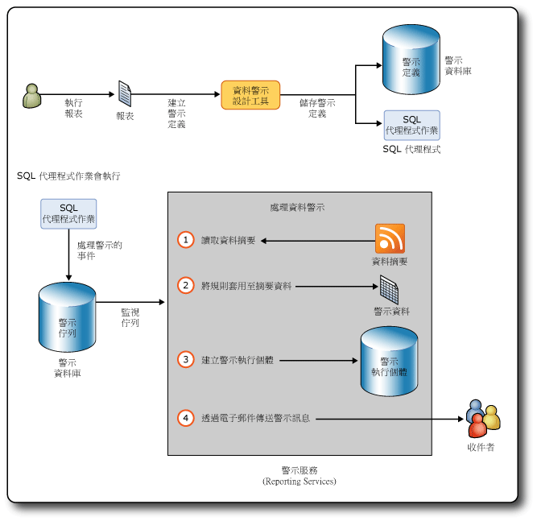

# Reporting Services 資料警示

[!INCLUDE [ssrs-appliesto](../includes/ssrs-appliesto.md)] [!INCLUDE [ssrs-appliesto-2016](../includes/ssrs-appliesto-2016.md)] [!INCLUDE [ssrs-appliesto-not-2017](../includes/ssrs-appliesto-not-2017.md)] [!INCLUDE[ssrs-appliesto-sharepoint-2013-2016i](../includes/ssrs-appliesto-sharepoint-2013-2016.md)] [!INCLUDE [ssrs-appliesto-not-pbirs](../includes/ssrs-appliesto-not-pbirs.md)]

[!INCLUDE [ssrs-previous-versions](../includes/ssrs-previous-versions.md)]

SQL Server Reporting Services 資料警示是資料驅動的警示解決方案，可協助您得知報表中您有興趣或對您很重要的某個相關時間點的資料。 透過使用資料警示，您就不必再搜尋資訊，而會自動收到資訊。

資料警示訊息是透過電子郵件傳送。 依據資訊的重要性而定，您可以選擇傳送訊息的頻率，以及僅在結果變更時傳送。 您可以指定多位電子郵件收件者，如此就能通知其他人，以提升效率並增進共同作業。

> [!NOTE]
> SQL Server 2016 後即不再提供 Reporting Services 與 SharePoint 的整合。

##   資料警示架構和工作流程

以下摘要說明 [!INCLUDE[ssRSnoversion](../includes/ssrsnoversion-md.md)] 資料警示的主要區域：

-   **定義和儲存資料警示定義**：您會執行報表、建立識別有興趣之資料值的規則、定義傳送資料警示訊息的循環模式，以及指定警示訊息的收件者。  
  
-   **執行資料警示定義**：警示服務會在排定的時間處理警示定義、擷取報表資料，以及根據警示定義中的規則建立資料警示執行個體。  
  
-   **將資料警示訊息傳遞至收件者**：警示服務會建立警示執行個體，並透過電子郵件將警示訊息傳遞至收件者。  
  
 此外，身為資料警示擁有者，您可以檢視有關資料警示的資訊，以及刪除和編輯您的資料警示定義。 警示只有一個擁有者，也就是建立警示的人。  
  
 警示系統管理員也就是具備「SharePoint 管理警示」權限的使用者，可以管理網站層級的資料警示。 這些使用者可以檢視每一位網站使用者的警示清單並刪除警示。  
  
 [!INCLUDE[ssRSnoversion](../includes/ssrsnoversion-md.md)] 資料警示與 SharePoint 警示不相同。 您可以在任何文件類型上定義 SharePoint 警示，包括報表。 SharePoint 警示會在文件變更時傳送。 例如，您將資料行加入報表中的資料表。 相反地，資料警示是在報表中顯示的資料符合警示定義中的條件時傳送。 規則通常參考報表中顯示的資料。  
  
 藉由在報表上建立資料警示，您就可以監視報表資料中的變更，並且在報表資料符合定義您或其他人感興趣之資料的規則時，依照符合業務需求的間隔以電子郵件傳送資料警示訊息。 您也可以依需要執行資料警示。 如果您擁有「SharePoint 建立警示」權限，就可以在任何您有權檢視的報表上建立警示。 您可以在報表上建立多個警示，而且多位使用者可以在報表上建立相同或不同的警示。 若要與其他人共同作業，您可以將這些人指定為您所建立資料警示定義中警示訊息的收件者。  
  
 下圖說明建立和儲存資料警示定義、建立 SQL Agent 作業開始處理資料警示執行個體，以及透過電子郵件傳送包含觸發警示之報表資料的資料警示訊息給一位或多位收件者的工作流程。  
  
   
  
### 資料警示支援的報表  
 您可以在以報表定義語言 (RDL) 撰寫並且於報表設計師或報表產生器中建立的所有類型專業報表上建立資料警示。 包含資料表和圖表等資料區的報表、擁有子報表的報表，以及擁有多個平行資料行群組和巢狀資料區的複雜報表。 唯一的需求是，報表至少包含一個任何類型的資料區域，而且報表資料來源設定為使用預存認證或無認證。 如果報表沒有任何資料區，則無法為其建立警示。  
  
 您無法針對使用 [!INCLUDE[ssCrescent](../includes/sscrescent-md.md)]所建立的報表建立資料警示。  
  
 當您以原生模式或 SharePoint 模式安裝 [!INCLUDE[ssRSnoversion](../includes/ssrsnoversion-md.md)] 或是使用獨立版的報表產生器時，可以將報表儲存到報表伺服器、您的電腦或 SharePoint 文件庫。 若要在報表上建立資料警示，則報表必須儲存或上載到 SharePoint 文件庫。 這表示，您無法在儲存到原生模式的報表伺服器或電腦的報表上建立警示。 此外，您也無法建立內嵌於自訂應用程式中的警示。  
  
 [!INCLUDE[ssRSnoversion](../includes/ssrsnoversion-md.md)] 支援報表中各種不同的認證類型。 您可以在資料來源設定為使用預存認證或不使用認證的報表上建立資料警示。 不過您無法在設定為使用整合式安全性認證或提示輸入認證的報表上建立警示。 報表會在處理警示定義時一併執行，而沒有認證的情況下處理會失敗。 如需詳細資訊，請參閱下列：  
  
-   [指定報表資料來源的認證及連線資訊](../reporting-services/report-data/specify-credential-and-connection-information-for-report-data-sources.md)  
  
-   [角色與權限 &#40;Reporting Services&#41;](../reporting-services/security/roles-and-permissions-reporting-services.md)  
  
-   [報表伺服器的驗證](../reporting-services/security/authentication-with-the-report-server.md)  
  
### 執行報表  
 建立資料警示定義的第一個步驟，就是在 SharePoint 文件庫中尋找您要的報表，然後執行報表。 如果報表執行時未包含任何資料，則無法在當時於報表上建立警示。  
  
 如果報表已參數化，您會在執行報表時指定要使用的參數值。 參數值將儲存在您於報表上建立的報表警示定義中。 這些值會在重新執行報表做為處理資料警示定義的步驟時使用。 如果您要變更參數值，則需要使用這些參數值重新執行報表，並且在該版本的報表上建立警示定義。  
  
### 建立資料警示定義  
 [!INCLUDE[ssRSnoversion](../includes/ssrsnoversion-md.md)] 資料警示功能包括資料警示設計工具，可用來建立資料警示定義。  
  
 若要建立資料警示定義，請執行報表，然後從 SharePoint 報表檢視器的 **[動作]** 功能表開啟 [資料警示設計工具]。 如此就會產生報表的報表資料摘要，而資料摘要中的前 100 個資料列會在 [資料警示設計工具] 的資料預覽資料表中顯示。 只要您在 [資料警示設計工具] 中處理警示定義，就會持續快取所有來自報表的資料摘要。 快取可讓您在資料摘要之間迅速切換。 當您在 [資料警示設計工具] 中重新開啟警示定義時，資料摘要會重新整理。  
  
 資料警示定義包含以下內容：規則和子句，報表資料必須滿足這些規則和子句才能觸發資料警示訊息；排程，定義傳送警示訊息的頻率以及開始和停止傳送警示訊息的日期 (選擇性)；像是主旨和警示訊息中要包含的描述等資訊；以及訊息的收件者。 在您建立警示定義之後，可以將它儲存到 SQL Server 警示資料庫。  
  
### 儲存資料警示定義和警示中繼資料  
 您以 SharePoint 模式安裝 [!INCLUDE[ssRSnoversion](../includes/ssrsnoversion-md.md)] 時，會自動建立 SQL Server 警示資料庫。  
  
 資料警示定義和警示中繼資料會儲存到警示資料庫中。 根據預設，這個資料庫的名稱為 ReportingServices\<GUID>_Alerting。  
  
 當您儲存資料警示定義時，警示會為該警示定義建立 SQL Server Agent 作業。 作業會包括作業排程。 排程是依據您在警示定義上定義的循環模式。 執行該作業會起始資料警示定義的處理。  
  
### 處理資料警示定義  
 SQL Server Agent 作業的排程開始處理警示定義時，會執行報表以重新整理報表資料摘要。 警示服務會讀取資料摘要，並且套用資料警示定義對資料值指定的規則。 如果一個或多個資料值符合規則，則會建立資料警示執行個體，並且以電子郵件將包含警示結果的資料警示訊息傳送給所有收件者。 結果會是建立警示執行個體時滿足所有規則的報表資料資料列。 為避免產生多個相同結果的警示訊息，您可以指定只有在結果變更時傳送訊息。 在此情況下會建立警示執行個體，並且儲存到警示資料庫，但是不會產生警示訊息。 如果發生錯誤，警示執行個體還是會儲存到警示資料庫，而且包含錯誤之詳細資料的警示訊息會傳送給收件者。 本主題稍後的＜診斷和記錄＞一節將提供記錄和疑難排解的詳細資訊。  
  
### 傳送資料警示訊息  
 資料警示訊息是透過電子郵件傳送。  
  
 **[寄件者]** 一行包含 [!INCLUDE[ssRSnoversion](../includes/ssrsnoversion-md.md)] 電子郵件傳遞組態提供的值。 **[收件者]** 一行列出您在 [資料警示設計工具] 中建立警示時指定的收件者。  
  
 除了您在 [資料警示設計工具] 中指定的電子郵件 [主旨] 之外，資料警示訊息還包含下列資訊：  
  
-   建立資料警示定義的建立者名稱。  
  
-   如果您在警示定義中提供了描述，該描述會在電子郵件本文最上方顯示。  
  
-   警示結果，包含滿足警示定義中所指定規則之報表資料摘要中的資料列。  
  
-   建立警示定義所在之報表的連結。  
  
-   警示定義中的規則。  
  
-   用來執行報表的參數和值。  
  
-   位於報表資料區域外之報表項目的內容值。  
  
 如果無法件例警示執行個體或資料警示訊息，則會傳送錯誤訊息給所有收件者。 訊息不會包括警示結果，而是錯誤描述。  
  
 如需相關資訊，請參閱 [Data Alert Messages](../reporting-services/data-alert-messages.md)。  
  
##   安裝資料警示  
 資料警示功能只有在 [!INCLUDE[ssRSnoversion](../includes/ssrsnoversion-md.md)] 是以 SharePoint 模式安裝時才可使用。 當您以 SharePoint 模式安裝 [!INCLUDE[ssRSnoversion](../includes/ssrsnoversion-md.md)] 時，安裝程式會自動建立儲存警示定義和警示中繼資料的警示資料庫，以及兩個用於管理警示的 SharePoint 頁面，並且將 [資料警示設計工具] 加入 SharePoint 網站。 在安裝期間不需要針對警示執行特殊步驟或是設定特殊選項。  
  
 如果您想要深入了解以 SharePoint 模式安裝 [!INCLUDE[ssRSnoversion](../includes/ssrsnoversion-md.md)] (包括 [!INCLUDE[ssSQL11](../includes/sssql11-md.md)] 中的新 [!INCLUDE[ssRSnoversion](../includes/ssrsnoversion-md.md)] 共用服務，以及在使用 [!INCLUDE[ssRSnoversion](../includes/ssrsnoversion-md.md)] 功能之前，必須先建立和設定的 [!INCLUDE[ssRSnoversion](../includes/ssrsnoversion-md.md)] 服務應用程式)，請參閱 MSDN Library 中的 [安裝適用於 SharePoint 2010 的 Reporting Services SharePoint 模式](https://msdn.microsoft.com/47efa72e-1735-4387-8485-f8994fb08c8c) \(機器翻譯\)。  
  
 如本主題前段的圖中所示，資料警示會使用 SQL Server Agent 作業。 若要建立作業，必須執行 SQL Server Agent。 您可能已將 SQL Server Agent 設定為在安裝 [!INCLUDE[ssRSnoversion](../includes/ssrsnoversion-md.md)]時自動啟動。 否則，您可以手動啟動 SQL Server Agent。 如需詳細資訊，請參閱[設定 SQL Server Agent](../ssms/agent/configure-sql-server-agent.md)及[及啟動、停止、暫停、繼續、重新啟動 Database Engine、SQL Server Agent 或 SQL Server Browser 服務](../database-engine/configure-windows/start-stop-pause-resume-restart-sql-server-services.md)。  
  
 您可以使用 SharePoint 管理中心內的 **[提供訂閱和警示]** 頁面，查看 SQL Server Agent 是否正在執行，並且建立和下載自訂的 [!INCLUDE[tsql](../includes/tsql-md.md)] 指令碼，之後可執行這些指令碼將權限授與 SQL Server Agent。 另外還可以使用 PowerShell 產生 [!INCLUDE[tsql](../includes/tsql-md.md)] 指令碼。 如需詳細資訊，請參閱 [SSRS 服務應用程式的佈建訂用帳戶及警示](../reporting-services/install-windows/provision-subscriptions-and-alerts-for-ssrs-service-applications.md)。  
  
##   設定資料警示  
 從 [!INCLUDE[ssSQL11](../includes/sssql11-md.md)] 開始，只要在 SharePoint 模式下安裝 [!INCLUDE[ssRSnoversion](../includes/ssrsnoversion-md.md)] ， [!INCLUDE[ssRSnoversion](../includes/ssrsnoversion-md.md)] 功能的設定 (包括資料警示) 就會在報表伺服器組態檔 (rsreportserver.config) 和 SharePoint 組態資料庫之間散發。 當您在安裝和設定 [!INCLUDE[ssRSnoversion](../includes/ssrsnoversion-md.md)]的過程中建立服務應用程式時，會自動建立 SharePoint 組態資料庫。 如需詳細資訊，請參閱 [RsReportServer.config 組態檔](../reporting-services/report-server/rsreportserver-config-configuration-file.md) 和 [Reporting Services 組態檔](../reporting-services/report-server/reporting-services-configuration-files.md)。  
  
 [!INCLUDE[ssRSnoversion](../includes/ssrsnoversion-md.md)] 資料警示的設定包括清除警示資料和中繼資料的間隔，以及以電子郵件傳送資料警示訊息的重試次數。 您可以更新組態檔和組態資料庫，以便使用不同的資料警示設定值。  
  
 您可以直接更新報表伺服器組態檔。 SharePoint 組態資料庫則要使用 Windows PowerShell 指令程式更新。  
  
 下表列出資料警示的組態項目、其預設值、描述和位置。  
  
|設定|預設值|描述|Location|  
|-------------|-------------------|-----------------|--------------|  
|AlertingCleanupCycleMinutes|20|兩次清除循環開始之間的分鐘數。|報表伺服器組態檔|  
|AlertingExecutionLogCleanupMinutes|10080|保留執行記錄項目的分鐘數。|報表伺服器組態檔|  
|AlertingDataCleanupMinutes|360|保留暫存資料的分鐘數。|報表伺服器組態檔|  
|AlertingMaxDataRetentionDays|180|在刪除警示執行中繼資料、警示執行個體和執行結果之前經過的天數。|報表伺服器組態檔|  
|MaxRetries|3|重試處理資料警示的次數。|服務組態資料庫|  
|SecondsBeforeRetry|900|每次重試之前等待的秒數。|服務組態資料庫|  
  
 依據預設，MaxRetries 和 SecondsBeforeRetry 設定會套用到引發資料警示的所有事件。 如果您想要更進一步控制重試次數和重試延遲，可以針對指定不同 MaxRetries 和 SecondsBeforeRetry 值的任何或所有事件處理常式加入項目。  
  
### 事件處理常式和重試  
 事件處理常式包括：  
  
|事件處理常式|描述|  
|-------------------|-----------------|  
|FireAlert|按一下 [資料警示管理員] 中的 **[執行]**  ，初始化立即處理警示定義。|  
|FireSchedule|SQL Server Agent 會為警示定義啟動作業排程。|  
|CreateSchedule|您建立資料警示定義，然後就會依據警示定義中指定的頻率間隔件例 SQL Server Agent 作業排程。|  
|UpdateSchedule|您更新資料警示定義的頻率間隔，SQL Server Agent 作業排程就會更新。|  
|DeleteSchedule|您刪除資料警示定義，該定義的 SQL Server Agent 也會刪除。|  
|GenerateAlert|警示執行階段會處理報表資料摘要、套用資料警示定義中指定的規則、判斷是否建立資料警示的執行個體，以及在需要時建立資料警示的執行個體。|  
|DeliverAlert|執行階段會建立資料警示訊息，並且以電子郵件將它傳送給所有收件者。|  
  
 下表將摘要說明事件處理常式以及引發重試的時間：  
  
|錯誤類別|<|\<|事件類型||>|>|>|  
|--------------------|--------|--------|----------------|-|--------|--------|--------|  
||**FireAlert**|**FireSchedule**|**CreateSchedule**|**UpdateSchedule**|**DeleteSchedule**|**GenerateAlert**|**DeliverAlert**|  
|記憶體不足|X|X|X|X|X|X|X|  
|執行緒中止|X|X|X|X|X|X|X|  
|SQL 代理程式並未執行|X||X|X|X|||  
|暫時性。 通常是由於連接問題、逾時和鎖定造成。|X|X|X|X|X|X|X|  
|IOException|||||||X|  
|WebException|||||||X|  
|SocketException|||||||X|  
|SMTPException **(\*)**|||||||X|  
  
 **(\*)** 將觸發重試的 SMTP 錯誤：  
  
-   SmtpStatusCode.ServiceNotAvailable  
  
-   SmtpStatusCode.MailboxBusy  
  
-   SmtpStatusCode.MailboxUnavailable  
  
###   停用資料警示  
 如果您要停用資料警示功能，可更新組態檔的 [服務] 區段。 以下程式碼顯示組態檔的 [服務] 區段。  
  
 `<Service>`  
  
 `<IsSchedulingService>True</IsSchedulingService>`  
  
 `<IsNotificationService>True</IsNotificationService>`  
  
 `<IsEventService>True</IsEventService>`  
  
 `<IsAlertingService>True</IsAlertingService>`  
  
 `...`  
  
 `</Service>`  
  
 若要停用警示，請將 `<IsAlertingService>True</IsAlertingService>`中的 True 變更為 False。  
  
##   資料警示的權限  
 您必須具有在 SharePoint 網站上執行報表和建立警示的權限，才能在報表上建立資料警示。 若要了解有關報表權限的詳細資訊，請參閱下列主題。  
  
-   [從多個報表產生資料摘要 &#40;報表產生器及 SSRS&#41;](../reporting-services/report-builder/generating-data-feeds-from-reports-report-builder-and-ssrs.md)  
  
-   [設定 SharePoint 網站上報表伺服器項目的權限 &#40;SharePoint 整合模式的 Reporting Services&#41;](../reporting-services/security/set-permissions-for-report-server-items-on-a-sharepoint-site.md)  
  
 [!INCLUDE[ssRSnoversion](../includes/ssrsnoversion-md.md)] 資料警示支援兩種權限層級：資訊工作者和警示系統管理員。 下表列出相關的 SharePoint 權限和使用者工作。  
  
|使用者類型|SharePoint 權限|工作描述|  
|---------------|---------------------------|----------------------|  
|資訊工作者|檢視項目   建立警示|檢視項目 (例如報表) 以及在報表上建立資料警示。 編輯和刪除警示。|  
|警示系統管理員|管理警示|檢視儲存在 SharePoint 網站上所有資料警示的清單，並且刪除警示。|  
  
##   診斷和記錄  
 資料警示提供許多方式來幫助資訊工作者和系統管理員追蹤警示以及了解警示失敗的原因，並且幫助系統管理員運用記錄來了解哪些警示訊息傳送給哪些人、傳送的警示執行個體數目等。  
  
### 資料警示管理員  
 資料警示管理員會列出警示定義和錯誤資訊，有助於資訊工作者和警示系統管理員了解錯誤發生的原因。 一些常見的錯誤原因包括：  
  
-   報表資料摘要已變更，且資料警示定義規則中使用的資料行已不包含在資料摘要中。  
  
-   已撤銷檢視報表的權限。  
  
-   基礎資料來源中的資料類型已變更，且警示定義不再有效。  
  
### 記錄  
 [!INCLUDE[ssRSnoversion](../includes/ssrsnoversion-md.md)] 會提供一些記錄檔，有助於深入了解處理資料警示定義、所建立的資料警示執行個體等等時執行的報表。 有三個記錄檔特別實用：警示執行記錄、報表伺服器執行記錄及報表伺服器追蹤記錄。  
  
 如需其他 [!INCLUDE[ssRSnoversion](../includes/ssrsnoversion-md.md)] 記錄檔的相關資訊，請參閱 [Reporting Services 記錄檔和來源](../reporting-services/report-server/reporting-services-log-files-and-sources.md)。  
  
#### 警示執行記錄  
 警示執行階段服務會將項目寫入警示資料庫的 ExecutionLogView 資料表中。 您可以查詢資料庫或執行下列預存程序，以取得有關儲存到警示資料庫之資料警示的更完整診斷資訊。  
  
-   ReadAlertData  
  
-   ReadAlertHistory  
  
-   ReadAlertInstances  
  
-   ReadEventHistory  
  
-   ReadFeedPollHistory  
  
-   ReadFeedPools  
  
-   ReadPollData  
  
-   ReadSentAlerts  
  
 您可以使用 SQL 代理程式依照排程執行預存程序。 如需詳細資訊，請參閱 [SQL Server Agent](../ssms/agent/sql-server-agent.md)。  
  
#### 報表伺服器執行記錄  
 執行報表會產生資料摘要，做為建立資料警示定義的基礎。 報表伺服器資料庫中的報表伺服器執行記錄會在每次報表執行時擷取資訊。 您可以查詢資料庫中的 ExecutionLog2 檢視，以了解詳細資訊。 如需詳細資訊，請參閱 [報表伺服器 ExecutionLog 和 ExecutionLog3 檢視](../reporting-services/report-server/report-server-executionlog-and-the-executionlog3-view.md)。  
  
#### 報表伺服器追蹤記錄  
 報表伺服器追蹤記錄包含報表伺服器服務作業的詳細資訊，包括報表伺服器 Web 服務和背景處理所執行的作業。 如果您要偵錯包含報表伺服器的應用程式，或者調查寫入事件記錄或執行記錄的特定問題，追蹤記錄資訊可能會很有用。 如需詳細資訊，請參閱 [Report Server Service Trace Log](../reporting-services/report-server/report-server-service-trace-log.md)。  
  
##   效能計數器  
 資料警示會提供自己的效能計數器。 除了效能計數器之外，其他內容都會與警示執行階段服務內含的某一個事件相關。 與事件佇列相關的效能計數器會告知所有使用中事件的佇列長度。  
  
|事件或事件佇列|效能計數器|  
|--------------------------|-------------------------|  
|ALERTINGQUEUESIZE|警示：事件佇列長度|  
|FireAlert|警示：已處理的事件數 - FireAlert|  
|FireSchedule|警示：已處理的事件數 - FireSchedule|  
|CreateSchedule|警示：已處理的事件數 - CreateSchedule|  
|UpdateSchedule|警示：已處理的事件數 - UpdateSchedule|  
|DeleteSchedule|警示：已處理的事件數 - DeleteSchedule|  
|GenerateAlert|警示：已處理的事件數 - GenerateAlert|  
|DeliverAlert|警示：已處理的事件數 - DeliverAlert|  
  
 [!INCLUDE[ssRSnoversion](../includes/ssrsnoversion-md.md)] 會提供其他 [!INCLUDE[ssRSnoversion](../includes/ssrsnoversion-md.md)] 功能的效能計數器。 如需詳細資訊，請參閱 [ReportServer:Service 和 ReportServerSharePoint:Service 效能物件的效能計數器](../reporting-services/report-server/performance-counters-reportserver-service-performance-objects.md)、[MSRS 2011 Web 服務和 MSRS 2011 Windows 服務效能物件的效能計數器&#40;原生模式&#41;](../reporting-services/report-server/performance-counters-msrs-2011-web-service-performance-objects.md) 和 [MSRS 2011 Web 服務 SharePoint 模式和 MSRS 2011 Windows 服務 SharePoint 模式效能物件的效能計數器 &#40;SharePoint 模式&#41;](../reporting-services/report-server/performance-counters-msrs-2011-sharepoint-mode-performance-objects.md)。  
  
##   支援 SSL  
 [!INCLUDE[ssRSnoversion](../includes/ssrsnoversion-md.md)] 可以使用 HTTP SSL (安全通訊端層) 服務來建立與報表伺服器或 SharePoint 網站的加密連接。  
  
 警示執行階段服務和資料警示使用者介面支援 SSL，而且無論您使用 SSL 或 HTTP 的運作方式都很類似，不過還是有些微的差異。 使用 SSL 連接建立資料警示定義時，從資料警示訊息連結回 SharePoint 文件庫的 URL 也會使用 SSL。 您可以識別 SSL 連接，因為它的 URL 中是使用 HTTPS，而不是 HTTP。 同樣地，如果是使用 HTTP 連接件例資料警示定義，則返回 SharePoint 網站的連結會使用 HTTP。 無論警示定義是使用 SSL 或 HTTP 所建立，使用者和警示系統管理員使用 [資料警示設計工具] 或 [資料警示管理員] 時的體驗都是一樣的。 如果在資料定義建立、更新再儲存期間應變更通訊協定 (HTTP 或 SSL)，則會保留原始通訊協定並且在連結 URL 中使用。  
  
 如果您在 SharePoint 網站上建立設定為使用 SSL 的資料警示，然後移除 SSL 需求，警示會繼續在網站上運作。 如果網站遭到刪除，則會改用預設的區域網站。  
  
##   資料警示使用者介面  
 資料警示提供了管理警示的 SharePoint 頁面，以及建立和編輯資料警示定義的設計工具。  
  
-   您用來建立或編輯資料警示定義的**資料警示設計工具** 。 如需詳細資訊，請參閱 [資料警示設計工具](../reporting-services/data-alert-designer.md)、 [在資料警示設計工具中建立資料警示](../reporting-services/create-a-data-alert-in-data-alert-designer.md) 和 [在警示設計工具中編輯資料警示](../reporting-services/edit-a-data-alert-in-alert-designer.md)。  
  
-   您用來檢視資料警示清單、刪除警示及開啟警示進行編輯的**資料警示管理員** 。 [資料警示管理員] 有兩種版本：一種可供使用者管理自己建立的警示，另一種可供系統管理員管理屬於網站使用者的警示。  
  
     如需管理所建立資料警示的詳細資訊，請參閱 [SharePoint 使用者的資料警示管理員](../reporting-services/data-alert-manager-for-sharepoint-users.md) 和 [在資料警示管理員中管理我的資料警示](../reporting-services/manage-my-data-alerts-in-data-alert-manager.md)。  
  
     如需管理網站上所有資料警示的詳細資訊，請參閱 [警示系統管理員的資料警示管理員](../reporting-services/data-alert-manager-for-alerting-administrators.md) 和 [在資料警示管理員中管理 SharePoint 網站上的所有資料警示](../reporting-services/manage-all-data-alerts-on-a-sharepoint-site-in-data-alert-manager.md)。  
  
-   **佈建訂閱及資料警示** ，您可在其中查看 Reporting Services 是否可以針對資料警示使用 SQL Server Agent，以及下載允許存取 SQL Server Agent 的指令碼。 如需詳細資訊，請參閱 [SSRS 服務應用程式的佈建訂用帳戶及警示](../reporting-services/install-windows/provision-subscriptions-and-alerts-for-ssrs-service-applications.md)。  
  
##   資料警示的全球化  
 特定指令碼 (像是阿拉伯文與希伯來文) 是由右至左書寫。 資料警示支援由右至左書寫的指令碼，以及由左至右書寫的指令碼。 資料警示會偵測文化特性，並且對應地改變使用者介面的外觀和行為以及資料警示訊息的配置。 文化特性衍生自使用者電腦上作業系統的地區設定。 每次您更新並重新儲存資料警示定義時，就會儲存文化特性。  
  
 警示定義中的文化特性會影響資料是否符合警示定義中的規則。 字串比較最常受文化特性專屬的規則所影響。  
  
 判斷警示定義中的文化特性會否影響報表資料是否符合警示定義中的規則。 這種情況最常出現在字串中。 例如，在德文文化特性的警示定義中，比較英文字母 "o" 與德文字母 "ö" 的規則將不會相符。 在使用英文文化特性的相同警示定義中，就會符合該規則。  
  
 資料格式也是以警示定義的文化特性為基礎。 例如，如果文化特性使用句號做為小數符號，則值會顯示為 45.67；而使用逗號做為小數符號的文化特性則會顯示為 45,67。  
  
 依據您使用的資料警示使用者介面而定，由右至左書寫的支援也會有所不同。 [資料警示設計工具] 支援在文字方塊中使用由右至左指令碼，但是設計工具的配置並不是由右至左。 其配置就像其他工具一樣，是由左至右。 如果以由右至左文字方向建立警示定義，然後在由右至左書寫的環境中進行編輯，則在您儲存警示定義時，會保留由右至左文字方向。 [資料警示管理員] 的行為與 SharePoint 頁面相同。 其配置就像其他 SharePoint 頁面一樣，是由右至左。 以由右至左書寫的資料警示定義為基礎的資料警示訊息，會由右至左顯示訊息文字，但訊息配置是由左至右。  
  
##   相關工作  
  
-   [將報表儲存至 SharePoint 文件庫 &#40;報表產生器&#41;](../reporting-services/report-builder/save-a-report-to-a-sharepoint-library-report-builder.md)  
  
-   [在資料警示設計工具中建立資料警示](../reporting-services/create-a-data-alert-in-data-alert-designer.md)  
  
-   [在警示設計工具中編輯資料警示](../reporting-services/edit-a-data-alert-in-alert-designer.md)  
  
-   [在資料警示管理員中管理我的資料警示](../reporting-services/manage-my-data-alerts-in-data-alert-manager.md)  
  
-   [在資料警示管理員中管理 SharePoint 網站上的所有資料警示](../reporting-services/manage-all-data-alerts-on-a-sharepoint-site-in-data-alert-manager.md)  
  
-   [將權限授與使用者及警示系統管理員](../reporting-services/grant-permissions-to-users-and-alerting-administrators.md)  
  
## 另請參閱

[資料警示設計工具](../reporting-services/data-alert-designer.md)   
[警示系統管理員的資料警示管理員](../reporting-services/data-alert-manager-for-alerting-administrators.md)   
[SharePoint 使用者的資料警示管理員](../reporting-services/data-alert-manager-for-sharepoint-users.md)  

更多問題嗎？ [請嘗試詢問 Reporting Services 論壇](https://go.microsoft.com/fwlink/?LinkId=620231)
