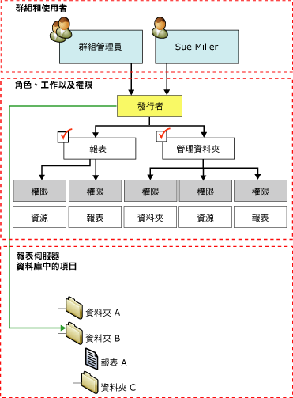

# 角色指派

在 [!INCLUDE[ssRSnoversion](../../includes/ssrsnoversion-md.md)] 中，「角色指派」會決定預存項目以及報表伺服器本身的存取權。 角色指派包含下列部份：  
  
- 您想要控制存取權的安全性實體項目。 安全性實體項目的範例包括資料夾、報表和資源。  
  
- 可以利用 Windows 安全性，或其他驗證機制驗證的使用者或群組帳戶。  
  
- 角色定義會定義一組允許的工作，包括：
  - **瀏覽器**
  - **內容管理員**
  - **我的報表**
  - **發行者**
  - **報表產生器**
  - **系統管理員**
  - **系統使用者**

 角色指派是在資料夾階層內繼承的，並由下列自主項目自動繼承：

- **報表**
- **共用資料來源**
- **資源**
- **子資料夾**

您可以為個別項目定義角色指派，以覆寫繼承的安全性。 至少要有一個角色指派，以保護資料夾階層中所有的部份。 您無法建立不安全的項目，或者以產生不安全項目的方式來操作設定。  
  
 下圖描述將一個群組和一個特定使用者對應至資料夾 B 之 **發行者** 角色的角色指派。  
  
   
角色指派圖表  
  
## 系統層級與項目層級角色指派

 在 [!INCLUDE[ssRSnoversion](../../includes/ssrsnoversion-md.md)] 中以角色為基礎的安全性會組織成下列層級：

- 項目層級的角色指派會控制報表伺服器資料夾階層中對項目的存取，例如：
  - 報表
  - 資料夾
  - 報表模型
  - 共用資料來源
  - 其他資源

- 在特定項目或 [主資料夾] 資料夾上建立角色指派時，會定義項目層級的角色指派。

- 系統角色指派會授權以整部伺服器為範圍的作業。 例如，管理作業的能力是系統層級的作業。 系統角色指派不等同於系統管理員。 它並未授與完全控制報表伺服器的進階權限。

系統角色指派不會授權資料夾階層中對項目的存取。 系統與項目安全性互斥。 有時候您可能需要建立系統層級與項目層級的角色指派，以提供足夠的存取權給使用者或群組。

## 角色指派中的使用者與群組

 您在角色指派中指定的使用者或群組帳戶屬於網域帳戶。 報表伺服器會從 [!INCLUDE[msCoName](../../includes/msconame-md.md)] Windows 網域 (如果您是使用自訂安全性延伸模組，則為另一個安全性模型) 參考 (但不會建立或管理) 使用者與群組。

在套用至任何給定項目的所有角色指派中，不會有兩個可以指定相同使用者或群組。 如果使用者帳戶也是群組帳戶的成員，而二者皆有角色指派，則兩個角色指派結合的工作皆可供使用者使用。

當您將使用者新增至已經有角色指派的群組時，必須重設 Internet Information Services (IIS)，新的角色指派才會生效。

## 預先定義的角色指派

 依預設，會實作預先定義的角色指派，讓本機管理員可以管理報表伺服器。 您可以新增其他角色指派，以便將存取權授與其他使用者。

 如需提供預設安全性之預先定義角色指派的詳細資訊，請參閱 [預先定義的角色](../../reporting-services/security/role-definitions-predefined-roles.md)。  

## 另請參閱

 [建立、刪除或修改角色 &#40;Management Studio&#41;](../../reporting-services/security/role-definitions-create-delete-or-modify.md)

 [修改或刪除角色指派 &#40; SSRS Web 入口網站 &#41;](../../reporting-services/security/role-assignments-modify-or-delete.md)

 [設定 SharePoint 網站上報表伺服器項目的權限 &#40;SharePoint 整合模式的 Reporting Services&#41;](../../reporting-services/security/set-permissions-for-report-server-items-on-a-sharepoint-site.md)

 [在原生模式報表伺服器上授與權限](../../reporting-services/security/granting-permissions-on-a-native-mode-report-server.md)  
