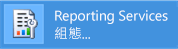
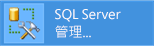
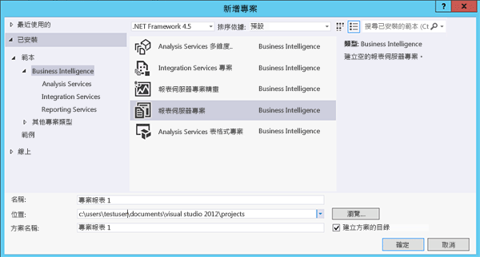

# 教學課程：如何尋找及啟動 Reporting Services 工具 (SSRS)

  本教學課程介紹設定報表伺服器、管理報表伺服器內容和作業，以及建立並發行分頁和行動 [!INCLUDE[ssRSnoversion](../../includes/ssrsnoversion-md.md)] 報表所使用的工具。 如果您已經熟悉這些工具，可以移至其他教學課程，了解使用 [!INCLUDE[ssRSnoversion](../../includes/ssrsnoversion-md.md)]的技巧。 如需其他教學課程，請參閱 [Reporting Services 教學課程 &#40;SSRS&#41;](../../reporting-services/reporting-services-tutorials-ssrs.md)。  
  
  
##   Reporting Services 組態管理員 (原生模式)  
 使用原生模式組態管理員來完成下列動作：  
  
-   指定服務帳戶。  
-   建立或升級報表伺服器資料庫。  
-   修改連接屬性。  
-   指定 URL。  
-   管理加密金鑰。  
-   設定自動報表處理和電子郵件報表傳遞。  
  
**安裝** [!INCLUDE[ssRSnoversion](../../includes/ssrsnoversion-md.md)] 原生模式時，就會安裝 [!INCLUDE[ssRSnoversion](../../includes/ssrsnoversion-md.md)] 組態管理員。 如需詳細資訊，請參閱 [安裝 Reporting Services 原生模式報表伺服器](assetid:///8f25e6dc-b753-400e-9e9a-50f4f35bf6c4)。  
  
### 啟動 Reporting Services 組態管理員  
  
1.  在 Windows 的 [開始] 畫面上，輸入 **reporting** ，然後在 [應用程式]  搜尋結果中，按一下 [Reporting Services 組態管理員] 。  
  
       
  
     **Or**  
  
     依序按一下 **[開始]**、 **[程式集]**、[ [!INCLUDE[ssCurrentUI](../../includes/sscurrentui-md.md)]]、 **[組態工具]** 和 **[Reporting Services 組態管理員]**。  
  
     **[報表伺服器安裝執行個體選取範圍]** 對話方塊隨即出現，以便讓您選取所要設定的報表伺服器執行個體。  
  
2.  在 **[伺服器名稱]** 中，指定安裝報表伺服器執行個體的電腦名稱。 依預設，會指定本機電腦的名稱，但您也可以輸入遠端 [!INCLUDE[ssNoVersion](../../includes/ssnoversion-md.md)] 執行個體的名稱。  
  
     如果您指定遠端電腦，請按一下 **[尋找]** 來建立連接。 必須事先設定報表伺服器的遠端管理功能。 如需詳細資訊，請參閱 [設定報表伺服器來進行遠端管理](../../reporting-services/report-server/configure-a-report-server-for-remote-administration.md)。  
  
3.  在 **在stance Name**中，選擇您要設定的 [!INCLUDE[ssNoVersion](../../includes/ssnoversion-md.md)] [!INCLUDE[ssRSnoversion](../../includes/ssrsnoversion-md.md)] 執行個體。 只有 SQL Server 2008 和更新版的報表伺服器執行個體會出現在此清單中。 您不能設定舊版的 [!INCLUDE[ssRSnoversion](../../includes/ssrsnoversion-md.md)]。  
  
4.  按一下 **[連接]**。  
  
5.  若要確認您已啟動工具，請將結果與下圖相比較：  
  
       
  
 **後續步驟**︰[設定和管理報表伺服器 &#40;SSRS 原生模式&#41;](../../reporting-services/report-server/configure-and-administer-a-report-server-ssrs-native-mode.md) 和[Reporting Services 組態管理員 &#40;原生模式&#41;](../../reporting-services/install-windows/reporting-services-configuration-manager-native-mode.md)。  
  
##  入口網站 (原生模式)  
 使用 [Web portal (SSRS Native Mode)](../../reporting-services/web-portal-ssrs-native-mode.md) 來設定權限、管理訂閱與排程，以及處理報表。 您也可以使用入口網站來檢視報表。  
  
 **安裝** ︰當您安裝 [!INCLUDE[ssRSnoversion](../../includes/ssrsnoversion-md.md)] 原生模式 ( [安裝 Reporting Services 原生模式報表伺服器](assetid:///8f25e6dc-b753-400e-9e9a-50f4f35bf6c4)  
  
 在您開啟入口網站之前，必須有足夠的權限 (一開始，只有本機管理員群組成員才有權限，可以存取入口網站功能)。 依目前使用者的指派角色而定，入口網站會提供不同的頁面和選項。 沒有權限的使用者就會看到空白頁。 有權限檢視報表的使用者會取得連結，按一下就可以開啟報表。 若要深入了解權限，請參閱[角色與權限 &#40;Reporting Services&#41;](../../reporting-services/security/roles-and-permissions-reporting-services.md)。  
  
### 啟動入口網站  
  
1.  開啟瀏覽器。 如需支援之瀏覽器和瀏覽器版本的資訊，請參閱 [Reporting Services 和 Power View 的瀏覽器支援](../../reporting-services/browser-support-for-reporting-services-and-power-view.md)。  
  
2.  在網頁瀏覽器的網址列中，輸入入口網站 URL。 根據預設，URL 為 `https://<serverName>/reports`的技巧。 您可以使用 Reporting Services 組態工具，以確認伺服器名稱和 URL。 如需 [!INCLUDE[ssRSnoversion](../../includes/ssrsnoversion-md.md)] 中所使用之 URL 的詳細資訊，請參閱[設定報表伺服器 URL &#40;SSRS 組態管理員&#41;](../../reporting-services/install-windows/configure-report-server-urls-ssrs-configuration-manager.md)。  
  
3.  入口網站會在瀏覽器視窗中開啟。 啟動頁面是 [主資料夾] 資料夾。 視權限而定，您可能會看到其他資料夾、報表超連結，以及啟動頁面之內的資源檔案。 您也可能會在工具列上看其他按鈕和命令。  
  
4.  如果您在本機報表伺服器上執行入口網站，請參閱[設定原生模式報表伺服器進行本機管理 &#40;SSRS&#41;](../../reporting-services/report-server/configure-a-native-mode-report-server-for-local-administration-ssrs.md)。  
   
##   Management Studio  
 報表伺服器管理員可以使用 [!INCLUDE[ssManStudio](../../includes/ssmanstudio-md.md)] ，將報表伺服器連同其他 [!INCLUDE[ssNoVersion](../../includes/ssnoversion-md.md)] 元件伺服器一起管理。 如需詳細資訊，請參閱 [Use SQL Server Management Studio](https://docs.microsoft.com/sql/ssms/tutorials/tutorial-sql-server-management-studio) (使用 SQL Server Management Studio)。  
  
### 若要啟動 SQL Server Management Studio  
  
1.  在 Windows 的 [開始] 畫面中，輸入 **sql server** ，然後在 [應用程式]  搜尋結果中，按一下 [SQL Server Management Studio] 。  
  
       
  
     **Or**  
  
     依序按一下 [開始] 、[所有程式] 和 [ [!INCLUDE[ssCurrentUI](../../includes/sscurrentui-md.md)]]，然後按一下 [SQL Server Management Studio] 。 此時會出現 **[連接到伺服器]** 對話方塊。  
  
2.  如果 **[連接到伺服器]** 對話方塊沒有出現，請在 **[物件總管]** 中按一下 **[連接]** ，然後選取 **[Reporting Services]**。  
  
3.  在 **[伺服器類型]** 清單中，選取 **[Reporting Services]**。 如果 [!INCLUDE[ssRSnoversion](../../includes/ssrsnoversion-md.md)] 不在清單上，就表示未安裝。  
  
4.  在 **[伺服器名稱]** 清單中，選取一個報表伺服器執行個體。 本機執行個體隨即出現在清單中。 您也可以輸入遠端 [!INCLUDE[ssNoVersion](../../includes/ssnoversion-md.md)] 執行個體的名稱。  
  
5.  按一下 **[連接]**。 您可以展開根節點以設定伺服器屬性、修改角色定義，或關閉報表伺服器功能。  
  
##   含有報表設計師和報表精靈的 SQL Server 資料工具  
 您可以選擇兩個不同的工具來建立 [!INCLUDE[ssNoVersion](../../includes/ssnoversion-md.md)] 分頁報表︰報表設計師和 [報表產生器](#bkmk_report_builder)。  
  
 報表設計師位於 [!INCLUDE[ssBIDevStudioFull](../../includes/ssbidevstudiofull-md.md)] -Visual Studio。 報表設計師的設計介面包括：索引標籤式視窗、精靈和用來存取報表撰寫功能的功能表。 報表設計師工具會在您選擇 [!INCLUDE[ssBIDevStudioFull](../../includes/ssbidevstudiofull-md.md)]報表伺服器專案或報表伺服器精靈範本時提供使用。 若要深入了解，請參閱 [SQL Server Data Tools &#40;SSDT&#41; 中的 Reporting Services](../../reporting-services/tools/reporting-services-in-sql-server-data-tools-ssdt.md)。 
 
下載 [SQL Server Data Tools](https://go.microsoft.com/fwlink/?LinkID=616714)。  
  
### 啟動報表設計師  
  
1.  開啟 [SQL Server Data Tools]。  
  
2.  在 **[檔案]** 功能表上，指向 **[開新檔案]**，然後按一下 **[專案]**。  
  
3.  在 **[專案類型]** 清單中，按一下 **[商業智慧專案]**。  
  
4.  在 **[範本]** 清單中，按一下 **[報表伺服器專案]**。 下圖顯示專案範本出現在對話方塊中的情形：  
  
       
  
5.  輸入專案的名稱與位置，或者按一下 **[瀏覽]** 然後選取位置。  
  
6.  [!INCLUDE[clickOK](../../includes/clickok-md.md)] [!INCLUDE[ssBIDevStudioFull](../../includes/ssbidevstudiofull-md.md)] 會與 [!INCLUDE[vsprvs](../../includes/vsprvs-md.md)] 起始頁面一起開啟。 方案總管提供類別，以供建立報表和資料來源。 您可以使用這些類別，建立新報表和資料來源。 建立報表定義時，會顯示索引標籤式視窗。 索引標籤式視窗包括 [資料]、[配置] 和 [預覽] 等視窗。  
  
 若要著手建立第一份報表，請參閱[建立基本資料表報表 &#40;SSRS 教學課程&#41;](../../reporting-services/create-a-basic-table-report-ssrs-tutorial.md)。 若要深入了解可在報表設計師中使用的查詢設計工具，請參閱 [查詢設計工具 &#40;SSRS&#41;](../../reporting-services/report-data/query-design-tools-ssrs.md)的技巧。  
  
##   [!INCLUDE[ssRBnoversion](../../includes/ssrbnoversion.md)]  
 [SQL Server 的報表產生器](../../reporting-services/report-builder/report-builder-in-sql-server-2016.md) 是獨立的應用程式，可在 [!INCLUDE[ssNoVersion](../../includes/ssnoversion-md.md)] 外建立分頁報表。 不論報表是使用報表設計師還是舊版 [!INCLUDE[ssRBnoversion](../../includes/ssrbnoversion.md)]所建立，您都可以自訂與更新所有現有的報表。 從 [!INCLUDE[ssNoVersion](../../includes/ssnoversion-md.md)] 入口網站或 Microsoft 下載中心進行安裝。 

分頁報表準備就緒時，將它發佈至報表伺服器或[將它儲存到 Power BI 服務](https://docs.microsoft.com/power-bi/paginated-reports-save-to-power-bi-service)。 
  
 從 Microsoft 下載中心[下載報表產生器](https://go.microsoft.com/fwlink/?LinkID=219138) 。  
  
### 啟動 [!INCLUDE[ssRBnoversion](../../includes/ssrbnoversion.md)]  
  
1.  在 [!INCLUDE[ssNoVersion](../../includes/ssnoversion-md.md)] 入口網站的 [新增] 功能表上，選取 [分頁報表]。  
  
       
  
2.  如果這部電腦尚未安裝 [!INCLUDE[ssRBnoversion](../../includes/ssrbnoversion.md)]，請選取 [取得 [!INCLUDE[ssRBnoversion](../../includes/ssrbnoversion.md)]]。  
  
     或  
  
     從 Microsoft 下載中心[下載報表產生器](https://go.microsoft.com/fwlink/?LinkID=219138) 。  
  
3.  [!INCLUDE[ssRBnoversion](../../includes/ssrbnoversion.md)] 隨即開啟，您可以建立或開啟分頁報表。  
  
##   [!INCLUDE[SS_MobileReptPub_Long](../../includes/ss-mobilereptpub-long.md)]  
 使用 [SQL Server 行動報表發行工具](../mobile-reports/create-mobile-reports-with-sql-server-mobile-report-publisher.md) ，建立您可以在 [!INCLUDE[ssNoVersion](../../includes/ssnoversion-md.md)] 入口網站及行動裝置 (例如 iPad 和 iPhone) 上檢視的行動報表。   您可以從 [!INCLUDE[ssNoVersion](../../includes/ssnoversion-md.md)] 入口網站或 Microsoft 下載中心進行安裝。  
  
 從 Microsoft 下載中心[下載 SQL Server 行動報表發行工具](https://go.microsoft.com/fwlink/?LinkID=733527) 。  
  
### 啟動 [!INCLUDE[SS_MobileReptPub_Short](../../includes/ss-mobilereptpub-short.md)]  
  
1.  在 [!INCLUDE[ssNoVersion](../../includes/ssnoversion-md.md)] 入口網站的 [新增] 功能表上，選取 [行動報表]。  
  
       
  
2.  如果這部電腦尚未安裝 [!INCLUDE[SS_MobileReptPub_Short](../../includes/ss-mobilereptpub-short.md)]，請選取 [取得 [!INCLUDE[SS_MobileReptPub_Short](../../includes/ss-mobilereptpub-short.md)]]。  
  
     或  
  
     從 Microsoft 下載中心[下載 SQL Server 行動報表發行工具](https://go.microsoft.com/fwlink/?LinkID=733527) 。  
  
3.  [!INCLUDE[SS_MobileReptPub_Short](../../includes/ss-mobilereptpub-short.md)] 隨即開啟，您可以建立或開啟行動報表。  

## 後續步驟

[下載 SQL Server 行動報表發行工具](https://go.microsoft.com/fwlink/?LinkID=733527)   
[下載報表產生器](https://go.microsoft.com/fwlink/?LinkID=219138)  
[下載 SQL Server Data Tools](https://go.microsoft.com/fwlink/?LinkID=616714) 
[安裝 Reporting Services SharePoint 模式](../../reporting-services/install-windows/install-reporting-services-sharepoint-mode.md)   
[Reporting Services Report Server](../../reporting-services/report-server-sharepoint/reporting-services-report-server.md)   
[查詢設計工具](../../reporting-services/report-data/query-design-tools-ssrs.md)   
[Reporting Services 教學課程](../../reporting-services/reporting-services-tutorials-ssrs.md)  

更多問題嗎？ [請嘗試詢問 Reporting Services 論壇](https://go.microsoft.com/fwlink/?LinkId=620231)
