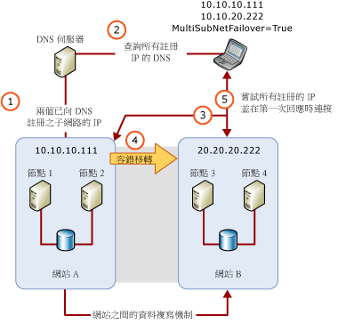

# SQL Server 多重子網路叢集 (SQL Server)
[!INCLUDE[appliesto-ss-xxxx-xxxx-xxx-md](../../../includes/appliesto-ss-xxxx-xxxx-xxx-md.md)]
  [!INCLUDE[ssNoVersion](../../../includes/ssnoversion-md.md)] 多重子網路容錯移轉叢集是一個組態，當中每個容錯移轉叢集節點都會連接到不同的子網路或不同的子網路集。 這些子網路可以位於相同位置，或位於散佈於不同地理區域的站台。 跨越散佈於不同地理區域之站台的叢集有時候又稱為「延展叢集」。 由於沒有可供所有節點存取的共用儲存體，資料應該在多重子網路上的資料儲存體之間複寫。 透過資料複寫，可用資料就可以擁有多份複本。 因此，除了具有高可用性之外，多重子網路容錯移轉叢集也提供了災害復原方案。  
  
   
##   SQL Server 多重子網路容錯移轉叢集 (兩個節點、兩個子網路)  
 下圖代表兩個節點、兩個子網路的 [!INCLUDE[ssCurrent](../../../includes/sscurrent-md.md)]容錯移轉叢集執行個體 (FCI)。  
  
   
  
  
##   多重子網路容錯移轉叢集執行個體組態  
 下列為使用多重子網路之 [!INCLUDE[ssNoVersion](../../../includes/ssnoversion-md.md)] FCI 的部分範例：  
  
-   [!INCLUDE[ssNoVersion](../../../includes/ssnoversion-md.md)] FCI SQLCLUST1 包含 Node1 和 Node2。 Node1 會連接到 Subnet1。 Node2 會連接到 Subnet2。 [!INCLUDE[ssNoVersion](../../../includes/ssnoversion-md.md)] 安裝程式會將這個組態視為多重子網路叢集，並將 IP 位址資源相依性設為 **OR**。  
  
-   [!INCLUDE[ssNoVersion](../../../includes/ssnoversion-md.md)] FCI SQLCLUST1 包含 Node1、Node2 和 Node3。 Node1 和 Node2 會連接到 Subnet1。 Node 3 會連接到 Subnet2。 [!INCLUDE[ssNoVersion](../../../includes/ssnoversion-md.md)] 安裝程式會將這個組態視為多重子網路叢集，並將 IP 位址資源相依性設為 **OR**。 由於 Node1 和 Node2 位於相同的子網路，這個組態會提供額外的本機高可用性。  
  
-   [!INCLUDE[ssNoVersion](../../../includes/ssnoversion-md.md)] FCI SQLCLUST1 包含 Node1 和 Node2。 Node1 位於 Subnet1 上。 Node2 位於 Subnet1 和 Subnet2 上。 [!INCLUDE[ssNoVersion](../../../includes/ssnoversion-md.md)] 安裝程式會將這個組態視為多重子網路叢集，並將 IP 位址資源相依性設為 **OR**。  
  
-   [!INCLUDE[ssNoVersion](../../../includes/ssnoversion-md.md)] FCI SQLCLUST1 包含 Node1 和 Node2。 Node1 會連接到 Subnet1 和 Subnet2。 Node2 也會連接到 Subnet1 和 Subnet2。 **安裝程式會將 IP 位址資源相依性設為** AND [!INCLUDE[ssNoVersion](../../../includes/ssnoversion-md.md)] 。  
  
    > **注意** ：由於叢集的節點位於相同的子網路集，這個組態不會視為多重子網路容錯移轉叢集組態。  
  
##   IP 位址資源考量  
 在多重子網路容錯移轉叢集組態中，IP 位址不會由容錯移轉叢集中的所有節點擁有，可能也不會在 [!INCLUDE[ssNoVersion](../../../includes/ssnoversion-md.md)] 啟動期間全數都在線上。 從 [!INCLUDE[ssSQL11](../../../includes/sssql11-md.md)]開始，您可以將 IP 位址資源相依性設為 **OR**。 當 [!INCLUDE[ssNoVersion](../../../includes/ssnoversion-md.md)] 可以繫結到至少一個有效的 IP 位址時，這可讓它位於線上。  
  
> **注意** ：在版本早於 [!INCLUDE[ssNoVersion](../../../includes/ssnoversion-md.md)] 的 [!INCLUDE[ssSQL11](../../../includes/sssql11-md.md)]版本中，多重子站台叢集組態中使用了延展 V-LAN 技術來公開跨越站台之容錯移轉的單一 IP 位址。 利用 [!INCLUDE[ssNoVersion](../../../includes/ssnoversion-md.md)] 跨越不同子網路叢集節點的新功能，現在您可以在不需要實作延展 V-LAN 技術的情況下，設定跨越多個站台的 [!INCLUDE[ssNoVersion](../../../includes/ssnoversion-md.md)] 容錯移轉叢集。  
  
### IP 位址資源 OR 相依性考量  
 若您將 IP 位址資源相依性設為 **OR**，可能需要考量下列容錯移轉行為：  
  
-   目前擁有 [!INCLUDE[ssNoVersion](../../../includes/ssnoversion-md.md)] 叢集資源群組之節點上的其中一個 IP 位址失敗時，直到該節點上所有有效 IP 位址都失敗為止，將不會自動觸發容錯移轉。  
  
-   發生容錯移轉時，如果 [!INCLUDE[ssNoVersion](../../../includes/ssnoversion-md.md)] 可以繫結到目前節點上至少一個有效的 IP 位址，它將會上線。 啟動時沒有繫結到 [!INCLUDE[ssNoVersion](../../../includes/ssnoversion-md.md)] 的 IP 位址將會列在錯誤記錄檔中。  
  
   
 當 [!INCLUDE[ssNoVersion](../../../includes/ssnoversion-md.md)] FCI 與 [!INCLUDE[ssDEnoversion](../../../includes/ssdenoversion-md.md)]的獨立執行個體並行安裝時，務必避免 IP 位址發生 TCP 通訊埠編號衝突。 通常兩個 [!INCLUDE[ssDE](../../../includes/ssde-md.md)] 執行個體同樣設定為使用預設 TCP 通訊埠 (1433) 時，就會發生衝突。 為避免發生衝突，請將其中一個執行個體設定為使用非預設固定通訊埠。 在獨立執行個體上設定固定通訊埠通常最為簡單。 將 [!INCLUDE[ssDE](../../../includes/ssde-md.md)] 設定為使用不同的通訊埠，就能防止發生非預期的 IP 位址/TCP 通訊埠衝突，以免造成 [!INCLUDE[ssNoVersion](../../../includes/ssnoversion-md.md)] FCI 失敗而移轉至待命節點時，執行個體無法啟動。  
  
##   容錯移轉期間的用戶端復原延遲  
 多重子網路 FCI 預設會針對其網路名稱啟用 RegisterAllProvidersIP 叢集資源。 在多重子網路組態中，網路名稱的線上或離線 IP 位址都會在 DNS 伺服器註冊。 然後用戶端應用程式會從 DNS 伺服器擷取所有註冊的 IP 位址，並依序或平行嘗試連接到位址。 這表示，多重子網路容錯移轉時用戶端復原時間不再取決於 DNS 更新延遲。 根據預設，用戶端會依序嘗試 IP 位址。 當用戶端在其連接字串中使用新的選擇性 **MultiSubnetFailover=True** 參數時，它會改為同時嘗試 IP 位址並連接到第一個回應的伺服器。 這有助於在發生容錯移轉時將用戶端復原延遲降至最低。 如需詳細資訊，請參閱 [Always On 用戶端連接性 (SQL Server)](../../../database-engine/availability-groups/windows/always-on-client-connectivity-sql-server.md) 和 [建立或設定可用性群組接聽程式 (SQL Server)](../../../database-engine/availability-groups/windows/create-or-configure-an-availability-group-listener-sql-server.md)。  
  
 對於舊版用戶端程式庫或協力廠商資料提供者，您不能在連接字串中使用 **MultiSubnetFailover** 參數。 為確保用戶端應用程式以最佳方式與 [!INCLUDE[ssCurrent](../../../includes/sscurrent-md.md)]多重子網路 FCI 搭配使用，針對每個額外 IP 位址，請嘗試將用戶端連接字串中的連接逾時調增 21 秒。 這可確保在完成多重子網路 FCI 中的所有 IP 位址之間循環前，用戶端的重新連線嘗試不會逾時。  
  
 [!INCLUDE[ssNoVersion](../../../includes/ssnoversion-md.md)] Management Studio 和 **sqlcmd** 的預設用戶端連接逾時期限是 15 秒。  
  
   
##   相關內容  
  
|內容描述|主題|  
|-------------------------|-----------|  
|安裝 SQL Server 容錯移轉叢集|[建立新的 SQL Server 容錯移轉叢集 (安裝程式)](../../../sql-server/failover-clusters/install/create-a-new-sql-server-failover-cluster-setup.md)|  
|現有 SQL Server 容錯移轉叢集的就地升級|[升級 SQL Server 容錯移轉叢集執行個體 &#40;安裝程式&#41;](../../../sql-server/failover-clusters/windows/upgrade-a-sql-server-failover-cluster-instance-setup.md)|  
|維護現有 SQL Server 容錯移轉叢集|[在 SQL Server 容錯移轉叢集中新增或移除節點 &#40;安裝程式&#41;](../../../sql-server/failover-clusters/install/add-or-remove-nodes-in-a-sql-server-failover-cluster-setup.md)|  
|使用容錯移轉叢集管理嵌入式管理單元檢視 WSFC 事件和記錄|[檢視容錯移轉叢集的事件和記錄檔](https://technet.microsoft.com/library/cc772342\(WS.10\).aspx)|  
|使用 Windows PowerShell 建立 WSFC 容錯移轉叢集中所有節點 (或特定節點) 的記錄檔|[Get-ClusterLog 容錯移轉叢集指令程式](https://technet.microsoft.com/library/ee461045.aspx)|  
  

  
  
