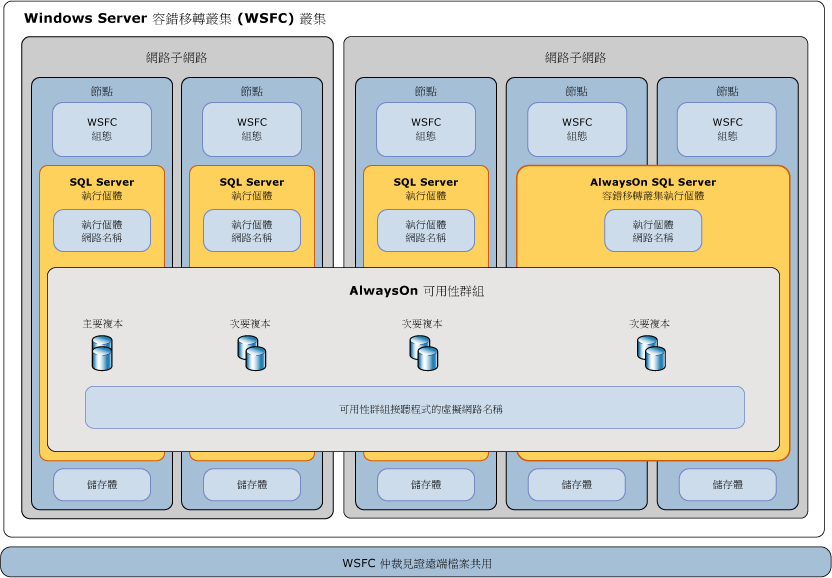

# SQL Server 的 Windows Server 容錯移轉叢集
[!INCLUDE[appliesto-ss-xxxx-xxxx-xxx-md](../../../includes/appliesto-ss-xxxx-xxxx-xxx-md.md)]「Windows Server 容錯移轉叢集 (WSFC)」是一組獨立伺服器，會一起運作以提高應用程式和服務的可用性。 [!INCLUDE[ssCurrent](../../../includes/sscurrent-md.md)] 利用 WSFC 服務和功能，以支援 [!INCLUDE[ssHADR](../../../includes/sshadr-md.md)] 和 [!INCLUDE[ssNoVersion](../../../includes/ssnoversion-md.md)] 容錯移轉叢集執行個體。  
  
   
##   詞彙和定義  
 Windows Server 容錯移轉叢集 (WSFC)：WSFC 是一組獨立伺服器，會一起運作以提高應用程式和服務的可用性。  
  
 節點  
 參與 WSFC 的伺服器。
  
 叢集資源  
 實體或邏輯實體，可為節點所擁有、恢復上線及離線、在節點之間移動，並以叢集物件方式進行管理。 叢集資源在任何時間點只能由單一節點所擁有。  
  
 以單一叢集物件方式管理的角色 A 叢集資源集合，來提供特定功能。 針對 SQL Server，角色將是 AlwaysOn 可用性群組 (AG) 或 AlwaysOn 容錯移轉叢集執行個體 (FCI)。 角色包含 AG 或 FCI 需要的所有叢集資源。 容錯移轉和容錯移轉一律在角色的內容中運作。 針對 FCI，角色將包含 IP 位址資源、網路名稱資源和 SQL Server 資源。 AG 角色將包含 AG 資源；而且，如果設定接聽程式，則包含 networm 名稱和 IP 資源。 

 網路名稱資源  
 以叢集資源方式管理的邏輯伺服器名稱。 網路名稱資源必須與 IP 位址資源搭配使用。 這些項目可能需要 Active Directory Domain Services 和 (或) DNS 中的物件。 
  
 資源相依性  
 另一個資源所相依的資源。 如果資源 A 與資源 B 相依，則 B 是 A 的相依性。如果沒有資源 B，就無法啟動資源 A。  
  
  
 慣用擁有者  
 資源群組偏好在其上執行的節點。 每個資源群組都與依照喜好設定順序排序的慣用擁有者清單相關聯。 在自動容錯移轉期間，資源群組會移至慣用擁有者清單中的下一個慣用節點。  
  
 可能擁有者  
 資源可在其上執行的次要節點。 每個資源群組都與可能擁有者清單相關聯。 角色只能容錯移轉至列為可能擁有者的節點。   
  
 仲裁模式  
 容錯移轉叢集中決定叢集可承受之節點失敗次數的仲裁設定。  
  
 強制仲裁  
 即使僅少數仲裁必要元素正在通訊中，也會啟動叢集的程序。  
  

##   Windows Server 容錯移轉叢集概觀  
 Windows Server 容錯移轉叢集提供基礎結構功能，支援 Microsoft [!INCLUDE[ssNoVersion](../../../includes/ssnoversion-md.md)] 和 Microsoft Exchange 等託管伺服器應用程式的高可用性和災害復原案例。 如果叢集節點或服務失敗，該節點上裝載的服務可在稱為 *「容錯移轉」*(Failover) 的程序中自動或手動轉移至另一個可用的節點。  
  
 WSFC 中的節點會一起運作，共同提供這些類型的功能：  
  
-   **分散式的中繼資料和通知。** WSFC 服務和託管應用程式中繼資料是在叢集中的每個節點上進行維護。 此中繼資料除了包含託管應用程式設定之外，還包含 WSFC 組態和狀態。 對節點中繼資料或狀態所做的變更會自動傳播到 WSFC 中的其他節點。  
  
-   **資源管理。** WSFC 中的個別節點可以提供實體資源，例如直接附加的儲存體、網路介面和共用磁碟儲存體存取。 託管應用程式會自行註冊為叢集資源，並可設定對其他資源的啟動和健全狀況相依性。  
  
-   **健全狀況監視。** 節點間和主要節點健全狀況偵測是透過活動訊號式網路通訊和資源監視的組合來完成。 WSFC 的整體健全狀況是由 WSFC 中節點的仲裁投票所決定。  
  
-   **容錯移轉協調。** 每個資源都是設定為在主要節點上裝載，而且每個資源都可以自動或手動轉移至一個或多個次要節點。 以健全狀況為主的容錯移轉原則會控制節點之間資源擁有權的自動轉移。 在發生容錯移轉時，節點和託管應用程式會收到通知，以便它們可以適當反應。  
  
 如需詳細資訊，請參閱 [容錯移轉叢集概觀](https://technet.microsoft.com/library/hh831579(v=ws.11).aspx)。  
  
##   SQL Server AlwaysOn 技術和 WSFC  
 [!INCLUDE[ssCurrent](../../../includes/sscurrent-md.md)] *AlwaysOn* 是利用 WSFC 的高可用性和災害復原方案。 AlwaysOn 功能提供彈性的整合式解決方案，以提高應用程式可用性、提供更佳的硬體投資報酬率，以及簡化高可用性部署和管理。  
  
 [!INCLUDE[ssHADR](../../../includes/sshadr-md.md)] 和 AlwaysOn 容錯移轉叢集執行個體都會使用 WSFC 作為平台技術，並且將元件註冊為 WSFC 叢集資源。  相關資源會合併為一個可相依於其他 WSFC 叢集資源的「角色」。 WSFC 接著可以感測需要重新啟動 [!INCLUDE[ssNoVersion](../../../includes/ssnoversion-md.md)] 執行個體並發出訊號，或自動將它容錯移轉至 WSFC 中的不同伺服器節點。  
  
> **重要！！** 若要充分利用 [!INCLUDE[ssNoVersion](../../../includes/ssnoversion-md.md)] AlwaysOn 技術，應該符合數個 WSFC 相關的必要條件。  
>   
>  如需詳細資訊，請參閱 [AlwaysOn 可用性群組的必要條件、限制和建議 &#40;SQL Server&#41;](../../../database-engine/availability-groups/windows/prereqs-restrictions-recommendations-always-on-availability.md)。  
  
### 執行個體層級高可用性與 AlwaysOn 容錯移轉叢集執行個體搭配使用  
 AlwaysOn「容錯移轉叢集執行個體」(FCI) 是在 WSFC 中跨多個節點安裝的 [!INCLUDE[ssNoVersion](../../../includes/ssnoversion-md.md)] 執行個體。 這種類型的執行個體相依於儲存體和虛擬網路名稱的資源。 儲存體可以使用光纖通道、iSCSI、FCoE 或 SAS 做為共用磁碟儲存體，或透過[儲存空間直接存取 (S2D) (英文)](http://technet.microsoft.com/windows-server-docs/storage/storage-spaces/storage-spaces-direct-overview) 來使用本機掛接的儲存體。 虛擬網路名稱資源相依於一個或多個虛擬 IP 位址，每個位址都位於不同的子網路。 SQL Server 服務和 SQL Server Agent 服務也是資源，而且也都相依於儲存體和虛擬網路名稱資源。  
  
 在發生容錯移轉時，WSFC 服務會將執行個體的資源擁有權轉移到指定的容錯移轉節點。 然後 [!INCLUDE[ssNoVersion](../../../includes/ssnoversion-md.md)] 執行個體會在容錯移轉節點上重新啟動，而且資料庫會照常復原。 在任何給定的時刻，只有一個叢集節點可以裝載 FCI 和基礎資源。  
  
> **注意：**  AlwaysOn 容錯移轉叢集執行個體需要對稱共用磁碟儲存體，例如存放區域網路 (SAN) 或 SMB 檔案共用。  共用磁碟存放磁碟區必須可供 WSFC 叢集中所有可能的容錯移轉節點使用。  
  
 如需詳細資訊，請參閱 [AlwaysOn 容錯移轉叢集執行個體 &#40;SQL Server&#41;](../../../sql-server/failover-clusters/windows/always-on-failover-cluster-instances-sql-server.md)。  
  
### 資料庫層級高可用性 [!INCLUDE[ssHADR](../../../includes/sshadr-md.md)]  
 AlwaysOn「可用性群組」(AG) 是可一起進行容錯移轉的一或多個使用者資料庫。 可用性群組是由主要 *「可用性複本」* (Availability Replica) 和一到四個次要複本所組成，這些次要複本是透過 SQL Server 記錄式資料移動提供資料保護的方式維護，不需要共用儲存體。 每個複本都是由位於 WSFC 的不同節點上的 [!INCLUDE[ssNoVersion](../../../includes/ssnoversion-md.md)] 執行個體所裝載。 可用性群組和對應的虛擬網路名稱會註冊為 WSFC 叢集中的資源。  
  
 位於主要複本節點的 *「可用性群組接聽程式」* (Availability Group Listener) 會回應連接到虛擬網路名稱的內送用戶端要求，並根據連接字串中的屬性，將每個要求重新導向至適當的 [!INCLUDE[ssNoVersion](../../../includes/ssnoversion-md.md)] 執行個體。  
  
 發生容錯移轉時會運用 WSFC，將另一個 [!INCLUDE[ssNoVersion](../../../includes/ssnoversion-md.md)] 執行個體上的次要複本重新設定為可用性群組的主要複本，而不會將共用實體資源的擁有權轉移至另一個節點。 然後可用性群組的虛擬網路名稱資源會轉移至該執行個體。  
  
 在任何給定的時刻，只有一個 [!INCLUDE[ssNoVersion](../../../includes/ssnoversion-md.md)] 執行個體可以裝載可用性群組的主要資料庫複本，每個相關的次要複本必須位於個別的執行個體，而且每個執行個體必須位於個別的實體節點。  
  
> **注意：**[!INCLUDE[ssHADR](../../../includes/sshadr-md.md)] 不需要部署容錯移轉叢集執行個體或使用對稱共用儲存體 (SAN 或 SMB)。  
>   
>  容錯移轉叢集執行個體 (FCI) 可與可用性群組一起使用，以加強可用性複本的可用性。 不過，為了避免 WSFC 叢集中可能的競爭情形，不支援可用性群組自動容錯移轉至裝載於 FCI 的可用性複本，或從該複本容錯移轉。  
  
 如需詳細資訊，請參閱 [AlwaysOn 可用性群組概觀 (SQL Server)](../../../database-engine/availability-groups/windows/overview-of-always-on-availability-groups-sql-server.md)。  
  
##   WSFC 健全狀況監視和容錯移轉  
 AlwaysOn 方案的高可用性是透過下列方式完成：對實體和邏輯 WSFC 叢集資源的主動式健全狀況監視，以及自動容錯移轉至備援硬體和重新設定備援硬體。  系統管理員也可以起始可用性群組或 *執行個體從某個節點* 「手動容錯移轉」 [!INCLUDE[ssNoVersion](../../../includes/ssnoversion-md.md)] (Manual Failover) 至另一個節點。  
  
### 節點、容錯移轉叢集執行個體和可用性群組的容錯移轉原則  
 「容錯移轉原則」是在 WSFC 節點、[!INCLUDE[ssNoVersion](../../../includes/ssnoversion-md.md)] 容錯移轉叢集執行個體 (FCI) 和可用性群組層級上設定。  這些原則根據狀況不良的叢集資源狀態和節點反應速度的嚴重性、持續時間和頻率，可能會觸發服務重新啟動或叢集資源從某個節點 *「自動容錯移轉」* (Automatic Failover) 到另一個節點，也可能會觸發可用性群組主要複本從某個 [!INCLUDE[ssNoVersion](../../../includes/ssnoversion-md.md)] 執行個體移至另一個執行個體。  
  
 可用性群組複本的容錯移轉不會影響基礎 [!INCLUDE[ssNoVersion](../../../includes/ssnoversion-md.md)] 執行個體。  FCI 容錯移轉會將裝載的可用性群組複本隨著執行個體移動。  
  
 如需詳細資訊，請參閱： [容錯移轉叢集執行個體的容錯移轉原則](../../../sql-server/failover-clusters/windows/failover-policy-for-failover-cluster-instances.md)。  
  
### WSFC 資源健全狀況偵測  
 WSFC 中的每個資源都可以定期或視需要報告其狀態和健全狀況。 有許多情況皆意味著資源失效，例如停電、磁碟或記憶體錯誤、網路通訊錯誤或無反應的服務。  
  
 WSFC 資源 (例如網路、儲存體或服務) 可以彼此相依。 資源的累積健全狀況是透過其個別資源相依性的健全狀況連續積存其健全狀況來決定。  
  
### WSFC 節點間健全狀況偵測和仲裁投票  
 WSFC 中的每個節點都會參與定期活動訊號通訊，以與其他節點共用節點的健全狀況。 沒有回應的節點是視為處於失敗狀態。  
  
 「仲裁」是一種機制，可透過確保 WSFC 中有足夠的資源上線，協助確保 WSFC 啟動並執行。 如果 WSFC 有足夠的投票，則其狀況會良好，而且可以提供節點層級容錯。  
  
 「仲裁模式」是在指定仲裁投票所使用方法以及指定何時執行自動容錯移轉或使叢集離線的 WSFC 設定。 
  
> **提示！！** 最佳做法是 WSFC 中一定要有奇數的仲裁投票。  為了仲裁投票目的， [!INCLUDE[ssNoVersion](../../../includes/ssnoversion-md.md)] 不需要在叢集中的所有節點上安裝。 另一個伺服器可以做為仲裁成員，或者 WSFC 仲裁模式可設定為使用遠端檔案共用做為平局決勝者 (Tiebreaker)。  
>   
>  如需詳細資訊，請參閱 [WSFC 仲裁模式和投票組態 (SQL Server)](../../../sql-server/failover-clusters/windows/wsfc-quorum-modes-and-voting-configuration-sql-server.md)。  
  
### 透過強制仲裁執行災害復原  
 根據操作實務和 WSFC 設定，在發生自動和手動容錯移轉時，您仍然可以維持強固且容錯的 [!INCLUDE[ssNoVersion](../../../includes/ssnoversion-md.md)] AlwaysOn 解決方案。 不過，如果 WSFC 中適合投票之節點的仲裁無法彼此通訊，或者 WSFC 叢集的健全狀況驗證失敗，則 WSFC 可能會離線。  
  
 如果 WSFC 因未規劃的災害或持續硬體或通訊失敗而離線，則需要手動管理介入「強制仲裁」，使非容錯設定中的存活叢集節點恢復上線。  
  
 隨後，也必須採取一連串步驟，重新設定 WSFC、復原受影響的資料庫複本，以及重新建立新仲裁。  
  
 如需詳細資訊，請參閱 [透過強制仲裁執行 WSFC 災害復原 (SQL Server)](../../../sql-server/failover-clusters/windows/wsfc-disaster-recovery-through-forced-quorum-sql-server.md)。  
  
##   SQL Server AlwaysOn 元件與 WSFC 之間的關聯性  
 [!INCLUDE[ssNoVersion](../../../includes/ssnoversion-md.md)] AlwaysOn 和 WSFC 功能與元件之間有數層關聯性。  
  
 AlwaysOn 可用性群組是裝載在 [!INCLUDE[ssNoVersion](../../../includes/ssnoversion-md.md)] 執行個體上。  
 指定邏輯可用性群組接聽程式網路名稱連線至主要或次要資料庫的用戶端要求，會重新導向至基礎 [!INCLUDE[ssNoVersion](../../../includes/ssnoversion-md.md)] 執行個體或 [!INCLUDE[ssNoVersion](../../../includes/ssnoversion-md.md)] FCI 的適當執行個體網路名稱。  
  
 「SQL Server 執行個體」(SQL Server Instance) 是在單一節點上主動裝載。  
 獨立的 [!INCLUDE[ssNoVersion](../../../includes/ssnoversion-md.md)] 執行個體 (如果有) 永遠位於具有靜態執行個體網路名稱的單一節點。  [!INCLUDE[ssNoVersion](../../../includes/ssnoversion-md.md)] FCI (如果有) 是作用於兩個以上具有單一虛擬執行個體網路名稱的其中一個可容錯移轉節點。  
  
 「節點」(Node) 是 WSFC 叢集的成員。  
 所有節點的 WSFC 組態中繼資料和狀態都是儲存在各節點上。 每一部伺服器都可提供非對稱的儲存體或共用儲存體 (SAN) 磁碟區讓使用者或系統資料庫使用。 每個伺服器都至少有一個位於一個或多個 IP 子網路的實體網路介面。  
  
 WSFC 會監視健全狀況，並管理一組伺服器的設定。  
 WSFC 機制會傳播 WSFC 設定中繼資料以及 WSFC 中所有節點狀態的變更。 如果使用磁碟見證，則中繼資料也會儲存在該處。 根據預設，WSFC 的每個節點都會取得仲裁的投票，並在需要且設定時使用見證。
 
 [!INCLUDE[ssHADR](../../../includes/sshadr-md.md)] 登錄機碼是 WSFC 叢集的子機碼。  
 如果您刪除後重新建立 WSFC，則必須針對原始 WSFC 上已啟用 [!INCLUDE[ssHADR](../../../includes/sshadr-md.md)] 的每個伺服器執行個體，停用後重新啟用 [!INCLUDE[ssHADR](../../../includes/sshadr-md.md)] 功能。 如需詳細資訊，請參閱[啟用和停用 AlwaysOn 可用性群組 &#40;SQL Server&#41;](../../../database-engine/availability-groups/windows/enable-and-disable-always-on-availability-groups-sql-server.md)。  
  
   
  
##   相關工作  
  
-   [檢視叢集仲裁 NodeWeight 設定](../../../sql-server/failover-clusters/windows/view-cluster-quorum-nodeweight-settings.md)  
  
-   [設定叢集仲裁 NodeWeight 設定](../../../sql-server/failover-clusters/windows/configure-cluster-quorum-nodeweight-settings.md)  
  
-   [在無仲裁情況下強制啟動 WSFC 叢集](../../../sql-server/failover-clusters/windows/force-a-wsfc-cluster-to-start-without-a-quorum.md)  
  
##   相關內容  
  
-   [Windows Server 技術：容錯移轉叢集](http://technet.microsoft.com/library/cc732488\(v=WS.10\).aspx)  

-   [儲存空間直接存取 \(S2D\) 概觀 (英文)](http://technet.microsoft.com/windows-server-docs/storage/storage-spaces/storage-spaces-direct-overview)

-   [Windows Server 2008 R2 中的容錯移轉叢集](http://technet.microsoft.com/library/ff182338\(WS.10\).aspx)  
  
-   [檢視容錯移轉叢集的事件和記錄檔](http://technet.microsoft.com/library/cc772342\(WS.10\).aspx)  
  
-   [Get-ClusterLog 容錯移轉叢集指令程式](http://technet.microsoft.com/library/ee461045.aspx)  
  
## 另請參閱  
 [AlwaysOn 容錯移轉叢集執行個體 (SQL Server)](../../../sql-server/failover-clusters/windows/always-on-failover-cluster-instances-sql-server.md)   
 [AlwaysOn 可用性群組概觀 (SQL Server)](../../../database-engine/availability-groups/windows/overview-of-always-on-availability-groups-sql-server.md)   
 [WSFC 仲裁模式和投票組態 (SQL Server)](../../../sql-server/failover-clusters/windows/wsfc-quorum-modes-and-voting-configuration-sql-server.md)   
 [容錯移轉叢集執行個體的容錯移轉原則](../../../sql-server/failover-clusters/windows/failover-policy-for-failover-cluster-instances.md)   
 [透過強制仲裁執行 WSFC 災害復原 (SQL Server)](../../../sql-server/failover-clusters/windows/wsfc-disaster-recovery-through-forced-quorum-sql-server.md)  
 [SQL Server 2016 支援 Windows Server 2016 儲存空間直接存取 (英文)](http://blogs.technet.microsoft.com/dataplatforminsider/2016/09/27/sql-server-2016-now-supports-windows-server-2016-storage-spaces-direct/)
  
