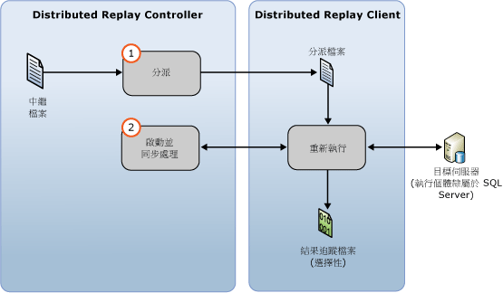

# 重新執行追蹤資料
 [!INCLUDE [SQL Server](../../includes/applies-to-version/sqlserver.md)]
  在您已經備妥輸入追蹤資料之後，就可以使用 [!INCLUDE[msCoName](../../includes/msconame-md.md)] [!INCLUDE[ssNoVersion](../../includes/ssnoversion-md.md)] Distributed Replay 功能啟動分散式重新執行。 如需詳細資訊，請參閱 [準備輸入追蹤資料](../../tools/distributed-replay/prepare-the-input-trace-data.md)。  
  
 您可以使用管理工具的 [重新執行]  選項以起始 Distributed Replay 的事件重新執行階段。 這個階段是由兩個部分組成：追蹤資料分派以及分散式重新執行的啟動和同步處理。  
  
   
  
 您可以在下列其中一種順序模式中重新執行追蹤資料：壓力模式或同步處理模式。 預設行為是在壓力模式中重新執行追蹤資料。 如需有關事件重新執行階段和順序模式的詳細資訊，請參閱＜ [SQL Server Distributed Replay](../../tools/distributed-replay/sql-server-distributed-replay.md)＞  
  
> [!NOTE]  
>  輸入追蹤資料必須在相容於 Distributed Replay 的 [!INCLUDE[ssNoVersion](../../includes/ssnoversion-md.md)] 版本中擷取。 輸入追蹤資料也必須相容於您要針對它重新執行追蹤資料的目標伺服器。 如需有關版本需求的詳細資訊，請參閱＜ [Distributed Replay Requirements](../../tools/distributed-replay/distributed-replay-requirements.md)＞。  
  
### 若要重新執行追蹤  
  
1.  **(選擇性) 修改重新執行組態設定**：如果您想要修改重新執行組態設定 (例如順序模式和各種調整值)，您必須修改以 XML 為基礎之重新執行組態檔 `DReplay.exe.replay.config` 的 `<ReplayOptions>` 元素。 此外，您也可以修改 `<OutputOptions>` 元素來指定輸出設定，例如是否要記錄資料列計數。 如果您要修改重新執行組態檔，我們建議您修改複本，而不是原始版本。 若要修改設定，請執行下列步驟：  
  
    1.  建立預設重新執行組態檔 `DReplay.exe.replay.config`的複本，並重新命名新的檔案。 預設重新執行組態檔位於管理工具的安裝資料夾。  
  
    2.  修改新組態檔中的重新執行組態設定。  
  
    3.  當起始事件重新執行階段 (下一步) 時，使用 [重新執行] 選項的 *config_file* 參數指定已修改組態檔的位置。  
  
     如需重新執行組態檔的詳細資訊，請參閱 [設定 Distributed Replay](../../tools/distributed-replay/configure-distributed-replay.md)。  
  
2.  **開始事件重新執行階段**：若要啟動 Distributed Replay，您必須透過 [重新執行] 選項執行系統管理工具。 如需詳細資訊，請參閱[重新執行選項 &#40;Distributed Replay 管理工具&#41;](../../tools/distributed-replay/replay-option-distributed-replay-administration-tool.md)。  
  
    1.  開啟 Windows 命令提示字元公用程式 (**CMD.exe**)，並巡覽至 Distributed Replay 管理工具 (**DReplay.exe**) 的安裝位置。  
  
    2.  (選擇性) 使用 *controller* 參數 **-m**指定控制器 (如果控制器服務是在與管理工具不同的電腦上執行)。  
  
    3.  使用 *controller_working_directory* 參數 **-d**，指定中繼檔案在前置處理階段期間儲存在控制器上的位置。  
  
    4.  (選擇性) 使用 **-o** 參數，在每個用戶端的結果追蹤檔案中擷取重新執行活動。  
  
    5.  (選擇性) 使用 *target_server* 參數 **-s**，指定 Distributed Replay Client 應該重新執行追蹤工作負載所在的 [!INCLUDE[ssNoVersion](../../includes/ssnoversion-md.md)] 執行個體。 如果您使用了 `<Server>` 元素，在重新執行組態檔的 `<ReplayOptions>` 元素中指定目標伺服器，就不需要這個參數。  
  
    6.  使用 *clients* 參數 **-w**，指定應該參與重新執行的 Distributed Replay Client。 然後，列出用戶端電腦名稱 (以逗號隔開)。 注意:不允許 IP 位址。  
  
    7.  (選擇性) 使用 *config_file* 參數 **-c**，指定重新執行組態檔的位置。 如果已修改預設重新執行組態檔的複本，請使用此參數指向新的組態檔。  
  
    8.  (選擇性) 使用 *status_interval* 參數 **-f**，指定是否要讓管理工具以不同於 30 秒的頻率顯示狀態訊息。  
  
     例如，下列語法會在控制器服務所在的同一部電腦上起始重新執行階段、使用位於 `c:\WorkingDir`的控制器工作目錄、在每個參與的用戶端上擷取重新執行活動、使用 `client1` 和 `client2` 用戶端來進行重新執行，並且從位於 `c:\modifiedreplay.config`的已修改重新執行組態檔中取得其餘重新執行組態設定：  
  
     `dreplay replay -d c:\WorkingDir -o -w client1,client2 -c c:\modifiedreplay.config`  
  
3.  當分散式重新執行完成時，管理工具就會傳回摘要資訊。 如果您已指定 **-o** 選項，重新執行活動就已經儲存在每個用戶端的結果追蹤檔案中。 如需結果追蹤檔案的詳細資訊，請參閱 [檢閱重新執行結果](../../tools/distributed-replay/review-the-replay-results.md)。  
  
## 另請參閱  
 [Distributed Replay Requirements](../../tools/distributed-replay/distributed-replay-requirements.md)   
 [管理工具命令列選項 &#40;Distributed Replay Utility&#41;](../../tools/distributed-replay/administration-tool-command-line-options-distributed-replay-utility.md)   
 [設定 Distributed Replay](../../tools/distributed-replay/configure-distributed-replay.md)  
  
  
