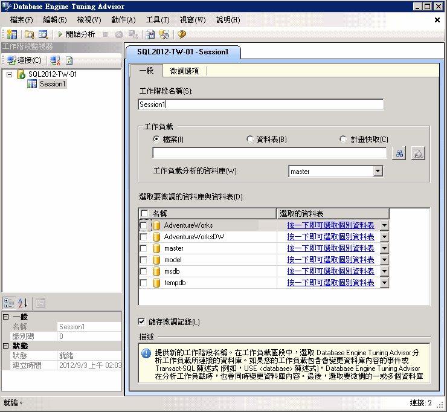

# 課程 1-1 - 啟動 Database Engine Tuning Advisor
[!INCLUDE[appliesto-ss-xxxx-xxxx-xxx-md](../../includes/appliesto-ss-xxxx-xxxx-xxx-md.md)] 首先，請開啟 Database Engine Tuning Advisor 圖形化使用者介面 (GUI)。 在第一次使用時， **系統管理員** 固定伺服器角色的成員必須啟動 Database Engine Tuning Advisor 來初始化應用程式。 初始化之後， **db_owner** 固定資料庫角色的成員便可以利用 Database Engine Tuning Advisor 來微調他們擁有的資料庫。 如需初始化 Database Engine Tuning Advisor 的詳細資訊，請參閱 [啟動及使用 Database Engine Tuning Advisor](../../relational-databases/performance/start-and-use-the-database-engine-tuning-advisor.md)。  
  
### 開啟 Database Engine Tuning Advisor GUI  
  
1.  在 Windows [開始] 功能表上，依序指向 [所有程式]、[[!INCLUDE[ssCurrentUI](../../includes/sscurrentui-md.md)]]、[效能工具]，然後按一下 [Database Engine Tuning Advisor]。  
  
2.  在 [連接到伺服器] 對話方塊中，驗證預設值，然後按一下 [連接]。  
  
依預設，Database Engine Tuning Advisor 會開啟下列說明中的組態：  
  
  
  
> [!NOTE]  
> 索引標籤和 [工作階段名稱] 方塊會顯示您的電腦名稱和已連接的執行個體名稱。 索引標籤和方塊也會顯示目前的日期和時間。  
  
在第一次開啟 Database Engine Tuning Advisor 時，它的 GUI 會出現兩個主要窗格。  
  
-   左窗格包含「工作階段監視器」，它會列出這個 [!INCLUDE[msCoName](../../includes/msconame-md.md)] [!INCLUDE[ssNoVersion](../../includes/ssnoversion-md.md)] 執行個體已執行的所有微調工作階段。 當您開啟 Database Engine Tuning Advisor 時，它會在窗格頂端顯示一個新的工作階段。 您可以在相鄰的窗格中命名這個工作階段。 一開始，只列出預設工作階段。 這是 Database Engine Tuning Advisor 自動建立的預設工作階段。 微調資料庫之後，您連接的 [!INCLUDE[ssNoVersion](../../includes/ssnoversion-md.md)] 執行個體的所有微調工作階段都會列在這個新的工作階段之下。 您可以以滑鼠右鍵按一下微調工作階段，對它進行重新命名、調整、刪除或複製等動作。 如果您在清單中按一下滑鼠右鍵，您可以依名稱、狀態或建立時間來排序工作階段，也可以建立新的工作階段。 這個窗格的底端區段會顯示所選微調工作階段的詳細資料。 您可以選擇使用 [分類] 按鈕將詳細資料組成類別目錄，來顯示詳細資料，也可以使用 [字母順序] 按鈕，以字母順序清單顯示它們。 您也可以將右窗格框線拖曳至視窗左邊來隱藏工作階段監視器。 若要重新檢視它，將窗格框線拖回至右邊即可。 您可以利用工作階段監視器來檢視先前的微調工作階段，也可以利用它們來建立含有類似定義的新工作階段。 您也可以利用工作階段監視器來評估微調建議。 如需詳細資訊，請參閱[檢視及處理 Database Engine Tuning Advisor 的輸出](../../relational-databases/performance/view-and-work-with-the-output-from-the-database-engine-tuning-advisor.md)。 請利用瀏覽器中的 [上一頁] 按鈕來返回這個教學課程。  
  
-   右窗格包含 [一般] 和 [微調選項] 索引標籤。 您可以在這裡定義您的 Database Engine 微調工作階段。 在 [一般] 索引標籤中，輸入微調工作階段的名稱，指定要使用的工作負載檔案或資料表，並選取您要在此工作階段中進行微調的資料庫和資料表。 工作負載是針對需要微調的一或多個資料庫來執行的一組 [!INCLUDE[tsql](../../includes/tsql-md.md)] 陳述式。 當微調資料庫時，Database Engine Tuning Advisor 會利用追蹤檔、追蹤資料表、[!INCLUDE[tsql](../../includes/tsql-md.md)] 指令碼或 XML 檔來作為工作負載輸入。 您可以在 [微調選項] 索引標籤中，選取實體資料庫設計結構 (索引或索引檢視)，以及在分析期間，Database Engine Tuning Advisor 所要考量的資料分割策略。 在這個索引標籤中，您也可以指定 Database Engine Tuning Advisor 微調工作負載所花的最大時間。 依預設，Database Engine Tuning Advisor 會微調工作負載一小時。  
  
> [!NOTE]  
> 當從 [!INCLUDE[tsql](../../includes/tsql-md.md)] 查詢編輯器匯入 [!INCLUDE[msCoName](../../includes/msconame-md.md)][!INCLUDE[ssManStudioFull](../../includes/ssmanstudiofull-md.md)] 指令碼時，Database Engine Tuning Advisor 可以採用 XML 檔來作為輸入。 如需詳細資訊，請參閱 [!INCLUDE[ssManStudioFull](../../includes/ssmanstudiofull-md.md)] 啟動及使用 Database Engine Tuning Advisor [中有關從](../../relational-databases/performance/start-and-use-the-database-engine-tuning-advisor.md)查詢編輯器＜啟動 Database Engine Tuning Advisor＞一節。  
  
## 本課程的下一項工作  
[設定工具選項和配置](../../tools/dta/lesson-1-2-setting-tool-options-and-layout.md)  
  
  
  
