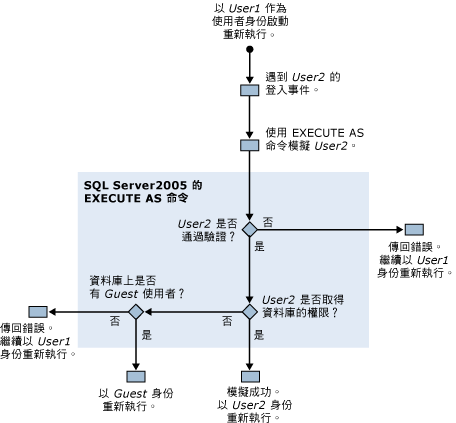

# 執行 SQL Server Profiler 所需的權限
[!INCLUDE[appliesto-ss-xxxx-xxxx-xxx-md](../../includes/appliesto-ss-xxxx-xxxx-xxx-md.md)]根據預設，執行[!INCLUDE[ssSqlProfiler](../../includes/sssqlprofiler-md.md)]需要與用來建立追蹤的 TRANSACT-SQL 預存程序相同的使用者權限。 若要執行 [!INCLUDE[ssSqlProfiler](../../includes/sssqlprofiler-md.md)]，使用者必須被授與 ALTER TRACE 權限。 如需詳細資訊，請參閱 [GRANT 伺服器權限 &#40;Transact-SQL&#41;](../../t-sql/statements/grant-server-permissions-transact-sql.md)。  
  
> [!IMPORTANT]  
>  具有 SHOWPLAN、ALTER TRACE 或 VIEW SERVER STATE 權限的使用者可以檢視執行程序表輸出中所擷取的查詢。 這些查詢可能會包含類似密碼的敏感資訊。 因此，我們建議您只能將這些權限授與給有權檢視敏感資訊的使用者，例如 db_owner 固定資料庫角色的成員或是 sysadmin 固定伺服器角色的成員。 此外，我們也建議您只將執行程序表檔案或是包含與執行程序表相關之事件的追蹤檔案儲存到使用 NTFS 檔案系統的位置，並建議您將存取權限制為有權檢視敏感資訊的使用者。  
  
## 用來重新執行追蹤的權限  
 重新執行追蹤時，執行的使用者也必須要有 ALTER TRACE 權限。  
  
 然而，在重新執行期間，如果所重新執行的追蹤發生「稽核登入」事件，則 [!INCLUDE[ssSqlProfiler](../../includes/sssqlprofiler-md.md)] 會使用 EXECUTE AS 命令。 [!INCLUDE[ssSqlProfiler](../../includes/sssqlprofiler-md.md)] 會使用 EXECUTE AS 命令來模擬與該登入事件有關的使用者。  
  
 如果 [!INCLUDE[ssSqlProfiler](../../includes/sssqlprofiler-md.md)] 在重新執行的追蹤中發生登入事件，就會執行下列權限檢查：  
  
1.  User1 (具有 ALTER TRACE 權限) 開始重新執行追蹤。  
  
2.  在重新執行的追蹤中，User2 發生登入事件。  
  
3.  [!INCLUDE[ssSqlProfiler](../../includes/sssqlprofiler-md.md)] 使用 EXECUTE AS 命令來模擬 User2。  
  
4.  [!INCLUDE[ssNoVersion](../../includes/ssnoversion-md.md)] 嘗試驗證 User2，根據驗證結果，會發生下列其中一種情形：  
  
    1.  如果無法驗證 User2， [!INCLUDE[ssSqlProfiler](../../includes/sssqlprofiler-md.md)] 會傳回錯誤，並以 User1 的身分繼續重新執行追蹤。  
  
    2.  若成功驗證 User2，就會以 User2 的身分繼續重新執行追蹤。  
  
5.  在目標資料庫上檢查 User2 的權限，根據檢查結果，會發生下列其中一種情形：  
  
    1.  如果 User2 擁有目標資料庫的權限，則已模擬成功，而且是以 User2 的身分來重新執行追蹤。  
  
    2.  如果 User2 沒有目標資料庫的權限，伺服器會檢查該資料庫上是否有 Guest 使用者。  
  
6.  在目標資料庫上檢查是否有 Guest 使用者，根據檢查結果，會發生下列其中一種情形：  
  
    1.  若有 Guest 帳戶存在，就會以 Guest 帳戶來重新執行追蹤。  
  
    2.  如果目標資料庫沒有 Guest 帳戶，就會傳回錯誤，並以 User1 的身分來重新執行追蹤。  
  
 下圖顯示重新執行追蹤時，檢查權限的程序：  
  
   
  
## 請參閱  
 [SQL Server Profiler 預存程序 &#40;Transact-SQL&#41;](../../relational-databases/system-stored-procedures/sql-server-profiler-stored-procedures-transact-sql.md)   
 [重新執行追蹤](../../tools/sql-server-profiler/replay-traces.md)   
 [建立追蹤 &#40;SQL Server Profiler&#41;](../../tools/sql-server-profiler/create-a-trace-sql-server-profiler.md)   
 [重新執行追蹤資料表 &#40;SQL Server Profiler&#41;](../../tools/sql-server-profiler/replay-a-trace-table-sql-server-profiler.md)   
 [重新執行追蹤檔案 &#40;SQL Server Profiler&#41;](../../tools/sql-server-profiler/replay-a-trace-file-sql-server-profiler.md)  
  
  
